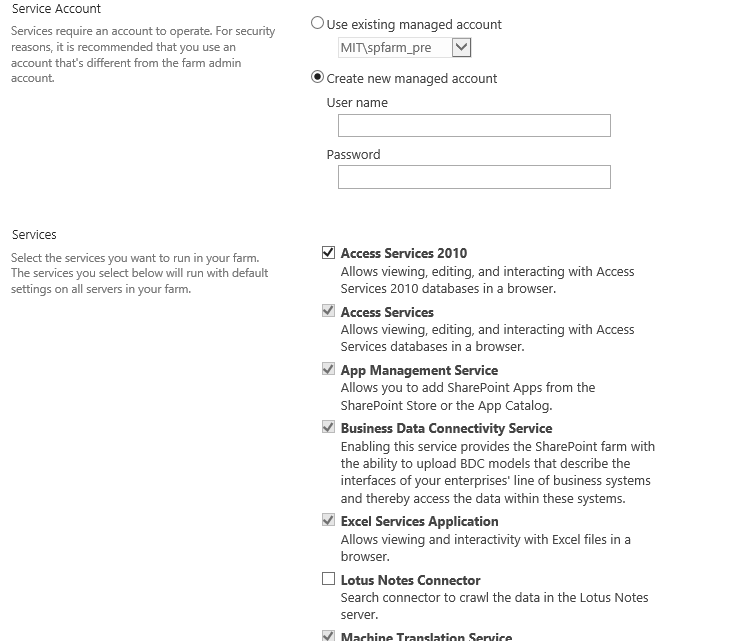
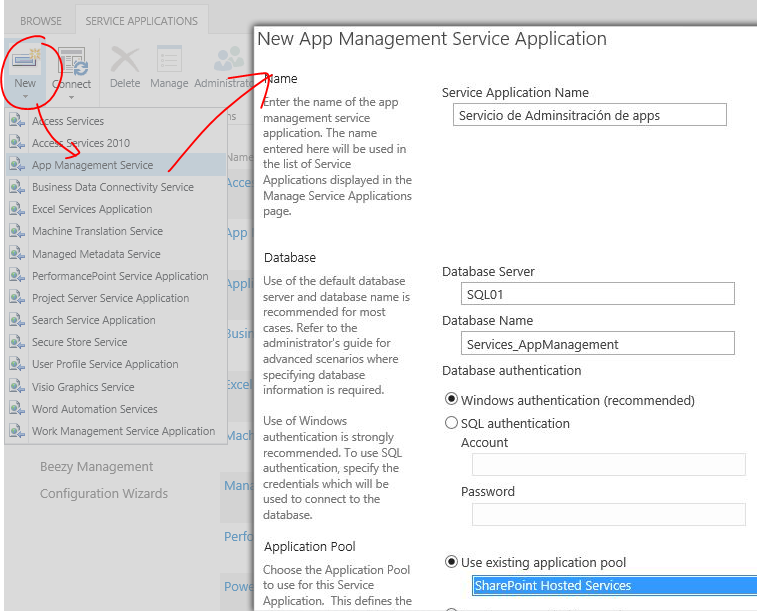
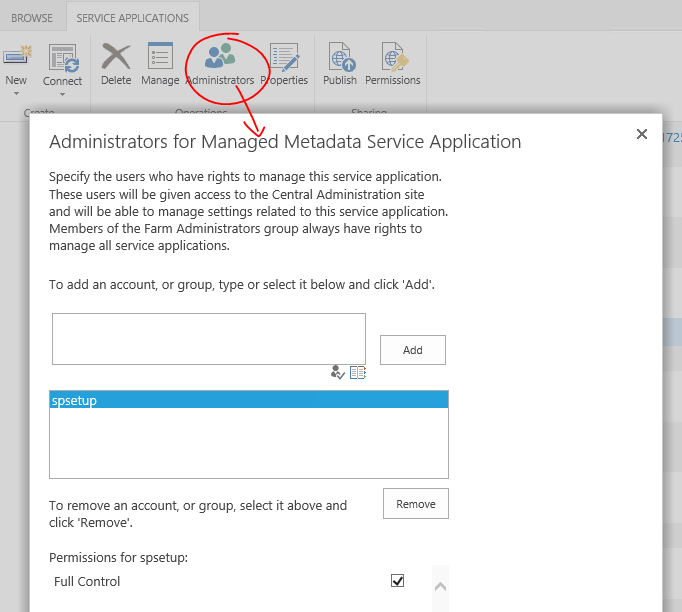
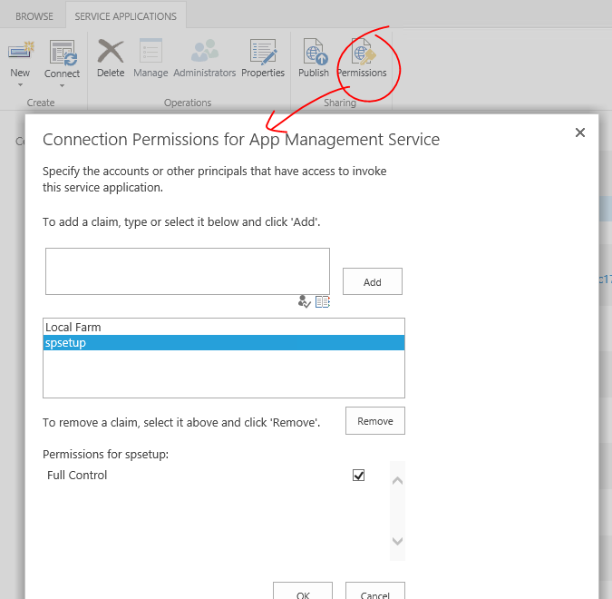
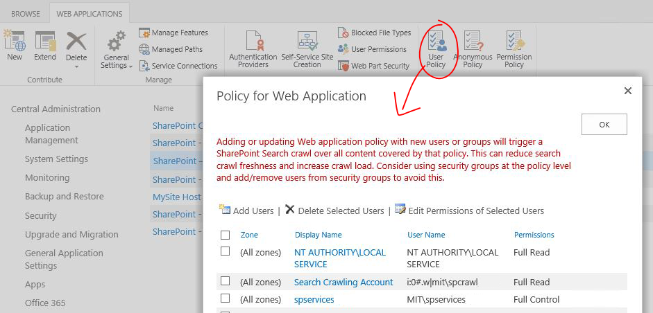
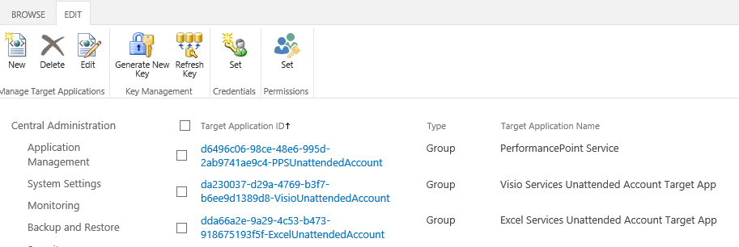
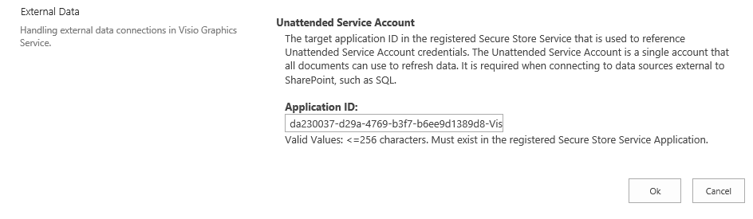
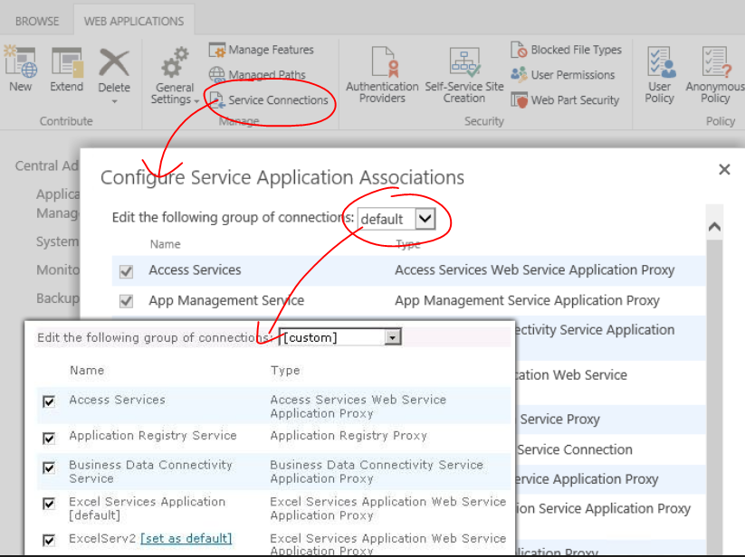

import ArticleHeader from '../../../components/article-header'

<ArticleHeader frontmatter={props.pageContext.frontmatter} />

​En SharePoint 2010 y 2013, el modelo de arquitectura de servicios ofrece un marco en el que implementar y administrar servicios dentro de una granja o entre varias. Las llamadas aplicaciones de servicio representan a una instancia de un servicio que se puede ofrecer en SharePoint para ser consumido y que se puede configurar de forma centralizada. Las aplicaciones de servicio nos permiten ofrecer servicios en nuestra granja de SharePoint que pueden ser compartidos y consumidos por distintas aplicaciones web o incluso por distintas granjas (en infraestructuras muy grandes).

Las aplicaciones de servicio disponibles en SharePoint 2010 y 2013 por defecto son las siguientes:

| Nombre de la aplicación de servicio | SP 2013 | SP 2010 |
| --- | --- | --- |
| Servicios de Access | X |   |
| Servicios de Access 2010 | X | X |
| Servicio de administración de apps | X |   |
| Equilibrio de carga y detección de aplicaciones | X |   |
| Conectividad a datos empresariales (BCS) | X | X |
| Servicios de Excel | X | X |
| Conector a Lotus Notes | X | X |
| Servicio de traducción automática | X |   |
| Servicio de metadatos administrados | X | X |
| Servicio de configuración de suscripción de Microsoft SharePoint Foundation | X | X |
| Servicios de PerformancePoint | X | X |
| Conversión de PowerPoint | X | X |
| Servicio de búsqueda | X | X |
| Servicio de almacenamiento seguro | X | X |
| Aplicación de servicio de token de seguridad | X | X |
| Servicio de estado | X | X |
| Recolección de datos de mantenimiento y uso | X | X |
| Servicio de perfil del usuario | X | X |
| Servicio de gráficos de Visio | X | X |
| Word Automation Services | X | X |
| Administración del trabajo | X |   |
| Web Analytics |   | X |
| Aplicación de servicio de flujo de trabajo (sólo si hay un servicio externo de flujo de trabajo conectado) | X |   |

Además de estas aplicaciones de servicio, existen otras que pueden ser creadas por otros productos que se integran con SharePoint (Project Server, Office Web Apps 2010, SQL Reporting Services, PowerPivot…) o pertenecer a productos de terceros. Para conseguir un correcto funcionamiento, mantenimiento y escalabilidad de nuestros entornos, es necesaria una correcta configuración de nuestras aplicaciones de servicio. En este artículo repasaremos los puntos clave a tener en cuenta para organizar las aplicaciones de servicio, configurar su seguridad, organizar sus bases de datos y planear el escalado de éstas.

**Planear las cuentas de seguridad**

El primer paso a tener en cuenta a la hora de planear las aplicaciones de servicio son las cuentas a utilizar. Para ello nos basaremos en las cuentas recomendadas que expusimos en el nº 20 de CompartiMOSS ("Buenas prácticas en infraestructura en SharePoint 2013 - Parte II"). Las aplicaciones de servicio residen, como cualquier otra aplicación web, en el IIS del servidor. Es por ello que es necesario al menos un grupo de aplicación (application pool) para ejecutarlas. Para este grupo de aplicaciones utilizaremos una cuenta de seguridad que llamaremos **spservices**.

El servicio de búsquedas requiere varias cuentas para funcionar correctamente. Es necesaria una cuenta de acceso al contenido, que tendrás permisos de lectura en todo el contenido y será utilizada por el rastreador (crawler) de las búsquedas. La llamaremos **spcrawl**. También es necesaria una cuenta independiente para la administración de búsqueda, que se asignará a todas las aplicaciones de servicio de búsqueda de la granja. Además, se recomienda independizar el grupo de aplicación (application pool) del servicio de búsquedas y disponer de una cuenta para este servicio. Microsoft especifica que puede ser la misma cuenta de administración u otra cuenta distinta. Nosotros utilizaremos la misma: spsearch.

El servicio de sincronización de perfiles necesita una cuenta para acceder al Active Directory y obtener datos de los usuarios. Debe tener permisos de "Replicating Directory Changes" en el AD. La llamaremos spprofile.

Los servicios de Excel, Visio y PerformancePoint necesitan utilizar una cuenta en nombre de usuarios autorizados para proporcionar acceso a orígenes de datos externos. Estas cuentas, llamadas cuentas "desatendidas" se configuran en el servicio de almacenamiento seguro. Las llamaremos spvisio, spexcel y spperfpoint.

**Planear los grupos de aplicación (application pools)**

Como se ha mencionado en el apartado anterior, las aplicaciones de servicio se deben distribuir en uno o más grupos de aplicación (application pool). Microsoft indica en TechNet que se puede implementar aplicaciones de servicio en distintos grupos de aplicaciones para aislar procesos. Sin embargo, también se indica que el rendimiento de una granja se optimiza si todos los servicios están dentro de un mismo grupo de aplicaciones. Aun así, se recomienda la ejecución del servicio de búsqueda en un grupo de aplicación independiente por razones de escalabilidad y de seguridad. También se recomienda ejecutar los servicios de token de seguridad y de equilibrio de carga con las credenciales del administrador de granja y cuenta de acceso a base de datos (spfarm).

Buscando la convergencia entre la recomendación de juntar servicios en un mismo grupo de aplicación y estas configuraciones especiales, el resultado sería la creación de cuatro grupos de aplicación en el IIS para las aplicaciones de servicio de SharePoint:

- SecurityTokenServiceApplicationPool [cuenta: spfarm].
    - Servicio de token de seguridad.
- SharePoint Hosted Services [cuenta: spservices].
    - Servicio de administración de apps.
    - Conectividad a datos empresariales (BCS).
    - Servicios de Excel.
    - Servicio de traducción automática.
    - Servicio de metadatos administrados.
    - Servicios de PerformancePoint.
    - Conversión de PowerPoint.
    - Servicio de almacenamiento seguro.
    - Servicio de configuración de suscripción.
    - Servicio de perfil del usuario.
    - Servicio de gráficos de Visio.
    - Word Automation Services.
- SharePoint Search Application Pool [cuenta: spsearch].
    - Aplicación de servicio de búsqueda.
    - Search Administration Web Service for Search Service Application.
- SharePoint Web Services System [cuenta: spfarm].
    - Equilibrio de carga y detección de aplicaciones.

**Nota:** se ha utilizado la nomenclatura usada en muchos artículos y en proyectos como AutoSPInstaller.

**Planear las bases de datos**

Hay determinadas aplicaciones de servicio que requieren el uso de una o varias bases de datos. Es muy recomendable tener una nomenclatura de nombres muy clara a la hora de nombrar estas bases de datos, ya que ayudará a la gestión y al mantenimiento, permitiéndonos identificarlas rápidamente. La recomendación es utilizar un prefijo único que las identifique como bases de datos de servicio (para verlas todas juntas en SQL Server) seguida de un nombre descriptivo. Para el artículo, indicamos los nombres más utilizados por la comunidad y usados en proyectos como AutoSPInstaller:

| Aplicación de servicio | Nombre de BD recomendado |
| --- | --- |
| Servicio de administración de apps | Services\_AppManagement |
| Conectividad a datos empresariales (BCS) | Services\_BusinessDataCatalog |
| Servicio de traducción automática | Services\_TranstaltionService |
| Servicio de metadatos administrados | Services\_MetaData |
| Servicio de configuración de suscripción | Services\_SubscriptionSettings |
| Servicios de PerformancePoint | Services\_PerformancePoint |
| Servicio de búsqueda | Base de datos de administración de búsquedas: <ul><li>Services_Search</li></ul> Base de datos de informes de Anaytics <ul><li>Services_AnalyticsReportingStore</li></ul> Base de datos de rastreo <ul><li>Services_CrawlStore</li></ul> Base de datos de vínculo <ul><li>Services_LinksStore</li></ul> |
| Servicio de almacenamiento seguro | Services\_SecureStore |
| Servicio de estado | Services\_StateService |
| Recolección de datos de mantenimiento y uso | Services\_UsageAndHealth |
| Servicio de perfil del usuario | Base de datos de información sobre los perfiles: <ul><li>Services_Profile</li></ul> Base de datos de etiquetas sociales y notas de los usuarios: <ul><li>Services_Social</li></ul> Base de datos con información provisional para la sincronización de perfiles: <ul><li>Services_Sync</li></ul> |
| Word Automation Services | Services\_WordAutomation |

Los permisos de las bases de datos se asignan al crear la aplicación de servicio o al actualizar la seguridad desde la Administración Central. Es recomendable no editarlos desde SQL Server para evitar problemas.

**Creación de las aplicaciones de servicio**

Existen tres formas de crear las aplicaciones de servicio:

- Todas a la vez mediante el asistente de configuración de la granja.
- De una en una desde la página de administración de aplicaciones de servicio (Administración Central de SharePoint).
- De una en una mediante Windows PowerShell.

El Asistente de Configuración de la Granja permite crear todas las aplicaciones de servicio a la vez y si tener que preocuparse por nombres, seguridad ni otras configuraciones (Imagen 1).

Precisamente por esta facilidad es por lo que no se recomienda el uso del asistente, no permite tener el control de la configuración y eso genera multitud de inconvenientes tales como:

- Todas las aplicaciones de servicio se implementan en el mismo grupo de aplicaciones (application pool).
- Se usa una única cuenta para todos los servicios. Se puede cambiar más adelante, pero es complicado.
- Los nombres de las bases de datos se generan automáticamente, con GUIDs largos e incómodos de recordar. No es sencillo identificarlas rápidamente al administrar SQL Server.
- No nos permite tener una convención de nomenclatura para las aplicaciones de servicio y para sus bases de datos.
- Se aplica la configuración predeterminada en cada aplicación de servicio. Se puede cambiar más adelante.

En cambio, la creación manual (mediante Administración Central o PowerShell) permite tener el control sobre nombres, conexiones, seguridad y configuración (Imagen 2). Una vez se hayan decidido la nomenclatura de nombres, las cuentas y grupos de aplicación, el servidor  de base de datos y los nombres de bases de datos, es muy sencillo crear una aplicación de servicio. En la Imagen 2 puede verse que los datos para la aplicación de servicio de administración de apps son estos datos de los que hemos estado hablando.

Además de estos parámetros, algunas aplicaciones de servicio requieren configuración adicional. Por ejemplo, los servicios de perfiles y de búsqueda necesitan varias bases de datos, el servicio de perfiles necesita varios parámetros para configurar Mi Sitio, el servicio de almacenamiento seguro tiene opciones de auditoría, etc. Para las opciones específicas de cada servicio, se puede consultar esta guía de TechNet: [https://technet.microsoft.com/es-es/library/ee794878.aspx](https&#58;//technet.microsoft.com/es-es/library/ee794878.aspx)

**Seguridad**

Una vez se han creado las aplicaciones de servicio, es necesario configurar una serie de parámetros de seguridad para asegurarnos que los servicios, usuarios o aplicaciones que las consuman no tengan problemas de acceso. Para explicar este punto, utilizaremos las cuentas mencionadas en este artículo, a las que le añadiremos:

- **spfarm**: cuenta administrador de granja y de conexión a base de datos. Se impersonal como Cuenta del Sistema y es cuenta del grupo de aplicación (application pool) de la Administración Central.
- **spsetup**: cuenta de instalación, configurador de SharePoint y PowerShell.
- **sppool1, sppool2, sppool3**…: cuentas del grupo de aplicación (application pool) de cada aplicación de contenido de SharePoint.
- **spmysite**: cuenta del grupo de aplicación (application pool) de la aplicación de Mi Sitio.

Por un lado, se pueden configurar uno o varios administradores en cada aplicación de servicio y establecerles diferentes niveles de permiso, tal y como se ve en la Imagen 3.

De forma predeterminada, los miembros del grupo de administradores de la granja de servidores tienen permisos para administrar las aplicaciones de servicio. Aun así, es necesario hacer algún ajuste adicional en las siguientes:

- Servicio de metadatos administrados:
    - spsetup: full control.
- Servicio de perfiles de usuario:
    - spsetup: full control.
    - spmysite: full control.
    - sppool1, sppool2, sppool3…: full control.
    - spcrawl: retrieve people data for search crawlers.
    - spfarm: full control.

De esta forma, las aplicaciones de contenido no tendrán problemas para acceder al servicio de perfiles y la cuenta de rastreo de búsquedas podrá rastrear personas. También evitaremos problemas accediendo desde PowerShell al servicio de metadatos. Si se desea administrar alguna de las aplicaciones de servicio con otra cuenta, es posible asignarles permisos desde aquí. Esta asignación provocará que se le otorguen permisos internamente en las bases de datos de las aplicaciones de servicio.

Por otra parte, existe la posibilidad de compartir las aplicaciones de servicio con las cuentas de usuario que se considere necesarias, como se muestra en la Imagen 4. El objetivo de esta funcionalidad es poder compartir determinadas aplicaciones de servicio con otras granjas, aunque también es necesario para que algunas funcionalidades y servicios de la granja puedan utilizar alguna de las aplicaciones de servicio.

Por ejemplo, la navegación en los sitios de publicación necesita acceder internamente al servicio de perfiles para obtener información de audiencias. Y la cuenta del grupo de aplicación (sppooln) de una aplicación web necesita acceso de lectura al almacén de términos del servicio de metadatos para, entre otras cosas, proporcionar la funcionalidad de "I like it" en SP 2010 y de los tag sociales. Por razones como estas (y muchas otras), se recomienda configurar los siguientes permisos:

- Todas las aplicaciones de servicio:
    - Local farm: full control (configurado por defecto).
- Servicio de metadatos administrados:
    - Local farm: Full Access to Term Store.
    - All Authenticated Users: Read Access to Term Store.
    - spsetup: Full Access to Term Store.
- Servicio de perfiles de usuario:
    - spsetup: full control.
    - spmysite: full control.
    - sppool: full control.
    - spfarm: full control.

Nótese que se otorga acceso de lectura al almacén de términos a todas las cuentas. Esto permitirá que cualquier usuario pueda utilizar y crear términos si así se desea y evitará problemas de acceso al almacén de términos desde los sitios. Finalmente, es necesario otorgar ciertos permisos en las aplicaciones de contenido mediante políticas para la correcta interacción con las aplicaciones de servicio. La cuenta de rastreo (spcrawl) debe tener permisos de "Full Read" en las aplicaciones de contenido para asegurarnos que pueda rastrear todo el contenido. Las cuentas de los grupos de aplicación (application pool) de las aplicaciones de servicio (spservices y spsearch) deben tener permisos de "Full Control" para asegurarnos que pueden realizar operaciones contra los sitios de SharePoint. En la Imagen 5 se puede ver un ejemplo.

Se recuerda que es necesario configurar la cuenta spcrawl como cuenta de rastreo en la configuración del servicio de búsquedas.

**Configurar las cuentas desatendidas**

Las aplicaciones de servicio de Excel, Visio y PerformancePoint necesitan utilizar una cuenta en nombre de usuarios autorizados para proporcionar acceso a orígenes de datos externos. Estas cuentas, llamadas cuentas "desatendidas" se configuran en el servicio de almacenamiento seguro. Las cuentas tendrán acceso a los orígenes de datos que sean necesarios y estas aplicaciones de servicio podrán utilizarlas.  Para la creación de estas cuentas, se recomienda utilizar las cuentas de usuario spexcel, spvisio y spperfpoint y registrarlas en el servicio de almacenamiento seguro, tal y como se muestra en la imagen 6.

En cada una de las aplicaciones de servicio, hay un apartado en la configuración en el que se asignará el ID generado para estas cuentas. En la Imagen 7 se muestra la configuración para la aplicación de servicios de Visio.

**Asociar servicios**

Tras haber creado las aplicaciones de servicio y configurado su seguridad, es posible asignarlas a las aplicaciones de contenido (en la Administración Central) para que éstas puedan usarlas. El botón de Conexiones de Servicio permite realizar esta asociación. Si se mantiene el combo en el grupo "default", todas las predeterminadas se asignarán. Si se cambia a un valor personalizado, podremos elegir las aplicaciones de servicio que necesitamos, tal y como se muestra en la Imagen 8.

Es posible incluso tener más de una aplicación de servicio de un tipo. En la Imagen 8 se muestran dos aplicaciones de servicio de Excel y se permite decidir cuál es la predeterminada.

**Bibliografía recomendada**

Si se desea profundizar más en la gestión y configuración de las aplicaciones de servicio, recomiendo los siguientes enlaces:

- Configuración de servicios y aplicaciones de servicio:
    - [https://technet.microsoft.com/es-es/library/ee794878.aspx](https&#58;//technet.microsoft.com/es-es/library/ee794878.aspx)
- Servicios de SharePoint 2013 (diagrama técnico muy recomendado):
    - [http://go.microsoft.com/fwlink/p/?LinkId=259425](http&#58;//go.microsoft.com/fwlink/p/?LinkId=259425)
- Aplicaciones de servicio en SharePoint 2013: Introducción y funcionalidad (Gustavo Vélez, Juan Carlos González, Fabián Imaz):
    - [https://msdn.microsoft.com/es-es/library/dn195886.aspx](https&#58;//msdn.microsoft.com/es-es/library/dn195886.aspx)

**MIGUEL TABERA PACHECO**
 SharePoint Lead en Plain Concepts 
MVP de SharePoint Server
 miguel.tabera@outlook.com
 @migueltabera
 [www.sinsharepointnohayparaiso.com](http&#58;//www.sinsharepointnohayparaiso.com/)

