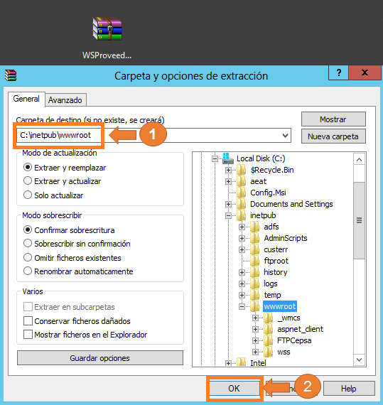
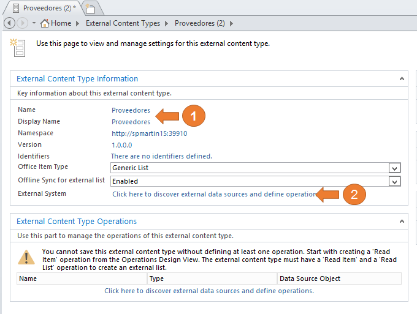

​En muchas ocasiones necesitamos presentar en nuestro sitio de búsqueda datos empresariales de otros orígenes (fuera de SharePoint) como pueden ser base de datos (SQL Server, Oracle, MySQL), ERP (Dynamics, SAP, ECI, NetSuite), CRM (Dinamics, SAP,Sugar), etc.

Esto es posible mediante la búsqueda de datos externos utilizando los servicios de conectividad empresarial, a continuación vamos a ver paso a paso como realizar dicha integración utilizado como conector un servicio web.

**Paso 0 – Requisitos necesarios.**

Para nuestro ejemplo es necesario disponer de las siguientes aplicaciones de servicio creadas en nuestro servidor.

- Búsqueda. Para más información de cómo crear dicho aplicación [http://technet.microsoft.com/es-es/library/gg502597(v=office.15).aspx](http&#58;//technet.microsoft.com/es-es/library/gg502597%28v=office.15%29.aspx)
- Almacenamiento Seguro. Para más información de cómo crear dicho aplicación  [http://technet.microsoft.com/es-es/library/ee806866(v=office.15).aspx](http&#58;//technet.microsoft.com/es-es/library/ee806866%28v=office.15%29.aspx)
- Conectividad a datos empresariales:

Para más información de cómo crear dicha aplicación  [http://technet.microsoft.com/es-es/library/jj683108(v=office.15).aspx](http&#58;//technet.microsoft.com/es-es/library/jj683108%28v=office.15%29.aspx)

También es necesario tener instalado Microsoft SharePoint Designer 2013 que lo podemos descargar del [http://www.microsoft.com/es-es/download/details.aspx?id=35491](http&#58;//www.microsoft.com/es-es/download/details.aspx?id=35491)

**Paso 1 - Preparación del servicio web de proveedores.**

Disponemos en el código fuente del artículo un servicio web que devuelve un conjunto de proveedores codificado pero suficiente para nuestro ejemplo. Aunque existen muchas técnicas para publicar el servicio web, la más fácil en nuestro caso es copiar todo el contenido del fichero comprimido "WSProveedores.zip" en "C:\inetpub\wwwroot", para después crear el directorio virtual en IIS, para ello seguimos los siguientes puntos.

- Copiamos el servicio web: Abrimos el fichero "WSProveedores.zip" con Winrar o equivalente y extraemos en la ubicación anteriormente mencionada.

- Creamos el directorio web. En el buscador del sistema operativo introducimos el texto  "IIS" y seleccionamos el icono de "Internet Information Server".

Nos posicionamos en el nodo de la lista de sitios del panel de navegación y pulsamos el botón derecho de ratón para seleccionar añadir sitio web (Add WebSite), después introducimos los siguientes datos en el formulario nombre del sitio (Site Name) "Web Services Proveedores", en pool de aplicaciones (.Net 2.0), ruta física (Physical Path) "C:\inetpub\wwwroot", puerto (Port) 9797 y pulsamos en aceptar (OK) para crear el sitio web.

- Validamos el servicio. En el navegador introducimos la url del servicio web, en nuestro caso [http://spmartin15:9797/service.asxm](http&#58;//spmartin15&#58;9797/service.asxm)

**Paso 2 - Añadir credenciales al servicio de almacén seguro**

Aunque podemos proteger nuestras conexiones con sistemas externos de muchas maneras, uno de los métodos recomendados es utilizar la aplicación de servicios de almacén seguros, para ello seguimos los siguientes puntos:

- Abrimos la Administración central de SharePoint 2013. En el buscador del sistema operativo introducimos el texto "SharePoint 2013" y seleccionamos el icono de "SharePoint 2013".

- Abrimos el formulario de la aplicación del servicio de almacén seguro. Seleccionamos la opción de gestión de servicios de aplicaciones (Manage services applications) para posteriormente seleccionar nuestra aplicación de servicio de almacén seguro (Secure Store Services Application).

- Creamos una nueva aplicación destino. Seleccionamos el botón de nuevo (New) en la cinta de opciones.

Introducimos los datos solicitados. En nuestro caso en el identificador de la aplicación de servicio (Target Application ID), en el nombre a mostrar (Display Name) introducimos "ServiciosProveedores", en el campo de email de contacto (Contact E-Email) introducimos  [martin@spmartin15.com](mailto&#58;martin@spmartin15.com), dejamos los demás campos con los valores por defecto y pulsamos el botón de siguiente (Next).

Marcamos el tipo de campo de nombre de usuario de Windows (Windows User Name) y pulsamos sobre el botón de siguiente (Next).

Introducimos la relación de usuarios que tienen permisos para la gestión de la configuración de la aplicación destino, en nuestro caso "Martin Luis Lopez" y pulsamos sobre el botón de aceptar (OK)

- Asignamos las credenciales a la aplicación de destino. Seleccionamos nuestra aplicación de destino "ServicioProveedores" y en la cinta de opciones pulsamos sobre el botón de asignar credenciales (Set).

Introducimos los datos solicitados. En nuestro caso el propietario (Credential Owner) "Martin Luis Lopez", usuario de Windows "spmartin15\mlopezre", contraseña de Windows \*\*\*\*\*\*\*\*, y por últimos pulsamos sobre el botón de aceptar (OK)

**Paso 3 - Creación del tipo de contenido externo.**

Aunque podemos crear el tipo de contenido externo mediante código vamos a utilizar Microsoft SharePoint Designer 2013 por su facilidad, para ello seguimos los siguientes puntos:

- Abrimos SharePoint Designer 2013. En el buscador del sistema operativo introducimos el texto de "Designer" y seleccionamos el icono de "SharePoint Designer 2013"

- Abrimos nuestro sitio de búsqueda. Para ello pulsamos sobre el botón de abrir sitio (Open Site) introducimos la Url en el nombre del sitio (Site Name) en nuestro caso "[http://spmartin15:39910/](http&#58;//spmartin15&#58;39910/)" y pulsamos sobre el botón abrir (Open).

- Creamos el nuevo tipo de contenido externo. En el panel de navegación seleccionamos el objeto de tipos de contenido externo (External Content Type), aparecerán los iconos correspondiente en la cinta de opciones y seleccionamos el primero de la categoría nuevo (External Content Type).

- Datos básicos. Introducimos el valor "Proveedores" en los campos nombre (Name) y nombre a mostrar (Display Name), después seleccionamos el enlace del sistema Externo (External System).

- Creamos la conexión. Pulsamos sobre el botón de añadir conexión (Add Connection) y seleccionamos el tipo de origen de datos, en nuestro caso  "WCF Services" y aceptamos pulsando el botón aceptar (OK), posteriormente introducimos los datos de la conexión, en nuestro caso  URL Servicio de metadatos (Metadata Connection Model) "[http://spmartin15:9797/service.asmx?WSDL](http&#58;//spmartin15&#58;9797/service.asmx?WSDL)",  punto de enlace del servicio (Service EndPoint URl) [http://spmartin15:9797/service.asmx](http&#58;//spmartin15&#58;9797/service.asmx),  nombre (Name) "SeviciosProveedores", utilizamos la credenciales almacenada en nuestro almacén seguro (Connect with impersonated Custom Identity) creado en el apartado anterior "ServiciosProveedor" y pulsamos sobre el botón de aceptar (OK).

- Creamos las operaciones. Aunque podemos crear todas las operaciones CRUD, en las búsquedas sólo necesitamos las operaciones de lecturas. Sobre el método "GetSupplier" pulsamos con el botón derecho del ratón y seleccionamos nueva operación de Lectura de Lista (New Read List Operation).

En la primera ventana del formulario (Operation Properties) dejamos los valores por defecto y pulsamos el botón de siguiente (Next).

Aunque se recomienda por buenas prácticas introducir parámetros de entrada para limitar el número de elementos devuelto, en nuestro caso de ejemplo pasamos por alto esta advertencia pulsamos sobre el botón siguiente (Next).

En los parámetros de retorno Seleccionamos el campo "code", indicamos que es mapa a identificador (Map to identifier), también lo indicamos como identificador (Identificator), indicamos que lo muestre en un recogedor (Picker), y por último pulsamos el botón de finalizar (Finish).

Ahora creamos la operación de lectura de elemento.

Sobre el método "GetSupplierById" pulsamos con el botón derecho del ratón y seleccionamos nueva Operación de Lectura de elemento (New Read Item Operation).

En la primera ventana del formulario (Operation Properties) dejamos los valores por defecto y pulsamos el botón de siguiente (Next).

En los parámetros de entrada seleccionamos "code" como mapa a identificar (Map to identifer) y pulsamos en el botón de siguiente (Next).

En los parámetros de retorno Seleccionamos el campo "code", indicamos que es mapa a identificador (Map to identifier), también lo indicamos como identificador (Identificator) y por último pulsamos el botón de finalizar (Finish).

- Guardamos el nuevo tipo de contenido externo. Por último guardamos las acciones realizadas, para ello pulsamos sobre el botón representado con una imagen de un disquete situado en parte superior del formulario principal o pulsamos la combinación de teclas "Ctr+S".

**Paso 4 - Configuración y Seguridad.**

Para presentar los datos es necesario disponer de las páginas de perfil de los tipos de contenidos externo de proveedores y quien tiene acceso a ellos. Para ello seguimos los siguientes puntos:

- Abrimos la administración central de SharePoint 2013. En el buscador del sistema operativo introducimos el texto "SharePoint 2013" y seleccionamos el icono de "SharePoint 2013".

- Abrimos el formulario de la aplicación de servicio conectividad a datos empresariales. En el caso de no estar en la página inicial de la Administración Central pulsamos sobre la imagen de SharePoint, seleccionamos la opción de gestión de servicios de aplicaciones (Manage services Applications) para posteriormente seleccionar nuestra aplicación de servicio de conectividad a datos empresariales (Business Data Connectity Services Application).

- Activamos la creación de la página de perfil del tipo de contenido externo. Seleccionamos nuestro contenido externo creado anteriormente "Proveedores" y pulsamos sobre el botón de configuración "Configure" de la cinta de opciones.

En el formulario de configuración seleccionamos la casilla de activar la creación de página de perfil (Enable Profile Page Creation) e introducimos la URL correspondiente del sitio de búsqueda en nuestro caso [http://spmartin15:39910](http&#58;//spmartin15&#58;39910/) y aceptamos los valores.

- Creamos la página de perfil del tipo de contenido externo. Volvemos a SharePoint Designer 2013 concretamente a nuestro tipo de contenido externo "Proveedores" en caso de no estar abierto ver los pasos en el punto 3. En la cinta de opciones pulsamos sobre crear página de perfil (Create Profile Page).

- Introducimos los permisos para nuestro tipo de contenido externo. Volvemos a la Administración central, concretamente al formulario del servicio de conectividad a datos empresariales, seleccionamos el contenido de origen "Proveedores" y pulsamos sobre el botón coger los permisos del objeto (Set Object Permission), en el formulario asignamos los permisos necesarios y guardamos la información introducida.

**Conclusiones**

Si combinamos el motor de búsqueda con Business Connectivity Services (BCS) nos brinda grandes posibilidades de integración con datos empresarial sin ningún tipo de desarrollo personalizado en la mayoría de los cosas además de una gran facilidad y flexibilidad en su configuración. En el siguiente artículo de la serie, continuaremos realizando las configuraciones necesarias para aprovechar estas características de integración.

**MARTIN LUIS LOPEZ REQUENA**
SharePoint Solution Architect & Trainer at everis 
[martinluislopez@hotmail.com](mailto&#58;martinluislopez@hotmail.com)

