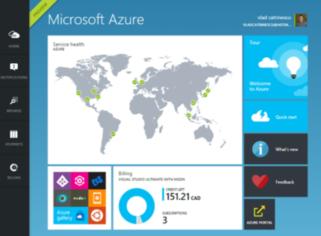
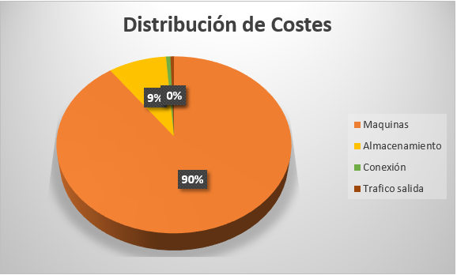

​Cada vez es más habitual entre los clientes que te encuentres con situaciones en las que, o bien quieren establecer entornos de *Disaster Recovery* o bien quieren migrar sus granjas de entornos no productivos a la nube, como forma de conseguir unos entornos "elásticos" que les permitan crecer/decrecer de forma ágil. Esta nueva dinámica normalmente viene seguida de la típica pregunta ¿Y cuánto me va a costar mes a mes?

La nueva dinámica empresarial y tecnológica de movimiento hacia la nube normalmente viene seguida de la típica pregunta ¿Y cuánto me va a costar mes a mes? Este cálculo no es nada sencillo de hacer, por cuanto depende mucho la granja, las prestaciones requeridas, las consideraciones de resistencia a fallos, y la misma relación de la empresa con Microsoft para hacer la cuenta, pero ese tampoco es el objetivo del presente artículo.

En este artículo voy a permitirme la licencia de diseñar una granja desde cero, intentando conseguir un "estado del arte" de lo que se puede montar a día de hoy. Esta consideración es importante, porque para cualquier persona que comienza a trabajar con Azure es impactante la velocidad con la que evoluciona la plataforma, y esto hace que sea complicado el mantenerse al paso de los nuevos servicios e infraestructura en Preview y GA (*Globally Available).*Eso sí, siempre teniendo en cuenta la relación inversión/beneficio. Sería muy fácil montar decenas de máquinas con cientos de Gb de RAM, procesadores gigantescos, y enormes discos (o al menos muchos), pero no siempre son la respuesta adecuada, y su coste sería desmesurado. Por ello, mi objetivo es proponer pequeñas ideas y/o trucos que pueden servir para tener una infraestructura óptima, y a un coste moderado.

**Consideraciones de infraestructura**

Para ello, nada mejor que recordar una regla importante en Azure: *De un nivel al siguiente, el coste se dobla*. Esta regla implica que dos máquinas A5 costarán, aproximadamente, lo mismo que una máquina A6 de forma mensual. En una infraestructura SharePoint, habitualmente es preferible una estrategia *Scale Out*(Añadir máquinas a la granja) que una estrategia *Scale Up*(añadir recursos a las máquinas). Por muchos recursos que añadamos, llegado a un determinado nivel no vamos a conseguir ganar velocidad a la granja, y tendremos que recurrir a otras estrategias, como añadir servidores de cacheado en capas adicionales, para mejorar el rendimiento. La mejor analogía que se puede hacer es como potenciar un coche… podemos ponerle 200 caballos más, pero una vez llega al corte en 5ª o 6ª, no va a correr más.

Otro punto a tener a tener en cuenta es que por lo general las máquinas de SharePoint suelen tener grandes requerimientos a nivel de discos duros, y en Azure existen limitaciones de IOPs por disco añadido. Ante esta situación, existen dos formas de atajar la situación. La primera es disponer de máquinas muy grandes, que permiten añadir muchos discos, y hacer stripping sobre ellos de forma que aparezcan como una sola unidad con muchos IOPs, y además disponen de mucha memoria lo que reducen los requerimientos de acceso a disco.  Esta era la única estrategia de la que se disponía hasta hace poco, pero a día de hoy (al final vamos a tener que inventar un acrónimo para esta expresión cuando hablamos de Azure) disponemos de una solución más óptima. Azure Premium Storage permite la definición de unidades con los límites de tamaño y velocidad que se requiera hasta unos límites bastante impresionantes. 32 Tb, 50.000 IOPs y una latencia &lt; 1 ms… Bastante impresionante, ¿no?  Esto no solo nos daría cobertura a los requisitos de una granja de SharePoint, sino que abre las posibilidades para subir a la nube a sistemas de alta demanda como un Dynamics, una instalación SQL grande, o un sistema SAP.

Se ha tomado como premisa que el cliente dispone de las licencias bases de software y el contrato de Software Assurance necesario para utilizar las licencias en la nube. En caso contrario, para las máquinas base de SQL debería tomarse el coste de las máquinas de tipo SQL que ya incluye el coste de licenciamiento incluido en el precio por hora

Los costes totales se han tomado con los precios P-a-G (Pay as you Go) publicados en [http://azure.microsoft.com](http://azure.microsoft.com/) a día 10/02/2014.

**Máquinas virtuales**

Para una granja estándar, se puede proponer una configuración 2x2x2:

- ­Dos servidores WFE de tipo D12.
- Dos servidores WFE de tipo D12.
- 1 cluster de SQL formado por dos máquinas de tipo D13.

A estas máquinas se recomienda anexar también una réplica del AD local en la nube. Para este cometido puede usarse una máquina sencilla A1. El porqué de utilizar máquinas de tipo D12 es debido a que, salvo que los requisitos de la aplicación destino indique lo contrario, apostamos a nivel de coste más por invertir en memoria que en procesador.

Mis **recomendaciones** **personales** para las máquinas de SharePoint serían:

| **Apartado** | **Cantidad** |
| --- | --- |
| **Procesador** | 4 cores, 2,0 GHz mínimo |
| **Memoria** | 16 GB mínimo. |
| **Discos** | Dos unidades: <ul><li>C:\ 80 GB mínimo.</li><li>E:\80 GB mínimo</li><li>Unidades localmente redundantes (LRS).</li></ul> |
| **S.O.** | Windows Server 2012. |
| **Otros** | Microsoft SharePoint Server 2013 + CALs. |

Para los SQL

| **Apartado** | **Cantidad** |
| --- | --- |
| **Procesador** | 4 cores, 2,0 GHz mínimo. |
| **Memoria** | 32 GB mínimo. |
| **Discos** | Dos unidades: <ul><li>C:\ 80 GB mínimo.</li><li>Logs:\ 512 GB mínimo.</li><li>Datos:\ 1 TB mínimo.</li><li>MasterDB:\ 160 GB mínimo.</li></ul> |
| **S.O.** | Windows Server 2012. |
| **Otros** | SQL 2012 Server Standard Edition. |

Las máquinas especificadas tienen las siguientes características:

| **Máquina** | **Cores** | **Memoria** | **Tamaño Discos** | **Coste** |
| --- | --- | --- | --- | --- |
| **D12** | 4 | 28 GB | 200 GB | 0,6271 €/h |
| **D13** | 8 | 56 GB | 400 GB | 1,129 €/h |

Una opción para reducir coste en estas máquinas sería utilizar máquinas de tipo A, pero estas máquinas no permiten el uso de discos de Azure Premium. Tomando estos datos de partida, el total en coste de máquinas sería:

| **Máquina** | **Máquinas** | **Coste/hora** | **Horas** | **Total/Mes** |
| --- | --- | --- | --- | --- |
| SP | ​ | ​ | ​ | ​ |
| **D12** | 4 | 0,6271 € | 744 | 1866,25 € |
| SQL | ​ | ​ | ​ | ​ |
| **D13** | 2 | 1,129 € | 744 | 1679,952 € |
| AD | ​ | ​ | ​ | ​ |
| **A1** | 1 | 0,0671 € | 744 | 49,9224 € |
|   | ​ | ​ | ​ | ​ |
| **Total Máquinas** |   |   |   | 3596,124 € |

**Almacenamiento**

Para el almacenamiento, vamos a instalar nuestro SharePoint sobre la unidad Premium, y vamos a utilizar la unidad temporal para alojar el archivo de swap, de forma que utilicemos la velocidad de esta unidad, que es estándar para las máquinas D. Por lo tanto, necesitaremos al menos de una unidad Premium por máquina WFE o BE.

En el caso de los SQL, vamos a añadirle tres unidades. El tamaño de cada una dependerá de la aplicación, por lo que nos basaremos en el cálculo en los tamaños estándar.

Para Azure Premium, las configuraciones estándar son:

| **Máquina** | **Tamaño** | **Precio** | **IOPs** | **Proceso** |
| --- | --- | --- | --- | --- |
| **P10** | 128 GB | 8,0726 € | 500 | 100 MB/s |
| **P20** | 512 GB | 29,99 € | 2300 | 150 MB/s |
| **P30** | 1024 GB | 55,37 € | 5000 | 200 MB/s |

Actualmente esta funcionalidad se encuentra en vista previa, por lo que los precios tienen una rebaja con respecto a su precio final. Es muy probable que cuando se hagan GA, se dispongan de más tamaños alternativos.  El total de almacenamiento sería:

|   | Unidades | Máquinas | Coste mensual | Capacidad | ​ |
| --- | --- | --- | --- | --- | --- |
| SP | ​ | ​ | ​ | ​ | ​ |
| P20 | 1 | 4 | 29,99 € | 512 GB | 119,96 GB |
| SQL | ​ | ​ | ​ | ​ | ​ |
| P20 | 2 | 2 | 29,99 € |  512 GB | 119,96 GB |
| P30 | 1 | 2 | 55,37 € | ​ | 110,74 GB |
| ​ | ​ | ​ | ​ | ​ | ​ |
| Total Almacenamiento | ​ |   |   |   | 350,96 GB |

**Otros**

Además de los gastos correspondientes a MV y almacenamiento, considerados como principales, también hay que tener en cuenta otros gastos que se pasan a enumerar:

- Conexión VNET-to-VNET: El tráfico de entrada a la nube no se tarifica. En cambio, el de salida sí que es tarificado. El coste es 0,0261€ por GB. Para un total de 1 TbBal mes: 26,7264 €\mes
- Puertas de enlace: 0,0269 por puerta de enlace. Aprox 21€\mes.
- Los datos de salida de Azure: En Zona 1 (europa) los primeros 5 Gb al mes son gratuitos. De 5 a 10 Tb se facturará a 0,0648 GB.
- Direccionamiento: Las 5 primeras reservas de IP interna son gratuitas.

Por último, y aunque no es necesario tenerlo en cuenta, es conveniente considerar utilizar el Load Balancer configurado delante de los servidores frontales, y aprovechar su funcionalidad de balanceo con persistencia de sesión. Esta funcionalidad, añadida hace poco, evita la necesidad de configurar cualquier otro tipo de balanceo, sea este externo en nube, como IMPERVA, o físico del tipo F5.

**Costes totales**

Para el ejemplo descrito, y tomando en cuenta que los precios pueden modificarse en función de las decisiones y/o licenciamiento efectuado, el total de coste sería:

| **Concepto** | **Coste mes** |
| --- | --- |
| SP | ​ |
| **Maquinas** | 3596,12 € |
| **Almacenamiento** | 350,96 € |
| **Conexión** | 26,73 € |
| **Trafico salida** | 21,00 € |
|   | ​ |
| **Total** | 3.994,81 € |

Y esto nos da la siguiente distribución de costes:

**Conclusiones finales**

A lo largo del artículo, hemos visto como ir elaborando el coste para una granja de SharePoint, y como resultado de esta inversión disfrutaríamos de una granja de rendimiento muy robusto, y que podría dar servicio a un gran número de usuarios de forma concurrente. Aunque a priori pueda resultar un coste no muy reducido, una vez que se compara el valor con el coste de provisionar estas máquinas, tiempo para su disposición, posibilidades de fallo, robustez de la configuración y seguridad de acceso, el coste de esta solución se puede ver desde otra perspectiva. Como se observa de forma gráfica, el grueso del coste para una solución de SharePoint en la nube corresponde con el coste de las máquinas virtuales y el almacenamiento. De cara a bajar el coste de la solución propuesta, por lo tanto, podremos jugar tanto con dimensionamiento de máquinas, como con el tamaño de las mismas. Es perfectamente válido el disponer de máquinas de un tamaño en el frontal, y otras de tamaño diferente en la capa de backend y/o otras capas intermedias, como las de cacheo, o máquinas para la instalación de las OWA.

Espero que os haya gustado, y que tengáis una respuesta preparada la próxima vez que un cliente os pregunte ¿Cuánto me va a costar mi granja en Azure?

**Fabián Calvo**
 Team leader
 [fcalvo@encamina.com](mailto:fcalvo@encamina.com) 
@fcvspain
 [http://www.encamina.com](http://www.encamina.com/)

