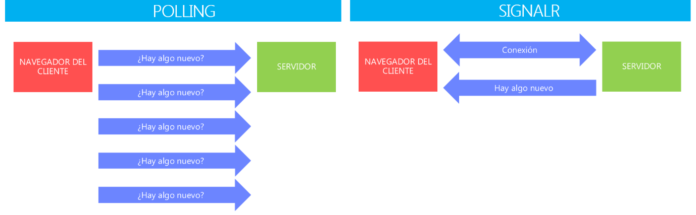
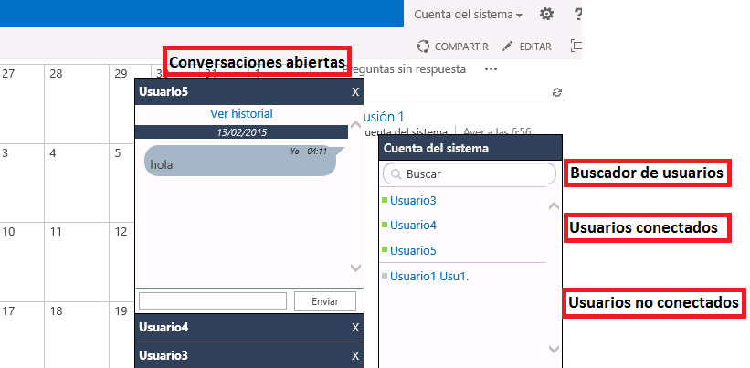
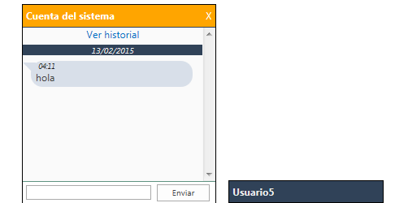

import ArticleHeader from '../../../components/article-header'

<ArticleHeader frontmatter={props.pageContext.frontmatter} />


​En este artículo vamos a explicar cómo hemos desarrollado un chat para SharePoint usando SignalR, pero, ¿qué es SignalR? SignalR es una librería Open Source que forma parte de la familia de ASP.Net. Mediante SignalR podemos añadir funcionalidad de tipo comunicación en tiempo real entre cliente y servidor, teniendo así una comunicación bidireccional.

Todas las conexiones son administradas por SignalR y permite transmitir los cambios a todos los clientes conectados o en caso de que sea necesario podemos notificar a un cliente específico.

Lo que nos ayuda a resolver SignalR es que en lugar de tener una aplicación que desde el lado del cliente periódicamente este preguntando al servidor si hay "algo nuevo" (lo denominado "Polling"), sea el servidor el que notifique al cliente cuándo se ha producido "algo nuevo".



Gracias a esta arquitectura podremos mandar mensajes 1 a N (por ejemplo cuando un usuario se conecta o se desconecta para informar al resto de clientes) o 1 a 1 (cuando un cliente manda un mensaje a otro cliente) todo ello de una forma ligera dado que el servidor únicamente actúa cuando tiene que realizar una tarea, lo mismo en la parte cliente dado que no se realiza el llamado "Polling" mostrado en la imagen anterior.

Para entender un poco cómo funciona todo esto vamos a mostrar algunos ejemplos de código. Cuando un cliente se conecta al chat, lo primero que hace es establecer la conexión con el servidor, esto se hace de la siguiente manera:

```
<script src="/signalr/hubs" type="text/javascript"></script>
<script type="text/javascript">
$(document).ready(function () {
    var chatHub = $.connection.chatHub;
    registerClientMethods(chatHub);
    // Start Hub
    $.connection.hub.start()
        .done(function () { registerEvents(chatHub); })
        .fail(function () { alert('El servicio de chat no está disponible en este momento.'); });
});
</script>
```

Donde se incluye una referencia a "/signalr/hubs", ubicación donde el propio SignalR genera de forma automática las librerías de JavaScript necesarias para llamar a las funciones de la parte servidora.  Gracias a esta referencia tenemos acceso a "$.connection" y de ahí realizar llamadas como por ejemplo a la función "$.connection.hub.start()", que abrirá la conexión con el servidor.

Una vez establecida la conexión con el servidor, podremos llamar fácilmente a funciones del servidor mediante JavaScript. A continuación se muestra un ejemplo de cómo se enviaría un mensaje privado a otro usuario:

```
<script type="text/javascript">
$div.find("#btnSendMessage").click(function () {
        chatHub.server.enviarMensajePrivado(userId, toUserId, msg);
});
</script>
```

Al pulsar el botón de enviar, realizaremos una llamada a la función "enviarMensajePrivado", llamada que se realiza en JavaScript pero que será respondida por una función servidora que se muestra a continuación:

```
public void EnviarMensajePrivado(string fromUserId, string toUserId, string message)
{
    //Previamente al envío del mensaje se haría la persistencia del mensaje en base de datos, se ha quitado del ejemplo por simplicidad
    foreach (var user in toUsers)
    {
        //Con este foreach lo que hacemos es recorrer todas las sesiones que el usuario receptor tiene abiertas (porque puede tener varias pestañas, varios navegadores...) y enviar el mensaje a cada una de ellas
        Clients.Client(user.ConnectionId).sendPrivateMessage(fromUserId, message);
    }
    foreach (var user in fromUsers)
    {
        //Con este foreach lo que hacemos es recorrer todas las sesiones que el usuario emisor tiene abiertas (porque puede tener varias pestañas, varios navegadores...) y enviar el mensaje a cada una de ellas
        Clients.Client(user.ConnectionId).sendPrivateMessage(toUserId, message);
    }
}
```

Al llamar a la función "sendPrivateMessage" lo que hacemos es llamar a la función de JavaScript que estará incluida en cada navegador del cliente (del usuario emisor o receptor) y enviará el id del usuario y el mensaje para que cada uno de estos navegadores clientes refleje el mensaje en pantalla.

```
<script type="text/javascript">
chatHub.client.sendPrivateMensaje = function (userId, message) {
    if ($('#' + userId).length == 0)
    {
        OpenPrivateChatWindow(chatHub, userId);
    }
    else
    {
        $('#' + userId) append("<div class='message'>" + message + "</div>");
    }
};
</script>
```

Al recibir el mensaje en la parte cliente se comprueba si "($('#' + userId)" existe, en caso de no existir significa que el usuario no tiene abierta la ventana de conversación con el usuario que le está enviando el mensaje, de modo que se llamará a la función "OpenPrivateChatWindow" para mostrar la ventana emergente. En caso de ya existir la ventana de la conversación lo que se hace es mostrar el nuevo mensaje.

A continuación se muestra una captura de pantalla de cómo se visualiza el chat dentro de SharePoint:



Y de la visión que tendría el usuario 5 al recibir el mensaje:



Entre las características principales que nos ofrece el chat cabe destacar:

- Información de conexión de los usuarios en tiempo real, de modo que sabemos en todo momento quién está conectado.
- Los mensajes son entregados correctamente a sus destinatarios aun cuando no estén conectados. El servicio proporciona la entrega fuera de línea de mensajes personales. Dispone además de un histórico que podremos consultar para ver conversaciones pasadas.
- Dispone de un buscador de usuarios para encontrar rápidamente un usuario en concreto y ver su disponibilidad.
- El diseño está totalmente integrado con la UI de SharePoint y es fácilmente personalizable dado que se basa en una CSS que se puede modificar.
- Mejora la comunicación interna y garantiza la confidencialidad de la conversación.
- Permite un número ilimitado de usuarios usando para ello pocos recursos del sistema y de una forma ligera gracias a la arquitectura de SignalR.


**Conclusiones**

SharePoint es una plataforma extensible por naturaleza y la incorporación de tecnologías como SignaIR facilitan habilitar más opciones de extensibilidad de la misma dotando de funcionalidad adicional como la descrita en este artículo: proporcionar una funcionalidad de chat de forma rápida y sencilla sin necesidad de recurrir a productos de terceros o a la integración nativa de la plataforma con Lync.

**Ricardo Gil González**
<br />MVP CLUSTER | Especialista en SharePoint & Office 365
[francisco.gil@fiveshareit.es](mailto&#58;francisco.gil@fiveshareit.es)
[Linkedin](http&#58;//es.linkedin.com/pub/ricardo-gil-gonzalez/63/99b/689/es)
[http://www.mvpcluster.es](http&#58;//www.mvpcluster.es/)

**José Antonio Fraga Sánchez**
<br />MVP CLUSTER | SharePoint Team Leader 
[jose.fraga@fiveshareit.es](mailto&#58;jose.fraga@fiveshareit.es)
[Linkedin](http&#58;//www.linkedin.com/in/josefraga)
[http://www.mvpcluster.es](http&#58;//www.mvpcluster.es/)

