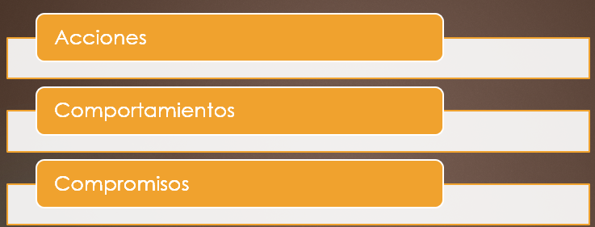
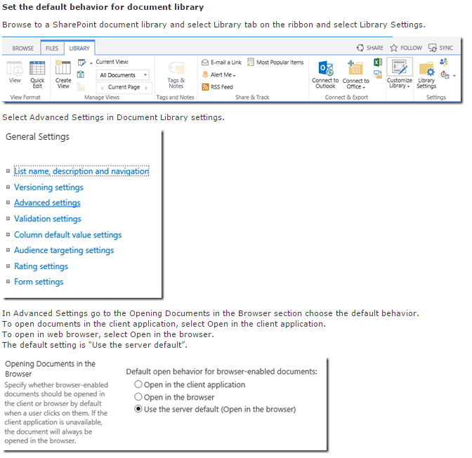
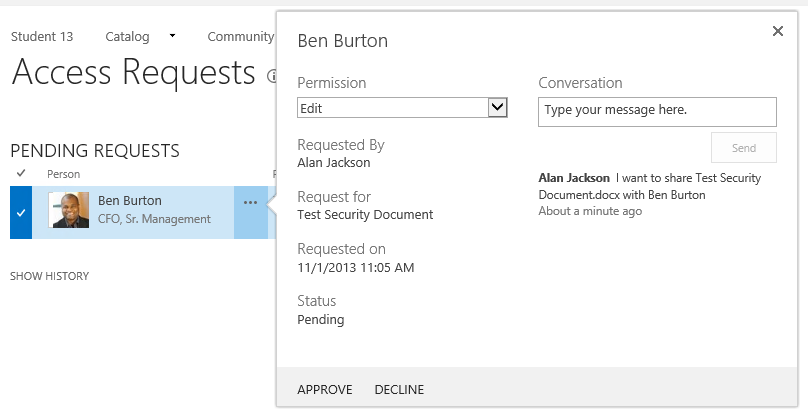
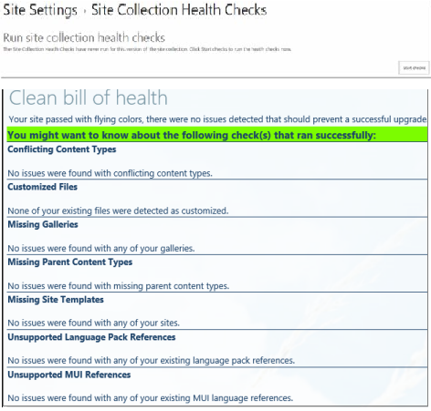

​A través de una serie de artículos trataré de exponer, con casos prácticos extraídos de situaciones reales, paradigmas con el objetivo de que, si te encuentras con un caso similar, sepas enfocarlo y resolverlo.

**Que es la gobernanza**

A mi entender, la gobernanza es un conjunto de acciones, comportamientos y compromisos que se relacionan con un servicio de SharePoint, y contribuye a un conjunto intencionado de procesos establecidos de operaciones y procedimientos, funciones y responsabilidades, y toma de decisiones protocolarias.

- Una acción es la primera iniciativa o una respuesta a una oportunidad.
- Un comportamiento es un conjunto de prácticas que se convierte en un hábito.
- Un compromiso es una dedicación que se desarrolla en un propósito.

La aptitud que adoptemos frente a estas tres figuras determinará el camino correcto hacia el éxito, una vez puestas en práctica, de nuestro entorno SharePoint. "Las acciones hablan más que las palabras," como dice el refrán. En este contexto, las acciones son lo primero en esta gobernanza tripartita. Me gusta pensar en esto como respuesta a la oportunidad que se presenta o tomar la iniciativa para llegar a la cima del objetivo.

**Las acciones** pueden ser cosas como insuflar a los usuarios energía y ofrecerles orientación para ayudar a maximizar su experiencia en el uso de SharePoint mientras también podemos orientarlos hacia el uso óptimo del mismo.  Las acciones, a veces, son la parte más difícil, porque implican a menudo el primer paso hacia algo, y esos primeros pasos, al igual que sucede en cualquier inicio, suelen ser inseguros y sin impulso.

**Los comportamientos** se definen como aquellas acciones que, puestas en prácticas, se convierten en parte de una rutina. Cuando una acción podría implicar la investigación de algo diferente, o la realización de un análisis, los comportamientos incorporar las actividades más comunes con una reiteración de forma constante. Éstas pueden ser cosas como procedimientos operativos, el mantenimiento de la granja o el proceso de creación de una colección de sitios. Pueden ser la forma en que interactuamos con SharePoint, como si tiene recursos dedicados a la gestión del servicio de SharePoint o si sus responsabilidades principalmente están en otra parte, pero también son necesarios para mantener los servicios disponibles que nos ofrece SharePoint en base al uso de buenas prácticas.

**Los compromisos** engloban la actitud y dedicación hacia el servicio de SharePoint: ¿Es SharePoint servicio de alta prioridad o por el contrario sólo le prestamos atención cuando tenemos tiempo? Dependiendo de nuestras circunstancias, situación individual, y los objetivos de nuestra organización, cualquiera de ellos puede ser válida. Compromisos relacionados a su disciplina en la adopción de medidas y el mantenimiento de sus comportamientos. También realizamos compromisos con nuestros clientes, nuestro compromiso de ofrecer un servicio a un determinado nivel de servicio en el que se pueda confiar.

No pretendo fijar conceptos de gobernanza para una determinada situación o proceso específico. Mi objetivo es exponer estos conceptos basados en una forma lo suficientemente genérica para que pueda adoptar tal y como son, o adaptarse para que se ajusten con cualquier marco que se utiliza. Mi enfoque es específico de SharePoint con las consideraciones que deben regir tu entrono de SharePoint al compartir mi experiencia en la administración de SharePoint y consultar con una amplia variedad de clientes en la vida real.

También hemos de ser objetivos y ser conscientes de que muchas veces, por diferentes motivos como pueden ser falta de recursos, carencia de autoridad para implementar muchos de los procesos necesarios, pueden convertir el objetivo que voy a proponer en una tarea complicada, pero debemos de ser conscientes de que si somos capaces de asimilar nuevos conceptos y técnicas de mejoras podremos, sin duda alguna, tener un mayor éxito en la experiencia y uso de nuestro entorno de SharePoint. Aconsejo comenzar el planteamiento y diseño de nuestra gobernanza desde un punto de partida pequeño, enfocar los primeros pasos en un dilema menor, y como el efecto de una bola de nieve, tomar impulso e ir abarcando ámbitos mayores para construir nuestro plan de gobernanza, ya que no siempre hay una solución rápida y sería complicado y abrumador tratar de adoptar todo a la vez. En lugar de pensar en lo mucho que la gobernanza necesita, centrémonos mejor en donde deseamos iniciarla.

**Por dónde empezar**

El mejor lugar para comenzar es definir en qué consiste el servicio de SharePoint. En esta descripción, también estamos definiendo lo que no hace. Esta descripción da el enfoque de servicio, por lo que explícitamente de intención, en lugar de reaccionario. Una descripción de esta manera establece las bases clave para cualquier otra iniciativa de gobierno a depender y mejorar. Este ha sido un componente crucial para mí, y la base sobre la que utilizo para construir todas las demás tareas de gobierno e iniciativas. Por esa razón, la primera cosa que hacemos frente a como comenzamos nuestro viaje hacia la gobernanza de SharePoint. Te animo a explorar algunas de estas ideas y perspectivas, muchos de los cuales serán referenciadas en la serie de artículos que se publicarán en la revista, y que recomiendo utilizar.

Hago referencia a la implementación de SharePoint como los servicios de SharePoint que ofrecemos. Esto es significativo para mí, ya que crea el derecho de pensar que desplegamos SharePoint para cumplir necesidades que algunos necesitan, para proporcionar algún servicio a los que lo usan.

Tomémonos nuestro tiempo: la gobernanza puede significar un montón de cambios de acciones, comportamientos y compromisos. Las organizaciones son muy lentas en adoptar los cambios de esta naturaleza, ya que pueden afectar a la cultura de la base de una organización. La gente todavía puede resistirse el cambio por diferentes razones, no importa lo posible, los cambios pueden parecer o la cantidad de los cambios puede beneficiar a las personas a largo plazo. Algunas personas se frustran cuando pasan de hacer algo cómodo a algo con lo que no están familiarizados con la sensación de un nuevo proceso, y como resultado, pueden reaccionar para resistirse a lo cambios.  Dependiendo del enfoque que se le dé podremos tener mayor número de adeptos o detractores, fijémonos en ejemplos que pueden sernos de utilizad a la hora de poner en práctica nuestro plan, uno de ellos podemos enfocarlo en el número generalizado de dispositivos de táctiles y la naturaleza ubicua de las redes sociales como se han integrado en la vida de las personas - ambos elementos fueron en gran medida poco comunes para las masas, hace tan sólo una década más o menos

El cambio puede ser bueno, y algunos de los cambios que pueda requerir para las ideas de gobierno pueden ser para mejor también. Permanecer abiertos a las posibilidades y saber que si coloca desde la perspectiva de cómo los usuarios se beneficiarán, serán menos propensos a resistir el cambio que queremos introducir. A todo el mundo, por lo general, le gustan las cosas que le benefician. Las herramientas proporcionadas en estos artículos te ayudarán a realizar este cambio, si los usuarios se resisten o terminan abrazándolo.

Voy a compartir mis ideas para que consideres y pienses acerca de cómo puedes utilizarlas para empezar con tu propia Gobernabilidad de SharePoint. Sin embargo, si todavía no puedes decidir, a menudo el mejor lugar para empezar es por el principio: comenzar con la definición de su servicio de SharePoint.

**Gobernanza y SharePoint 2013**

SharePoint 2013 añade nuevas capacidades y mejora algunas ya existentes que ayudan en la consecución de diferentes objetivos de gobierno, haciendo de este un lanzamiento muy interesante para las necesidades de gobierno. Yo escogería eDiscovery como una nueva capacidad en SharePoint 2013, que proporciona funciones ricas de gobierno, ya que proporciona la infraestructura para administrar y gobernar el contenido de elementos individuales con colecciones de sitios completas. SharePoint 2013 eDiscovery añade sofisticación desde una perspectiva de gestión de documentos y gestión de la información, y mejorando estas capacidades añaden madurez a SharePoint como un sistema de gestión de contenido empresarial.

Con el uso de eDiscovery en SharePoint 2013, podemos gobernar la retención de contenido y otros tipos de políticas, a nivel mundial y entre granjas. También podemos gobernar los requisitos legales y reglamentarios, así como realizar seguimientos e informar sobre nuestro cumplimiento.

Los Propietarios o las políticas de sitio pueden establecer sitios a un estado cerrado o congelado en lugar de simplemente eliminarlos, habilitando estrategias de gobernabilidad para hacer frente a retirar el contenido archivado en un proceso gradual de entre un estado de contenido que se está convirtiendo de on-line a off-line.

Las Aplicaciones para SharePoint y la tienda de SharePoint permiten escenarios tales como permitir a los usuarios comprar y adquirir su propia funcionalidad sin modificar o afectar la granja subyacente. Una organización también puede ofrecer un catálogo interno de aplicaciones para SharePoint que los usuarios pueden consumir y utilizar en su sitio, lo que permite un catálogo centralizado y único punto de acceso para proporcionar aplicaciones personalizadas y funciones de la organización. Este simplifica el proceso de implementación y administración de soluciones a medida, tanto para el departamento de IT a la hora de proporcionar las soluciones como para los usuarios finales a la hora de añadir la solución a su sitio.

SharePoint 2013 mejora la función de creación de sitios sin intervención del servicio, de modo que ahora se puede recopilar más información, información como el tiempo que el sitio está activo y otro tipo de información valiosa sobre el sitio. También puedes personalizar este proceso para agregar lógica adicional para ayudar a gobernar y administrar sitios. Puedes utilizar la función de cualquiera de las colecciones de sitio o nuevas redes dentro de una colección de sitios, que es una característica muy útil sobre todo para la aplicación de las políticas sobre la colección de sitios o nuevas webs dentro de la colección de sitios.

Las solicitudes de acceso del sitio es otra de las características de SharePoint 2013 ha mejorado. Estas mejoran en el proceso de petición en sitios, realizando una gestión de permisos y más sencilla para los usuarios comunes, y esto como resultado, ayuda a que la gobernanza del control de acceso sea más directo. Por un lado, existe una vía de auditoría de la actividad en la solicitud de permisos, por lo que puede rastrear quien concedió, qué permiso y cuando.

Otra característica muy útil para la gobernabilidad es la página de Gestión de solicitudes (Request Management Page), donde peticiones de acceso pendientes y un historial de peticiones son visibles para los administradores del sitio.  Las solicitudes también tienen un lugar para comentarios, por lo que los administradores del sitio pueden hacer preguntas a los solicitantes para entender del por qué necesitan los permisos que están solicitando.

Todo esto pensado para ayudar a reducir el número de permisos excesivos e innecesarios otorgados a los usuarios, permisos concedidos simplemente porque en el pasado los permisos o solicitudes no eran lo suficientemente claras para ser entendidas por el administrador del sitio.

Algunos cambios sutiles en la forma de gestionar el Branding (marca) en SharePoint 2013 también puede ayudar a simplificar la forma en que gobernar personalizaciones de Branding. Por un lado, se puede crear un paquete de Branding mediante la creación de nuestros elementos de interfaz, estilos, imágenes, etc., todos en un sitio de grupo de SharePoint y luego exportarlos como un paquete de Branding. También podemos compartir este paquete con otros sitios. SharePoint 2013 ofrece las normas de Branding en HTML 5, lo que significa que nuestros diseñadores gráficos se enfrentarán a menos obstáculos a la hora de personalizar el aspecto y la sensación de un Sitio de SharePoint. Lo más importante para nosotros teniendo en cuenta la gobernabilidad, esto también significa que nosotros o los diseñadores de sitios pueden personalizar más fácilmente elementos de la interfaz de usuario en los sitios de una manera estándar y consistente, y esto nos ayudará a realizar un mantenimiento más fácil de gestionar.

El Rastreo continuo (Continuous crawling) en el motor de búsqueda de SharePoint  2013 nos ofrece la posibilidad de que el índice de contenido permanezca actualizado de forma continua. Por lo tanto, para aquellas fuentes de contenido que habilite dicha acción, no requerirá de intervención por parte del administrador para que el índice esté actualizado. Esto simplifica programar y coordinar el servicio de búsqueda. Hay implicaciones de rendimiento, y en algunos casos, es posible que todavía tengamos que planificar una frecuencia de rastreo incremental, para ello aún disponemos de los rastreos incrementales, tal vez por las acciones de archivos de red o archivo los medios de comunicación que no cambia con frecuencia y no necesita un índice de "dulce" disponible en el motor de búsqueda empresarial.

SharePoint 2013 introduce la gestión de navegación por metadatos (Managed Navigation), una característica que la navegación del sitio asocia con un plazo establecido en el Servicio de metadatos administrados. Ahora la navegación de un portal puede ser fácilmente manejada y mantenerse coherente en muchas colecciones de sitios. El uso de la navegación basada en la estructura integrada fue una de las objeciones más comunes contra la implementación de una arquitectura de la información que constaba de varias colecciones de sitios, pero ahora que SharePoint 2013 ofrece tanto una estructura y metadatos impulsados de navegación hay menos dificultad para poder realizar un diseño en múltiples colecciones de sitios con mayor escalabilidad.

Office 2013 ahora establece el archivo por defecto como ubicación de almacenamiento para los usuarios de la empresa MySites. Aunque el cuadro de diálogo Guardar archivo ofreció MySites como una opción de ubicación para varias versiones anteriores de Microsoft Office, nunca fue el valor predeterminado. Este cambio es importante porque le ayuda dar un gran salto hacia un almacenamiento de contenido centralizado. Desde la perspectiva de Gobernanza, habiendo contenidos almacenados centralizados nos proporciona más oportunidades de administrar y gobernar el contenido, por ejemplo, cuando los usuarios lo almacenan en sus MySites en lugar de en sus escritorios. SharePoint 2013 también hace gestionar y compartir contenido en Mysites de un usuario más fácil y con una experiencia de usuario mejorada. MySites sólo tienen una única biblioteca de documentos personales en SharePoint 2013, por lo que los usuarios ya no tienen que negociar entre el personal y el documento público de las bibliotecas como se hacía en las anteriores versiones. Ahora los usuarios pueden utilizar su biblioteca de documentos personal para almacenar los documentos a los que sólo ellos tienen acceso, y comparten con otros usuarios.

SharePoint 2013 también hace extensible los Health Checks, que, en versiones anteriores, sólo estaban accesible desde la Administración Central. Ahora también están disponibles en las colecciones de sitios para realizar un chequeos que valida el sitio contra de las reglas definidas. Los resultados de la verificación, proporcionan un informe visual en las áreas que necesitan atención para alertar a los administradores de las colecciones de sitio de los posibles problemas a futuro cuando actualicen su sitio o aplicaciones dentro del sitio.

**Conclusiones**

El diseño de una buena gobernanza en despliegues SharePoint y su aplicación es fundamental por un lado para facilitar la adopción y uso de la plataforma, y por otro para garantizar su crecimiento ordenado y bajo una serie de parámetros controlados por la organización. SharePoint 2013 incorpora de serie unas características y capacidades que facilitan el diseño y uso de estrategias de gobernanza adecuadas para una organización.

**Francisco Ricardo Gil González**
 MVP CLUSTER | Especialista en SharePoint & Office 365
 [francisco.gil@fiveshareit.es](mailto&#58;francisco.gil@fiveshareit.es)
 [Linkedin](http&#58;//es.linkedin.com/pub/ricardo-gil-gonzalez/63/99b/689/es)
 [http://www.mvpcluster.es](http&#58;//www.mvpcluster.es/)

