​Dynamics CRM y SharePoint son soluciones de Microsoft que tienen una vida ya de más de diez años cada uno. Con el paso del tiempo, estas dos soluciones no solo fueron incrementando funcionalidades, sino que se han convertido en grandes plataformas donde poder implementar cualquier tipo de proceso de negocio. Si bien las posibilidades son ilimitadas en ambas plataformas, por su naturaleza cada una lo hace de otras maneras, y por lo tanto existen escenarios de negocio que se acercan más a una o a otra.

Tradicionalmente se asocia al CRM con las relaciones con los clientes (Ventas, Servicio al cliente y Marketing) y SharePoint se asocia más a escenarios de entornos de intranets, gestión de contenidos o documental. Ambas asociaciones son correctas, pero desde mi punto de vista son algo simplistas si se tiene en cuenta las posibilidades que ambas plataformas pueden ofrecer.

Desde el punto de vista funcional, SharePoint y Dynamics CRM tienen enfoques diferentes como se puede apreciar en la siguiente imagen:

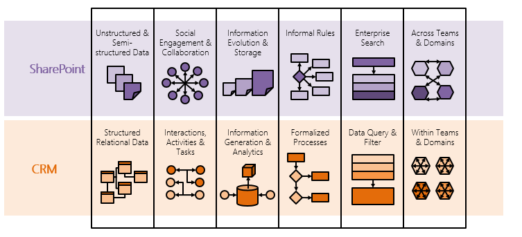

Este gráfico explica a alto nivel los enfoques la forma de trabajo en una y otra plataforma, que permiten enfocar los datos y los procesos relacionados con los mismos de diferente manera.

**Por qué integrar Dynamics CRM con SharePoint**

La integración de Dynamics CRM con SharePoint nace de la necesidad de cubrir un GAP funcional en Dynamics CRM en cuanto a la gestión documental que dispone SharePoint. En Dynamics CRM existe la posibilidad de añadir ficheros adjuntos, que son almacenados como "notas" relacionadas con las entidades de CRM. Pero estos ficheros adjuntos solo se permiten guardar en CRM y nada más. En SharePoint en cambio podemos disponer de todo un abanico funcional y de colaboración mucho más rico.

Además del GAP funcional, existen un también un tema económico. En la "nube" se paga por uso y uno de estos conceptos es el espacio de almacenamiento. El almacenamiento de Dynamics CRM Online es mucho más caro que el almacenamiento de SharePoint. Esto es importante, ya que en caso de enfrentarnos a un escenario en Dynamics CRM Online con gran volumen de ficheros adjuntos, se debería avaluar la repercusión del precio de estos adjuntos en cuanto al almacenamiento en la nube.

**Arquitectura de integración lado servidor**

La integración de la versión actual de Dynamics CRM 2015 con SharePoint Online está bastante desarrollada, aunque existen algunos puntos que deberían ser mejorados para garantizar una completa integración. En versiones anteriores de Dynamics CRM la integración estaba basada en el lado cliente, en donde mediante un iframe apuntando a SharePoint, se podía acceder a documentos allí almacenados desde un contexto de un registro de CRM. Esto significa que desde el navegador cliente, es el que directamente accede y se autentica contra el SharePoint.

Desde Dynamics CRM 2013 Online, existe la posibilidad de integrar Dynamics CRM desde el lado servidor. Esto quiere decir que directamente será Dynamics CRM el que se encargue de conectar con SharePoint, consultando y actualizado los datos que allí se almacenan. Esto permite que, desde el navegador del cliente, solo se acceda a Dynamics CRM, haciendo la integración más transparente para los usuarios. A continuación, se enseñan estos dos tipos de escenarios:

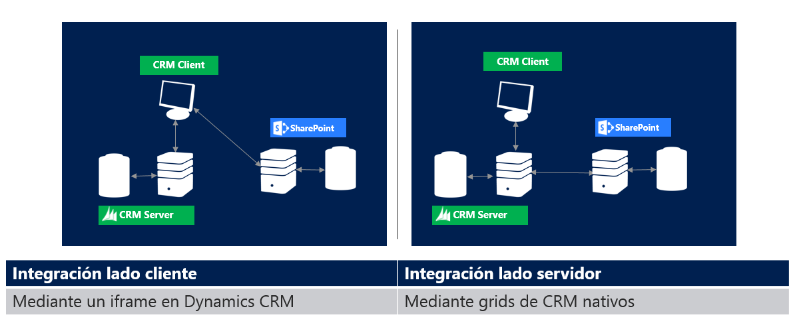

**Configurando Integración de documentos Dynamics CRM y SharePoint**

Veamos un paso a paso como configurar Dynamics CRM 2015 Online con SharePoint Online. Para este ejemplo, he creado una trial de Office365, con una trial de SharePoint y de CRM.

- Lo primero que voy a hacer es crearme una biblioteca de documentos en SharePoint, donde quiero almacenar los documentos a almacenar provenientes de Dynamics CRM:

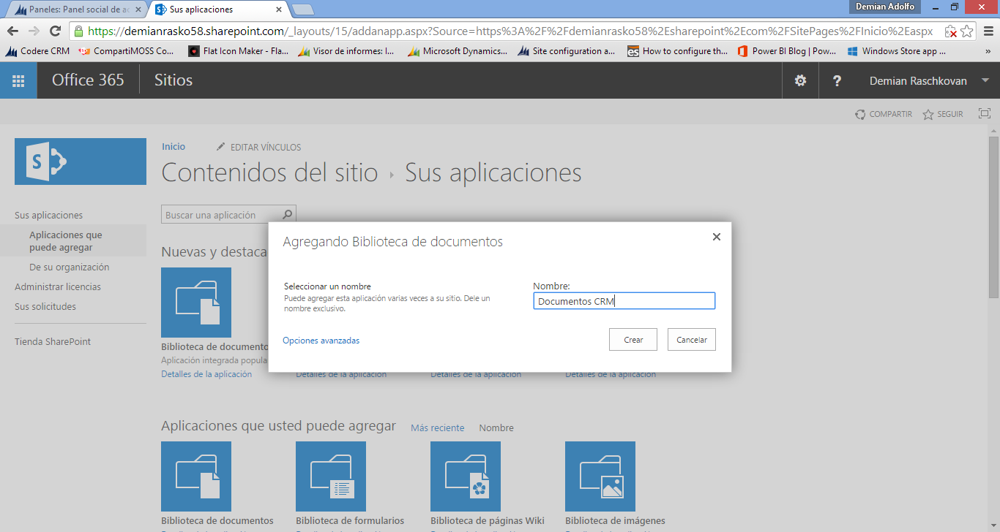

- Luego en Dynamics CRM en Configuración-&gt;Administración de documentos, podemos configurar toda la integración.

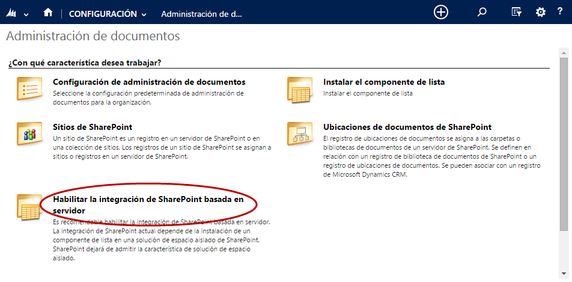

- Y al habilitar la integración de SharePoint basada en servidor, introducimos la dirección URL del sitio de SharePoint:

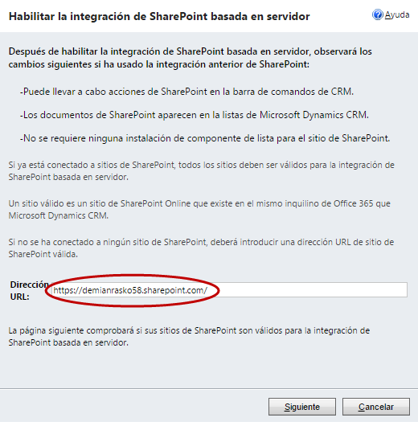

- A continuación, la URL de SharePoint Online es validada por el asistente:

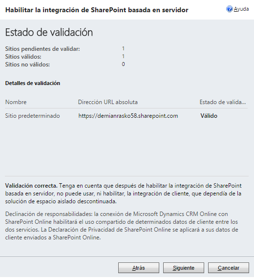

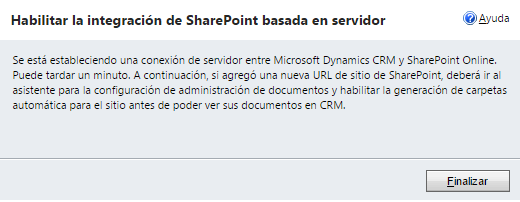

Luego abrimos la configuración de administración de documentos, donde introducimos la url de SharePoint y seleccionamos que entidades dispondrán de documentos:

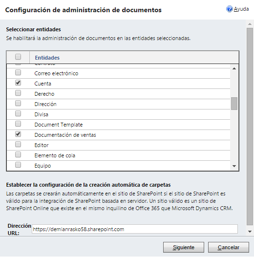

- A continuación, configuraremos la estructura de carpetas para cada entidad:

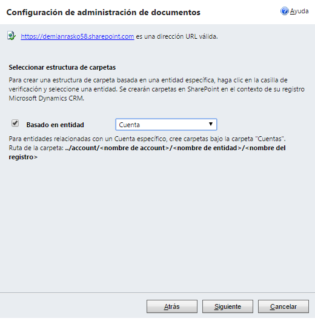

- Una vez seleccionadas las entidades y la configuración de la estructura de carpetas, se muestra una ventana que indica el estado de creación de las bibliotecas de documentos en SharePoint.

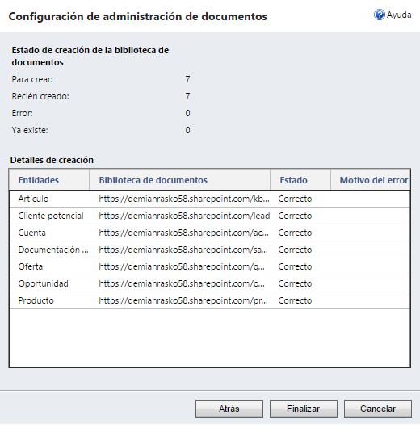

- Una vez configurada esta integración, desde un formulario de una Cuenta de CRM, podemos acceder a los Documentos relacionados:

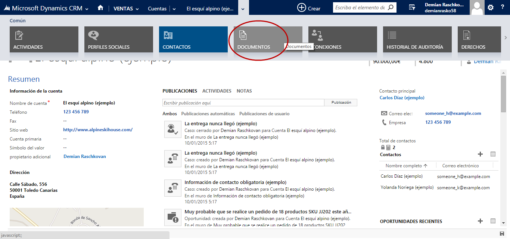

- Si es la primera vez que se accede a los documentos de esta Cuenta, aparece la siguiente ventana:

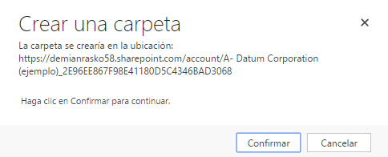

- Al confirmar esta acción, se crea la carpeta en SharePoint, relacionada con el registro de la Cuenta de CRM. A partir de este momento, los documentos pueden añadirse en CRM, mediante formularios nativos, y estos documentos son almacenados en SharePoint.

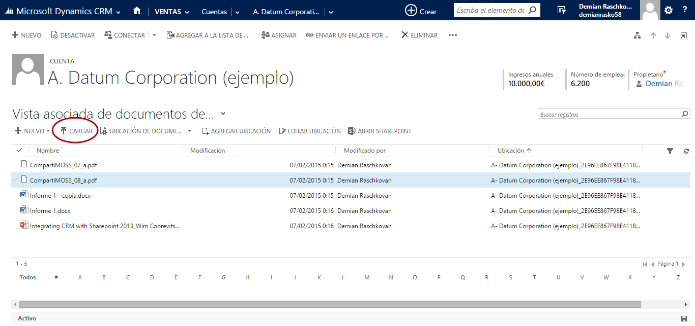

**Integración de metadatos de SharePoint con Dynamics CRM**

Otra funcionalidad interesante relacionada con la integración de Dynamics CRM con SharePoint, es la utilización de metadatos. La creación de un documento en SharePoint, permite que otros usuarios, incluso no usuarios de CRM, puedan interactuar con un documento. Una opción podría ser un flujo de aprobación o revisión de un documento. A continuación, se detalla cómo se pueden crear metadatos en SharePoint, que pueden ser consultados directamente en CRM.

- Primero creamos una columna con un desplegable de estados, que quiero que se vean en SharePoint

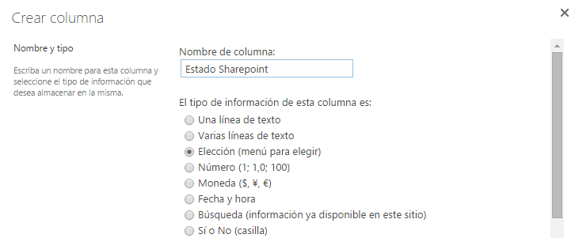

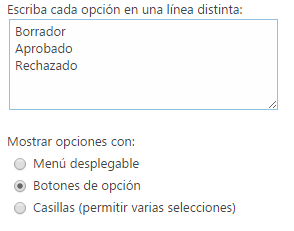

- Así se ven estos registros que se han creado en CRM en SharePoint:

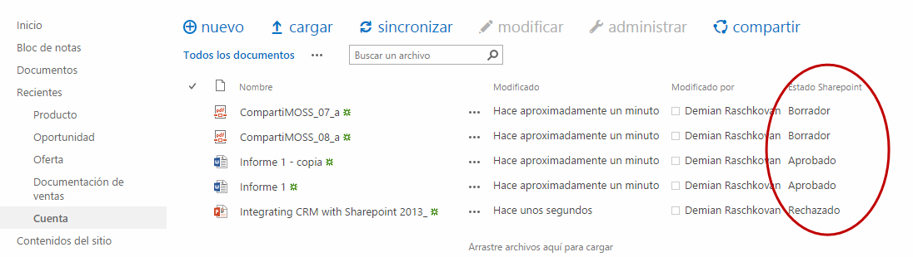

- La entidad que utiliza Dynamics CRM para integrar con SharePoint se llama "Documentos de SharePoint", y si creamos en la misma un campo con el mismo nombre que el metadato creado en SharePoint, Dynamics CRM se encarga de forma automática de integrar los mismos:

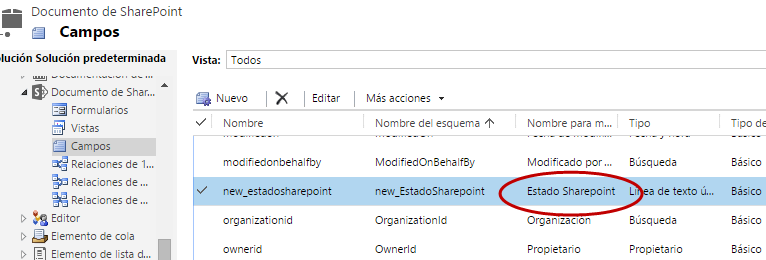

- También añadimos esta columna en las vistas de la entidad, para que sea visible. Publicamos y ya tenemos disponible este campo en el listado de documentos:

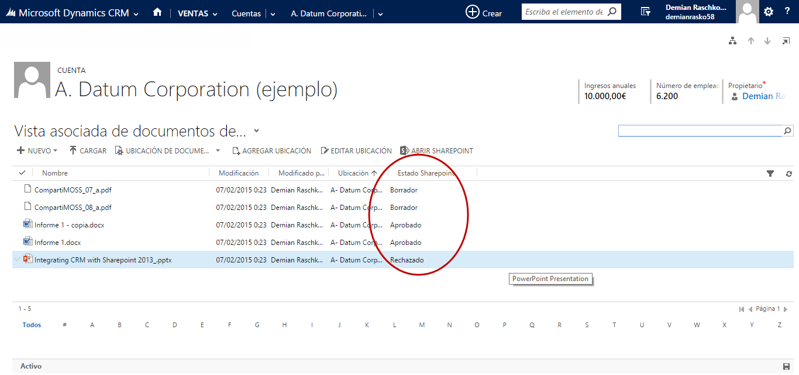

Esta integración de atributos es muy interesante, pero hay que tener en cuenta que los tipos de datos que hay en Dynamics CRM y SharePoint no son iguales y se debe revisar qué tipo de metadato se puede mapear con qué tipo de campo con CRM. En este ejemplo se ha utilizado un atributo de tipo texto, que puede ser mapeado con cualquier metadato de SharePoint.

**Escenarios avanzados de integración**

Lo explicado anteriormente ofrece una serie de opciones configurables, que están muy bien, pero en muchos escenarios de negocio, las integraciones deben ser algo más complejas. Ya sea por requerimientos funcionales no cubiertos o por requerimientos de seguridad. Es por esto, que se abre un abanico de nuevas posibilidades que los propios entornos de Dynamics CRM y SharePoint ofrecen. Como se comentaba al inicio, la madurez de los productos nos garantiza que "casi" todo requerimiento funcional se pueda conseguir, aunque a veces hay que valorar si los esfuerzos de desarrollo a dedicar para este tipo de extensiones funcionales son los adecuados.

El primero de los escenarios es el siguiente:

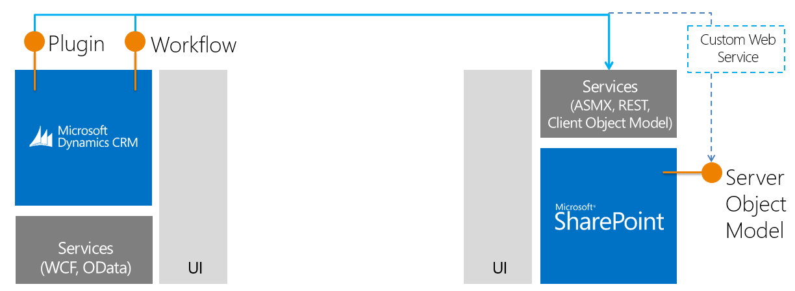

Desde Dynamics CRM, se pueden crear Plugins o actividades de Workflow, que hagan llamadas directamente a SharePoint, o a un web service intermedio que conecte con SharePoint. De la misma manera, podría existir un camino inverso desde SharePoint, hacia Dynamics CRM:

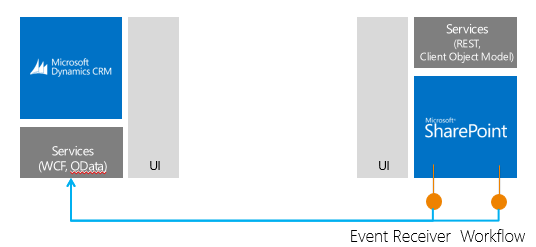

Desde el punto de vista de la interfaz de usuario, en Dynamics CRM se podría añadir un iframe en formularios o Dashboards que apunten a URLs de SharePoint, o bien crear Recursos Web (HTML, Silverlight), que conecten directamente al punto REST y consulten datos de SharePoint y se muestren.

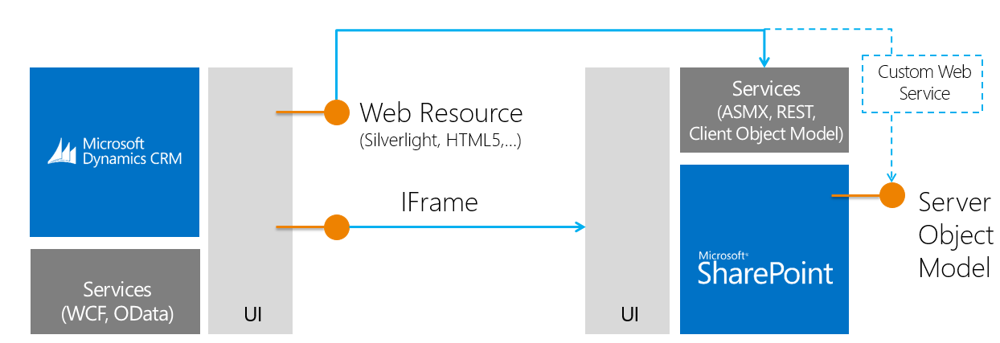

Igualmente, el camino inverso en SharePoint se podría añadir un iframe con una URL de cualquier registro de CRM, o desarrollar una App o un WebPart, que conecte con los servicios de Dynamics CRM.

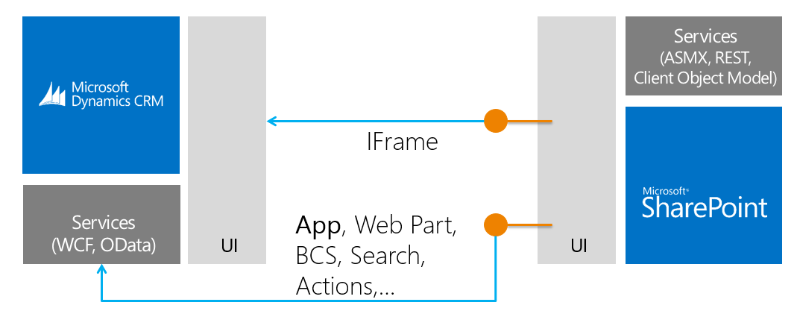

**Conclusiones**

Como puede verse, la integración de Dynamics CRM con SharePoint, es sencilla de montar y configurar, pero la funcionalidad que ofrece es limitada. De todos modos, la madurez de estas dos plataformas permite que se pueda extender a los requerimientos de negocio.  La integración de la gestión documental de SharePoint en Dynamics CRM cubre un GAP funcional a CRM, y ofrece a SharePoint la posibilidad de trabajo de documentos que ya vienen relacionados con entidades de negocio de Dynamics CRM.  De los temas que quedarían pendientes de montar, es el tema de la seguridad. En Dynamics CRM la seguridad es implícita, basada en roles de seguridad y en la ubicación jerárquica de los usuarios. En cambio, en SharePoint la seguridad es explícita en cada registro, y por lo tanto se debería tener que desarrollar algo para permitir que esta integración sea más sólida.

**Demian Adolfo Raschkovan**
Microsoft MVP | Dynamics CRM
Director Técnico | Infoaván Soluciones
 [mvp@demianrasko.com](mailto:mvp@demianrasko.com) 
 @demian\_rasko
 [http://www.demianrasko.com](http://www.demianrasko.com/)
@ComunidadCRM
[http://www.comunidadcrm.com](http://www.comunidadcrm.com/)

 
 
import LayoutNumber from '../../../components/layout-article'
export default LayoutNumber
