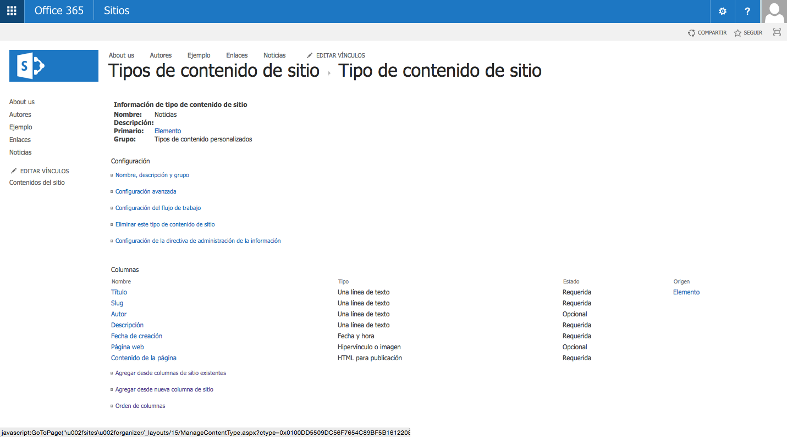
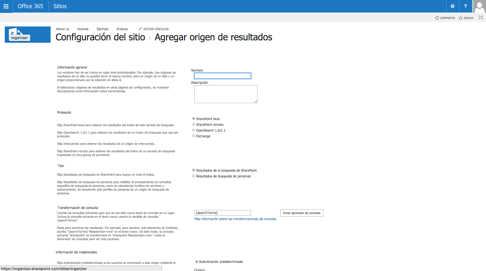
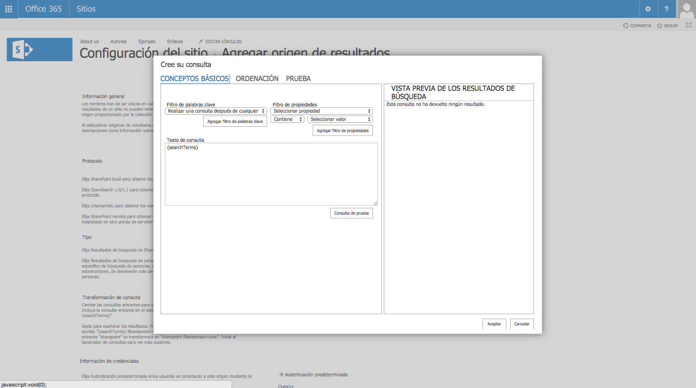
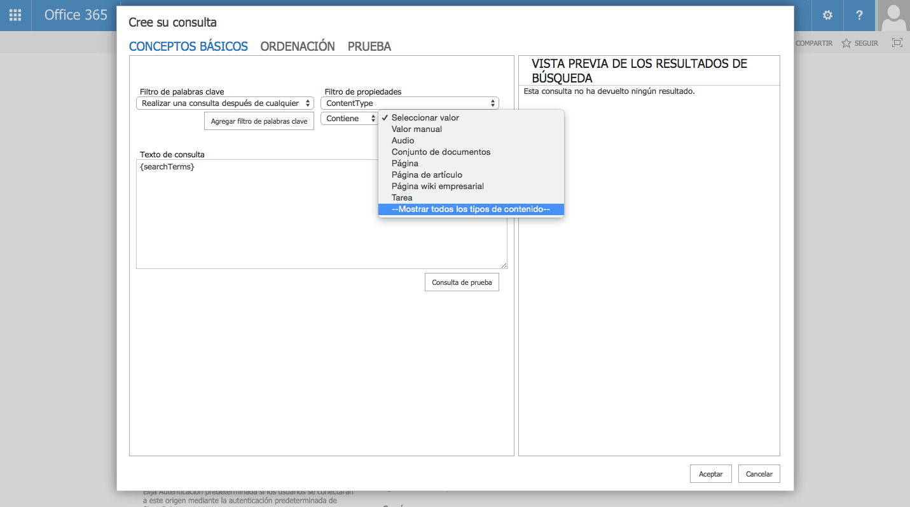
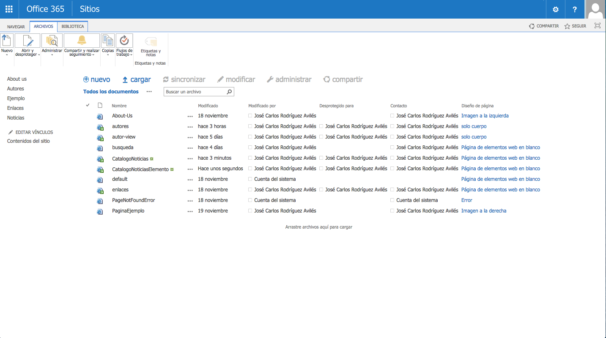
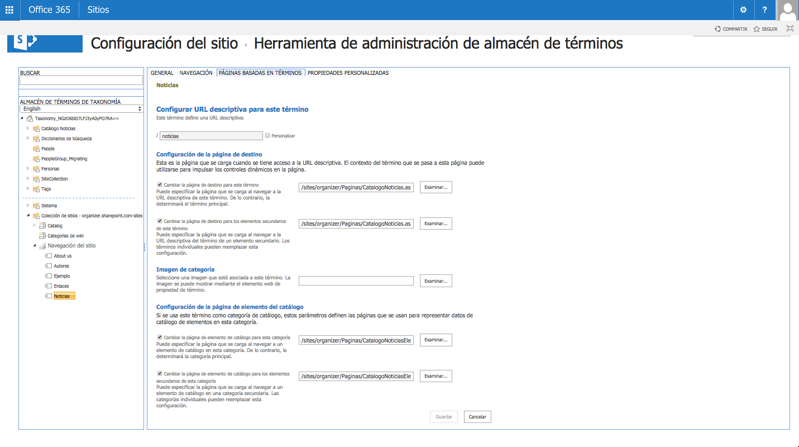
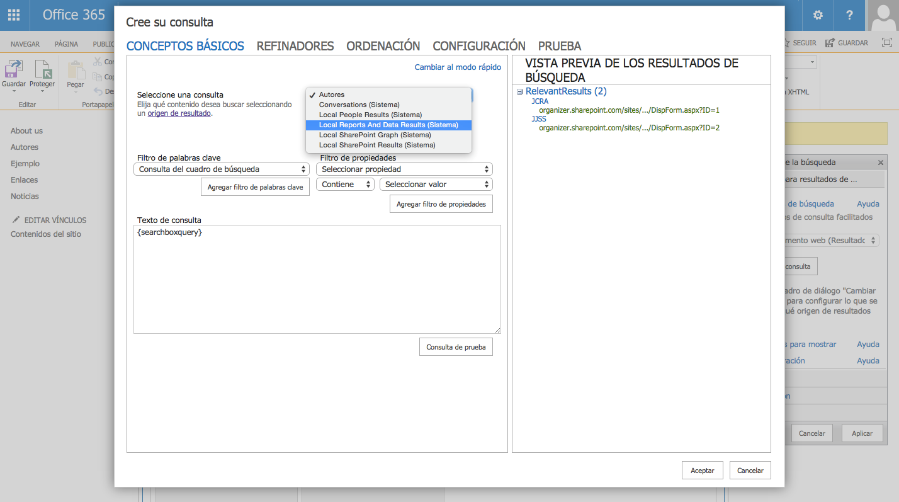
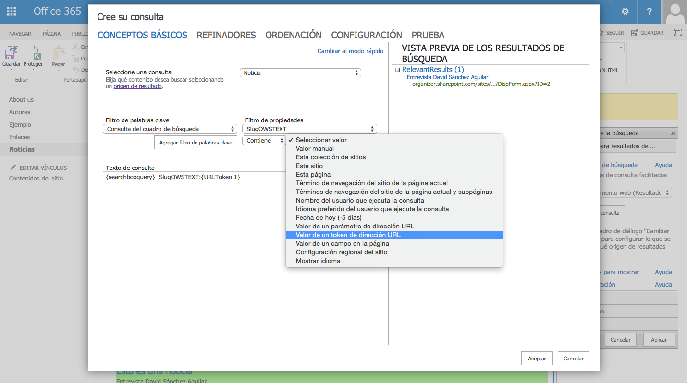

​El presente artículo muestra  un ejemplo de cómo aprovechar algunas de las funcionalidades que ofrecen las búsquedas para implementar un requisito habitual en muchos de nuestros sitios, tanto escenarios Intranet como de internet. Se va a crear una vista de un catálogo y detalles de elementos de ese catálogo, como podría ser por ejemplo un catálogo de noticias y el detalle de cada una de ellas, y lo haremos además usando URLs amigables.  Los conceptos del presente artículo pueden aplicarse en escenarios de BCS o Cross Site Publishing. Con el objetivo de no hacer el artículo demasiado largo y centrarnos en el motivo del mismo, se desarrollará todo en el mismo sitio y con una lista personalizada que se creará para tal fin.

**Preparación de nuestro sitio**

En primer lugar se creará la lista personalizada que contendrá el catálogo, que recibirá el nombre de "Noticias". Además, se habilitará la gestión de tipos de contenido para esta lista y se creará un "*tipo de contenido"* para la misma que represente a cada elemento de nuestro catálogo y que será clave en este ejemplo. El tipo de contenido se llamará Noticias y puede tener una estructura como la que vemos en la Imagen 1.

**Creación del origen de resultados**

Uno de los aspectos más importantes para lograr nuestro fin es la definición de un *"Origen de resultados"*.  Esta opción permite crear búsquedas limitadas a ciertos contenidos o a un subconjunto de resultados de búsqueda. En nuestro caso, vamos a definir un origen de resultados que nos devuelva las "Noticias" a partir del  *Tipo de Contenido* que hemos definido en el apartado anterior. El Origen de resultados se puede definir a distintos niveles: a nivel de administración del servicio de búsqueda, a nivel de colección de sitios, o bien, a nivel de sitio. Para el ejemplo que se está mostrando, vamos a definir el "origen de resultados" al nivel del sitio en el que se está trabajando. Desde la configuración del sitio, vamos al apartado de búsqueda y fuentes de resultado, y desde ahí a "Nuevo origen de resultado", Imagen 2.

Tras indicar el nombre y la descripción, se señala como protocolo "SharePoint local" y el tipo de búsqueda como "Resultados de la búsqueda de SharePoint" para seleccionar los elementos de todo el índice. Para configurar la consulta se entra en "Iniciar generador de consultas".

La configuración de nuestra consulta se realiza en la pantalla que aparece, como puede apreciarse en la Imagen 3.  Los filtros de la consulta pueden definirse mediante filtros de palabras clave o de propiedades, donde se pueden establecer filtros a partir de las propiedades administradas que hay identificadas en nuestro sistema. Para este caso, se va a añadir un filtro de propiedad en el que se indicará que los elementos devueltos sean del tipo de contenido creado en la sección anterior, tipo de contenido "Noticias", como vemos en la Imagen 4.

Una vez añadido el filtro, se puede efectuar la comprobación de que los resultados son los correctos en la opción *"Consulta de prueba"*. Para comprobar  que la consulta configurada devuelve los resultados correctos, es necesario asegurar  que se ha re-indexado la lista después de haber insertado los datos, ya que, de otro modo, al usar la opción de "Consulta de prueba", podrían no obtenerse los resultados esperados. Una vez comprobado, se guarda la fuente de resultados que será usada más adelante en el Content Search WebPart.

**Creación de las páginas**

El siguiente paso será crear las páginas que se van a utilizar y crear el término de la navegación basada en metadatos para nuestro catálogo. La navegación basada en metadatos es otra de las interesantes funcionalidades que incorpora SharePoint 2013 y que permite utilizar nuestro almacén de términos para crear URLs amigables. Aunque el objetivo de este artículo no es cómo activar esta opción, si se puede mencionar que, al menos, es necesario tener activada la Feature *"I**nfraestructura de publicación de SharePoint Server"* de la colección de sitios y activar la navegación basada en metadatos del sitio para poder crear URLs amigables*.*A continuación, se crearán dos páginas en nuestro sitio en la librería de páginas, una para el catálogo y otra para los elementos del catálogo.

Después, se accede al almacén de términos de nuestro sitio y al conjunto de términos de navegación del mismo para crear un nuevo término, que llamaremos "Noticias" y que creará un nuevo elemento en el menú de navegación y una URL amigable de la forma "&lt;site&gt;/noticias". Una vez creado, en la configuración de este nuevo término, nos dirigimos a la pestaña "Páginas basadas en términos" y activamos en la sección de *Configuración de la página de destino* las dos casillas, seleccionando para ambas  la página que hemos creado para el catálogo. Por último, en la sección que aparece más abajo sobre *Configuración de la página de elemento de catálogo*, activamos igualmente las dos casillas y para ambas, se selecciona la página que se ha creado para los elementos de catálogo.

**Configuración del Content Search WebPart**

El último paso para tener listas las páginas que se han creado, es añadir y configurar en cada una de ellas el Content Search WebPart, tanto para el catálogo como para los elementos del mismo. En primer lugar, se va a trabajar sobre la página del catálogo, editándola para añadir el WebPart. Posteriormente se accede a las propiedades y hacemos click sobre "Cambiar Consulta", lo que permitirá modificar la consulta y configurar los datos que se desea que devuelva el WebPart.

En la pestaña de conceptos básicos, seleccionamos el *Origen de resultados* que  había sido creado previamente, Imagen 7. En este caso, como se está editando la página del catálogo y se pretende que sea devuelto el catálogo completo, solo seleccionamos el origen de resultados, por lo que para continuar, se acepta y guarda la configuración del WebPart. El siguiente paso es modificar la página que se ha creado para los elementos del catálogo y, de la misma manera, añadir el WebPart. Se acceden a las propiedades del mismo, y de nuevo a la opción de Cambiar consulta. En este caso, una vez seleccionado el *Origen de resultados* se añade un filtro para que devuelva solo el elemento del catálogo al que se está accediendo.

En nuestro caso, se añade un filtro para la propiedad Slug que tenía nuestro tipo de contenido, que será lo que acompañe a la URL del catálogo para acceder a cada elemento. Posteriormente se selecciona la opción de "Valor de un token de la dirección URL", para la propiedad administrada relacionada con el campo al que se desea asociar y se añade el filtro. Con este procedimiento, el WebPart para la página de elementos del catálogo habrá sido configurado. Desde ahora se puede acceder a una noticia de nuestro catálogo a través de la URL "/noticias/slug-de-la-noticia-de-ejemplo".

Una vez preparadas, la página de nuestro catálogo y de detalle de ese catálogo, se puede combinar con los Display Templates para proporcionar un diseño más atractivo a los resultados que nos da el *Content Search WebPart*. Este tema ha sido objeto de un artículo en la revista *(**Número 17,*[*Introducción a las plantillas de elementos de contenido (Display templates)*](/revistas/numero-17/introduccion-plantillas-elementos-contenido-display-templates), Santiago Porras Rodríguez), por lo que se puede acudir a él y, junto con lo que hemos podido ver en éste, comenzar a explotar todas las posibilidades que nos ofrecen estas *features*.

Como se ha podido comprobar, sin la necesidad de escribir código y por medio de las nuevas herramientas que nos proporcionan las búsquedas, se pueden generar de una forma muy sencilla funcionalidades muy habituales en nuestros sitios. Me gustaría concluir destacando que las búsquedas en SharePoint 2013 nos ofrecen una amplia variedad de nuevas oportunidades que nos llevarán,  no solo a tenerlas en cuenta para construir un mero buscador con refinamiento, sino también a considerarlas como una opción válida a la hora de plantear la resolución de muchos de los requerimientos que se nos presentan cuando abordamos un proyecto con SharePoint 2013 o SharePoint Online.

**José Carlos Rodríguez Avilés**
Analista Programador en Soluciones de SharePoint
[josecarlos.rodriguez@uci.com](mailto&#58;josecarlos.rodriguez@uci.com)
@jcroav
[http://elblogdelprogramador.wordpress.com](http&#58;//elblogdelprogramador.wordpress.com/)

