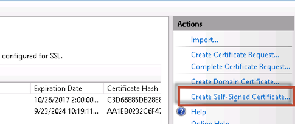
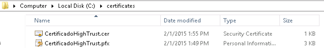
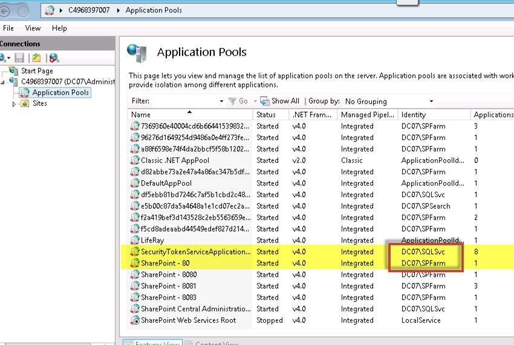
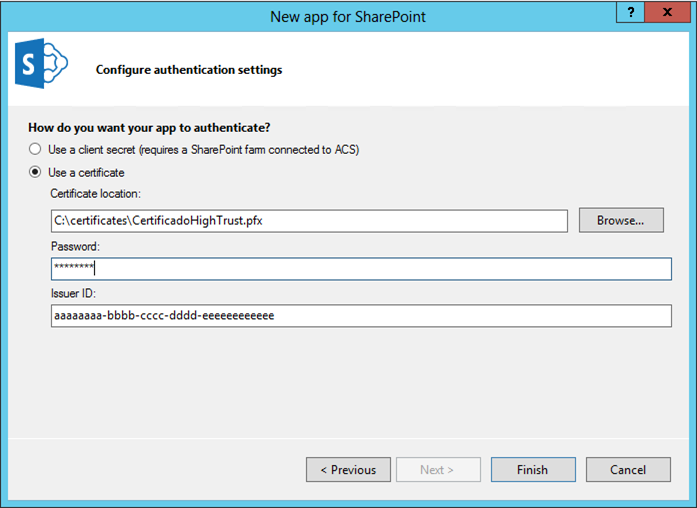
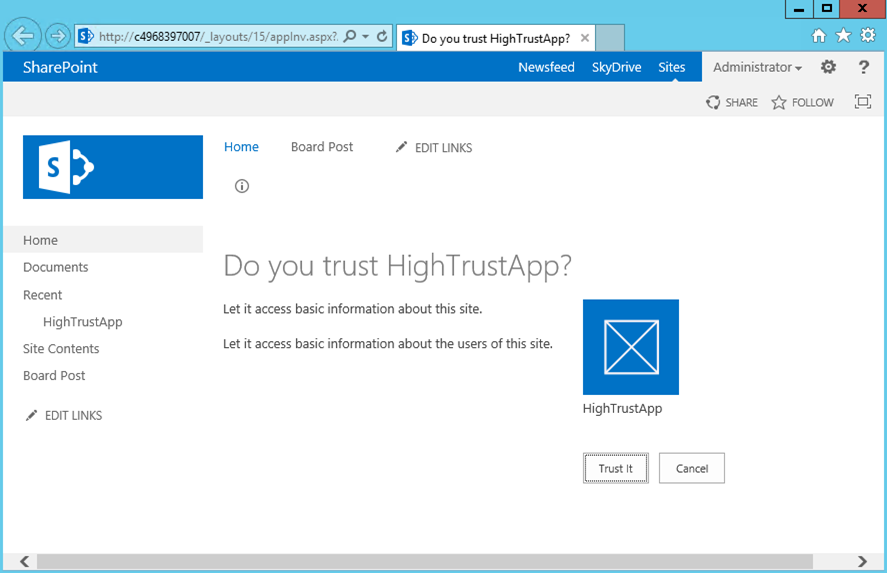
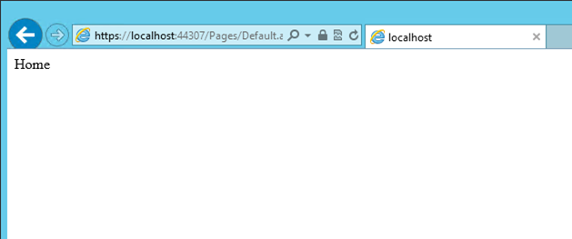
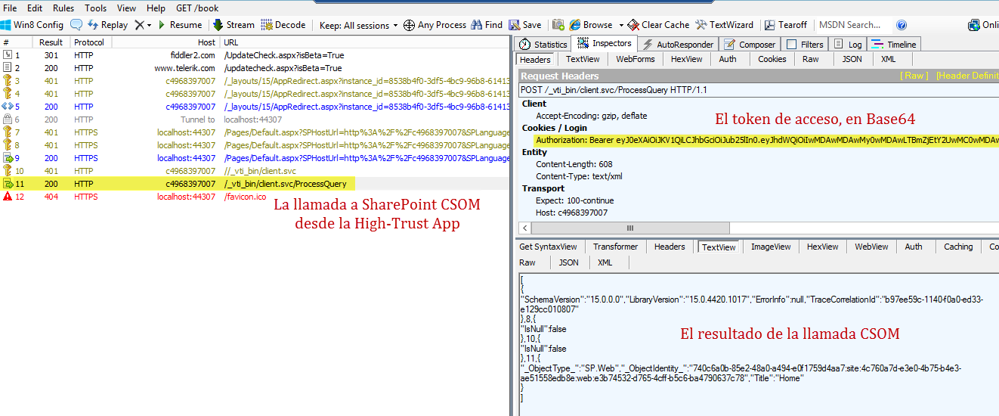

import ArticleHeader from '../../../components/article-header'

<ArticleHeader frontmatter={props.pageContext.frontmatter} />

​En el [último artículo para CompartiMOSS](/revistas/numero-22/las-aplicaciones-high-trust-i) hablé sobre el concepto de las aplicaciones High-Trust o de alta confianza (también conocidas como *S2S, server-to-server*) en los entornos de SharePoint 2013. Pues bien, hoy vamos a meternos en la harina y hacer una de ellas.

**Preparando el entorno para crear la app High-Trust**

Para comenzar a crear una aplicación High-Trust, necesitamos configurar varias cosas en nuestro entorno local de SharePoint 2013. Las configuraciones no son muchas, pero es fácil olvidarse de una de ellas y luego tendremos problemas para investigar de donde viene el error.

Antes que nada, necesitamos que nuestro SharePoint 2013 tenga activo el servicio de perfiles de usuario y que además tenga indexados los perfiles de los usuarios que vamos a utilizar en la aplicación. Esto es necesario porque el servicio de autenticación de una app High-Trust necesita "encontrar" el usuario en el servicio de perfiles de SharePoint para poder ejecutar las consultas en su nombre. Si el perfil del usuario no está, la autenticación fallará.

Realmente, el token de acceso que la app envía hacia SharePoint contiene el identificador del usuario, y SharePoint se basa en él para saber si el usuario es válido o no, buscándolo en su base de datos de perfiles. El identificador suele ser el SID del usuario Windows, su UPN o nombre de usuario de Active Directory. Si usamos otros sistemas de autenticación como FBA o Claims, los identificadores serán otros. Es estrictamente necesario que el identificador del usuario esté presente en su perfil y que no haya repeticiones. Si os pica mucho la curiosidad, hay un excelente post de Steve Peschka al respecto<u>[i]</u>.

Para poder firmar el token de la app, necesitamos un certificado SSL. Mientras desarrollamos, podemos usar un certificado de desarrollo firmado por nosotros mismos (*self-signed certificate*). Luego, en producción, usaremos un certificado real. Además, para que nuestra app se pueda comunicar con SharePoint de manera segura, necesitamos que la comunicación esté encriptada bajo HTTPS. Para ello, necesitaremos otro certificado SSL con la URL de la app. Esto no es necesario en desarrollo, donde podemos relajar la restricción y usar HTTP, pero en producción esto sería una imprudencia seria.

Para crear un certificado autofirmado, iremos a la consola de IIS y bajo el apartado "Server Certificates" y dentro de él la opción "Create Self-Signed Certificate". Le daremos el nombre CertificadoHighTrust.

Al final, exportaremos el certificado incluyendo la clave privada. Como contraseña le pondremos "*password*". Al final, tendremos un fichero PFX con el certificado digital que usaremos en nuestra app. Este fichero tiene que estar en una carpeta accesible desde Visual Studio. En nuestro caso, como estamos desarrollando en una máquina de SharePoint, no tenemos que mover el fichero y lo tendremos en la ruta C:\Certificates\CertificadoHighTrust.pfx.

También haremos una exportación del certificado sin la clave privada, para obtener el fichero CertificadoHighTrust.cer. Para ello, tenemos que ir a "Server Certificates" dentro del IIS, abrir el certificado y en la pestaña "Details" ir a la opción "Copy to file" indicando que no queremos la clave privada.

Ahora vamos a comprobar los permisos necesarios para que SharePoint pueda procesar nuestros certificados. Los requerimientos son dos:

- El application pool SecurityTokenServiceApplicationPool tiene que tener permisos de lectura sobre la carpeta de los certificados.
- El application pool de la aplicación web en la que instalaremos la app (en nuestro caso, la del puerto 80) tiene que tener permisos de lectura sobre la carpeta de los certificados.

En nuestro caso, son las cuentas *SPFarm* y *SQLSvc*. Les daremos los permisos correspondientes en la carpeta Certificates.

Ahora tenemos que hacer que SharePoint reconozca nuestro certificado. Abrimos una consola PowerShell de SharePoint y registramos el certificado como de confianza.

| `$publicCertPath =``"C:\Certificates\CertificadoHighTrust.cer"``  $certificate = New-Object System.Security.Cryptography.X509Certificates.X509Certificate2($publicCertPath)  New-SPTrustedRootAuthority -Name``"CertificadoHighTrust"` `-Certificate $certificate` |
| --- |

Una vez que SharePoint se fía de nuestro certificado, vamos a proceder a configurar lo que se conoce como un emisor de confianza (*trusted issuer)*. Esto no es más que indicarle a SharePoint que los tokens firmados por un "emisor de confianza" son de fiar. Y, ¿cómo sabe SharePoint qué un emisor es de confianza? Primero, el ID del emisor (un GUID que va dentro del token) tiene que existir en la configuración de SharePoint. Segundo, el token tiene que estar firmado por un certificado del que SharePoint se "fía" porque tiene su parte pública. Como esta parte del certificado la hemos hecho ya, sólo falta decirle a SharePoint el ID de nuestro proveedor de confianza. Puede ser cualquier GUID, y aquí vamos a utilizar el *aaaaaaaa-bbbb-cccc-dddd-eeeeeeeeeeee* (si usamos letras en el GUID, tienen que ser en minúscula). Bonito y fácil de recordar, ¿verdad?

Para registrar nuestro emisor de confianza, hay que ejecutar el siguiente código en PowerShell, a continuación del script de importación del certificado:

| `$realm = Get-SPAuthenticationRealm  $specificIssuerId =``"aaaaaaaa-bbbb-cccc-dddd-eeeeeeeeeeee"``  $fullIssuerIdentifier = $specificIssuerId +``'@'` `+ $realm  New-SPTrustedSecurityTokenIssuer -Name``"CertificadoHighTrust"` `-Certificate $certificate -RegisteredIssuerName $fullIssuerIdentifier –IsTrustBroker  iisreset` |
| --- |

Ya podemos proceder a desarrollar la app, pero antes de esto vamos a permitir el uso del certificado autofirmado relajando los permisos de autenticación porque estamos en desarrollo.

| `$serviceConfig = Get-SPSecurityTokenServiceConfig `  `$serviceConfig.AllowOAuthOverHttp = $``true`` `  `$serviceConfig.Update() ` |
| --- |

**Desarrollando la app**

La app necesitará el certificado SSL y conocer la contraseña de su parte privada. Además, la cuenta bajo la que se ejecutará la app (el application pool del IIS) tiene que tener permisos para acceder a la ubicación del certificado. Abrimos Visual Studio 2013 y creamos una **app de SharePoint 2013**. Al salir el asistente, le indicamos que queremos una app provider-hosted y que la identidad de la app se establecerá mediante certificado.

Ahora tendremos una aplicación (en mi ejemplo, creada con Web Forms) que muestra el nombre del sitio actual de SharePoint donde está instalada la app.

El código que hace la llamada a SharePoint es muy sencillo:

| `protected` `void` `Page_Load(``object` `sender, EventArgs e)` |
| --- |

| `{` |
| --- |

| `    ``Uri hostWeb =``new` `Uri(Request.QueryString[``"SPHostUrl"``]);` |
| --- |

| ` ` |
| --- |

| `    ``using` `(var clientContext = TokenHelper.GetS2SClientContextWithWindowsIdentity(hostWeb, Request.LogonUserIdentity))` |
| --- |

| `    ``{` |
| --- |

| `        ``clientContext.Load(clientContext.Web, web => web.Title);` |
| --- |

| `        ``clientContext.ExecuteQuery();` |
| --- |

| `        ``Response.Write(clientContext.Web.Title);` |
| --- |

| `    ``}` |
| --- |

| `}` |
| --- |

Como se puede ver, el contexto de SharePoint se establece usando la clase auxiliar TokenHelper con el método GetS2SClientContextWithWindowsIdentity. Esta llamada obtiene un contexto de High-Trust app usando la identidad del usuario Windows que está ejecutando la aplicación. Esta es la configuración por defecto, pero se puede modificar para usar la identidad federada, por ejemplo. Ejecutando la aplicación, nos sale el diálogo de otorgar permisos a la aplicación, y al aceptarlo, podemos ver el título del sitio de SharePoint, "Home".

**La prueba de Fiddler**

Si abrimos Fiddler para ver el tráfico HTTP entre la aplicación y SharePoint, veremos que la aplicación hace una llamada a la API CSOM (/\_vti\_bin/client.svc/ProcessQuery). Si miramos la petición, en las cabeceras veremos un parámetro llamado Authentication con el valor "Bearer: " seguido de un texto codificado en Base64. Este es nuestro token de acceso.

Para más información sobre la estructura del token, hay un magnífico post de Kirk Evans al respecto[ii].

**Conclusión**

Espero haber desmitificado un poco el mundo de las aplicaciones High-Trust con este post. Como veréis, nos permite usar el modelo de apps sin tener que estar en la nube, lo que es un paso importante para poder adaptar nuestros desarrollos a los escenarios híbridos que parece que serán mucho más habituales en el futuro.

Seguro que muchos de vosotros tenéis dudas sobre si el modelo de las apps vale la pena para los desarrollos On-Premise. Yo también lo pienso muchas veces. Lo que me parece fascinante de este modelo High-Trust es que podemos separar la identidad de nuestra aplicación de los usuarios que la van a utilizar porque la app ya tiene su identidad y sus permisos dentro de SharePoint. Por el otro lado, ahora mismo sólo el modelo de apps ofrece la posibilidad de usar autenticación OAuth con SharePoint. Hasta ahora, si queríamos llamar a SharePoint desde fuera de él, teníamos que poner las credenciales del usuario. Incluso no hace falta seguir el modelo de apps en su totalidad, ya que podemos hacer una app que no tenga que iniciarse desde SharePoint, o una app que funciona como una aplicación de línea de comandos, servicio de Windows o un proceso de Node.js.

En el próximo artículo de esta serie veremos cómo usar un proveedor de identidad diferente al de Windows, como por ejemplo un usuario de Claims (SAML).

**Edin Kapić**
 Arquitecto SharePoint
 [edin.kapic@spenta.es](mailto&#58;edin.kapic@spenta.es)
 @ekapic
 [http://www.spenta.es](http&#58;//www.spenta.es/)

i. [http://blogs.technet.com/b/speschka/archive/2012/08/15/oauth-and-the-rehydrated-user-in-sharepoint-2013-how-d-they-do-that-and-what-do-i-need-to-know.aspx](http&#58;//blogs.technet.com/b/speschka/archive/2012/08/15/oauth-and-the-rehydrated-user-in-sharepoint-2013-how-d-they-do-that-and-what-do-i-need-to-know.aspx)

ii.[http://blogs.msdn.com/b/kaevans/archive/2013/04/05/inside-sharepoint-2013-oauth-context-tokens.aspx](http&#58;//blogs.msdn.com/b/kaevans/archive/2013/04/05/inside-sharepoint-2013-oauth-context-tokens.aspx)

