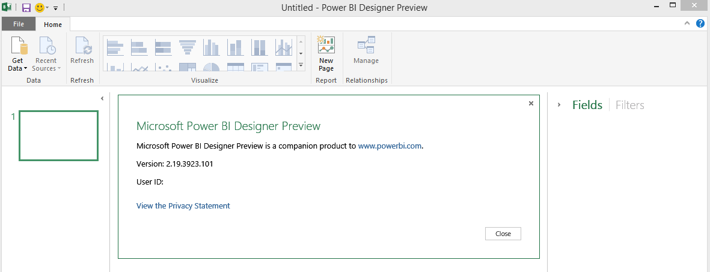

​En los últimos días puede que algunos de vosotros hayáis oído que se acercan novedades a Office 365 en lo que respecta a Power BI, y con el objetivo de daros un poco de luz sobre estos rumores aquí os dejo algunas pinceladas de lo que nos vamos a encontrar. Como en toda preview quiero recordaros que todo lo que hoy tenemos disponible es factible de cambio y/o eliminación, por lo que tomar este articulo como una antesala de la realidad a corto plazo.

**¿Algo nuevo?**

¡Pues sí, muchas cosas! Tal vez uno de los puntos más importantes es que Power BI ya no es una asociación a los Power\* que teníamos en Excel como complementos, es decir, ha dejado ser un mero visualizador de reportes creados con PowerView, PowerMap o PowerQuery dando un paso adelante con su propio diseñador.

**Power BI Designer**

Aunque ya se vislumbra como la herramienta de diseño de Dashboards por excelencia, todavía sigue siendo una herramienta de escritorio que debes descargar. A decir verdad, y aunque imagino que en breve veremos su homóloga web, debo reconocer que este modelo híbrido (aplicación de escritorio donde diseñamos los informes en local, pero están especialmente orientados a ser visualizados en la nube) resulta bastante cómoda, aunque obviamente, para gustos los colores….

Una de las cosas más importantes a tener en cuenta con esta "separación" y aunque por intrínseco parece obvio es que este nuevo funcionamiento separa a Power BI de Excel, lo que es trasladable a Excel Services, lo que quiere decir que… ¡exacto! Existe una separación patente entre SharePoint Online y Power BI, lo que además de ofrecer un modelo de licenciamiento mucho más abierto y modular, abre un abanico a nuevos tipos de conexión hasta ahora limitados, o por lo menos influenciados por Excel.

**El acceso a los datos**

Otro de los puntos a destacar que impactan a primera vista del Designer es la nueva capacidad de conectividad a nuevas fuentes de datos predefinidas, algo que hasta ahora teníamos que hacer vía oData, pero lo mejor de esto es que se abre un abanico para agregar nuevos conectores fácilmente.

Incluso (por ahora desde el interfaz web) tenemos conexiones predefinidas a determinadas soluciones y plataformas que otorgan dashboards predefinidos con los informes más populares.

La creación de conexiones a las distintas fuentes de información es sencilla y guiada, y si ya has utilizado PowerPivot y PowerQuery encontrarás el interfaz sumamente familiar, ya que la forma de editar columnas, cambiar tipos, enlazar con tablas relacionadas, etc. es muy similar. La forma en que almacena los cambios que realizas sobre los orígenes de datos se basa en almacenar cada modificación en pasos individuales, cosa que ya conocíamos en PowerQuery como lenguaje "M".

La edición del modelo de datos es intuitiva y recuerda a la edición en PowerPivot y PowerQuery

**Diseñando Informes**

El diseño de los informes es muy similar a lo que ya habíamos visto en Power View. Se basa en ir arrastrando los valores que deseamos, momento en el cual el Designer construye automáticamente el gráfico más adecuado a ese valor. A partir de ese punto podemos agregar filtros, slicers, otros ejes, editar las leyendas, etc.  Es importante mencionar los nuevos tipos de gráficos para los informes que antes no eran tan fáciles de construir y que recuerdan a viejos conocidos para los que hemos podido trabajar hace unos años con Proclarity (precursor de PerformancePoint). Por mencionar algunos: Tree Map (donde cada cuadrado representa el peso de ese grupo dentro del total), Gauge (especialmente pensado para grandes indicadores), dos tipos de mapas (conectan a Bing), Funnel.

**El Dashboard web: punto final**

Aunque ya hemos visto bastantes novedades la integración la encontramos en el dashboard que nos ofrece el interfaz web. Este dashboard, compuesto de Tiles, nos permite vincular a varios orígenes de datos y mostrar la información de varias formas:

Cabe destacar que los tiles que se visualizan en el dashboard pueden provenir de 3 orígenes distintos: de un reporte, de un dataset o como respuesta a una pregunta, pero lo que debemos tener en cuenta es que un Tile es siempre una foto de la información que representa.

A nuestros usuarios les llamará la atención la potencia del Q&A, pero debemos tener en cuenta que para que funcione correctamente necesita un origen de información bien estructurado en un fichero Excel y al mismo tiempo que todos los campos, relaciones, valores y elementos calculados tengan una definición clara y directa en inglés.

**En resumen**

Para terminar, mencionar que ya se están liberando también las aplicaciones móviles para consumir Power BI desde plataformas de otros fabricantes, lo que nos deja claro una vez más, la "apertura de mente" por parte de Microsoft hacia otros dispositivos y soluciones. No cabe duda que estas novedades que incorpora Power BI auguran una solución mucho más atractiva, modular y abierta a la integración con toda clase de plataformas, marcando un claro objetivo a corto plazo: el aprovechamiento de la nube a todo nivel, desde lo pequeño que nos pueda aportar un fichero plano hasta lo enorme que podamos encontrar en HDInsight.

**Javier Menéndez Pallo**
Director Oficina Centro – España y Portugal 
ENCAMINA
[jmenendez@encamina.com](mailto:jmenendez@encamina.com)

