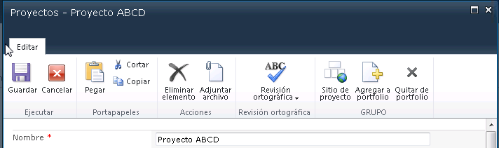
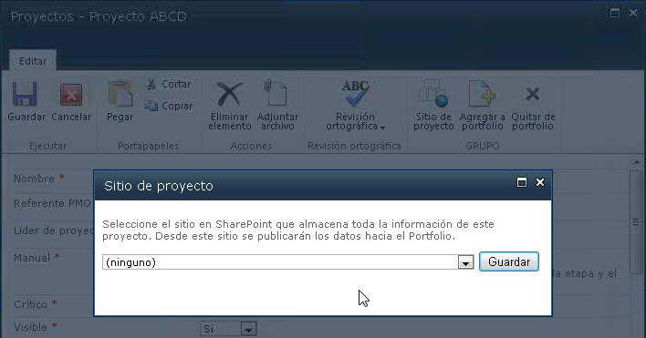

​Es bastante común que se necesiten agregar botones a la barra de herramientas de SharePoint 2010 (RIBBON). Muchas veces esto se resuelve en forma declarativa o con SharePoint Designer, pero otras veces necesitamos ir un poco más allá, por ejemplo, ejecutar código C# luego de presionar un botón o lograr que el botón este asociado a una lista específica y no a un tipo de lista. En este artículo veremos un ejemplo de cómo lograr este tipo de programación con Visual Studio. ¡Que lo disfruten!

**El objetivo**

Nuestro objetivo es agregar tres botones a la página de edición de una lista en particular. Esos tres botones estarán agrupados bajo un mismo título tal como muestra la imagen 1:



Al presionar el botón, se abre una página ASPX en C# que nos permite trabajar con la API de SharePoint tal como muestra la imagen 2:



**¿Cómo agregar los botones?**

Los botones suelen agregarse en forma declarativa, pero en este caso lo haremos mediante código C# para poder agregarlos en una lista en particular, y no en un tipo de lista. En este caso lo haremos a través de un evento de activación de feature. Esto puede verse en esta parte del código:

```
public override void FeatureActivated(SPFeatureReceiverProperties properties)
```

```
        {
```

```
            using (SPWeb mi_web = (properties.Feature.Parent as SPSite).OpenWeb())
```

```
            {
```

```
 
```

```
                // Agrego botones personalizados para la edición del Proyecto
```

```
                mi_web.AllowUnsafeUpdates = true;
```

```
                SPList lista = mi_web.GetList("/Lists/Proyectos");
```

```
                var action = lista.UserCustomActions.Add();
```

```
                action.Location = "CommandUI.Ribbon.EditForm";
```

```
                action.Sequence = 10;
```

```
                action.Title = "SURPOINT";
```

```
                action.CommandUIExtension = @"
```

Observar especialmente como agregar los botones en la página de edición de la lista: "CommandUI.Ribbon.EditForm".

Dos puntos adicionales:

- Los botones estarán dentro de un grupo
- Al presionar el botón ejecutamos código JavaScript para llamar a una página ASPX.

Esa página ASPX se carga en una ventana modal. Además, se controla el resultado de esa ventana para decidir si se cierra o no la pantalla de Edición del ítem. Esto puede verse en esta línea de código:


```
CommandAction=""javascript:
```

```
elID = _spGetQueryParam('id');
```

```
       var dlg=SP.UI.ModalDialog.showModalDialog({url: '{SiteUrl}/_Layouts/EMP_Procesos/VincularProyecto.aspx?ProjectId='+elID, dialogReturnValueCallback:function(res, val) { if (res == 1) window.frameElement.commonModalDialogClose(1, 0); } });
```

```
"" />
```

El siguiente es el código completo para agregar los botones:

```
public override void FeatureActivated(SPFeatureReceiverProperties properties)
```

```
        {
```

```
            using (SPWeb mi_web = (properties.Feature.Parent as SPSite).OpenWeb())
```

```
            {
```

```
 
```

```
                // Agrego botones personalizados para la edición del Proyecto
```

```
                mi_web.AllowUnsafeUpdates = true;
```

```
                SPList lista = mi_web.GetList("/Lists/Proyectos");
```

```
                var action = lista.UserCustomActions.Add();
```

```
                action.Location = "CommandUI.Ribbon.EditForm";
```

```
                action.Sequence = 10;
```

```
                action.Title = "SURPOINT";
```

```
                action.CommandUIExtension = @"
```

```
                <CommandUIExtension>
```

```
                      <CommandUIDefinitions>
```

```
                        <CommandUIDefinition Location=""Ribbon.Templates._children"">
```

```
                          <GroupTemplate Id=""Ribbon.Templates.CustomTemplate"">
```

```
                            <Layout Title=""NewGroupInExistingTabOneLarge"" LayoutTitle=""NewGroupInExistingTabOneLarge"">
```

```
                              <Section Alignment=""Top"" Type=""OneRow"">
```

```
                                <Row>
```

```
                                  <ControlRef DisplayMode=""Large"" TemplateAlias=""Button1"" />
```

```
                                  <ControlRef DisplayMode=""Large"" TemplateAlias=""Button2"" />
```

```
                                  <ControlRef DisplayMode=""Large"" TemplateAlias=""Button3"" />
```

```
                                </Row>
```

```
                              </Section>
```

```
                            </Layout>
```

```
                          </GroupTemplate>
```

```
                        </CommandUIDefinition>
```

```
                        <CommandUIDefinition Location=""Ribbon.ListForm.Edit.Scaling._children"">
```

```
                          <MaxSize
```

```
                            Id=""Ribbon.ListForm.Edit.MaxSize""
```

```
                            Sequence=""15""
```

```
                            GroupId=""Ribbon.ListForm.Edit.Groups.CustomGroup""
```

```
                            Size=""NewGroupInExistingTabOneLarge"" />
```

```
                        </CommandUIDefinition>
```

```
                        <CommandUIDefinition Location=""Ribbon.ListForm.Edit.Groups._children"">
```

```
                          <Group Id=""Ribbon.ListForm.Edit.Groups.CustomGroup""
```

```
                            Sequence=""100"" Title=""SURPOINT""
```

```
                            Description=""SURPOINT""
```

```
                            Template=""Ribbon.Templates.CustomTemplate"">
```

```
                            <Controls Id=""Ribbon.ListForm.Edit.Groups.CustomGroup.Controls"">
```

```
                                <Button
```

```
                                Id=""Ribbon.ListForm.Edit.Groups.CustomGroup.Controls.Button""
```

```
                                Alt=""Vincular a sitio de proyecto""
```

```
                                Sequence=""1""
```

```
                                Image32by32=""/_layouts/images/newweb32.png""
```

```
                                Image16by16=""/_layouts/images/SharePointFoundation10.png""
```

```
                                Command=""vincularSitio""
```

```
                                LabelText=""Sitio de proyecto""
```

```
                                TemplateAlias=""Button1""
```

```
                                CommandType=""General""/>
```

```
                                <Button
```

```
                                Id=""Ribbon.ListForm.Edit.Groups.CustomGroup.Controls.Button2""
```

```
                                Alt=""Agregar a informe de portfolio""
```

```
                                Sequence=""2""
```

```
                                Image32by32=""/_layouts/images/uploaddoc.png""
```

```
                                Image16by16=""/_layouts/images/SharePointFoundation10.png""
```

```
                                Command=""agregarInforme""
```

```
                                LabelText=""Agregar a portfolio""
```

```
                                TemplateAlias=""Button2""
```

```
                                CommandType=""General""/>
```

```
                                <Button
```

```
                                Id=""Ribbon.ListForm.Edit.Groups.CustomGroup.Controls.Button3""
```

```
                                Alt=""Quitar de informe de portfolio""
```

```
                                Sequence=""3""
```

```
                                Image32by32=""/_layouts/images/mewa_backb.gif""
```

```
                                Image16by16=""/_layouts/images/SharePointFoundation10.png""
```

```
                                Command=""quitarInforme""
```

```
                                LabelText=""Quitar de portfolio""
```

```
                                TemplateAlias=""Button3""
```

```
                                CommandType=""General""/>
```

```
                            </Controls>
```

```
                          </Group>
```

```
                        </CommandUIDefinition>
```

```
                      </CommandUIDefinitions>
```

```
                      <CommandUIHandlers>
```

```
                        <CommandUIHandler
```

```
                         Command=""vincularSitio""
```

```
                         CommandAction=""javascript:
```

```
                                elID = _spGetQueryParam('id');
```

```
                                var dlg=SP.UI.ModalDialog.showModalDialog({url: '{SiteUrl}/_Layouts/EMP_Procesos/VincularProyecto.aspx?ProjectId='+elID, dialogReturnValueCallback:function(res, val) { if (res == 1) window.frameElement.commonModalDialogClose(1, 0); } });
```

```
                                "" />
```

```
                        <CommandUIHandler
```

```
                         Command=""agregarInforme""
```

```
                         CommandAction=""javascript:
```

```
                                elID = _spGetQueryParam('id');
```

```
                                var dlg=SP.UI.ModalDialog.showModalDialog({url: '{SiteUrl}/_Layouts/EMP_Procesos/proyectoInforme.aspx?Accion=agregar&amp;ProjectId='+elID, dialogReturnValueCallback:function(res, val) { if (res == 1) window.frameElement.commonModalDialogClose(1, 0); } });
```

```
                                "" />
```

```
                        <CommandUIHandler
```

```
                         Command=""quitarInforme""
```

```
                         CommandAction=""javascript:
```

```
                                elID = _spGetQueryParam('id');
```

```
                                var dlg=SP.UI.ModalDialog.showModalDialog({url: '{SiteUrl}/_Layouts/EMP_Procesos/proyectoInforme.aspx?Accion=quitar&amp;ProjectId='+elID, dialogReturnValueCallback:function(res, val) { if (res == 1) window.frameElement.commonModalDialogClose(1, 0); } });
```

```
                                "" />
```

```
                      </CommandUIHandlers>
```

```
                    </CommandUIExtension>
```

```
                ";
```

```
                action.Update();
```

```
                mi_web.AllowUnsafeUpdates = false;
```

```
            }
```

```
        }
```

**Las páginas de aplicación**

Las páginas que son llamadas desde la RIBBON son páginas de aplicación típicas de SharePoint. Ejecutan el código C# que necesitemos. Sólo tenemos que tener en cuenta que deben encargarse de cerrar la pantalla modal. A modo ilustrativo, muestro parte del código de carga de la página:

```
protected void Page_Load(object sender, EventArgs e)
```

```
        {
```

```
            if (!IsPostBack)
```

```
            {
```

```
                
```

```
                // Obtener el ID del proyecto recibido como parámetro
```

```
                string proyecto = "";
```

```
                proyecto = Page.Request.QueryString["ProjectId"];
```

```
 
```

```
                // Datos del actual sitio elegido
```

```
                string idSitio = "";
```

```
                using (SPSite sitio = new SPSite(SPContext.Current.Site.Url))
```

(…)

Y lo más importante la parte final del evento OnClick del botón de nuestra página:

```
protected void vincularSitio(object sender, EventArgs e)
```

```
        {
```

```
(..(
```

```
            this.Page.Response.Clear();
```

```
            this.Page.Response.Write("<script type='text/javascript'>window.frameElement.commonModalDialogClose(1, 1);</script>");
```

```
            this.Page.Response.End();
```

```
        }
```

Utilizamos commonModalDialogClose  para cerrar la ventana.

**Conclusión**

En este breve artículo vimos que no es tan complejo agregar componentes avanzados en la RIBBON de SharePoint. La posibilidad de ejecutar código C# de servidor, nos abre un abanico de posibilidades para extender nuestros sitios. Y lo que es más importante, se hace de una forma que resulta bastante amigable para el usuario, ya que la RIBBON es una barra que se ha acostumbrado a utilizar.

¡Hasta la próxima!


**Juan Pablo Pussacq Laborde**
SharePoint MVP
Blog: [http://surpoint.blogspot.com](http&#58;//surpoint.blogspot.com/)

