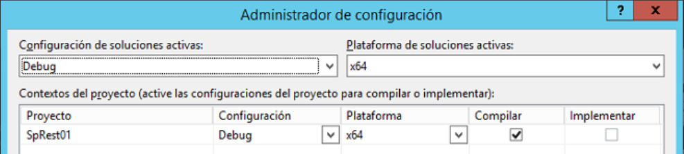
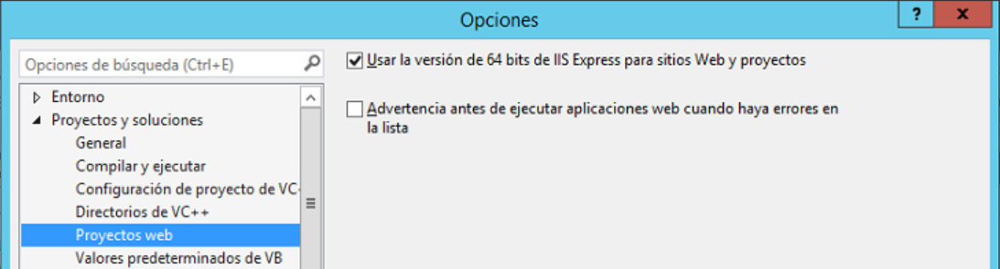
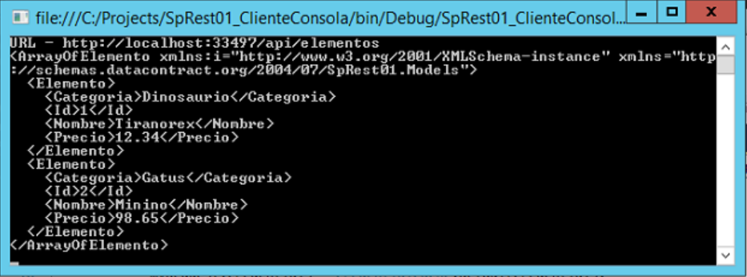
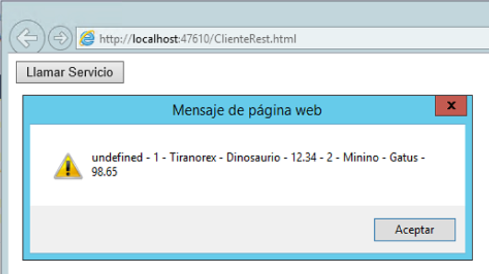

​SharePoint siempre ha sido un sistema abierto a aceptar modificaciones por medio de programación y que expone todos sus componentes e información al mundo exterior por medio de un API (Application Programming Interface) muy poderoso. Ese es, probablemente, uno de los factores más importantes para su aceptación empresarial. Aunque SharePoint siempre ha tenido una API remota (basada en Servicios Web), es decir, que permite crear software que interactúa con el servidor sin que sea indispensable instalar los programas localmente, solamente hasta la versión 2010 Microsoft le incluyo un API remoto basado en REST (Representational State Transfer).

REST, como se explicó en el artículo anterior, es un protocolo abierto y público que permite intercambiar información entre dos sistemas informáticos remotamente. En los últimos años, REST se ha convertido en el estándar para intercambio de información por excelencia, siendo utilizado por todos los grandes fabricantes de software (Amazon, Google, etc.), incluyendo a Microsoft. REST, fuera de ser un protocolo práctico y fácil de utilizar, soluciona los problemas técnicos de rapidez de ejecución bajo carga y transparencia a través de Internet que otros protocolos de Servicios Web, como SOAP, WSCL y BEEP, presentan.

A su vez, Microsoft ha establecido un Framework de programación para crear servicios REST llamado WebAPI, basado en ASP.NET e integrado en Visual Studio. De esta forma, es fácil construir servicios que accedan una gran cantidad de clientes, incluyendo navegadores y dispositivos móviles.

**Nota:** El primer artículo de la serie ([http://www.compartimoss.com/revistas/numero-22/rest-webapi-2-sharepoint-2013-introduccion](/revistas/numero-22/rest-webapi-2-sharepoint-2013-introduccion)) discute los principios fundamentales de REST y WebAPI.

**Otros conceptos de WebAPI**

En el primer artículo de la serie se utilizaron las características esenciales del WebAPI, tal y como las crea la plantilla de que dispone Visual Studio 2013 por defecto. Pero el WebAPI permite controlar muchos otros aspectos de un Servicio REST.

**Ruteo (Routing)**. El Controlador es el encargado de manejar las consultas de HTTP y sus métodos públicos son llamados "Acciones". Cuando un Servicio REST creado con el WebAPI recibe una consulta, el Framework rutea la consulta hacia una Acción determinada. El Framework contiene una "Tabla de Ruteo" que indica cómo debe hacer el ruteo. Abriendo el archivo "App\_Start/WebApiConfig.cs" se puede observar la tabla creada por defecto:

```
public static void Register(HttpConfiguration config)
```

```
{
```

```
    config.MapHttpAttributeRoutes();
```

```
 
```

```
    config.Routes.MapHttpRoute(
```

```
        name: "DefaultApi",
```

```
        routeTemplate: "api/{controller}/{id}",
```

```
        defaults: new { id = RouteParameter.Optional }
```

```
    );
```

```
}
```


Esta configuración indica que una consulta hecha al Servicio REST debe ser utilizando el URL http://[servidor]:[NumeroPuerto]/api/[NombreControlador]; por ejemplo, en el programa de prueba que se creó en el primer artículo seria "http://localhost:[NumeroPuerto]/api/elementos" para consultar todos los elementos y "http://localhost:[NumeroPuerto]/api/elementos/1" para pedir los datos del primer elemento. Si es necesario, este ruteo por defecto ("api/") se puede modificar, modificando, a su vez, la forma de llamar las Acciones
Fuera de poder rutear todo el Servicio, es también posible rutear solamente una Acción, o cada Acción con un prefijo diferente. Para hacerlo, solamente es necesario decorar la declaración de la clase del Controlador definiendo el nuevo prefijo, por ejemplo:

```
namespace SpRest01.Controllers{    [RoutePrefix("api/poc")]    public class ElementosController : ApiController    {
```

Lo que rutea la consulta de tal forma que la consulta debe ser hecha por medio del URL "http://localhost:[NumeroPuerto]/api/poc/elementos" y "http://localhost:[NumeroPuerto]/api/poc/elementos/1" en el Servicio diseñado en el artículo. Esto permite crear una ruta específica para caso de Pruebas de Concepto ("poc") en el ejemplo, pero el prefijo puede ser cualquier cadena deseada.
También es posible modificar el ruteo por defecto a las Acciones por medio de decoración del método. Por ejemplo, la siguiente decoración del método "DarElementos" indica que es el método para utilizar el verbo GET:

```
[HttpGet]public IEnumerable<Elemento> DarElementos(){    return myElementos;}
```

La Acción se puede modificar por medio de una decoración especial. El siguiente método tiene una decoración indicando el nombre que se debe utilizar para hacer la consulta:

```
[HttpGet][ActionName("DarElementos")]public IEnumerable<Elemento> GetAllElementos(){    return myElementos;}
```

De tal forma que la consulta sea "http://localhost:[NumeroPuerto]/api/elementos/DarElementos".
Finalmente es posible crear métodos públicos que no se deben rutear por medio de la decoración NonAction, de la siguiente forma:

```
[NonAction]public IEnumerable<Elemento> GetAllElementos(){    return myElementos;}
```

En este caso, el framework no ruteara la consulta GET al método GetAllElementos.
**Manejo de excepciones.** Cuando un Servicio Web creado con el WebAPI genera una excepción que no ha sido manejada apropiadamente en código, retorna un código 500 de HTTP (Internal Server Error). Pero el framework permite devolver códigos de estado HTTP específicos si el desarrollador lo considera necesario. Por ejemplo, el siguiente método devuelve un error 404 (Not Found) si el elemento buscado no existe:

```
public IHttpActionResult GetElemento(int id){    Elemento unElemento = myElementos.Where(e => e.Id == id).First();    if (unElemento == null)    {        throw new HttpResponseException(HttpStatusCode.NotFound);        //return NotFound();    }    return Ok(unElemento);} 
```

En el código se utilizan dos métodos diferentes: uno creando una excepción del tipo HttpResponseException, y el segundo (comentariado) retornando directamente un método NotFound. Si es necesario entregar más información al usuario, se puede utilizar la forma verbosa del método:

```
public IHttpActionResult GetElemento(int id){    Elemento unElemento = myElementos.Where(e => e.Id == id).First();    if (unElemento == null)    {        var resp = new HttpResponseMessage(HttpStatusCode.NotFound)        {            Content = new StringContent(string.Format("Ningun Elemento con id = {0}", id)),            ReasonPhrase = "El elemento no se encontro"        };        throw new HttpResponseException(resp);        //return NotFound();    }    return Ok(unElemento);}
```

**Otras características:** WebAPI ofrece otras características altamente especializadas que se escapan al alcance de este artículo por, entre otras, ser poco utilizadas. Por ejemplo, es posible crear proveedores propios para el manejo de errores que pueden enviar mensajes personalizados que no existen en la lista de errores de HTTP por defecto, y es posible crear formateadores especiales que envían la respuesta del servicio fuera de los dos formatos por defecto (JSON y XML), por ejemplo, en formato csv.

**Creación de un Servicio REST integrado en SharePoint 2013**
Desafortunadamente Microsoft no admite la creación de Servicios REST personalizados que funcionen simultáneamente con los Servicios REST nativos del servidor, de la misma forma que si se puede hacer con los Servicios Web tradicionales. El principal problema es fundamentalmente la forma en que SharePoint maneja el contexto. Aunque Visual Studio 2013 introdujo una plantilla especial para crear Aplicaciones de SharePoint utilizando MVC, no contiene un proveedor de autenticación y, además, los Controladores definidos para MVC no funcionan correctamente con los Controladores del WebAPI (ApiControllers) pues los primeros funcional óptimamente para devolver vistas (del modelo MVC) como HTML, mientras que los segundos han sido diseñados para devolver datos estructurados como XML o JSON. Como se ha indicado, el manejo del contexto es totalmente diferente en aplicaciones MVC y WebAPI, lo que no es de extrañar teniendo en cuenta que el WebAPI está hecha para trabajar con REST que, a su vez, es sin estado, es decir, no mantiene, por defecto, el estado de las consultas ni del servidor que las realiza:

- Un Controlador de MVC hereda de System.Web.MVC.Controller que, entre otras propiedades, mantiene un registro de la consulta (HttpRequestBase) y de su contexto, basado en el cual se crea el contexto de SharePoint, el que se guarda en la propiedad HttpContext.Session.
- El ApiController de WebAPI hereda de System.Web.Http.ApiController que no contiene un HttpContext sino un HttpControllerContext que, a su vez, contiene una propiedad para la Session. Por otro lado, las propiedades para Request y RequestContext son del tipo HttpRequestMessage y HttpRequestMessageContext, no del tipo HttpContext.


En Internet se pueden encontrar varios intentos para hacer funcionar el WebAPI dentro de los Servicios REST nativos de SharePoint, pero todos no son más que parches de funcionamiento, y no son soportados oficialmente por Microsoft. Las soluciones que se pueden encontrar se basan principalmente en:

- Agregar un objeto de Session al API Controller ([http://www.strathweb.com/2012/11/adding-session-support-to-asp-net-web-api/](http&#58;//www.strathweb.com/2012/11/adding-session-support-to-asp-net-web-api/)). Esta solución básicamente elimina el requisito de sin estado de REST, haciendo que no cumpla el estándar aceptado universalmente.
- Alterar la clase SharePointContextProvider para que acepte el ApiController ([http://blog.baslijten.com/getting-sharepoint-2013-apps-and-webapi-to-work/](http&#58;//blog.baslijten.com/getting-sharepoint-2013-apps-and-webapi-to-work/)). Fuera de ser una solución técnicamente bastante compleja y difícil de implementar (crear una clase HttpRequestBase propia, reemplazar el uso de la clase HttpContext por HttpControllerContext, modificación de los tokens del ApiController), modifica clases por defecto de Microsoft, violando por definición la garantía del producto


En conclusión:

- No hay una solución aceptable por el momento para integrar nuevos Servicios REST creados con el WebAPI con los Servicios REST nativos y por defecto de SharePoint.
- Aunque técnicamente es posible crear Aplicaciones de SharePoint que funcionen como un Servicio REST, esta forma de trabajo no está soportada por el momento por Microsoft, por el estándar de REST y/o son complejas de implementar y de alto riesgo técnico.
- La opción más viable es crear Servicios REST que funcionen paralelamente a SharePoint y que:
    - Accedan a la información contenida en SharePoint por medio de su Modelo de Objetos de Servidor o de Cliente.
    - Utilizan su propio Website de IIS, ya sea utilizando un servidor separado a los utilizados por la granja de SharePoint o un puerto especifico (o un Host Name) si los Servicios tienen que funcionar dentro de los mismos servidores que la granja de SharePoint.


**Extensión del Servicio REST de ejemplo**
El siguiente ejemplo ha sido pensado para que sea lo más sencillo posible y continuar con el código creado en el primer artículo, de tal forma que se pueda, de nuevo, demostrar lo fácil que es crear un servicio REST con el WebAPI que interactúe con SharePoint. Por simplicidad, el ejemplo solamente lee datos de una Lista Personalizada de SharePoint utilizando el Modelo de Objetos de Servidor, pero el ejemplo se puede ampliar fácilmente para hacer todas las operaciones CRUD y se puede modificar para que utilice el Modelo de Objetos de Cliente. El ejemplo y las imágenes han sido creados utilizando Visual Studio 2013 Update 4 y CSharp, pero cualquier versión de Visual Studio 2013 (y Visual Basic) producirá los mismos resultados.
El ejemplo va a interactuar con una Lista Personalizada de SharePoint (Servidor o Foundation) llamada "ListaTestRest" que, adicionalmente a los campos de "Titulo" e "Id" creados por defecto, tiene otros dos campos de los siguientes tipos:

- Nombre: "Categoria", tipo "Una línea de texto".
- Nombre: "Precio", tipo "Moneda".


Como se puede ver en la definición del Modelo "Elemento", estos cuatro campos corresponden con la entidad "Elemento" configurada para el Servicio.
1. Descargue el código del proyecto creado en el primer artículo, o siga las instrucciones dadas en el para crearlo desde el principio con Visual Studio.
2. Abra el proyecto con Visual Studio. Porque se va a utilizar el Modelo de Objetos de servidor de SharePoint, es necesario agregar una referencia a Microsoft.SharePoint y una directiva using a Microsoft.SharePoint al inicio del archivo de código del Controlador.
3. El código de SharePoint necesita ejecutarse bajo la plataforma de 64 bits, mientras que un proyecto de WebAPI creado con la plantilla de Visual Studio utiliza por defecto código de 32 bits. Por lo tanto, es necesario modificar la compilación de "Any CPU" a "x64". Desde el menú "Compilar" de Visual Studio, seleccione "Administración de configuración" y en el elemento del proyecto seleccione (o cree una nueva) entrada en la columna de "Plataforma" que señale a "x64".

4. Como Visual Studio utiliza IIS Express como servidor Web estándar en modo de 32 bits, es necesario cambiar la configuración a 64 bits. Desde el menú de "Herramientas" – "Opciones" de Visual Studio, seleccione "Proyectos y soluciones" – "Proyectos web" y seleccione la casilla "Usar la versión de 64 bits de IIS Express para sitios Web y proyectos" (puede que sea necesario reiniciar totalmente el servidor para que la configuración sea efectiva).


Note que Visual Studio 2013 utiliza IIS Express versión 8.5. En versiones anteriores de Visual Studio se utilizaba IIS Express 7, que no dispone de una versión de 64 bits. También, la configuración mostrada en la Figura 2 es exclusiva de las últimas versiones de Visual Studio. En versiones anteriores es necesario instalar IIS Express 8 o superior y configurar a Visual Studio para que utilice la versión de 64x manualmente

5. Cree una rutina privada en el Controlador para devolver todos los elementos de la Lista de SharePoint. La rutina del ejemplo utiliza el Modelo de Objetos de Servidor de SharePoint, pero la misma rutina se puede crear utilizando el Modelo de Objetos de Cliente si el Servicio utiliza un servidor que no sea uno de los de la granja de SharePoint. La rutina del ejemplo es de la forma:

```
private List<Elemento> DarTodosLosElementos()
```

```
{
```

```
    List<Elemento> TodosLosElementos = new List<Elemento>();
```

```
 
```

```
    SPSecurity.RunWithElevatedPrivileges(delegate()
```

```
    {
```

```
        using (SPSite mySite = new SPSite("http://servidor"))
```

```
        {
```

```
            using (SPWeb myWeb = mySite.OpenWeb())
```

```
            {
```

```
                SPList myList = myWeb.Lists["ListaTestRest"];
```

```
                foreach (SPItem unItem in myList.Items)
```

```
                {
```

```
                    Elemento unElemento = new Elemento();
```

```
                    unElemento.Id = unItem.ID;
```

```
                    unElemento.Nombre = unItem["Título"].ToString();
```

```
                    unElemento.Categoria = unItem["Categoria"].ToString();
```

```
                    double myPrecio;
```

```
                    double.TryParse(unItem["Precio"].ToString(), out myPrecio);
```

```
                    unElemento.Precio = myPrecio;
```

```
                    TodosLosElementos.Add(unElemento);
```

```
                }
```

```
            }
```

```
        }
```

```
    });
```

```
 
```

```
    return TodosLosElementos;
```

```
}
```

Esta rutina tiene un par de puntos importantes que hay que remarcar. Primero que todo, utiliza Privilegios Elevados para acceder la Lista de SharePoint. Esto es necesario pues la consulta no está enviando las credenciales del usuario al Servicio, de tal forma que SharePoint va a denegar el acceso. Utilizar Privilegios Elevados no es una buena práctica. En el último artículo de esta serie se discutirán los aspectos de autenticación y autorización de Servicios REST, y se explicará cómo enviar las credenciales del usuario para que SharePoint puede devolver los datos apropiados.

El segundo punto importante es que la consulta de la Lista no está creada para que de un buen rendimiento pues utiliza un bucle sencillo para leer todos los elementos. Además, la misma rutina se utilizará para la consulta que lee todos los elementos de la Lista y para la consulta que devuelve los datos de uno solo, lo que la hace terriblemente ineficiente si la Lista contiene altas cantidades de elementos. Como se explicó en el principio, el código solamente es de ejemplo y no está pensado para ser utilizado en un Servicio de producción.

Note también que no se ha hecho ningún esfuerzo para enviar el URL del sitio (ni el nombre de la Lista ni de sus campos) de forma dinámica, todo está codificado directamente. Estos parámetros, especialmente el URL del Sitio en donde se encuentra la Lista, se deberían enviar como parámetros de entrada de la consulta (el primer artículo indica como enviar estos parámetros).

6. Finalmente, las dos rutinas públicas para las consultas GET de todos los elementos y de uno solo se han modificado ligeramente para que utilicen la rutina de acceso general:

```
public IEnumerable<Elemento> GetAllElementos()
```

```
{
```

```
    return DarTodosLosElementos();
```

```
}
```

```
 
```

```
public IHttpActionResult GetElemento(int id)
```

```
{
```

```
    List<Elemento> myElementos = DarTodosLosElementos();
```

```
    Elemento unElemento = myElementos.Where(e => e.Id == id).First();
```

```
    if (unElemento == null)
```

```
    {
```

```
        return NotFound();
```

```
    }
```

```
    return Ok(unElemento);
```

```
}
```

Las dos rutinas simplemente hacen una llamada a la rutina de acceso general para encontrar todos los elementos de la Lista (en el primer caso), y para filtrarlos posteriormente (en el segundo caso).

7. Los métodos para crear, eliminar y modificar un elemento de la Lista siguen exactamente el mismo patrón para acceder a la Lista de SharePoint y para que sean utilizados por el Servicio REST, tal como se especificó en el primer artículo, y no se muestran en este ejemplo.

8. Compile y ejecute el Servicio. Para testearlo se puede utilizar el navegador directamente, o inyectar las consultas y ver las respuestas por medio de una herramienta como Fiddler (ver el primer artículo de la serie).

**Utilización del Servicio REST**

Un Servicio REST puede ser utilizado desde múltiple tipos de sistemas y equipos. Como ejemplos, los siguientes parágrafos indican como crear clientes que utilizan código manejado y JavaScript para llamar al Servicio.

**Aplicación de Consola que utiliza código manejado**

9. Cree un nuevo proyecto de Visual Studio del tipo "Escritorio de Windows" – "Aplicación de consola". Asígnele un nombre ("SpRest01\_ClienteConsola" en el ejemplo).

**Nota**: no cree el nuevo proyecto dentro de la misma solución de Visual Studio en donde se encuentra el Servicio REST pues dificulta considerablemente el trabajo de depuración. Cree una solución separada para cada proyecto y, cuando se necesite depurar, lance cada solución por separado desde diferentes instancias de Visual Studio.

10. Agregue una referencia a System.Net y su correspondiente directiva using.

11. Modifique la clase Main para que incluya el siguiente código fuente:

```
static void Main(string[] args)
```

```
{
```

```
    string restURL = "http://localhost:33497/api/elementos";
```

```
 
```

```
    HttpWebRequest myRequest = (HttpWebRequest)HttpWebRequest.Create(restURL);
```

```
    myRequest.Credentials = CredentialCache.DefaultCredentials;
```

```
    myRequest.Method = "GET";
```

```
    myRequest.Accept = "application/xml";
```

```
    Console.WriteLine("URL - " + restURL);
```

```
 
```

```
    HttpWebResponse myResponse = (HttpWebResponse)myRequest.GetResponse();
```

```
    XDocument myDoc = XDocument.Load(myResponse.GetResponseStream());
```

```
    Console.WriteLine(myDoc);
```

```
}
```

La dirección del Servicio REST tiene que ser conocida de antelación, lo mismo que la consulta que se desea realizar (variable "restURL"). Inicialmente se crea la consulta utilizando la clase "HttpWebRequest", se le indican las credenciales que debe utilizar, el método y el tipo de respuesta que se espera ("xml"). La consulta se envía por medio del método "GetResponse" y la respuesta se atrapa en una instancia de la clase "HttpWebResponse". La respuesta se puede procesar de diferentes formas. El ejemplo la convierte en un documento XML, que se puede leer utilizando los métodos tradicionales de .NET.



**Aplicación Web que utiliza JavaScript**

12. Cree un nuevo proyecto de Visual Studio del tipo "Web" – "Aplicación web ASP.NET", asígnele un nombre ("SpRest01\_ClienteWeb" en el ejemplo) y seleccione "Empty" como plantilla.

13. Agréguele al proyecto un elemento del tipo "Pagina HTML" asignándole un nombre.

14. En la sección de "body" del código de la página HTML añada un botón que llama una función de JavaScript cuando el usuario lo aprieta, de la siguiente forma:

```
<body>
```

```
    <input id="btnLlamarServicio" type="button" value="Llamar Servicio" onclick="LlamarServicio()" />
```

```
</body>
```

15. Cree la función de JavaScript en la sección "head" del código de la página:

```
    <script src="http://ajax.aspnetcdn.com/ajax/jquery/jquery-1.9.0.js"></script>
```

```
    <script language="javascript">
```

```
 
```

```
        function LlamarServicio() {
```

```
            jQuery(function () {
```

```
                jQuery.ajax({
```

```
                    url: "http://localhost:33497/api/elementos",
```

```
                    type: "GET",
```

```
                    headers: {
```

```
                        "accept": "application/jsopn",
```

```
                    },
```

```
                    success: function (data, status, jqXHR) {
```

```
                        var myResultado;
```

```
                        $.each(data, function (key, value) {
```

```
                            $.each(value, function (llave, valor) {
```

```
                                myResultado += " - " + valor;
```

```
                            });
```

```
                        });
```

```
                        alert(myResultado);
```

```
                    },
```

```
                    error: function (jqXHR, status, message) {
```

```
                        alert(JSON.stringify(jqXHR));
```

```
                    }
```

```
                });
```

```
            });
```

```
        }
```

```
 
```

```
    </script>
```

El primer script simplemente agrega el código de jQuery que se va a utilizar posteriormente. La función "LlamarServicio" tiene tres secciones principales:

- La cabecera, en donde se define el URL del Servicio, junto con la consulta que se va a realizar.
- La sección que ejecuta cuando el Servicio devuelve una respuesta sin problemas ("success"). Los datos se encuentran en la variable "data" en forma de un objeto JSON. Por medio de dos bucles "each" se extrae la información y se muestra al usuario por medio de una Alerta de JavaScript
- Si el Servicio devuelve un error, la sección de "error" comienza a funcionar, mostrando el mensaje que el Servicio ha enviado por medio de otra Alerta




**Conclusión**

SharePoint 2013 y SharePoint Online en Office 365 utilizan extensivamente REST como medio de comunicación para manipular información. La creación de Servicios REST se ha simplificado considerablemente desde la aparición del Framework WebAPI de Microsoft, que se integra perfectamente en Visual Studio 2013 y permite la creación de servicios REST rápida e intuitivamente. Desafortunadamente no es posible integrar Servicios REST personalizados con los Servicios nativos de SharePoint 2013, pero eso no impide que se puedan crear (y utilizar) por separado, ya sea usando código del Modelo de Objetos de Servidor, o del Modelo de Objetos de Cliente.


**Gustavo Velez**
 MVP SharePoint
 [gustavo@](mailto&#58;gustavo@)gavd.net
 [http://www.gavd.net](http&#58;//www.gavd.net/)

