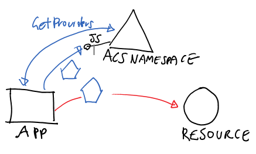
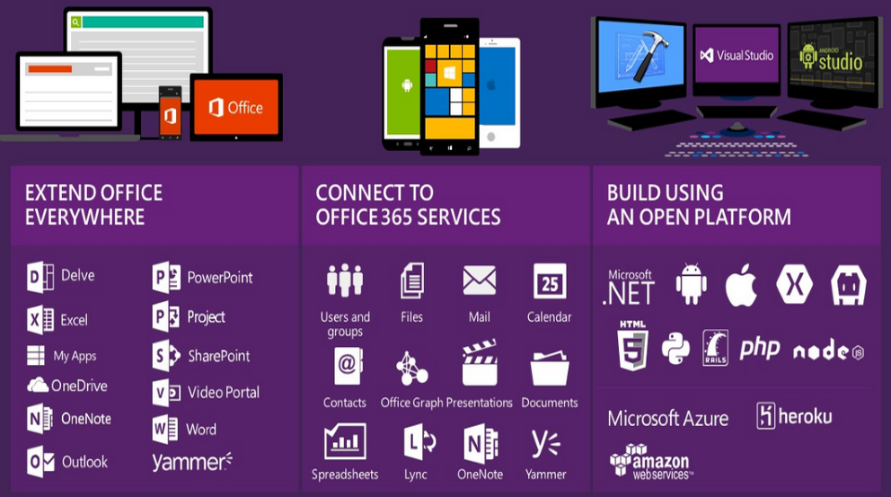
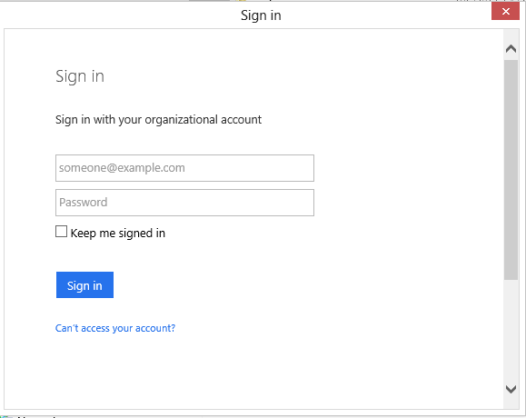
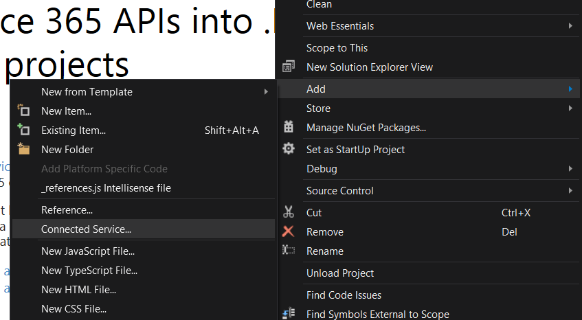
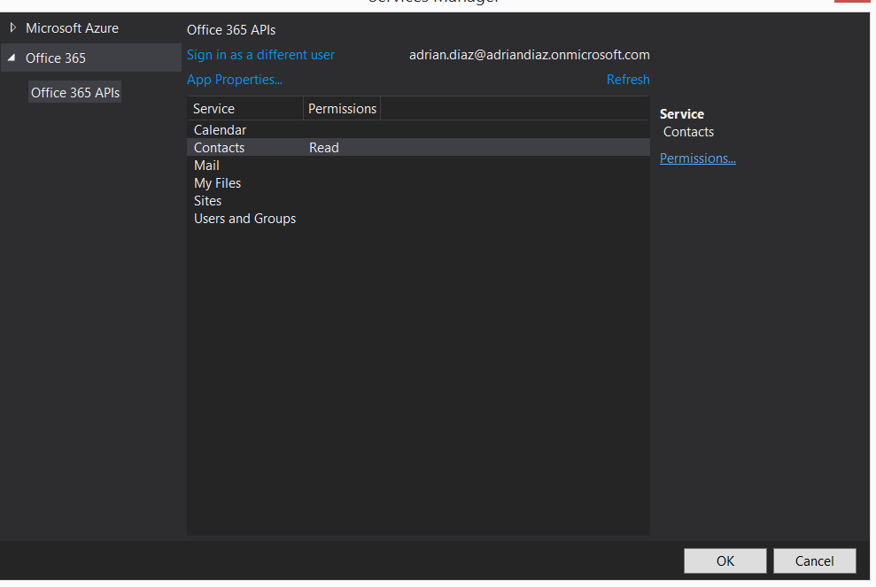
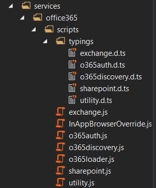
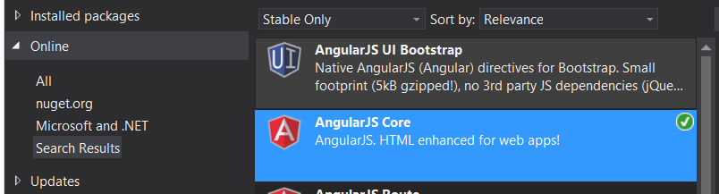

Mucho se está hablando del giro que se está produciendo en Microsoft desde la llegada de Satya Nadella al puesto de CEO de Microsoft. Uno de sus principales objetivos es hacer posible que todos los productos de su marca aumenten la productividad de las empresas desde cualquier dispositivo y en cualquier lugar, lo que bautizó como "MOBILE FIRST, CLOUD FIRST". Esta afirmación radicaba naturalmente en la mejora de su plataforma Cloud (Azure) y en su plataforma de productividad (Office 365).

Desde los últimos meses la comunidad de desarrolladores de Office 365 ha ido creciendo cada vez más y más, liderada de la mano de grandes gurús, MVPs o personal de Microsoft como Andrew Cornell, Jeremy Thake, Vesa,… De esta Comunidad ha surgido un proyecto Open Source llamado Patterns and Practice (PNP) para servir de adopción/evangelización a los desarrolladores de Office 365. Quizás sea el proyecto estrella y el que más ha evolucionado en los últimos meses. Pero para cumplir el objetivo de poder consumir servicios de Office 365 en cualquier dispositivo/plataforma ha sido muy importante la creación de una librería como ADAL. El funcionamiento de esta librería es abstraer al desarrollador de la forma en la que se tiene que autenticar contra Office 365 y simplifica mucho la tarea al desarrollador.



**¿Qué es Active Directory Authentication Library (ADAL)?**

Active Directory Authenticacion Library es una librería tanto de .NET como JavaScript cuyo funcionamiento es abstraer al programador de la forma en la que nuestra aplicación se autentifica contra Office 365. No es una librería nueva, ya tiene más de dos años desde que salió su primera versión.  Esta librería se puede utilizar tanto en desarrollos para IOS, Android como la nueva versión de ASP.NET llamada vNEXT.



**Principal patrón de ADAL**

La autenticación es un proceso bastante difícil, engorroso y sobre todo muy importante para la aplicación. Hay que conocer todo el proceso y verificar que se está haciendo correctamente, y  no podemos perder de vista muchos aspectos para poder autenticarnos. Los formatos de Token, qué protocolo a utilizar para una topología dada, qué parámetros de trabajo para un proveedor de identidad, pero no para el otro, cómo prevenir al usuario de que se le pregunte cada vez, cómo evitar guardar contraseñas y secretos, qué hacer cuando se necesita múltiples factores de autenticación, y muchos detalles más oscuros. Utilizando ADAL nos hace centrarnos en una solución a alto nivel tan simple como:

- Tengo una aplicación cliente
- Quiero llamar a un servicio, pero me obliga a presentar una ficha


Si queremos saber en detalle cual es el proceso de Autenticación que hace nuestra aplicación para para consumir información de Office 365 podemos revisar artículos anteriores donde se añaden más detalle. [http://www.compartimoss.com/revistas/numero-22/Como-utilizar-API-Office-365-aplicaciones-multiplataformas-Xamarin](/revistas/numero-22/Como-utilizar-API-Office-365-aplicaciones-multiplataformas-Xamarin)

**Escenarios donde podemos utilizar ADAL**

**1. Aplicación Cliente Nativa**

Este es el caso en el que se está desarrollando una aplicación nativa (todo lo que no es un navegador y que puede mostrar la interfaz de usuario, que incluye aplicación de consola) y desea acceder a un recurso con un token obtenido como el usuario interactivo actual. Para<br />implementarla se puede utilizar un código similar el siguiente:

```
AuthenticationContext _authenticationContext =
```

```
    new AuthenticationContext("https://login.windows.net/mytenant.onmicrosoft.com");
```

```
AuthenticationResult _authenticationResult =
```

```
  _authenticationContext.AcquireToken("http://myservices/service1",
```

```
                                      "a8cb2a71-da38-4cf4-9023-7799d00e09f6",
```

```
                                      new Uri("http://TodoListClient"));
```

La primera línea crea una AuthenticationContext atada al inquilino AAD "mytenant". La segunda línea pide que mytenant emitir un token para el servicio con identificador "http://misServicios/service1", se comunica que la solicitud proviene de cliente con ID a8cb2a71-da38-4cf4-9023-7799d00e09f6 y pasa en el retorno URI (utilizado como un terminador en el flujo contra el punto final autorización: un detalle protocolo OAuth2).

Si esta es la primera vez que ejecutamos ese código, el efecto de la llamada a AcquireToken será para que salga un cuadro de diálogo navegador recopilación de las credenciales de usuario:



ADAL maneja la creación del diálogo. Este diálogo es en realidad sólo una superficie del navegador y la autoridad decida qué enviar: aquí especificamos el nombre de usuario y contraseña, pero los usuarios específicos podría obtener múltiples factores de autenticación, mensajes de consentimiento y similar. Tras la autenticación exitosa, el AccessToken estará en \_authenticationResult. El contenido se almacena en caché \_authenticationResult: las llamadas posteriores a AcquireToken utilizando los mismos parámetros se obtendrán los resultados de la memoria caché hasta que se produzca una expiración.

2. **Aplicación Server to Server**

Este es el escenario en el que la aplicación cliente en sí tiene sus propias credenciales (independiente de las credenciales de Office 365) y necesita obtener información de algún servicio de Office 365.  Para ello lo hace utilizando el estándar OAuth2 (el cual permite que la aplicación pueda acceder a Office 365). Es un protocolo de autorización que permite a terceros (clientes) acceder a contenidos propiedad de un usuario (alojados en aplicaciones de confianza, servidor de recursos) sin que éstos tengan que manejar ni conocer las credenciales del usuario. Es decir, aplicaciones de terceros pueden acceder a contenidos propiedad del usuario, pero estas aplicaciones no conocen las credenciales de autenticación. De todas formas ADAL se encarga de gestionar este protocolo con total transparencia. Para este escenario se utiliza un código similar al siguiente.

```
_authenticationContext = 
```

```
     new AuthenticationContext("https://login.windows.net/21211b42-1e25-4046-8872-d8832a38099b");
```

```
 
```

```
ClientCredential clientCred2 = 
```

```
     new ClientCredential("2188a797-7d21-41dc-84f3-3c1720262614", "HBheXXXXXXXXXXXXXXXXXXXXXXXXXXXM=");
```

```
AuthenticationResult _authenticationResult = 
```

```
     _authenticationContext.AcquireToken("https://localhost:9001", clientCred2);
```

**No solo autentica, sino que tiene varias características destacadas**

1. Refresca el Token de uso: El Token obtenido tiene una duración de tiempo determinada y es necesario volver a obtenerlo, con ADAL se encarga automáticamente de este refresco.
2. Caché propia: ADAL viene con una memoria caché de forma predeterminada en memoria que se extiende por el proceso, y que se utiliza de forma automática. Eso caché es totalmente consultable a través de LINQ, y contiene mucho más que información como datos usuario (como identificadores, nombre y apellido, etc.).
3. Protección y validación: ADAL le protege de los recursos que le hagan llegar a las autoridades maliciosos mediante la validación de la URL autoridad contra las plantillas conocidas.


**Caso Práctico utilizar ADAL en una aplicación JavaScript (Cordova)**

En artículos previos hemos visto cómo utilizar ADAL, en aplicaciones Nativas sobre Windows 8, Android o IOS, así como en ASP.NET 4. Todos estos casos están muy bien, pero tiene algo en común y es que se realiza desde código C# lo cual no nos puede extrañar que tengamos una comunicación correcta con Office 365. Para demostrar que el mensaje que dice Microsoft es real vamos a ver como en una aplicación móvil implementada con Apache Cordova podemos consultar las API's de Office 365.

**Requisitos Previos:**

- Visual Studio 2013 Update 3 o Superior / Visual Studio 2015.
- Herramientas para Apache Cordova (el setup incluye herramientas como NodeJS, Sdk de Android,…).
- Office 365 API Tools ([http://visualstudiogallery.msdn.microsoft.com/7e947621-ef93-4de7-93d3-d796c43ba34f](http://visualstudiogallery.msdn.microsoft.com/7e947621-ef93-4de7-93d3-d796c43ba34f)).


**Nota:** Dentro de los emuladores que vienen con Cordova hay un plugin de Chrome llamado Riple que emula el comportamiento de un teléfono dentro de un navegador Web. Este emulador no funciona con ADAL debido a que dentro de una aplicación móvil no se espera que se abra una aplicación fuera de su contexto.  Para que funcione deberemos de utilizar un emulador bien de Android, IOS o Windows Phone.

**Manos a la obra**

Abrimos Visual Studio, creamos un proyecto JavaScript-&gt; Blank App (Apache Cordova). A continuación, a nuestro proyecto le vamos a añadir la conexión a los servicios REST de API 365. Para añadirlos, nos dirigimos al Explorador de soluciones, Agregar Servicio conectado tal y como se muestra en la siguiente imagen:



A continuación, seleccionamos la API que va a utilizar nuestra aplicación:



Si observamos dentro de nuestro proyecto se ha creado una carpeta dentro de Services-&gt; Office 365 en la que están las funciones necesarias para poder utilizar las API's de Office 365​



Con el fin de minimizar el uso de JavaScript vamos a utilizar un framework como AngularJS. Para ello nos dirigimos al repositorio de Nuget y nos descargamos el paquete Angular Core.



Una vez ya tenemos todas las herramientas preparadas, vamos con la parte más divertida: el código.

El primer paso en toda aplicación Angular es crearnos el punto de entrada de la aplicación, para ellos nos crearemos un fichero App.JS, en este fichero se define el nombre de nuestra aplicación, así como que dependencias tiene (la inyección de dependencias es uno de los aspectos que hacen muy potente a Angular y evitan que el código JavaScript se convierta en código espagueti).

```
var app365 = angular.module('app365', [
```

```
  'ngRoute']);
```

```
 
```

```
app365.config(['$routeProvider',
```

```
  function ($routeProvider) {
```

```
      $routeProvider.
```

```
          when('/', {
```

```
              templateUrl: 'partials/sign-in.html',
```

```
              controller: 'signInCtrl'
```

```
          }).
```

```
          when('/home', {
```

```
              templateUrl: 'partials/contact-list.html',
```

```
              controller: 'contactCtrl'
```

```
          });
```

```
      }
```

```
]);
```

A continuación, implementamos un Módulo en AngularJS en el que vamos a tener las funciones para autenticarnos contra Office 365. Este módulo contiene las siguientes funciones de login y de logout

```
function login(callback) {
```

```
            if (!authContext) {
```

```
                authContext = new O365Auth.Context();
```

```
            }
```

```
 
```

```
            authContext.getIdToken("https://outlook.office365.com/")
```

```
           .then((function (token) {
```

```
               // Get auth token.
```

```
               authtoken = token;
```

```
               // Get user name from token object.
```

```
               userName = token.givenName + " " + token.familyName;
```

```
               // Create Outlook client object.
```

```
               outlookClient = new Microsoft.OutlookServices.Client('https://outlook.office365.com/api/v1.0', authtoken.getAccessTokenFn('https://outlook.office365.com'));
```

```
               // Callback without parameter to indicate successful sign-in.
```

```
               callback();
```

```
           }).bind(this), function (reason) {
```

```
               // Log sign-in error message.
```

```
               console.log('Failed to login. Error = ' + reason.message);
```

```
               callback(reason.message);
```

```
           });
```

```
        };
```

```
function logout() {
```

```
            if (!authContext) {
```

```
                authContext = new O365Auth.Context();
```

```
            }
```

```
 
```

```
            authContext.logOut();
```

```
        };
```

Este ejemplo tendremos dos Controladores uno para la página de Login y otro para mostrar los contactos. El código a utilizar es el siguiente:

```
(function () {
```

```
    'use strict';
```

```
 
```

```
    function signInCtrl($scope, $location, app365api) {
```

```
 
```

```
        $scope.signIn = function () {
```

```
            app365api.login(onlogin);
```

```
        };
```

```
 
```

```
        var onlogin = function (reason) {
```

```
            $location.path("/home");
```

```
        };
```

```
    }
```

```
    angular.module('app365').controller('signInCtrl', ['$scope', '$location', 'app365api', signInCtrl]);
```

```
})();
```

```
(function () {
```

```
    "use strict";
```

```
    function contactCtrl($scope, app365api) {
```

```
        var vm = this;
```

```
        var outlookClient;
```

```
 
```

```
        function getContacts() {
```

```
 
```

```
            // Fetch all the contacts.
```

```
            outlookClient.me.contacts.getContacts().fetch()
```

```
            .then(function (contacts) {
```

```
                // Get the current page. Use getNextPage() to fetch next set of contacts.
```

```
                vm.contacts = contacts.currentPage;
```

```
                $scope.$apply();
```

```
 
```

```
            });
```

```
        };
```

```
 
```

```
        vm.loadList = function () {
```

```
            // Get the Outlook client object.
```

```
            outlookClient = app365api.outlookClientObj();
```

```
            // Get contacts.
```

```
            getContacts();
```

```
 
```

```
        };
```

```
 
```

```
        vm.loadList();
```

```
    }
```

```
    angular.module("app365").controller("contactCtrl", ['$scope', 'app365api', contactCtrl]);
```

```
})();
```

Una de las grandes ventajas que tiene AngularJS es están bastantes claras las responsabilidades, cumpliendo un patrón MV\*, ya hemos implementado los Controladores y ahora añadiremos las vistas necesarias. Para finalizar con el ejemplo tan solo nos queda modificar el HTML inicial, este HTML siguiendo con los patrones de Angular es un HTML sintáctico en el que por un lado tendremos que incrustar determinadas marcas para que Angular pueda aplicarlos, estas marcas comienzan todas por "ng". En nuestro caso quedaría como el siguiente:

```
<!DOCTYPE html>
```

```
<html ng-app="app365">
```

```
<head>
```

```
    <meta charset="utf-8" />
```

```
    <title>Cordova CompartiMOSS</title>
```

```
    <script src="services/office365/scripts/o365loader.js"></script>
```

```
    <script src="services/office365/settings/settings.js"></script>
```

```
    <script src="scripts/index.js"></script>
```

```
    <script src="scripts/angular.js"></script>
```

```
    <script src="scripts/angular-route.js"></script>
```

```
    <script src="scripts/app.js"></script>
```

```
    <script src="scripts/serviceO365.js"></script>
```

```
    <script src="scripts/signInCtrl.js"></script>
```

```
    <script src="scripts/contact-list-ctrl.js"></script>
```

```
    <link href="css/index.css" rel="stylesheet" />
```

```
</head>
```

```
<body>
```

```
    <div ng-view></div>
```

```
</body>
```

```
</html>
```

Por entender un poco el funcionamiento de AngularJS es el siguiente:

Encuentra una marca con el atributo "ng-app", este atributo indica el lugar donde va a arrancar la aplicación. Dependiendo del código introducido en nuestro modulo App.js realizaremos una acción u otra. En este ejemplo hemos indicado que cuando estemos en la pantalla inicial nos muestre el template de login así como el código del controlador establecido, por poner un símil tenemos el fichero ASPX y su código behind. De esta forma es mucho más sencillo y más fácil tener el código JavaScript organizado.


**Conclusion**

El desarrollo en Office 365 está evolucionando  a pasos de gigante, cada vez hay más desarrolladores sobre esta plataforma. Una de los principales motivos son todos los esfuerzos que está poniendo Microsoft para intentar que desarrollar sobre cualquier plataforma propia se pueda realizar con las herramientas que utiliza la mayoría de la gente.


**Adrián Diaz Cervera SharePoint - Architect at Encamina**
MVP SharePoint Server
[http://blogs.encamina.com/desarrollandosobresharepoint](http://blogs.encamina.com/desarrollandosobresharepoint)
[http://geeks.ms/blogs/adiazcervera](http://geeks.ms/blogs/adiazcervera)        
adiaz@encamina.com @AdrianDiaz81

 
 
import LayoutNumber from '../../../components/layout-article'
export default LayoutNumber
