​En muchas ocasiones necesitamos presentar en nuestro sitio de búsqueda datos empresariales de otros orígenes (fuera de SharePoint) como pueden ser base de datos (SQL Server, Oracle, MySQL),  ERP (Dynamics, SAP, ECI, NetSuite), ECi's M1ECi's M1  CRM( Dinamics, SAP, Sugar), etc.

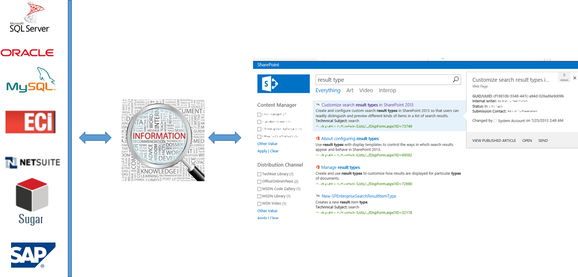

Esto es posible mediante la búsqueda de datos externos utilizando los servicios de conectividad empresarial, a continuación vamos a ver paso a paso como realizar dicha integración utilizado como conector un servicio web.

**Paso 5 - Creación del origen de datos para su rastreo.**

Para indexar el contenido externo es necesario crear un nuevo origen de contenido, para ello seguimos los siguientes puntos:

- Abrimos el formulario principal del servicio de aplicaciones de búsqueda. En el caso de no estar en la página inicial de la administración central pulsamos sobre la imagen de SharePoint, seleccionamos la opción de gestión de servicios de aplicaciones (Manage services applications), posteriormente seleccionar nuestra aplicación de servicio de búsqueda (Search Service Application).

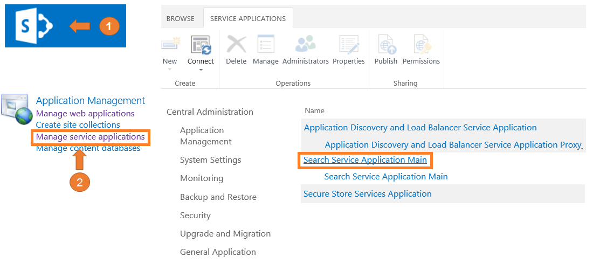

- Introducimos los datos solicitados. En la caja de texto de name (Name) introducimos "Proveedores", en el tipo de origen de contenido seleccionamos (Line of Business Data"), en el origen de datos externo (External Data Source) seleccionamos "ServiciosProveedores".

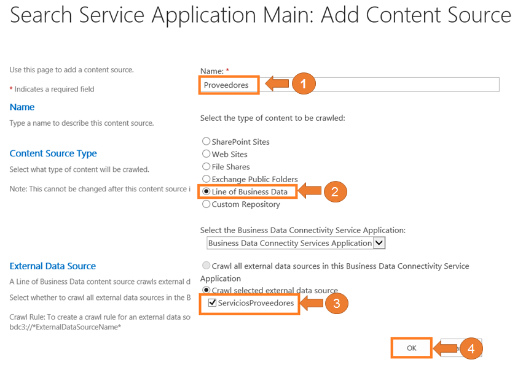

- Realizamos un rastreo completo. Para indexar y recoger las propiedades rastreadas es necesario realizar un rastreo completo, para ello pulsamos sobre el botón derecho del ratón sobre el nuevo origen de datos “Proveedores” y seleccionamos inicializar un rastreo completo (Start Full Crawl).

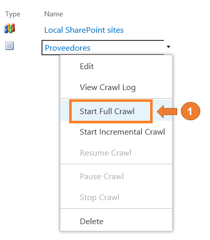

- Comprobamos el resultado de rastreo.  Comprobamos el resultado rastreo para ello pulsando sobre el botón derecho del ratón sobre el nuevo origen de datos "Proveedores" y seleccionamos ve el log de rastreo "View Crawl Log".

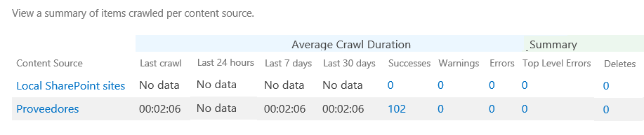

Es necesario incluir las propiedades administrada para posteriormente su utilización en las búsquedas, por ejemplo en el panel de refinamiento, plantillas de visualización de elementos, panel activable, etc. para ello seguimos los siguientes puntos:

- Visualizamos las propiedades rastreada de nuestro tipo de contenido externo. Seleccionamos en el menú vertical derecho la opción de esquema de búsqueda (Search Schema) en el apartado de consultas y resultados (Queries and Results), posteriormente pulsamos sobre la opción propiedades rastreada (Crawled Properties), seleccionamos en categoría (Category) "Business Data" y pulsamos sobre el botón buscar para presentar dichas propiedades.

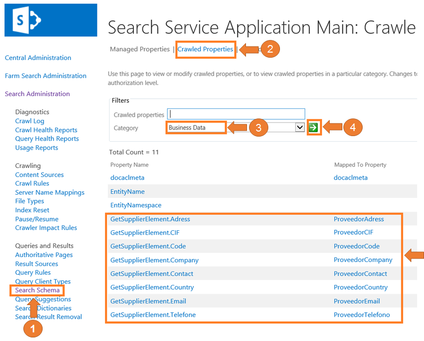

Añadimos nuestras propiedades administradas. Seleccionamos la opción de "Managed Properties" y pulsamos sobre "New Managed Property"

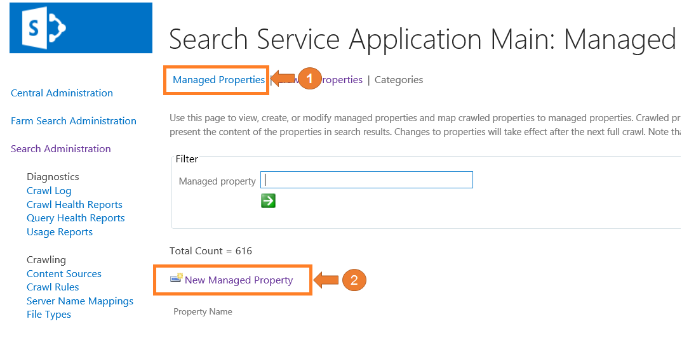

- Introducimos los datos solicitados. En nuestro caso en el nombre de la propiedad (PropertyName) introducimos "ProveedoresContry", en el tipo (Type) seleccionamos "Text", dependiendo la propiedad podemos indicar si deseamos que deseamos permitir realizar consultas contra el contenido de la propiedad administrada mediante índice de texto completo (Searchable),  también si deseamos que se pueda incluir en la consulta activamos la opción (Query), también  si deseamos que sea devuelto en el resultado de búsqueda activamos la opción (Retrievable), también si deseamos que se pueda refinar por dicha propiedad seleccionamos la opción correspondiente en (Refinable), introducimos el mapeo entre la propiedad rastreada y nuestra propiedad administrada, para ver los paso a seguir ver el siguiente punto antes de aceptar.

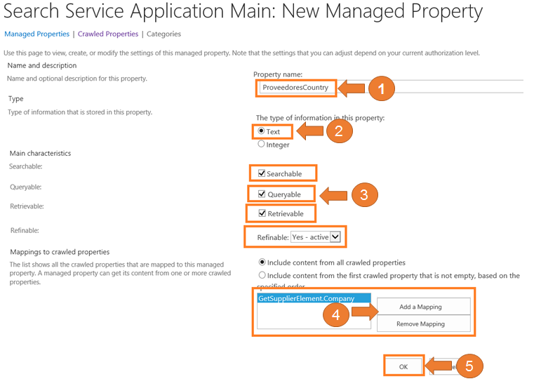

- Añadimos el mapeo con la propiedad rastreada. Pulsamos sobre el botón de un añadir mapeo (Add a Mapping), en el formulario realizamos un filtro por la categoría de datos de negocio (Business Data) para ello pulsamos sobre el botón de buscar (Find) después de indicar el valor correspondiente, en la lista de resultados de las propiedades rastreada (Select a crawled property) seleccionamos la propiedad deseada y pulsamos el botón de aceptar (OK).

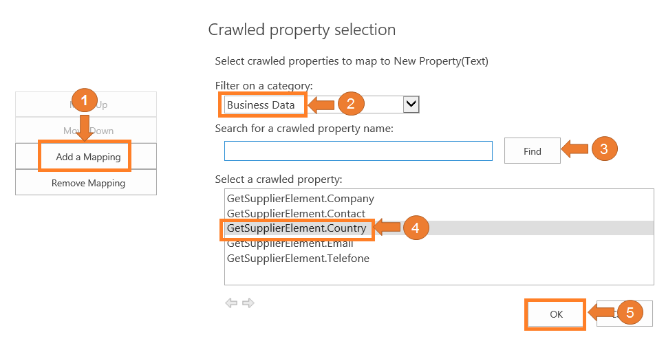

- Añadimos todas las propiedades. Repetimos los puntos anteriores hasta incluir todas las propiedades deseadas en nuestro caso.

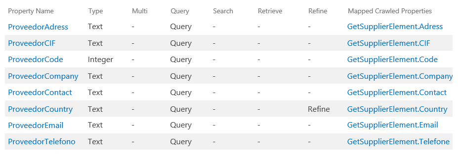

**Paso 7 - Creación de un origen de resultado.**

Para realizar un aislamiento del contenido externo de proveedores para posteriormente su utilización de un modo cómodo es necesario crear un origen de resultado, para ello seguimos los siguientes puntos.

- Abrimos el formulario de nuevo origen de resultado. Seleccionamos en el menú vertical derecho la opción de orígenes de resultado (Result Sources) en el apartado de consultas y resultados (Queries and Results) y posteriormente pulsamos sobre la opción de nuevo origen de resultado (New Result Source).

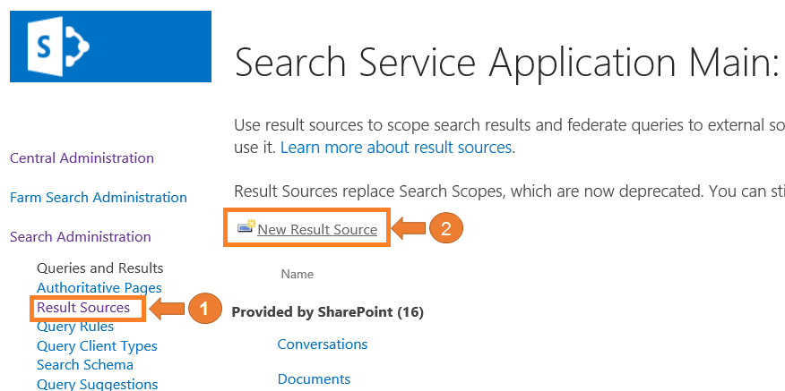

- Introducimos los datos solicitados. En nuestro caso introducimos "Proveedores" en cuadro de texto de nombre (Name),  "\{searchTerms\} ContentSource:Proveedores" en la consulta a tranformar (Query Transform) y pulsamos en guardar para crear el origen.

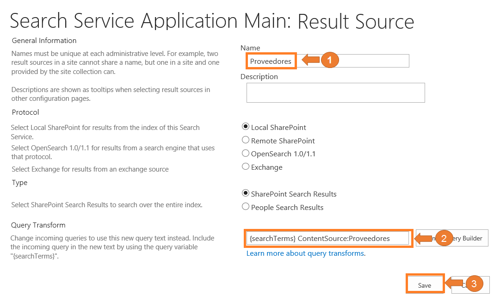

**Paso 8 - Creación de la página de resultado.**

Como deseamos realizar búsquedas aislada sobre nuestro contenido externo de proveedores, será necesario la creación de una nueva página de resultado limitando a dicho ámbito, para ello seguimos los siguientes puntos:

- Abrimos la página de contenido de sitio. En caso de no tener abierto nuestro sitio de búsqueda Introducimos en el navegador la URL correspondiente, en nuestro caso [http://spmartin15:39910](http://spmartin15:39910/), en la parte superior derecha pulsamos sobre el icono del menú de configuración y seleccionamos la opción de contenidos del sitio (Site Contents).

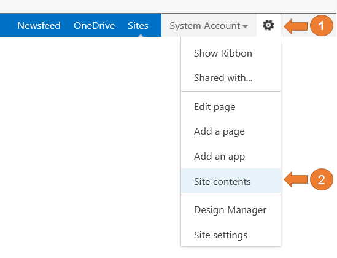

- Abrimos la librería de páginas. Pulsamos sobre el icono de Paginas (Pages).

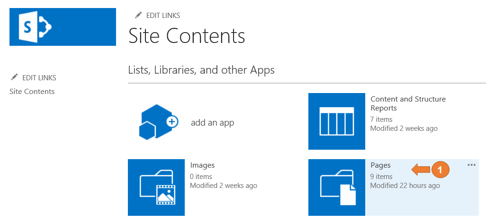

- Introducimos los datos solicitados. Seleccionamos ficheros (Files) dentro de la barra superior de la cinta de opciones, pulsamos sobre el icono de nuevo documento (New Document) y seleccionamos página (Page) después introducimos los datos solicitado en nuestro caso "Resultado de proveedores" como título (Title), URL "ProveedoresResult" y pulsamos el botón de crear (Create).

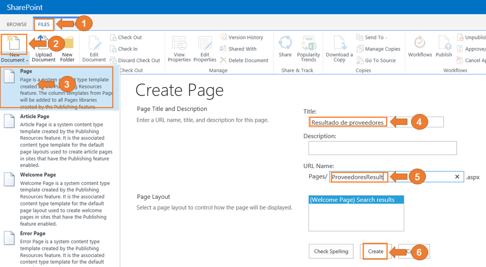

- Modificamos elemento web de resultado de búsqueda. Seleccionamos la página que acabamos de crear "ProveedoresResult"

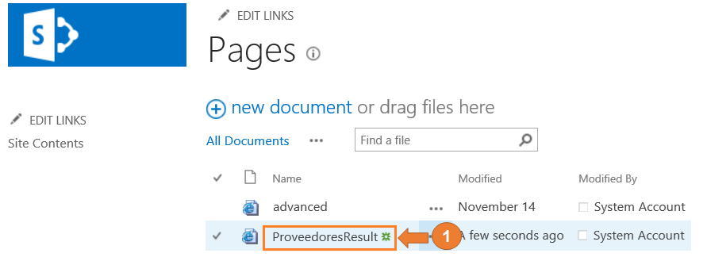

Editamos el elemento web de resultado de búsqueda (Search Result) para ello tenemos que editar la página.

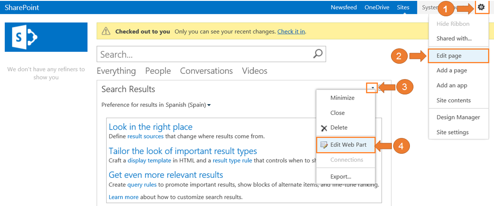

Cambiamos la consulta para ello seleccionar el botón de cambiar la consulta (Change query), en el formulario introducimos "Proveedores (Services)" en la selección de la búsqueda (Select a query) y guardamos pulsando sobre el botón de aceptar (OK).

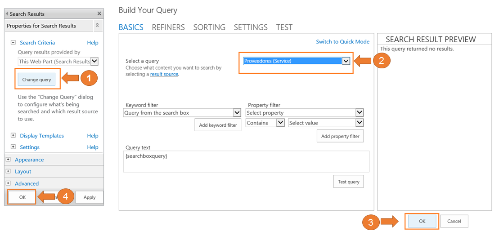

Después es necesario publicar la página para que sea visible por todos los usuarios.

**Paso 9 - Creación de vínculo de navegación.**

Como deseamos que el usuario realice búsquedas de forma cómoda en nuestro contenido externo de proveedores, será necesario la creación de un nuevo vínculo de navegación apuntado a nuestra página de resultado de proveedores, para ello seguimos los siguientes puntos:

- Abrimos la página de configuración de nuestro sitio de búsqueda. En la parte superior derecha pulsamos sobre el icono del menú de configuración y seleccionamos la opción de configuración de sitio (Site Settings).

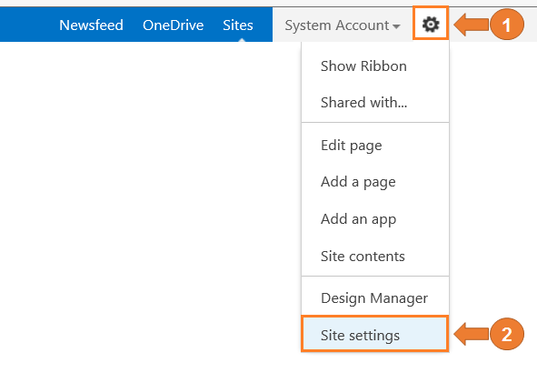

- Abrimos la página de configuración de búsqueda. Seleccionamos la opción de configuración de búsqueda (Search Settings) dentro de la categoría de búsqueda (Search).

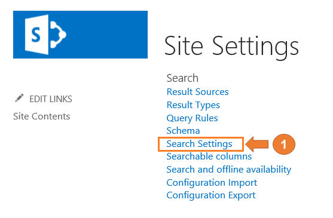

- Introducimos los datos solicitados. Dentro de la caja de la configuración de navegación (Configuration Search Navigation) pulsamos sobre la opción de añadir enlace (Add Link), introducimos los datos solicitados en nuestro caso "Proveedor" como título (Title),  Url "/Pages/ProveedoresResult.aspx" y guardamos los datos.

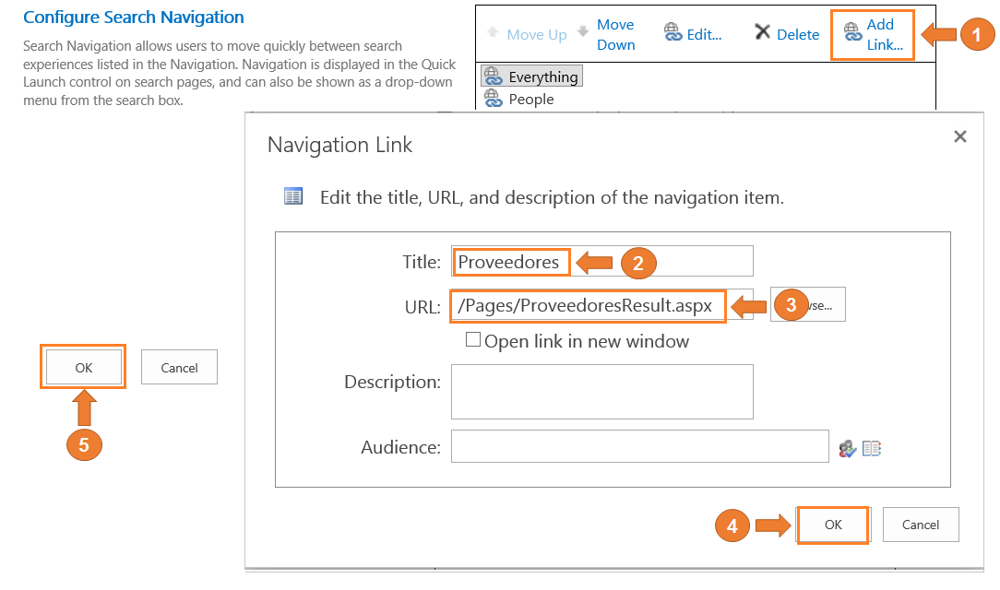

**Paso 10 - Validación del funcionamiento.**

Aunque podemos realizar otras configuraciones como puede ser el panel de refinamiento, plantillas de visualización de elementos, panel activable, etc. Y para no ser más extenso de lo debido en este artículo, vamos a concluir con una comprobación del funcionamiento, para ello seguimos los siguientes puntos:

- Realizamos una búsqueda. En caso de no estar en la página principal de nuestro sitio de búsqueda pulsamos sobre la imagen de SharePoint, introducimos en la caja de texto el valor que deseamos encontrar por ejemplo "Proveedor 10" y pulsamos sobre el botón de búsqueda.

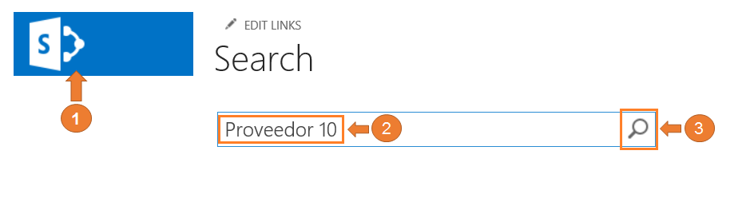

- Visualizamos los resultados. Comprobamos que aparecen los resultados deseado de nuestro contenido externo de proveedores.

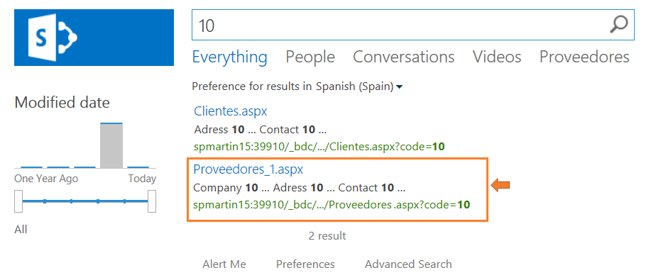

- Visualizamos sólo en el ámbito de proveedores. Si pulsamos sobre la pestaña de proveedores podemos comprobar que sólo presentará los resultados que se encuentra en el ámbito de proveedores.

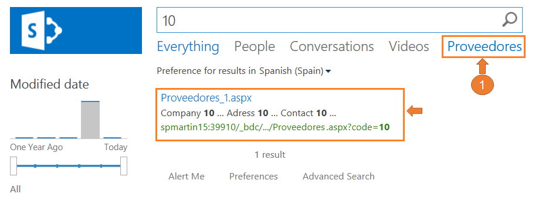

- Visualizamos los datos del proveedor. Como podemos comprobar presenta toda la información de nuestro proveedor.

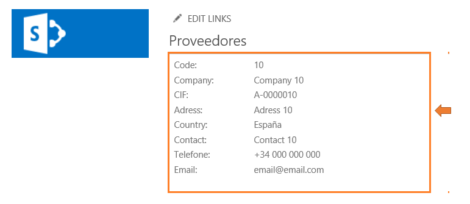

**Conclusiones**

Si combinamos el motor de búsqueda con Business Connectivity Services (BCS) nos brinda grandes posibilidades de integración con datos empresarial sin ningún tipo de desarrollo personalizado en la mayoría de los cosas además de una gran facilidad y flexibilidad en su configuración.

**MARTIN LUIS LOPEZ REQUENA**
SharePoint Solution Architect & Trainer at Everis

[martinluislopez@hotmail.com](mailto:martinluislopez@hotmail.com)

