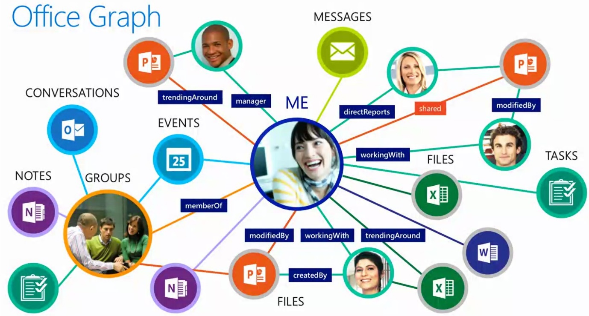

import ArticleHeader from '../../../components/article-header'

<ArticleHeader frontmatter={props.pageContext.frontmatter} />

​A estas alturas la mayoría de nosotros conocemos ya a Office Delve, un actor relativamente nuevo en la nube de aplicaciones de Office 365 que viene a romper el paradigma tradicional de los portales de información, mostrando la información que "el sistema" entiende que es relevante para cada uno de nosotros en forma de "cards" visuales que hacen de Delve una plataforma dinámica y atractiva de navegar.

Para ser francos, mi primera experiencia con Office Delve no fue del todo satisfactoria por la escasez de contenidos y rigidez de los mismos, así como unos "acabados" un tanto cuestionables en algunos puntos de la aplicación. Sin embargo, debo decir que mi interés por Delve crece a medida que voy viendo cómo la plataforma va evolucionando a ritmos acelerados para ir ofreciendo cada vez más y más contenidos provenientes de un número de fuentes también en crecimiento.

Para recordar muy rápidamente las "tripas" de Delve, en un artículo de Javier Menéndez Pallo del número 22 de COMPARTIMOSS ya se explicó en detalle cómo Office Graph, haciendo uso de ciertos algoritmos base definidos con Machine Learning, consigue relacionar los contenidos relativos a un usuario y extrapolar la relevancia y actualidad de los mismos para mostrarlos directamente en Office Delve.

Actualmente Delve extrae información de otras fuentes de Office 365, tales como SharePoint Online, Yammer, Exchange, Office Video u OneDrive. En el futuro ya han anunciado que también se integrará con otras fuentes como Skype for Business o entornos híbridos de SP 2016, pero lo más interesante es que ya han sido liberadas las "Graph Query API's" que permitirán construir apps a medida mediante conexiones a LOB y servicios de terceros. Así pues no hay límites sobre de qué fuente puede informar Office Delve, y eso le otorga un gran abanico de posibilidades y potencialidad.

De todas esas fuentes, Graph extrapola la información relevante (diferente para cada persona) estableciendo relaciones sobre a quién estoy siguiendo, a qué grupos pertenezco, quién me ha contestado un mail, post o conversación que yo he iniciado, quien ha modificado un documento que yo he creado, a quién reporto, qué tareas tengo asignadas, etc. Y con toda esa información nos muestra pantallas de "cards" tan dinámicas y atractivas como las que muestra la siguiente imagen.

Además, dejemos claro que Office Graph siempre tiene en cuenta los permisos de la fuente de información, mostrando al usuario únicamente aquella información a la que tiene acceso. Si alguien nos envía un documento adjunto en un mail privado, únicamente nosotros podremos ver el documento, y si se publica información en un grupo privado de Yammer, únicamente los integrantes del grupo la visualizarán en Office Delve.

**Perfil del usuario**

En Office Delve se puede consultar el perfil tanto de nosotros mismos como de cualquier persona en nuestra granja de Office 365. Esta es una característica que ya está actualmente disponible, pero que ha evolucionado respecto a su versión original y sigue teniendo previsto una mayor evolución en próximas versiones, incluyendo nuevos componentes como el "Blog", "Working On" o los premios recibidos "Praises", y redistribuyendo el espacio en diversas columnas y secciones, así como una personalización de la cabecera de nuestro perfil (banner de fondo). Personalmente siempre he pensado que el profile del "My Site" estaba mal resuelto, y aquí tenemos una versión más amigable y moderna de presentar la información relevante de cada usuario

**Blog**

Microsoft ha mostrado en Ignite otra característica que estará disponible en breve para Office Delve y que es ciertamente interesante, se trata de la posibilidad de mantener nuestro propio blog directamente desde Delve. La diferencia con los actuales blogs de SharePoint es que estos tirarán de un nuevo motor de creación de páginas con contenido enriquecido (imágenes, enlaces, contenido multimedia….) con una interface nueva y muy sencilla de manejar. A esta nuevo motor de creación de páginas web le llaman "microsites" y lo usaremos en Delve para crear posts de nuestros blogs desde la página de perfil de nuestro usuario, simplemente haciendo click en el enlace de "empezar a escribir" que se habilitará a tal efecto. Microsites también se ha anunciado para otros componentes que estarán presentes en el futuro de Office 365, tales como "InfoPedia" (antes conocida como bibliotecas de páginas wiki en SharePoint) y otras muchas que seguro iremos oyendo hablar durante los próximos meses.

Una de las características destacadas de los microsites es que serán responsive y por lo tanto se podrán visualizar correctamente desde cualquier dispositivo móvil. Esta funcionalidad en sí misma justifica dejar de usar los Blogs de SharePoint (al menos hasta que tengamos acceso a la versión 2016) y dar el salto a Office Delve.

**Seguir a personas**

En el momento de escribir este artículo todavía no estaba disponible esta opción, pero el equipo de Delve ha anunciado que cuando en Delve busquemos a una persona en concreto y vayamos a su página de perfil, podremos hacer un seguir "follow" o dejar de seguir "unfollow", siendo este uno de los parámetros básicos para que el algoritmo de Graph nos muestre resultados de dicha persona como relevantes en nuestra homepage de Delve.

Las personas que seguimos y visitamos más frecuentemente serán las que tengamos acceso rápido desde el menú de navegación vertical izquierdo.

**Actividades de personas que sigo**

Office Delve no solo nos muestra actividades en nuestra página principal, también permite ir a las páginas de actividades de cualquier otra persona y ver qué actividades son relevantes para él/ella (siempre que tengamos permisos adecuados para visualizar dicho contenido, claro está). El tipo de "cards" que veremos serán el mismo que en nuestra página principal, obtenidas de las mismas fuentes de información.

**Ver más contenido relacionado de…**

Otra funcionalidad que actualmente podemos encontrar en Delve es el acceso a "ver más contenido relacionado de…" que nos mostrará las personas vinculadas con ese usuario en concreto, además de más "cards" de actividades que no se mostraban en la página principal.

**Premios**

Esta es otra característica muy interesante que está por llegar a Office Delve, y se basa en que se podrá otorgar premios (felicitaciones) específicos a los usuarios de Office 365, y ser visualizados desde la página de perfil de los mismos, así como hacer un "me gusta" o "no me gusta" del mismo. El concepto de gamificación llega también a Delve, dispuesto a dinamizar y fomentar la calidad de contenidos y la participación del resto de usuarios.

**Trabajando en**

De nuevo otro componente que todavía está por llegar en Office Delve, es el "trabajando en" que se acoplará en la página de perfil de cada usuario. De nuevo los algoritmos basados en machine learning de Graph serán capaces de dilucidar en qué proyectos estamos trabajando, basándose en los últimos documentos que hemos subido, actualizado, seguido, comentado… en los grupos de Office 365, SharePoint y Yammer. El componente mostrará de forma directa en qué proyectos hemos registrado mayor actividad durante los últimos días.

**Comunicaciones**

La pestaña de comunicaciones todavía no estaba disponible en el momento de la redacción del presente artículo, aunque Microsoft la mostró ampliamente en Ignite y se aprecia una nueva funcionalidad muy sugerente, como la posibilidad de leer nuestros últimos mails y comentarios de Yammer, así como responderlos directamente desde Delve mediante una interface muy intuitiva y sencilla. De nuevo vemos aquí actuar a Delve como front-end unificador (centralizador) de las diversas piezas que componen la nube de Office 365, y es en estos detalles donde podemos dilucidar lo que pretende Microsoft realmente con esta plataforma: Que el usuario la utilice en primera instancia para comprobar el estado de su trabajo diario, y a partir de aquí, si se quiere profundizar en algún aspecto concreto derivar a la aplicación que corresponda. Entendemos además que mediante la propia evolución del producto y las API's que vayamos teniendo acceso podremos ir añadiendo más fuentes de contenido a la pestaña de comunicaciones (Skype for Business, por ejemplo).

**Boards**

Durante la navegación por Delve, el usuario puede seleccionar cualquier actividad (card) y enviarla a un Board (nuevo o existente). Esto permite algo inaudito hasta ahora, que es poder agrupar en una única página diversos ficheros o contenidos provenientes de fuentes tan dispares como SharePoint, Yammer, Outlook, Office Video, Skype… y guardar ese contendor de información relacionada para compartirlo con quien queramos. Imaginad por ejemplo que os llega un correo electrónico con un enlace a Delve que contiene diversos documentos en Word, PDF, un video formativo, una conversación de Yammer… al respecto de un proyecto en el que acabamos de aterrizar.

Además los "Boards" se mostrarán automáticamente en el panel de navegación izquierdo de Office Delve si los algoritmos de Graph detectan que tienen algún tipo de vinculación con el usuario (lo ha creado una persona a la que seguimos o hemos sido autores de alguno de los documentos que incluye el Board, por ejemplo).

**Organizational Dashboards**

Otra de las futuras novedades de Delve presentadas en Ignite es el nuevo Dashboard de organización ("Organizational Dashboard"), que muestra gráficas y números estadísticos muy visuales y atractivos sobre la actividad que hemos realizado desde Delve y Skype. Por ejemplo permite establecer un mapa de relaciones de nuestro equipo con otros equipos (tanto corporativos como externos). En dicho mapa, el grueso o fino de las líneas dibujadas indican lo fuerte o débil que son estas relaciones (relaciones fuertes se marcan con líneas gruesas, y viceversa).

También permitirán saber de forma muy visual en qué hemos invertido nuestro tiempo de trabajo (emails, meetings, videoconferencias de Skype, conversaciones de Yammer), o incluso con qué países del mundo nos comunicamos más según el número de interacciones registradas en cada una de ellas.

**Mobile**

Otra de las grandes novedades de Office Delve es que ya está mundialmente disponible la App para móviles Android, se puede descargar directamente de Play Store, y disfrutar de la experiencia responsive en nuestro dispositivo móvil. Es indudable también que esta App irá evolucionando y ofreciendo nuevas funcionalidades a medida que evolucione también papá Delve en Office 365.

**Grupos de Office 365**

Los grupos de Office 365 fueron lanzados hace ya unos meses, y aunque en principio resulten algo confusos en su concepto (¿Una bandeja de entrada más en nuestro buzón de correo para hacer algo similar a Yammer?) en Ignite se vio que estos también van a seguir evolucionando para ofrecer una experiencia integradora entre diversas fuentes de información, añadiendo nuevos orígenes de datos (como Dynamics CRM), o integraciones desde el propio Outlook cliente que pueden resultar interesantes. También Office Delve va a ser capaz de mostrarnos páginas de actividades relativas a grupos, con sus "cards" específicas para los mismos, tratándolos como si de un usuario más se tratara.

**Perfil de grupos de Office 365**

También hay que tener en cuenta que los grupos de Office 365 también van a tener su propia página de perfil, donde podremos ver por ejemplo los miembros del grupo que están conectados en el momento de la consulta, los siguientes eventos en la agenda del grupo, las conversaciones de email mantenidas, o los ficheros del grupo que hayamos podido guardar en OneDrive, así como las notas de OneNote relativas al mismo. Sin duda le da mucha más vistosidad a los Grupos de Office 365 que hasta el momento eran bastante precarios en cuanto a contenidos y presentación. Atención, ¿Estamos viendo nacer a un futuro rival interno de Yammer?

**Conclusiones**

Hasta aquí la ráfaga de novedades conocida a día de hoy sobre Office Delve. Como veréis son unas cuantas novedades importantes y la sensación que destila es que es un producto que está siendo mimado por Microsoft (al igual que toda la plataforma de Office 365). No podemos decir lo mismo de SharePoint 2016, del que apenas se vieron unas cuantas diapositivas explicando algunas novedades en cuanto a arquitectura y servicios que reflejan lo verde que se encuentra todavía la nueva versión de SharePoint.

En conjunto está claro que con Office Delve nos encontramos con un producto que Microsoft va a intentar usar como centralizador o catalizador de la información del resto de aplicaciones en la nube y también en entornos híbridos, incluyendo SharePoint, por supuesto. El hecho de que las Graph Query API's permitan a aplicaciones de terceros enviar "cards" de acciones a Delve no hace sino incrementar las posibilidades de la plataforma.

¿Por dónde empezar a mirar cuando uno tiene SharePoint, Office Video, Skype for Business, Yammer, Exchange, Dynamics CRM, Power BI, One Drive…? Sin duda alguna Delve aparece como "el pegamento" para unirlos a todos en una única experiencia, y tampoco cabe duda que Office Delve seguirá evolucionando a buen ritmo durante los próximos meses, así que os recomiendo no le perdáis el ojo, porque puede acabar convirtiéndose en una plataforma realmente útil e interesante como puerta de entrada a la nube de Office 365.

**Ignasi Tebé**
 SharePoint Professional
 [ignasitt@gmail.com](mailto&#58;ignasitt@gmail.com)

[http://www.sharepointer.info](http&#58;//www.sharepointer.info/)

