import ArticleHeader from '../../../components/article-header'

<ArticleHeader frontmatter={props.pageContext.frontmatter} />


​En el artículo anterior de [**Movilidad sobre SharePoint – Parte I**](/revistas/numero-22/movilidad-sobre-sharepoint-parte-i), hicimos una breve introducción a las distintas opciones que tenemos a la hora de desarrollar soluciones móviles que se integren con nuestro SharePoint.

Continuando con la serie, esta vez realizaremos un ejemplo práctico en el que desarrollaremos una aplicación híbrida multiplataforma.

Usaremos:

- **Apache** **Cordova** para empaquetar la solución.
- **Windows Azure Active Directory** para gestionar la identidad y controlar el acceso a nuestro **Office 365.**
- **KnockoutJS**para facilitarnos separar la capa de presentación y la lógica de nuestra aplicación, siguiendo el patrón model-view-viewmodel (MVVM).


**Introducción a Apache Cordova**

El núcleo de una aplicación Apache Cordova está compuesto por HTML5 y CSS3 para gestionar el renderizado y JavaScript (o TypeScript) para la lógica de la aplicación.  El uso de HTML5 nos posibilita el acceso tanto a funcionalidades nativas como al hardware del dispositivo.

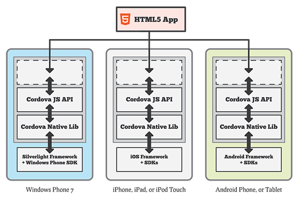

El framework nos proporciona la manera de encapsular y paquetizar nuestro código HTML y esto lo hace a través de un Webview, que es el que se encarga de renderizar dicho contenido. Por otro lado nos proporciona una API javascript para poder acceder a los componentes y funciones del dispositivo

A continuación una tabla de funcionalidades nativas soportadas por Apache Cordova**.**Como podemos comprobar para los dispositivos móviles más comunes el framework soporta prácticamente la totalidad de características nativas.

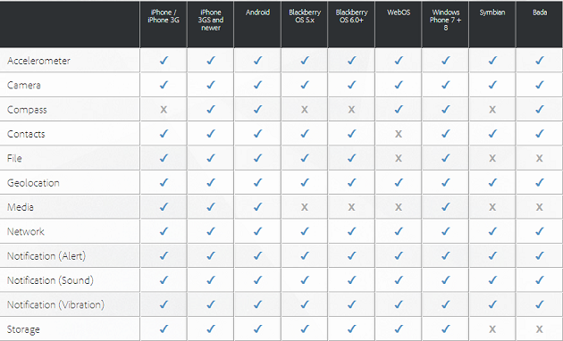

**Requisitos**

En este apartado, enumeraremos todo lo que necesitamos para poder desarrollar una aplicación como la que vamos a presentar más adelante.

*Infraestructura*

- **Office 365 E3 o superior**: Se puede crear una Trial de Office 365 desde    [http://bit.ly/1FD6Lvb](http&#58;//bit.ly/1FD6Lvb).
- **Azure Active Directory**: Vinculado con  Office 365.


*Herramientas*

- **Visual Studio 2013 Update 4**
- **Visual Studio Tools for Apache Cordova CTP3.0**


*APIs para el Desarrollo*

- **Referencia de la API de Cordova:**
    - [http://cordova.apache.org/docs/en/4.0.0/guide\_support\_index.md.html#Platform%20Support](http&#58;//cordova.apache.org/docs/en/4.0.0/guide_support_index.md.html#Platform%20Support)
- **Referencia de la API REST de SharePoint:**
    - [**https://msdn.microsoft.com/en-us/library/office/jj860569.aspx**](https&#58;//msdn.microsoft.com/en-us/library/office/jj860569.aspx)
- **Referencia de Knockout:**
    - [**http://learn.knockoutjs.com/#/?tutorial=intro**](http&#58;//learn.knockoutjs.com/#/?tutorial=intro)


*Publicación de la Aplicación en el Marketplace de aplicaciones*

Es necesario tener cuenta y licencia para publicar en el marketplace de aplicaciones de las distintas plataformas:

- **Android:**Pagando 25€  y ya tienes la licencia de desarrollador para siempre.
- **Windows Phone:** Pagando 19 €  y ya tienes la licencia de desarrollador para siempre.
- **Apple:**
    - Se pagan 100€  al año para ser desarrollador.
    - Necesitas obligatoriamente un Mac para subir tu aplicación a revisión.


**Conexión a Office 365 en Aplicaciones Apache Cordova**

A continuación describiremos los pasos para poder conectar nuestra aplicación con Office 365. Tenemos que tener en cuenta los requisitos mencionados anteriormente para poder realizarlo con éxito.

- Abrimos Visual Studio y creamos un proyecto Apache Cordova.


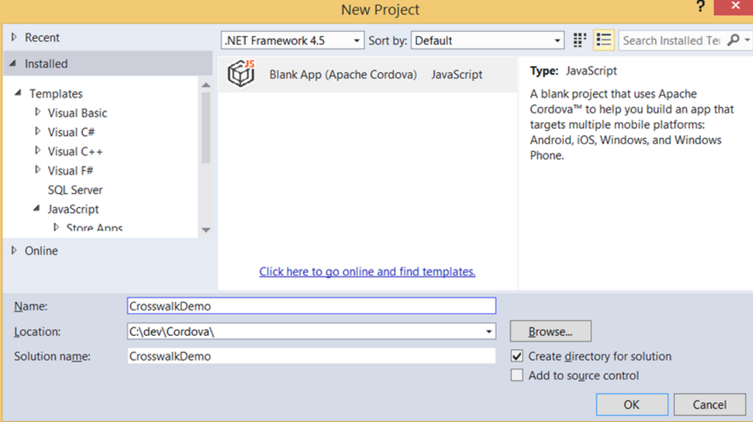

- Desde el explorador de soluciones incluiremos en el proyecto un servicio conectado:


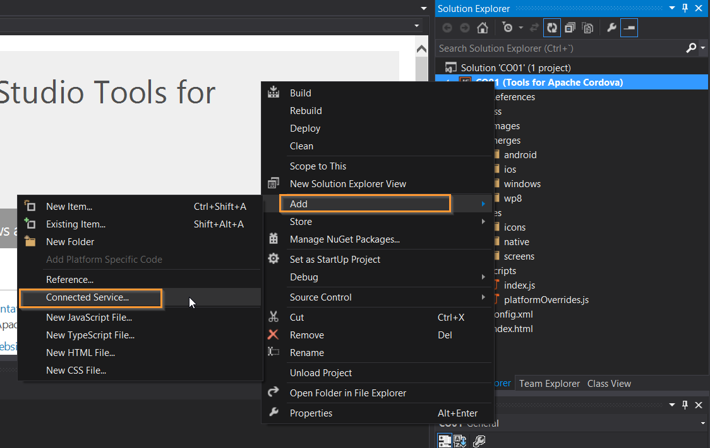

- Registramos nuestra App en Azure Directory Services, definiendo los permisos para cada servicio al cual queramos conectar. En nuestro caso, vamos a proceder a conectar a SharePoint y para ello seleccionaremos Sites:


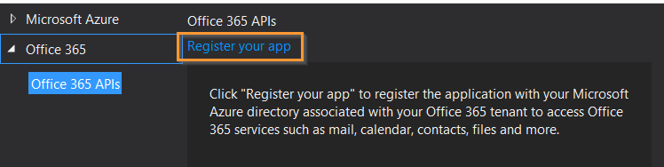

Una vez registrada nuestra aplicación nos aparecerá en<br />el panel de Azure nuestra aplicación, del tipo cliente nativo.

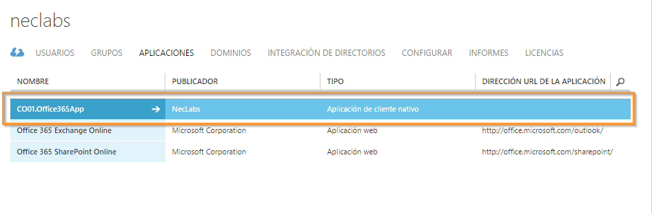

- Si vemos el detalle, podremos ver el nombre de la<br />solución, el Id de cliente y la URL de la redirección.


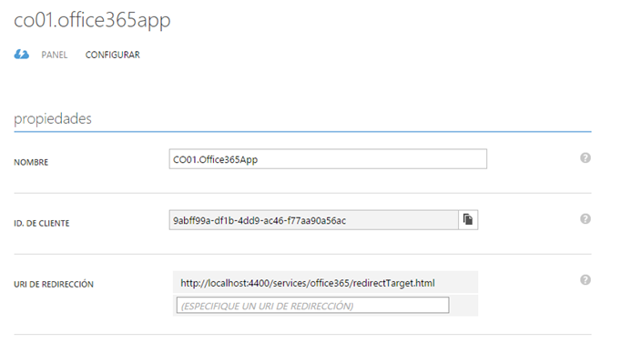

- Al haber creado el servicio conectado desde Visual Studio, las propiedades de la conexión quedan automáticamente configuradas en el fichero settings.js


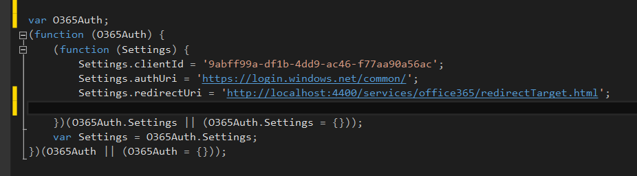

- En la solución de Visual Studio nos incluirá la carpeta Services con todos los scripts necesarios:


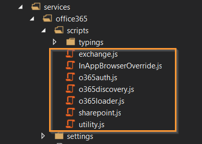

**Introducción a KnockoutJS**

Se trata de una librería JavaScript que facilita la creación de interfaces basándose en el patrón MVVM desde el lado del cliente. Las características de este Framework JavaScript son las siguientes:

- Permite separar los datos del dominio, los componentes y los datos a mostrar.
- Contiene una capa definida por el código para gestionar las relaciones entre los componentes y las vistas.
- Utiliza funciones de gestión de eventos nativos de JavaScript.
- Permite simplificar las relaciones y hacer que la visualización sea dinámica y rica en experiencia de usuario.


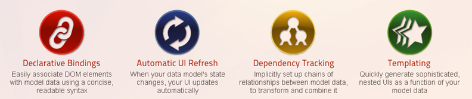

*Patrón MVVM*

Es un patrón que se originó a partir de Microsoft (John Gossman) como una especialización del patrón de diseño modelo de presentación introducida por Martin Fowler.

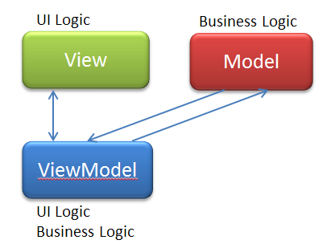

El siguiente ejemplo extraído de [http://learn.knockoutjs.com/#/?tutorial=intro](http&#58;//learn.knockoutjs.com/#/?tutorial=intro) muestra las características del Framework de acuerdo a la imagen 11.

Vista:

```
<p>First name: <input data-bind="value: firstName" /></p>
```

```
<p>Last name: <input data-bind="value: lastName" /></p>
```


VistaModelo:

```
// This is a simple *viewmodel* - JavaScript that defines the data and behavior of your UI
```

```
function AppViewModel() {
```

```
    this.firstName = ko.observable("Bert");
```

```
    this.lastName = ko.observable("Bertington");
```

```
}
```

```
// Activates knockout.js
```

```
ko.applyBindings(new AppViewModel());
```

**¿Porque KnockoutJS y no Angular?**

Elegimos KnockoutJS y no Angular porque como muchos de vosotros, preferimos seleccionar cada herramienta en función de lo que sabe hacer mejor frente a la alternativa de  todo en uno que representa Angular, aunque también sea una opción más que válida en escenarios más complejos.

**Creación de la Aplicación**

Nuestro objetivo es consumir en un dispositivo móvil  información hospedada en sitios de SharePoint  Online en Office 365. En nuestro caso de ejemplo, se tratará de una lista de noticias que tiene la siguiente estructura:

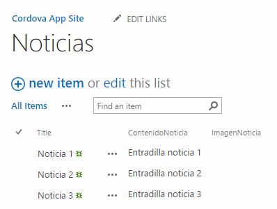

Como parte de nuestros objetivos, conectaremos a nuestro Office 365 dejando que Azure, y en concreto el servicio de Azure Directory, se encargue de gestionar tanto los permisos como el acceso. A nivel de arquitectura de la Aplicación, tendremos:

Capas

- **Vista**: Usamos esta capa para mostrar la información.
- **Vista Modelo**: Usamos esta capa para relacionar nuestros datos con la capa de presentación.
- **Modelo**: Usamos esta capa para obtener la información de SharePoint.


Acciones

- **Creamos un fichero HTML , donde pondremos la Vista**


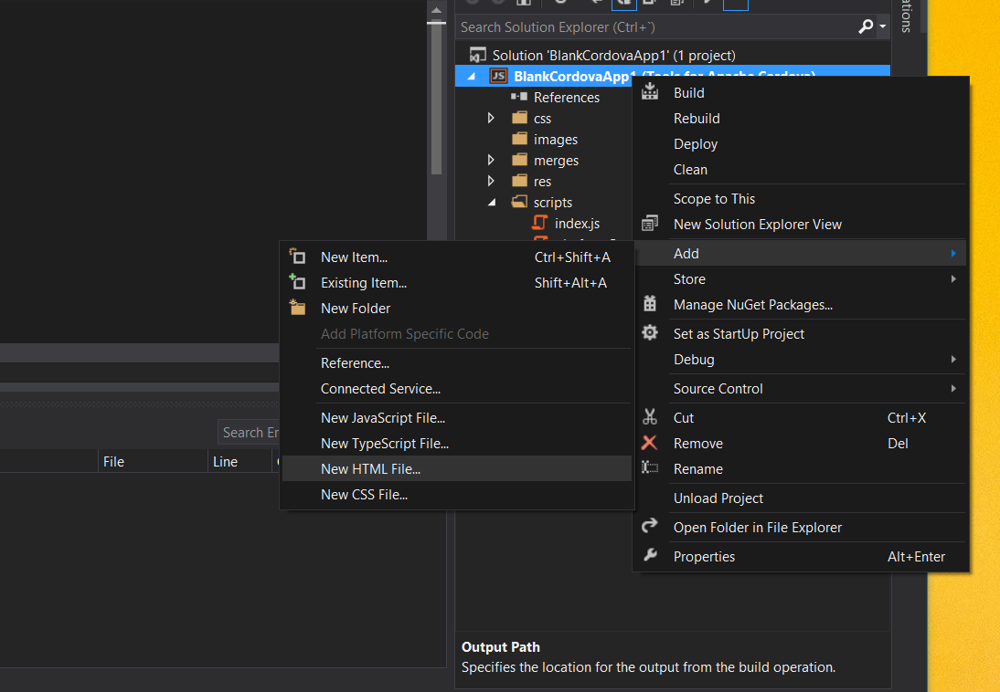

A continuación vamos a ir viendo como quedarían configurado cada uno de estos elementos:

Vista:

```
    <script src="cordova.js"></script>     <script src="scripts/platformOverrides.js"></script>     <script src="scripts/jquery-2.1.1.js"></script>     <script src="services/office365/settings/settings.js"></script>     <script src="services/office365/scripts/InAppBrowserOverride.js"></script>     <script src="services/office365/scripts/utility.js"></script>     <script src="services/office365/scripts/o365auth.js"></script>     <link href="Content/bootstrap.min.css" rel="stylesheet">     <script src="scripts/bootstrap.min.js"></script>     <script src="services/office365/scripts/aadgraph.js"></script>     <script src="scripts/app/index.js"></script>     <script src="scripts/app/listClient.js"></script>     <script src="app/index.js"></script>     <script src="scripts/knockout-3.2.0.js"></script>
```

```
 
```

```
<h3>Noticias <span class="label label-default">New!</span></h3> <div class="list-group">     <!-- ko foreach: news -->     <!-- ko if:($index() === 0)-->     <a href="#" class="list-group-item active" data-bind="text:Title"></a>     <!--/ko-->     <!-- ko if:($index() !== 0) -->     <a href="#" class="list-group-item" data-bind="text:Title"></a>     <!--/ko-->     <!-- /ko --> </div>
```

VistaModelo:

Creamos un fichero JS y agregamos Vista Modelo:

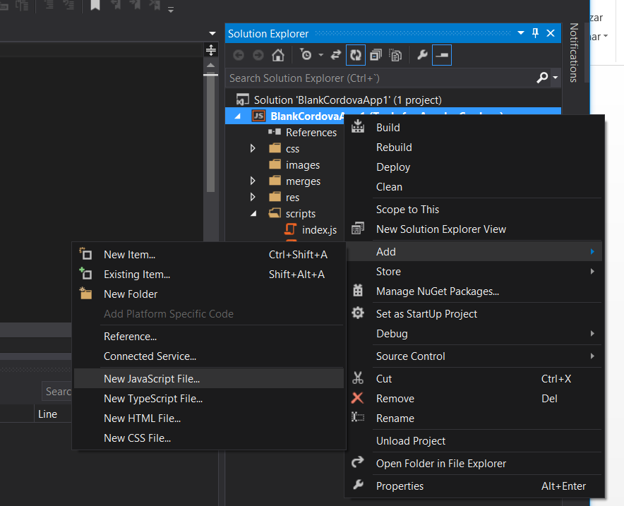

```
$(document).ready(function () {         listClient.getAccessToken(getAccessTokenSuccess, getAccessTokenFail);     }); function GetNews() {         var url = O365Auth.Settings.sitecollectionUrl + "/_api/lists/GetByTitle('Noticias')/Items";         listClient.getListItems(url, (OnShowNewsSucceed).bind(this), (OnShowNewsFail).bind(this));     } function OnShowNewsSucceed(results) {         var viewModel = {             news: ko.observableArray(results)         };         ko.applyBindings(viewModel);     }     function OnShowNewsFail(xhr) {         alert("Load Fail " + xhr);     }
```

Modelo

Creamos un fichero JS y agregamos el Modelo:


```
var listClient = {     accessToken: '',     emailaccessToken: '',     authContext:null,
```

```
 
```

```
getListItems: function(url , successcallback, failcallback)     {         $.ajax({             type: "GET",             async:true,             url: url,             headers: { "Authorization": "Bearer " +this.getToken(),                      "accept":"application/json;odata=verbose"},         }).         done(                 (function (data) {                     //console.log(data);                     var listitems = this.parseJsonDataToArray(data);                     successcallback(listitems);                 }).bind(this)         )         .fail(function (jqXHR, textStatus) {             failcallback(textStatus)         });     } getAccessToken: function(successCallBack, rejectCallBack)     {         //authenticate to Office 365         if (this.authContext == null)         {             this.authContext = new O365Auth.Context();         }                 //authContext.logOut();         this.authContext.getAccessToken(O365Auth.Settings.resourceId)         .then(             (function (token) {                 this.setToken(token);                 successCallBack();             }).bind(this)             ,             function (reason) {                 rejectCallBack(reason);             }         )     }
```

```
}
```


Flujo de Operación

Como se puede apreciar, el flujo de operación implica:

- En el document ready obtenemos el token de acceso con la función  listClient.getAccessToken().
- Una vez obtenemos el token llamamos a la función listClient.getListItem() y hacemos una llamada API REST donde le pasamos el token de acceso.
- Una vez obtenemos los elementos llamamos  a la función OnShowNewsSucceed() y pintamos los datos.


Resultado del caso Práctico

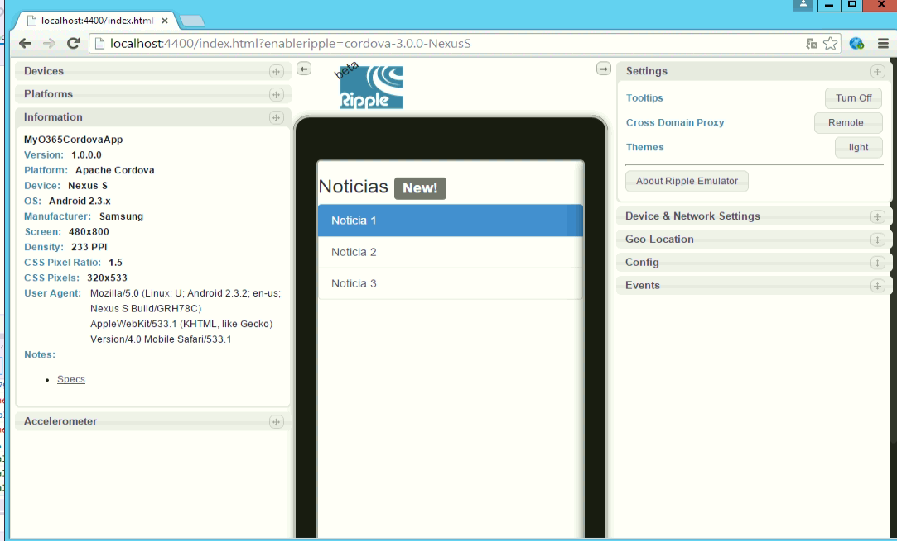

**Conclusiones:**

A través del ejemplo mostrado, podemos concluir que es posible crear una aplicación  con tecnologías HTML y JavaScript de forma sencilla y encapsulada en una aplicación para poder consumir la información desde nuestro dispositivo portátil, sin importar cuál sea. En el próximo artículo hablaremos sobre cómo crear una Aplicación nativa y cómo consumir información de nuestro SharePoint.


**Rubén Toribio**
 SharePoint Architect en Tokiota
 **@rtoribiog**
 **Jaime Arroyo**
 SharePoint Architect en Necsia
 **@jaumeouyea**

