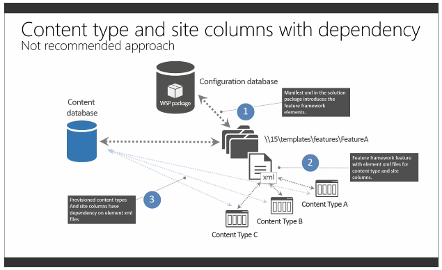
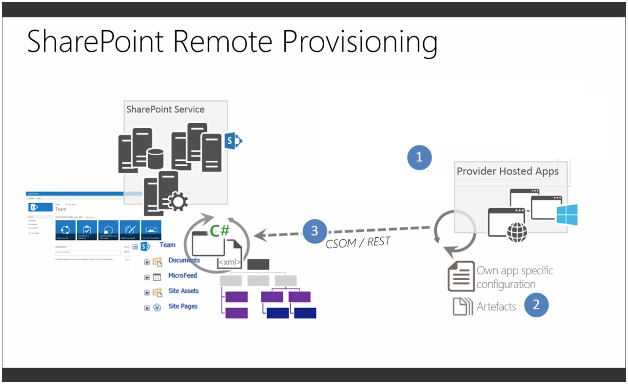

​**¿Por qué este nuevo modelo de desarrollo?**

En la versión Online, se hace evidente que el modelo tradicional de desarrollo, en el que predomina el código del lado del servidor, no es compatible para extender una plataforma multitenant en la que miles de usuarios comparten un mismo servidor, por lo que cualquier problema provocado por un código mal escrito podría afectar no solo a los usuarios de nuestra organización sino a otros muchos. Desde la propia Microsoft se ha confirmado que SharePoint Online ni soporta ni soportará nunca el despliegue de soluciones de tipo granja. Esto se une al hecho de que la suite de productividad de Office 365, de la que como se ha mencionado forma parte SharePoint Online, es una de las principales apuestas para el futuro de Microsoft, lo que se reflejará en un aumento cada vez mayor de la adopción de esta plataforma por parte de las empresas. Por ello, desarrollar soluciones que puedan ser compatibles con la misma se convierte casi en una obligación.

Siendo éste un motivo de suficiente peso como para adoptar esta nueva propuesta, no es el único. Hay otros motivos que llevarán a considerar este nuevo modelo de desarrollo no sólo como la única solución posible para extender SharePoint Online, sino también como una alternativa deseable para la versión OnPremise.

Por un lado, tenemos la oportunidad de generar soluciones que permitan la actualización y migración de versiones de SharePoint de una forma más sencilla, tanto entre versiones OnPremise, como de versiones OnPremise a Online. Por otro lado, con este nuevo modelo, se pretende minimizar los riesgos asociados a las soluciones de granja, que pueden causar caídas de rendimiento de los servidores provocadas por leaks de memoria o un mal uso de la API de servidor. Finalmente, un modelo de desarrollo basado en el despliegue de aplicaciones desde un catálogo corporativo, resolverá problemas como el downtime, que se produce cada vez que se despliega una solución de tipo granja en SharePoint.

**¿En qué consiste este nuevo modelo de desarrollo?**

Este nuevo modelo de desarrollo propone olvidar el modelo de soluciones de granja basadas en la API de servidor y adoptar un modelo que utilice código alejado del contexto de SharePoint. Para ello, las nuevas versiones de SharePoint han evolucionado de una forma muy importante sus APIs de cliente proporcionando una API REST, una API cliente en C# (CSOM) y otra API de cliente para JavaScript (JSOM).

Asimismo refuerza también el concepto de aprovisionamiento remoto, que nos propone usar las aplicaciones de SharePoint para, junto con las APIs mencionadas anteriormente, desplegar todos los elementos tales como listas, librerías de documentos, tipos de contenido, etc. o usar las mismas para la creación de sitios o personalizar su diseño, entre otras opciones. No obstante, no sólo se limita al uso de las aplicaciones de SharePoint, sino que también podremos usar el modelo de objetos de cliente tanto en scripts PowerShell, aplicaciones de consola, o características propias de Azure para extender remotamente SharePoint, tanto OnPremise como Online.

Además este modelo de desarrollo propone un cambio de filosofía a la hora de afrontar los proyectos. A partir de ahora, el desarrollo no se debe centrar tanto en la tecnología como en la funcionalidad y los requerimientos a los que hay que dar respuesta. Hasta ahora, con la API de servidor, se tenía acceso a todas las capacidades para extender SharePoint con los riesgos que esto podía suponer. Obviamente desde la API de cliente no se tienen disponibles todas las opciones, pero *¿quiere decir esto que solo podremos extender SharePoint con las opciones que permitan las APIs de cliente?*. Vamos a ver un ejemplo para responder a esta pregunta.

En el siguiente supuesto, se quiere implementar un *Timer Job*en SharePoint Online que procese una lista de elementos. Obviamente, desde la API de Cliente y para esta versión de SharePoint, no tenemos la oportunidad de crear *Timer Jobs*como sí podíamos hacer con la API de servidor y las soluciones de granja. Aquí es donde entra la idea de dejar de pensar en la tecnología, para pensar en la funcionalidad a la que queremos dar respuesta. ¿Qué es un *Timer Job*?. En resumen, es solo una tarea programada que hace un procesamiento en background sobre SharePoint. ¿Cómo podríamos cubrir esta funcionalidad?, bastaría con crear un *Worker Role de Azure* que usara la API de Cliente para hacer el procesamiento de la lista que deseamos con una programación establecida.

Por tanto, con la propuesta de este nuevo modelo, no solo es suficiente con conocer la API de Cliente. Es necesario conocer el abanico de posibilidades que nos ofrecen las API de SharePoint, las de Office 365, conocer Azure y sus oportunidades, etc. Esto permitirá saber en cada momento, cuales son las mejores opciones a emplear para resolver el requerimiento que se desea.

**¿Debemos dejar de utilizar el modelo tradicional?**

Cuando se piensa en desarrollar para SharePoint Online la respuesta a esta pregunta es obvia, pero no tanto cuando se va a abordar un proyecto de desarrollo sobre una plataforma OnPremise. La realidad es que no es obligatorio adoptar el nuevo modelo de desarrollo para la infraestructura OnPremise. Desde Microsoft se garantiza el soporte, al menos de momento, para las soluciones de granja. Sin embargo, por todas las ventajas de su uso, es recomendable adaptar progresivamente los desarrollos al nuevo paradigma.

No obstante, en el caso de que se opte, a la hora de desarrollar para SharePoint, por continuar trabajando con soluciones de granja, puede resultar interesante adaptar las mismas para aproximarlas, en la medida de lo posible, a las recomendaciones y buenas prácticas que nos sugieren con el nuevo modelo de desarrollo. Esto permitirá reducir algunos de los inconvenientes que provocan este tipo de soluciones.

A continuación vamos a ver qué cambios se podrían aplicar sobre una solución mediante un ejemplo en el que la intención es crear varias columnas de sitio y un tipo de contenido que usa las mismas.

***Desplegando Columnas de sitio y Tipos de Contenido vía XML***

Una primera aproximación para resolver este requerimiento, y que se ha hecho muy habitual en las soluciones de granja, gracias a las facilidades que proporciona Visual Studio, podría ser emplear ficheros XML donde se definieran estos elementos, como se ve a continuación, y después desplegar los mismos a través de características. En el siguiente ejemplo de código se puede ver la creación de columnas de sitio y tipos de contenido.

```
<?xml version="1.0" encoding="utf-8"?>
```

```
<Elements xmlns="http://schemas.microsoft.com/sharepoint/">
```

```
  <Field ID='{014AB8C6-02AA-41EC-B5A1-CD46668E6087}' Group="Ejemplo" Type='Number' Name='EjemploNumber1' DisplayName='EjemploNumero1' StaticName='EjemploNumber1' SourceID='http://schemas.microsoft.com/sharepoint/v3'/>
```

```
  <Field ID='{9F764C8E-D966-416D-8148-3CC0E4E88BDA}' Group="Ejemplo" Type='Text' Name='Ejemplo1' DisplayName='Ejemplo1' SourceID='http://schemas.microsoft.com/sharepoint/v3' StaticName='Ejemplo1' />
```

```
</Elements>
```

```
 
```

```
<?xml version="1.0" encoding="utf-8"?>
```

```
<Elements xmlns="http://schemas.microsoft.com/sharepoint/">
```

```
  <!-- Tipo de contenido primario: Elemento (0x01) -->
```

```
  <ContentType ID="0x01002b1edca8d3f94d9dbeb9ca8da78b2460"
```

```
               Name="EjemploTipoContenido"
```

```
               Group="Ejemplo"
```

```
               Description="Descripción de ejemplo de tipo de contenido"
```

```
               Inherits="TRUE"
```

```
               Version="0">
```

```
    <FieldRefs>
```

```
      <FieldRef ID='{014AB8C6-02AA-41EC-B5A1-CD46668E6087}' Name='EjemploNumero1' Required='TRUE'/>
```

```
      <FieldRef ID='{9F764C8E-D966-416D-8148-3CC0E4E88BDA}' Name='Ejemplo1' Required='TRUE' />
```

```
    </FieldRefs>
```

```
  </ContentType>
```

```
</Elements>
```

Como se puede ver en la Figura 1, esta aproximación tiene sus inconvenientes. Cuando usamos esta definición vía ficheros XML se crean dependencias con la base de datos de contenido que pueden dificultar la migración de las soluciones a nuevas versiones o nuevas granjas de servidores.



***Adaptando el modelo tradicional al nuevo modelo de desarrollo***

Los problemas de dependencias que se crean usando la aproximación anterior se pueden solucionar cambiando la forma en la que se despliegan los elementos. Cuando por cualquier motivo tenemos que seguir desarrollando soluciones de granja, en lugar de usar ficheros XML, aprovisionaremos los elementos por medio de código usando los *EventReceiver*de las características. En este caso usaremos el evento de activación de la característica de la siguiente forma.

```
public class Feature1EventReceiver : SPFeatureReceiver
```

```
{
```

```
    public override void FeatureActivated(SPFeatureReceiverProperties properties)
```

```
    {
```

```
        SPSite site = properties.Feature.Parent as SPSite;
```

```
        using (SPWeb web = site.OpenWeb())
```

```
        {
```

```
            Helper.CreateTextColumn(web, "Ejemplo1");
```

```
            Helper.CreateNumberColumn(web, "EjemploNumero1");
```

```
 
```

```
            Helper.CreateContentType(web, "EjemploTipoContenido","Descripcion de ejemplo de tipo de contenido","Ejemplo");
```

```
            Helper.AddColumnToContentType(web, "EjemploTipoContenido", "Ejemplo1",true);
```

```
            Helper.AddColumnToContentType(web, "EjemploTipoContenido", "EjemploNumero1",false);
```

```
        }
```

```
    }
```

```
} 
```

Con esto, como se aprecia en la siguiente imagen, además de crear las columnas de sitio y tipos de contenido sin dependencias, se avanza en el cambio de filosofía que nos lleva al ya comentado aprovisionamiento de los distintos elementos por medio de código. Esta técnica es recomendable que sea usada para desplegar todos los elementos propios de SharePoint como podrían ser Listas, Bibliotecas de documentos, etc.


**Evolucionando hacia el nuevo modelo de desarrollo de SharePoint**

La solución al requerimiento anterior, siguiendo el nuevo modelo, consistiría en el desarrollo de una *Aplicación Provider-Hosted de SharePoint*, que podría ser una aplicación ASP.NET, ya sea *WebForm*o *MVC*. Esta aplicación tendrá la opción de aprovisionar remotamente los elementos deseados por medio de un botón que va a usar la API Cliente. Para el ejemplo que se verá a continuación, y por simplicidad, se creará una aplicación Provider-Hosted de tipo WebForms en la que toda la funcionalidad se encontrará en el evento asociado al botón que se ha añadido a la misma. El código del evento podría ser el que se muestra a continuación.

```
var spContext = SharePointContextProvider.Current.GetSharePointContext(Context);
```

```
 
```

```
                using (var clientContext = spContext.CreateUserClientContextForSPHost())
```

```
                {
```

```
                    Web web = clientContext.Site.RootWeb; 
```

```
                    web.Fields.AddFieldAsXml("<Field ID='{014AB8C6-02AA-41EC-B5A1-CD46668E6087}' Group='Ejemplo' Type='Number' Name='EjemploNumero1' DisplayName='EjemploNumber1' StaticName='EjemploNumber1' SourceID='http://schemas.microsoft.com/sharepoint/v3'/> ", false, AddFieldOptions.AddFieldInternalNameHint);
```

```
                    web.Fields.AddFieldAsXml("<Field ID='{9F764C8E-D966-416D-8148-3CC0E4E88BDA}' Group='Ejemplo' Type='Text' Name='Ejemplo1' DisplayName='Ejemplo1' SourceID='http://schemas.microsoft.com/sharepoint/v3' StaticName='Ejemplo1' />", false, AddFieldOptions.AddFieldInternalNameHint);
```

```
                    clientContext.ExecuteQuery();
```

```
                    var parentContentTypes = clientContext.LoadQuery(web.ContentTypes.Where(ct => ct.Name == "Elemento"));
```

```
                    clientContext.ExecuteQuery();
```

```
 
```

```
                    ContentType parentContentType = parentContentTypes.FirstOrDefault();
```

```
 
```

```
                    if (parentContentType != null)
```

```
                    {
```

```
                        web.ContentTypes.Add(new ContentTypeCreationInformation
```

```
                        {
```

```
                            Name = "EjemploTipoContenido",
```

```
                            Group = "Ejemplo",
```

```
                            Description = "Descripción de ejemplo de tipo de contenido",
```

```
                            ParentContentType = parentContentType
```

```
                        });
```

```
                        clientContext.ExecuteQuery();
```

```
                    }
```

```
                    else
```

```
                    {
```

```
                        throw new InvalidOperationException("Item Content Type not found");
```

```
                    } 
```

```
                    Field ejemplo1 = web.Fields.GetByInternalNameOrTitle("Ejemplo1");
```

```
                    Field ejemploNumber1 = web.Fields.GetByInternalNameOrTitle("EjemploNumero1");
```

```
 
```

```
                    var createdContentTypes = clientContext.LoadQuery(web.ContentTypes.Where(ct => ct.Name == "EjemploTipoContenido"));
```

```
                    clientContext.ExecuteQuery();
```

```
 
```

```
                    ContentType createdContentType = createdContentTypes.FirstOrDefault();
```

```
                    createdContentType.FieldLinks.Add(new FieldLinkCreationInformation
```

```
                    {
```

```
                        Field = ejemplo1
```

```
                    });
```

```
                    createdContentType.FieldLinks.Add(new FieldLinkCreationInformation
```

```
                    {
```

```
                        Field = ejemploNumber1
```

```
                    });
```

```
                    createdContentType.Update(true);
```

```
                    clientContext.ExecuteQuery();
```

```
                }
```

Del mismo modo que en los casos anteriores, en la Imagen 3 se muestra, el esquema de despliegue de elementos del modelo basado en aprovisionamiento remoto y APIs de cliente.



Se trata de un ejemplo sencillo para el aprovisionamiento remoto de elementos tales como columnas de sitio y tipos de contenido. Para facilitar a los desarrolladores la adopción de este nuevo modelo se dispone del mejor repositorio de código mantenido por la propia Microsoft, y cuya visita puede resultar muy interesante para ver qué se puede hacer con las APIs de cliente y cómo resolver casi cualquier situación. Se trata del repositorio de GitHub de**Pattern & Practices de Office 365** cuyo enlace se recoge en la bibliografía del artículo.

**Conclusiones**

La propuesta de Microsoft de avanzar hacia este nuevo paradigma para el desarrollo de soluciones nos provoca, a muchos desarrolladores de SharePoint, un necesario cambio de filosofía y concepto  a la hora de afrontar nuestros proyectos. Este cambio supone un reto, que nos obligará a conocer mejor las tecnologías de Front-End, MVC .NET, Azure, etc. Así como a volver a trabajar sobre aspectos como el ALM de nuestras soluciones. Un reto que por otro lado, nos ayudará a abrir nuestro abanico de posibles soluciones a los requerimientos de nuestros clientes. Obviamente, si bien el modelo de apps, está aquí para quedarse, aún tiene que evolucionar y mejorar en muchos aspectos. No obstante, creo que resultará muy interesante y todas las oportunidades que nos ofrece nos ayudarán a estar al día, en toda la vorágine de cambios en la que Microsoft y sus productos estrella, se encuentran inmersos. En próximos artículos seguiremos avanzando en aspectos como el aprovisionamiento remoto de sitios o aspectos tan cuestionados como el branding.


**Bibliografía**

- [https://jcgonzalezmartin.wordpress.com/2015/02/12/sharepoint-2013-sharepoint-online-cambios-en-el-empaquetado-y-despliegue-de-soluciones-i/](https&#58;//jcgonzalezmartin.wordpress.com/2015/02/12/sharepoint-2013-sharepoint-online-cambios-en-el-empaquetado-y-despliegue-de-soluciones-i/)
- [http://www.microsoftvirtualacademy.com/training-courses/transform-sharepoint-customizations-to-sharepoint-app-model](http&#58;//www.microsoftvirtualacademy.com/training-courses/transform-sharepoint-customizations-to-sharepoint-app-model)
- [https://github.com/OfficeDev/PnP/wiki](https&#58;//github.com/OfficeDev/PnP/wiki)
- [http://blog.mastykarz.nl/programmatically-creating-site-columns-content-types-app-model/](http&#58;//blog.mastykarz.nl/programmatically-creating-site-columns-content-types-app-model/)

 

**José Carlos Rodríguez Avilés**
Analista Programador en Soluciones de SharePoint en UCI 
[josecarlos.rodriguez@uci.com](mailto&#58;josecarlos.rodriguez@uci.com) 
@jcroav 
[http://elblogdelprogramador.wordpress.com](http&#58;//elblogdelprogramador.wordpress.com/)

