import ArticleHeader from '../../../components/article-header'

<ArticleHeader frontmatter={props.pageContext.frontmatter} />

​Azure Site Recovery es el servicio de recuperación que contribuye a la continuidad de negocio a la estrategia de recuperación ante desastres (BCDR) orquestando la replicación, la conmutación por error y recuperación de máquinas virtuales y servidores físicos. Este servicio, cuya capacidad y versatilidad está más que comprobada en entorno multihost (*Enterprise to Enterprise* E2E) o híbridos (*Enterprise to Azure* E2A) se ha enriquecido en los últimos tiempos con la adquisición por parte de Microsoft de InMage. Este software permite la salvaguarda de prácticamente cualquier plataforma, pero en particular viene a resolver un caso que a menudo nos encontramos en muchos clientes: La plataforma de virtualización VMWare.

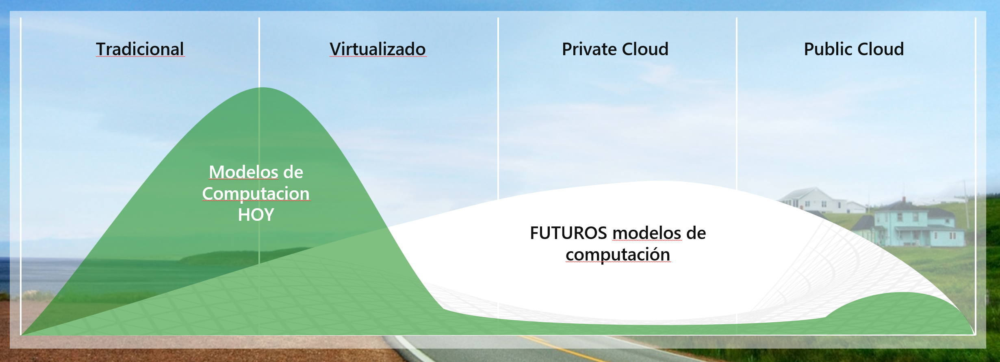

Muchos clientes, en su etapa de virtualización, virtualizaron sus máquinas sobre plataformas host VMWare. Esta situación, hasta ahora, ha sido un impedimento para proteger sus máquinas con Azure Site Recovery, y en muchos casos ralentizaba su adopción por la necesidad de convertir de forma manual sus máquinas antes de ser subidas a la nube. Mediante el uso de InMage, y de nuevas herramientas que hay en camino nacidas de la integración entre ambos servicios, este camino ha sido allanado, y en este artículo vamos a hablar sobre cómo implementar Site Recovery en Azure para proteger VMs alojadas en un VMWare ESXi.

Algunas de las ventajas que ofrece son:

- Replicación simple, conmutación por error y recuperación con el portal de Azure sitio de recuperación.
- La replicación de datos a través de Internet, una conexión de sitio a sitio VPN, o sobre Azure ExpressRoute.
- La conmutación por recuperación (restauración) de Azure a una infraestructura de VMWare en las instalaciones.
- Consistencia multi-VM para que las máquinas virtuales y servidores físicos que ejecutan cargas de trabajo específicas se pueden recuperar junto a un punto de datos consistente.
- Los planes de recuperación para la conmutación por error simplificada y la recuperación de las cargas de trabajo escalonados en varios equipos.

**Arquitectura de la solución**

Para empezar, un pequeño mapa de cómo va a funcionar:

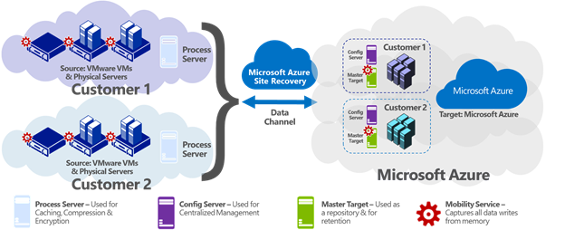

- **Máquinas On-Premise** 
Las máquinas On-Premise a proteger, que pueden ser principalmente de dos tipos: Máquinas físicas, o máquinas virtuales que se ejecutan en un hipervisor VMWare ESXi.

- **Servidor de proceso On-Premise**
Las máquinas protegidas envían datos de replicación al servidor de proceso, el cual realiza una optimización sobre estos datos y los envía al servidor maestro de destino en Azure. Este servidor cuenta con una memoria caché basada en disco para almacenar en los datos de replicación recibidos y también se encarga de coordinar los diferentes agentes del servicio de movilidad que se deberán instalar en cada máquina virtual o servidor físico que se desee proteger. Además, también se encarga de realizar la detección automática de servidores VMWare vCenter. 

El servidor de proceso debe ser un servidor virtual o físico Windows Server 2012 R2 y se recomienda que esté situado en el mismo segmento LAN y red que las máquinas a proteger, aunque es posible ejecutarlo en una red diferente siempre y cuando las máquinas protegidas tengan visibilidad con el servidor. Durante despliegue podrás configurar el servidor de procesos e inscríbete para el servidor de configuración.

- **Servicio de Almacenamiento de Azure Site Recovery**
También denominado Vault o bóveda, el servicio de almacenamiento sirve tanto como repositorio de las imágenes (apoyándose en un blob storage), validador de seguridad, y gestor de failover y recuperación, todo de una forma integrada y sencilla, como un servicio de Azure.

- **Servidor de Configuración**
El servidor de configuración coordina la comunicación entre las máquinas protegidas, el servidor de procesos y los servidores de destino en Azure. Para ello, establece la replicación y coordina la recuperación en Azure cuando se produce una conmutación por error. El servidor de configuración se ejecuta en una máquina virtual Azure Standard A3 dentro de la misma subscripción Azure en la que se ha establecido el Servicio de Almacenamiento, y durante el despliegue es necesario configurar el servidor e inscribirlo en el Servicio de Almacenamiento de Azure Site Recovery por medio de una key de seguridad.

- **Servidor****Maestro****Destino**

> El servidor maestro de destino posee los datos replicados de sus máquinas protegidas utilizando VHD adjuntos creados en el almacenamiento de blob en su cuenta de almacenamiento Azure. Un servidor maestro se puede implementar como una máquina virtual Azure ejecutando Windows 2012 R2 y basado en una de las imágenes de la galería cuando se van a proteger máquinas Windows, y como una servidor OpenLogic CentOS 6.6 cuando se van a proteger máquinas Linux. Para ambos casos, las opciones de dimensionamiento son A3 de la serie estándar, o D14 de la serie D. Este servidor debe estar conectado a la misma red de Azure que el servidor de configuración, y también ha de ser registrado en el servicio de Almacenamiento, y en el servidor de configuración.

- **Agente de Movilidad**
El agente de movilidad (InMage) se instala en cada servidor físico o máquina virtual VMWare que se desea proteger, y es el encargado de enviar los datos de replicación al servidor de procesos, que a su vez los envía al servidor maestro de destino en Azure. El servidor de proceso puede instalar automáticamente el agente de movilidad en las máquinas protegidas, o se puede desplegar el servicio manualmente descargándolo desde el servicio de almacenamiento. 

Para la comunicación de datos y el canal de replicación existen un par de opciones. En ninguno de los casos se requiere abrir puertos de red en las máquinas protegidas, por lo que la seguridad se mantiene en todos los casos:

Opción 1: A través de una conexión site-to-site: Este canal seguro permite la comunicación y replicación desde la red local hasta Azure a través de una conexión segura y cifrada mediante un protocolo de IpSec

Opción 2: A través de una conexión ExpressRoute: Para los casos en los que se estima que existirá una alta demanda de traspaso de información hacia/desde la nube, y se requieren unos estándares muy altos de seguridad, es posible establecer la conexión VPN a través de ExpressRoute, la cual ejerce como una fibra negra entre nuestros entornos On-Premise y la nube y requiere ser contratada a través de un ISP Provider

**Manos a la obra**

Ya hemos repasado la teoría que sustenta la conexión, pero ahora, vamos a configurar una conexión segura.

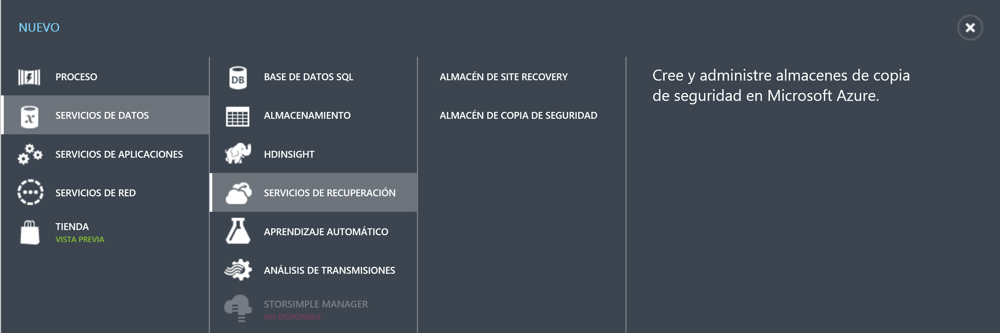

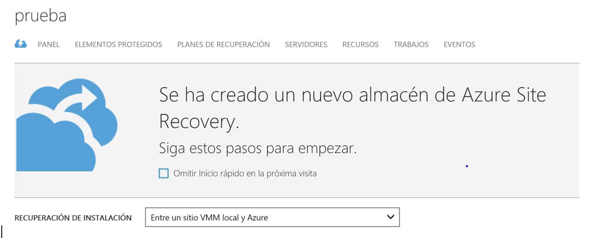

Nos descargamos la versión más reciente de Azure Site Recovery para el servidor de Configuración.

**Nota:** Cada vez que se descarga una clave de registro, se genera una nueva y solo la última será la valida.

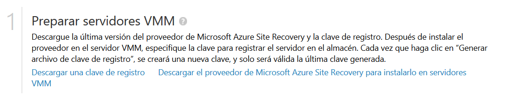

Añadimos una cuenta de almacenamiento. Debe ser con geo-redundancia activa en la misma región que la vault.

En este paso también vamos a instalar el agente del servidor de Proceso On-Premise

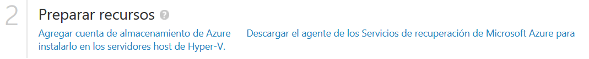

Debemos indicar la IP interna así como la URL del servidor de configuración por HTTPS

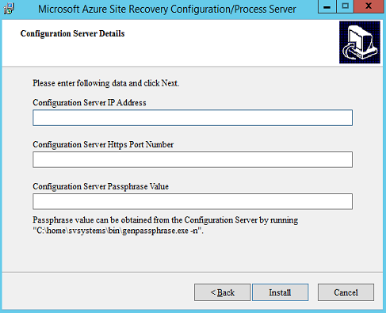

Una vez registrado veremos una pantalla como esta:

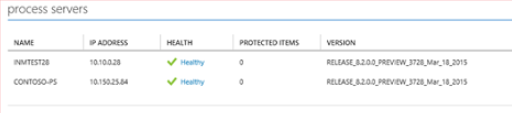

Configuramos la nube que va albergar las máquinas virtuales.

Nos descargamos el agente y lo instalamos en las VMs que vamos a proteger

Una vez instalado los agentes los veremos en la consola

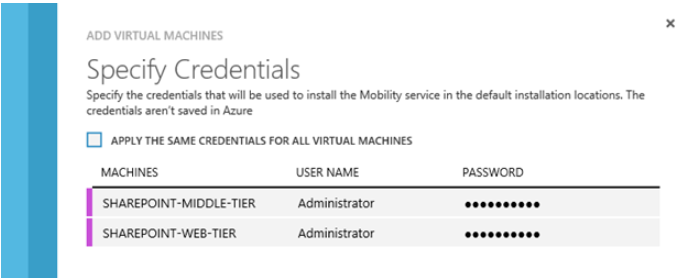

Asignamos las redes de destino para las VMs tras la conmutación por error

Activamos la protección de las VMs ubicadas en la nube VMM

y por último, definimos el plan de recuperación, y lanzamos un test para comprobar que todo funciona adecuadamente

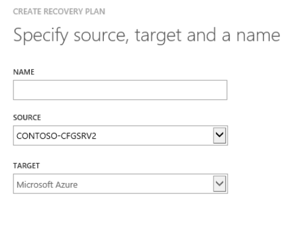

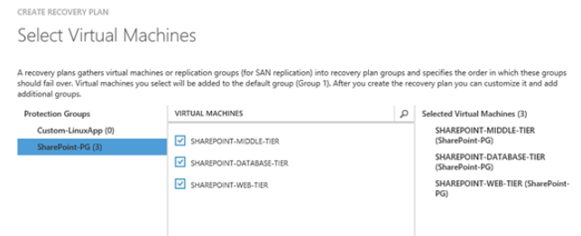

Una vez lanzado podemos ver usar la pestaña de Trabajos para seguir el proceso de replicación.

y eso es todo! esperamos que os haya parecido sencillo y si tenéis cualquier duda sobre el detalle del proceso, podéis aprovechar y escribirnos a cualquier de los dos autores

**Fabián Calvo Valmorisco**
 Gerente Soluciones Cloud Encamina
 [fcalvo@encamina.com](mailto&#58;fcalvo@encamina.com) 
@rainfc
 [https://blogs.encamina.com/elsextosharepoint](https&#58;//blogs.encamina.com/elsextosharepoint)

**Israel Urrea Carballo**
 Consultor Infraestructuras y Cloud Encamina
 [iurrea@encamina.com](mailto&#58;iurrea@encamina.com)

@israurrea

