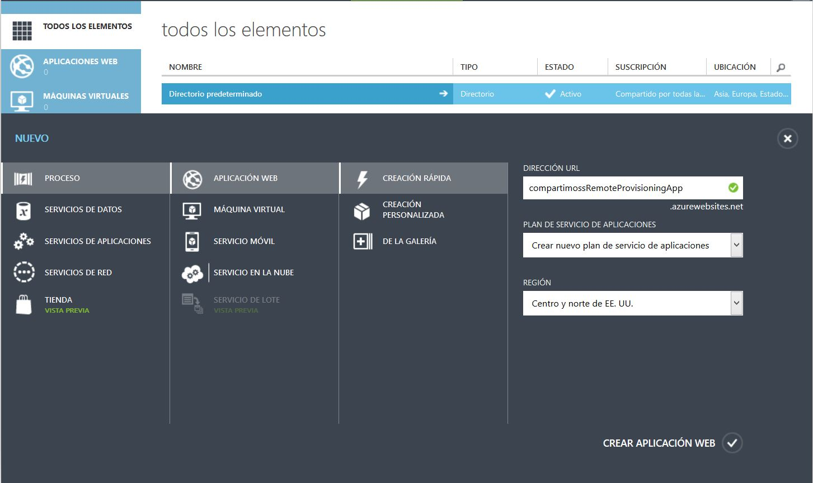
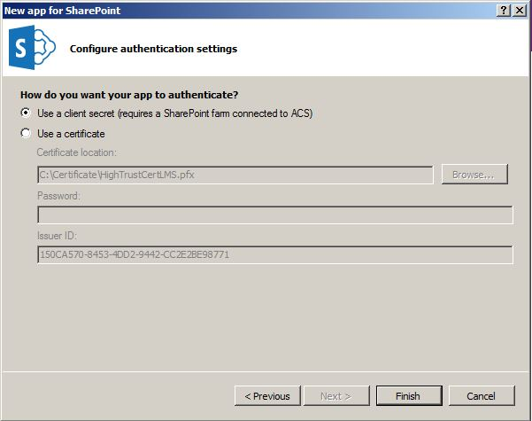

​Como parte de la estrategia de Microsoft de mover todos sus productos/clientes hacia la nube, ha hecho una serie de recomendaciones a los desarrolladores entre las que se encuentra el hecho de tratar de abandonar el clásico modelo de desarrollo basado en Features, para comenzar a pensar en el modelo de aprovisionamiento remoto ([Remote Provisioning](http://blogs.msdn.com/b/vesku/archive/2013/08/23/site-provisioning-techniques-and-remote-provisioning-in-sharepoint-2013.aspx)).

Si bien existen varias formas de aplicar este patrón de desarrollo (entre las que se encuentran Scripts en PowerShell o Aplicaciones de consola) en esta serie de artículos vamos a utilizar el modelo de Aplicaciones de SharePoint 2013, específicamente aplicaciones de tipo Provider-Hosted. Vale aclarar que este patrón también se puede aplicar utilizando aplicaciones de tipo SharePoint-Hosted, a través del uso de REST / JSOM en el lado del cliente desde código JavaScript.

Comenzaremos haciendo una breve introducción a los dos tipos de aplicaciones disponibles: SharePoint-hosted y provider-hosted.

*Hasta hace poco existía una tercera solución, auto-hosted, pero nunca salió de la versión "Preview" y fue abandonada en junio de 2014.*

Entre algunas de las diferencias que tienen estos dos tipos de aplicaciones encontramos que las SharePoint-Hosted solamente pueden contener código JavaScript, ya que se ejecutan en el navegador, mientras que las Provider-Hosted tienen al menos un componente que se hospeda de forma externa a la granja de SharePoint o la suscripción de SharePoint Online, permitiéndonos ejecutar código de servidor.

Las Aplicaciones **SharePoint-Hosted** se instalan en un web site llamado Host Web. A su vez todos los recursos se hospedan en un sub sitio aislado del Host Web, denominado App Web. Es importante tener clara la diferencia entre el host web y el App Web. Este tipo de hospedaje nos permite poder autenticar a los usuarios con el mismo nivel de autorización que maneja la granja.

Las Aplicaciones **Provider-Hosted** también son instaladas en el Host Web, pero sus componentes remotos son alojados en otro servidor externo a la granja. El proceso de autenticación que se lleva a cabo es OAuth.

Vamos a comenzar desarrollando nuestra aplicación provider-hosted. Lo primero que vamos a hacer es configurar Azure creando un nuevo web site.

- Accedemos al panel de control y hacemos clic en la opción "Nuevo" / "Aplicación Web" / "Creación Rápida".

- Especificamos una URL y hacemos clic en "Crear Aplicación Web". Esperamos unos segundos y el sitio se habrá creado correctamente.
- Una vez que tenemos creado el sitio en Azure el cuál utilizaremos para hospedar nuestra aplicación, debemos descargar el "**Perfil de Publicación**" ya que lo vamos a necesitar más adelante para poder publicar nuestra aplicación desde Visual Studio.

- A su vez, vamos a necesitar crear un sitio de desarrollo (**Developer Site**) en nuestro SharePoint Online (Office 365), el cuál utilizaremos para poder instalar nuestra aplicación.

- Cuando hayamos creado nuestro sitio en SharePoint, vamos a proceder a registrar nuestra aplicación manualmente y generar el Client Id y el Client Secret (requerido para la autentificación a través de ACS).
- Ambos valores son usados por OAuth para enlazar nuestra aplicación hospedada en Azure con SharePoint Online.
- Navegamos a la siguiente URL: *https://&lt;your site&gt;/\_layouts/15/appregnew.aspx*

​

- Generamos el "Id del cliente" y la "Clave secreta del cliente" de manera aleatoria haciendo clic en el botón "Generar". El Id del cliente es un Guid que identifica la App de manera única. Mientras que la "Clave Secreta del cliente" es una clave que utiliza SharePoint para validar los permisos de nuestra aplicación.
- También seteamos el título de nuestra aplicación, el domino (nuestro sitio en Azure) y una dirección de redireccionamiento (nuestro sitio en Azure con https).  El resultado será el siguiente:

Ahora ya estamos listos para crear nuestra aplicación desde Visual Studio. En mi caso para este ejemplo voy a utilizar Visual Studio 2012 con "Microsoft Office Developer Tools" instalado.

- Creamos un nuevo proyecto, seleccionamos el template "App for SharePoint 2013" y configuramos las características de nuestra App.
- Debemos de especificar un nombre a nuestra aplicación, la dirección de nuestro sitio de SharePoint y seleccionamos la opción de "Provider-hosted".

- Luego debemos de seleccionar la forma de autentificación. En nuestro caso vamos a seleccionar "Client Secret" ya que utilizaremos el servicio ACS (Access Control Service) disponible en Azure.

Finalmente se crean dos proyectos:

- Un proyecto de SharePoint: desde donde vamos a poder configurar nuestra App.
- Un proyecto Web: donde se aloja el código y las páginas de nuestra App.

Antes de publicar nuestra app debemos de configurar algunas cosas:

- Hacemos clic en el botón derecho del mouse, sobre el AppManifest.xml y seleccionamos la opción "View Code".
- Remplazamos el "\*" en la siguiente línea con nuestro "Id del cliente" (generado cuando registramos al App en SharePoint).
&lt;RemoteWebApplication ClientId="\*" /&gt;

- En "StartPage" cambiamos la URL de la aplicación Web, utilizando nuestro dominio del sitio de Azure + /pages/default.aspx?\{StandardTokens\}

- Abrimos el Web.config del proyecto Web y seteamos el "ClientId" y el "ClientSecret" con los generados anteriormente.

- Modificamos la página "Default.aspx"  tradicional de ASP.NET y agregamos el código que queramos.
- Finalmente, hacemos clic derecho en el proyecto web y elegimos la opción de publicar "Publish". En este punto es donde vamos a utilizar el "Perfil de Publicación" que guardamos cuando creamos nuestra aplicación web desde Azure.

- Importamos el perfil de publicación y hacemos clic en "Publish".
- Ahora debemos de volver a la consola de administración de Azure y crear las entradas "ClientId" y "ClientSecret" en la configuración de aplicaciones.

- Finalmente volvemos a Visual Studio y presionamos F5 para hacer deploy de nuestra aplicación en SharePoint Online.
- Se abrirá un popup del navegador preguntándonos si confiamos en nuestra aplicación: Obviamente le decimos que si confiamos, y seremos redirigidos a nuestra App y deberíamos de ver el título de nuestra página (y en mi caso, otro texto que le agregué).

A su vez, en el contenido del sitio de SharePoint deberíamos de tener acceso a nuestra aplicación.

**Conclusión**

Sin perder el foco en la recomendación de Microsoft de tratar de abandonar el clásico modelo de desarrollo basado en Features, para comenzar a pensar en el modelo de aprovisionamiento remoto, ahora que ya tenemos nuestra aplicación Provider-Hosted hospedada en Azure, en el próximo artículo veremos la codificación necesaria para crear un ejemplo de aprovisionamiento remoto.

**JOSE LUIS EROSA**
 SharePoint Solution Architect en Siderys & BSN 
[jlerosa@hotmail.com](mailto:jlerosa@hotmail.com)

 
 
import LayoutNumber from '../../../components/layout-article'
export default LayoutNumber
