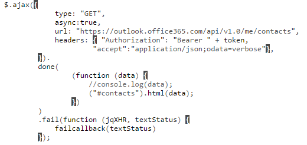
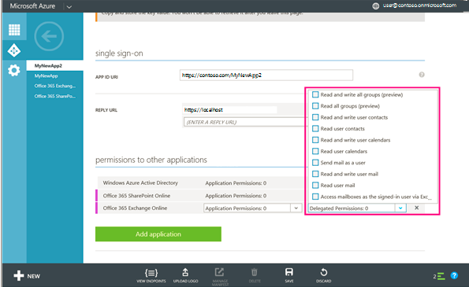
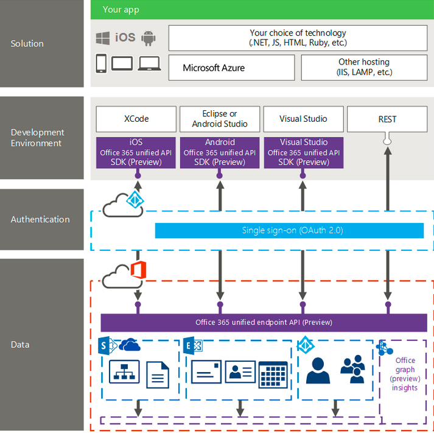

import ArticleHeader from '../../../components/article-header'

<ArticleHeader frontmatter={props.pageContext.frontmatter} />

​La plataforma de aplicaciones y servicios en la nube llamada Office 365, está siendo potenciada desde hace tiempo por Microsoft, ya sabemos que ventajas nos aporta un servicio. Principalmente nos ayuda a ahorrar costes en infraestructura y mantenimientos. A continuación, describiremos que tipo de aplicaciones podemos desarrollar y cómo funciona la API.

**Tipo de Aplicaciones**

En la siguiente tabla podemos ver los diferentes tipos de aplicaciones que podemos desarrollar agrupado por plataforma. Como podemos ver tenemos una gran variedad y eso nos permite interconectarnos con casi cualquier tecnología, incluso lenguajes Open Source.

| **Móvil** | **Escritorio** | **Web** |
| --- | --- | --- |
| iOS | Windows 8 | .Net |
| Android | Windows 10 | JavaScript |
| WP8 |   | Php ,Phyton , etc ... |

**Office 365 API**

A continuación, pasaremos a detallar que tipo de información tenemos disponible para su consumo, qué características tienen y cómo funciona la seguridad.

**Información**

La información accesible es la que podemos ver a continuación, juntamente sobre qué servicio se está consumiendo.

| **Exchange Online** | **Azure AD** | **SharePoint y OneDrive** |
| --- | --- | --- |
| Correos | Grupos | Archivos |
| Contactos |   | Sitios |
| Calendarios |   |   |

**Características**

Como hemos podido observar en el cuadro anterior, tenemos diferentes puntos de acceso dependiendo de la información y al servicio que estemos atacando, en el caso de Office365 API Preview que explicaremos más adelante no es necesario. En el caso de tener diferentes tenant, necesitaremos usar el servicio Discovery que nos obtendrá el punto de acceso para obtener la información correspondiente.

Aunque tenemos el Azure AD que nos proporciona la autenticación, necesitamos gestionar el token de acceso de manera separada para cada servicio antes mencionado.

**Seguridad**

A continuación, vamos a describir que seguridad posee la API y cómo funciona el flujo de autenticación.

**Autenticación**

La API posee single sign on y OAuth 2.0, sistema basado en tokens y todo esto es gestionado por Azure Active Directory.

**Flujo de Autenticación**

1. El usuario accede a una página o aplicación que consume información de Office 365, y este es redirigido a la página de autenticación de Azure.
2. El usuario introduce sus credenciales y consiente en el caso que se necesiten permisos. Azure AD emite un código de autorización.
3. La aplicación envía el código de autorización a Azure AD y este le devuelve el acceso y el token.
4. La aplicación ya puede acceder a la información del usuario a través del token.

**Desarrollo Office 365**

A continuación, vamos a hablar de la parte más enfocada al desarrollo, que Servicios necesitamos, Herramientas y cómo funciona la API con ejemplos.

**Servicios**

Estos son los servicios mínimos que vamos a necesitar para poder desarrollar una aplicación para Office 365:

- Office 365 API Setup.
- Office 365 Account:
    - Enterprise.
    - Education.
    - Developer.
    - Business.
- Azure AD.

**Herramientas**

Sera necesario un IDE para poder desarrollar, en este caso tenemos un abanico de posibilidades bastante amplio.

- Visual Studio.
- Eclipse / Android Studio.
- Xcode.
- Sublime.
- Etc.

**API**

Dentro del API tenemos dos variantes, el **SDK** y el servicio **REST**.

**SDK**

Es una librería específica por tecnología que nos provee de un modelo de objetos para obtener la información. Tendríamos:

- Visual Studio Office 365 SDK.
- I0S Office 365 SDK.
- Android Office 365 SDK.

***Ejemplo***

- Obtenemos el token de Acceso

- Obtenemos los contactos del usuario Ordenados por el Nombre

**REST**

Es un servicio multiplataforma que nos permite acceder a la información desde cualquier plataforma.

***Ejemplo***

- Obtenemos el token de Acceso:

- Obtenemos los contactos del usuario

**Registro una aplicación**

Hay dos maneras de registrar nuestra aplicación en Azure AD para gestionar la seguridad y la autenticación. Dependiendo el IDE que usemos tendremos que usar una u otro. En el caso de Visual Studio podremos usar el modo automático o manual, en el caso del resto de IDE's será manual.

**Manual**

Los pasos a seguir para registrar una aplicación de forma manual en Azure AD son los siguientes:

- Registrar la aplicación.
- Configurar las propiedades.
- Seleccionar Servicio.
- Seleccionar los permisos.

**Automático**

Los pasos a seguir para registrar una aplicación de forma automática por medio de Visual Studio son:

- Añadir Servicio Conectado.

**Office 365 API Preview**

Esta es una de las novedades respecto a la actual API de office 365, es la nueva versión, ya es posible utilizarla, aunque no es recomendado para entornos de producción aún. Las mejoras que nos aporta esta versión son principalmente:

- **Unificación de los puntos de acceso**, ya no es necesario saber a qué servicio quieres consumir la información, ya que lo hace de forma transparente, además no es necesario obtener un token para cada servicio, sino que es un único token para todos.
- **Se añaden más servicios**, como es el caso de Office Graph, donde podremos obtener información de los usuarios y las relaciones entre los documentos y la organización.

**Ejemplo:**

Llamada predefinida para obtener la información del usuario, donde ya no es necesario usar el punto de acceso del servicio.

Obtención de los mensajes del Usuario:

**Conclusiones**

A partir de la información anterior podemos ver que es posible desarrollar con  cualquier tecnología, nos aporta la posibilidad de un desarrollo multiplataforma  y sabemos  que requisitos necesitamos para llevarlo a cabo. Lo más importante son las mejoras que están llegando y que vendrán más adelante y que cada vez están facilitando más el desarrollo.

**Rubén Toribio**
 SharePoint Architect en Tokiota
 **@rtoribiog**

