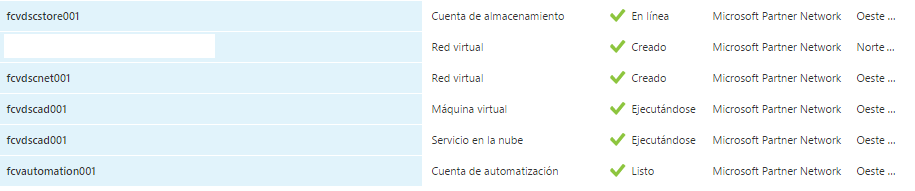
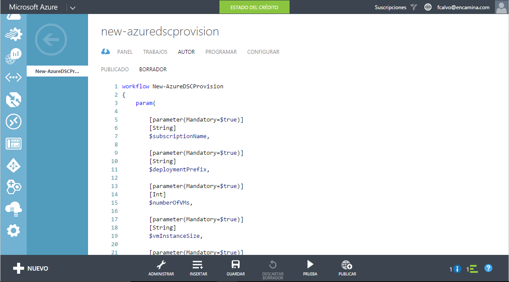

Al hilo de los dos últimos artículos de mi blog, sobre Azure Automation Service, descubrí una funcionalidad que se me había pasado por alto hasta ahora, llamada *Desired State Configuration* o DSC. Esta funcionalidad, que forma parte del estándar de Powershell 4.0, y está disponible desde Windows Server 2012 R2, permite a los servidores realizar un auto-aprovisionamiento durante el despliegue y/o un auto-arreglo cuando su configuración se desvía del estándar marcado. Esta funcionalidad está disponible como descarga gratuita para Windows Server 2008 R2 y 2012 dentro del Windows Management Framework 4.0

Esta funcionalidad, que a priori pudiera resultar poco atractiva, es muy útil cuando pensamos en el mundo de la nube, donde la velocidad y fiabilidad de aprovisionamiento de máquinas que cumplan determinados estándares es altamente requerida. DSC proporciona un framework estándar para definir y gestionar cambios de configuración, y proporciona una solución que puede ser replicada para gestionar grandes sistemas. ¡Todo son ventajas! Con esta funcionalidad podemos desde configurar roles y características, tanto en la plataforma Hyper-V, como en Azure (¡menos mal! Si no, no estaría escribiendo este artículo).

Con DSC se puede gestionar máquinas Windows Server tanto físicas, virtuales en hosts, como en plataformas de nube… digamos que solo en la de Azure y además, puede ser utilizado más allá de la plataforma Microsoft. Está construido sobre el estándar *Desktop Management Task Force* (DMTF), como el *Managed Object Format* (MOF) y el protocolo de servicios *WS-Management*. De esta manera, se integra de forma nativa con herramientas de terceros como Pupet, Chef y otras herramientas de gestión de la configuración del mundo Linux… y ahora también usadas como agentes en las máquinas virtuales de Azure.

**Prerequisitos para DSC**

Para poder hacer los ejemplos del presente artículo es necesario descargar e instalar los siguientes complementos:

- Powershell DSC Resource Kit: Este kit proporciona 40 nuevos módulos para DSC y proporciona recursos para configurar Directorio Activo, SQL Server, IIS, Hyper-V y otros. Puedes descargarlo desde https://gallery.technet.microsoft.com/DSC-Resource-Kit-All-c449312d, aunque lo están subiendo a GitHub
- Módulo Microsoft Azure Powershell: En este artículo lo utilizaremos para subir fichero DSC de configuración a una cuenta de almacenamiento desde la que enlazarlo a las máquinas virtuales recién creadas


**Programación Declarativa**

¿Qué es esto de Declarativa? En pocas palabras, es que en lugar de picarnos unos inacabables scripts de Powershell, vamos a declarar un estado final deseado para un servidor o conjunto de servidores, de forma que sea el propio sistema en encargado de "alcanzar" este estado. Cuando se le asigna un estado deseado a un servidor, este automáticamente compara su estado actual con el estado deseado y realiza todos los cambios de configuración necesarios para alcanzar el estado deseado, sin necesidad de escribir código. Cómodo ¿no?

Esto se consigue por medio de una nueva palabra reservada en Powershell 4.0, Configuration, que es usada para definir estados. La estructura sintáctica es muy similar a la de una función PowerShell, por lo que es fácil entender y seguir la sintaxis. Por ejemplo, a continuación, vamos a escribir la configuración para un servidor de SharePoint.

```
Configuration SharePointHost # Define the configuration name  {
```

```
    param ( $NodeName ) # Accept server names as parameters
```

```
    Node $NodeName # Begin block of configuration settings for each assigned server      {        
```

```
 #Install the Net Framework 4.5          WindowsFeature Net-Framework-Features          {              Ensure = "Present" # Can be "Present" or "Absent"              Name   = "Net-Framework-Features"          }
```

```
        #Install the Web Server          WindowsFeature Web-Server          {              Ensure = "Present" # Can be "Present" or "Absent"              Name   = "Web-Server"          }
```

```
        WindowsFeature Web-Common-Http         {              Ensure = "Present" # Can be "Present" or "Absent"              Name   = "Web-Common-Http"          }
```

```
        WindowsFeature Web-Static-Content         {              Ensure = "Present" # Can be "Present" or "Absent"              Name   = "Web-Static-Content"          }
```

```
        WindowsFeature Web-Default-Doc         {              Ensure = "Present" # Can be "Present" or "Absent"              Name   = "Web-Default-Doc"          }
```

```
        WindowsFeature Web-Dir-Browsing         {              Ensure = "Present" # Can be "Present" or "Absent"              Name   = " Web-Dir-Browsing"          }
```

```
 WindowsFeature Web-Dir-Browsing         {              Ensure = "Present" # Can be "Present" or "Absent"              Name   = "Web-Dir-Browsing"          } # ... completar las que faltan. El espacio en la revista no es infinito!!! 
```

```
    }  }
```

Este ejemplo (si lo completáis) asegura que todo servidor provisionado cumple con los prerrequisitos necesarios para desplegar un servidor de SharePoint, aunque no solo se pueden añadir características. Se pueden incluir recursos para manejar los siguientes conceptos:

- Habilitar o deshabilitar roles y características.
- Gestionar configuraciones de Registro.
- Gestionar Archivos y Características.
- Arrancar, para y gestionar proceso y servicios.
- Gestionar usuarios locales, y grupos.
- Desplegar nuevos paquetes de software.
- Gestionar variables de entorno.
- Ejecutar Scripts de PowerShell.


Una vez hayamos definido la configuración DSC, tenemos que ejecutar dos pasos para asignarla a los servidores en la que queramos ejecutarla:

1. Compilar la configuración definida en un conjunto de fichero MOF para cada servidor. Esto es posible realizarlo ejecutando la configuración, como si fuera una llamada a una función

**# Compile MOF files for each assigned server** 
 **SharePointHost -NodeName "SP2013SV1","SP2013SV12"**
2. Usar el cmdlet Start-DSCConfiguration para copiar el archivo MOF a cada uno de los servidores e invocar la configuración deseada

**# Copy MOF file to node(s) and invoke the configuration** 
 **Start-DSCConfiguration -Path .\****SharePointHost -Wait -Verbose –Force**


Cuando se lanza este comando, los ficheros MOF con copiados localmente a cada servidor y el motor *Local Configuration Manager* (LCM) los procesa. Como parte del proceso, el LCM va a hacer los cambios necesarios para que cada servidor designado cumpla con la configuración expresada en el archivo.

**Que usar, cuando y donde**

Hay tantas piezas que podemos utilizar para automatizar nuestros despliegues de IaaS (hablando del mundo Cloud, por ser el más dinámico y el más relacionado conmigo) que en ocasiones hay que decidir entre varias alternativas cual es la más adecuada para un determinado escenario. Sin querer ser dogmático aquí hay una clasificación que puede ser válida:

- Orquestar todo el proceso de aprovisionamiento con *Azure Automation.*
- Aprovisionar recursos de cloud fabric con *PowerShell Workflow Activites* usando *Azure Runbooks.*
- Configurar el sistema operativo y requisitos de aplicación dentro de las máquinas virtuales de Azure con *PowerShell DSC.*
- Publicar las configuraciones de Powershell DSC a una cuenta de *Azure Storage.*
- Usar los *Agentes* de Azure VM para aplicar las configuraciones de Powershell DSC.


Otra herramienta muy interesante es el *Azure Resource Management* (ARM) para manejar subconjuntos de recursos relacionados con dependencias entre sí.

**Ejemplo práctico: Aprovisionamiento extremo a extremo en Azure**

Vamos a hacer algo con todo lo que hemos visto. Partimos de una subscripción de Azure en la que tenemos al menos:

- Un grupo de afinidad: xxxdscag001 (substituir xxx por las iniciales de cada uno).
- Una cuenta de almacenamiento: xxxdscstor001.
- Red virtual: xxxdscnet001 (en el ejemplo, espacio 172.16.x.x).
- Servidor de AD en una máquina virtual: xxxdscad001 (en el ejemplo, 172.16.0.4).
- Una cuenta de Azure Automation (xxxautomation001).


Todos ellos configurados preferentemente en el mismo cpd. En el ejemplo Oeste de Europa.



En primer lugar, vamos a crear un nuevo Workflow en Azure Automation, al que denominaremos New-AzureDSCProvision, y al cual dotaremos de una serie de parámetros que nos servirán posteriormente para que podamos reutilizar el proceso. Estos parámetros, en los casos en los que el flujo se lance de forma manual, se pedirán por pantalla. En caso de ser lanzado de forma automatizada se los deberemos proporcionar. El código inicial es el siguiente:

```
workflow New-AzureDSCProvision {          param(                  [parameter(Mandatory=$true)]         [String]         $subscriptionName,                  [parameter(Mandatory=$true)]         [String]         $deploymentPrefix,                  [parameter(Mandatory=$true)]         [Int]         $numberOfVMs,                  [parameter(Mandatory=$true)]         [String]         $vmInstanceSize,                  [parameter(Mandatory=$true)]         [String]         $vmDomain,              [parameter(Mandatory=$true)]         [String]         $vmDomainNetBIOS           )
```

```
}
```

Así mismo, en el flujo introduciremos una serie de variables que utilizaremos para crear todas las máquinas

```
      # Obtener credenciales Azure    $cred = Get-AutomationPSCredential -Name 'AzureAutomationAccount'
```

```
   # Obtener credenciales del administrador de las máquinas    $vmAdmin = Get-AutomationPSCredential -Name 'AzureAdmin'        # Variables comunes    $storageName = $deploymentPrefix + 'store001'    $vmServiceName = $deploymentPrefix +'app'    $affinityGroupName = $deploymentPrefix + 'ag001'    $availabilitySetName = $deploymentPrefix + 'as'    $vNetName = $deploymentPrefix + 'net001'    $subnetName ='Subnet-1'    $dscArchive = 'ADSCSharePointHost.ps1.zip'   $dscConfigName = 'SharePointHost'   $vmInstanceSize = 'Large'
```

A continuación, vamos a introducir un bucle para crear todos los recursos necesarios (en este caso, las máquinas virtuales). Como la creación de recursos puede ser una tarea que se alargue en el tiempo, y para poder retomar el flujo en caso de error o suspensión del mismo, es conveniente utilizar los *Workflow-CheckPoint*, que nos permitirán retomar por donde lo dejamos. Así mismo, para la creación de las máquinas utilizaremos un bloque de inline-script, que se ejecutará de forma atómica

```
for ($i=1; $i -le $numberOfVMs; $i++)    {
```

```
        # Salvar estado del workflow         Checkpoint-Workflow                 # Conectar a la subscripción de Azure         Add-AzureAccount -Credential $cred
```

```
        Select-AzureSubscription `           -SubscriptionName $subscriptionName                  # Fijar la cuenta de almacenamiento         Set-AzureSubscription `           -SubscriptionName $subscriptionName `           -CurrentStorageAccountName $storageName
```

```
# Aprovisionar VM         InlineScript {                    $currentVM = "{0:D2}" -f $Using:i              $vmName = $Using:deploymentPrefix + 'app' + $currentVM              $vmImage = @((Get-AzureVMImage |                 Where-Object Label -like `                "Windows Server 2012 R2 Datacenter*").ImageName)[-1]              $vmAdmin = $Using:vmAdmin                     # Especificar nombre, imagen y tamaño              $vm = New-AzureVMConfig `                -Name $vmName `                -ImageName $vmImage `                -InstanceSize $Using:vmInstanceSize                    # especificar administrador local y credenciales para unirla al dominio              $vm = Add-AzureProvisioningConfig `                -VM $vm `                -WindowsDomain `                -AdminUserName $vmAdmin.Username `                -Password $vmAdmin.GetNetworkCredential().Password `                -JoinDomain $Using:vmDomain `                -Domain $Using:vmDomainNetBIOS `                -DomainUserName $vmAdmin.Username `                -DomainPassword `                  $vmAdmin.GetNetworkCredential().Password                             # Especificar subnet para las VM              $vm = Set-AzureSubnet `                -VM $vm `                -SubnetNames $Using:subnetName                        # Especificar Availability Set              $vm = Set-AzureAvailabilitySet `                -VM $vm `                -AvailabilitySetName $Using:availabilitySetName                # Provisionar la máquina con la configuración especificada              New-AzureVM `                -VMs $vm `                -ServiceName $Using:vmServiceName `                -VnetName $Using:vNetName `                -AffinityGroup $Using:affinityGroupName `                -WaitForBoot            }
```

```
   }
```

Y hasta aquí podemos *guardarlo, y probarlo*. Ahora mismo estamos en la situación en la que se van a crear las máquinas configuradas como nosotros creemos, pero *aún no les hemos aplicado la configuración que nosotros queremos*. Para cerrar el ejemplo, vamos a crear un fichero DSC con la especificación de máquinas para granja de SharePoint, de forma que sea tan solo instalar y configurar (que ¡oh casualidad! También podríamos hacerlo por PowerShell)



Para ello, los pasos a seguir van a ser un poco diferentes de los pasos que vimos en la parte inicial del artículo, ya que no disponemos de las máquinas creadas para generar los archivos MOF, ni podemos aplicarlos con *Start-DSCConfiguration*.

En primer lugar, cogeremos el fichero que creamos en el primer ejemplo del presente artículo, y lo salvaremos como fichero de PowerShell Script de nombre ADSCSharePointHost.ps1

A continuación, subiremos el fichero a una cuenta de almacenamiento desde la que podamos enlazar por medio de Azure Automation este archivo a las máquinas que vamos a crear con el Workflow. Para ello, vamos a ejecutar el siguiente script en una ventana de PowerShell ISE:

```
# Autenticar contra Azure Add-AzureAccount
```

```
# Seleccionar Subscripción y Cuenta de almacenamiento $subscriptionName = (Get-AzureSubscription).SubscriptionName |     Out-GridView `         -Title "Selecciona la subscripción" `         -PassThru   Select-AzureSubscription `     -SubscriptionName $subscriptionName   $storageName = (Get-AzureStorageAccount).StorageAccountName |     Out-GridView `         -Title "Selecciona la cuenta de almacenamiento" `         -PassThru   Set-AzureSubscription `     -SubscriptionName $subscriptionName `     -CurrentStorageAccountName $storageName
```

```
# Publicar el fichero de configuración a la cuenta de almacenamiento Publish-AzureVMDscConfiguration `     -ConfigurationPath .\ADSCSharePointHost.ps1 `     -Force
```

Durante la publicación, el fichero será convertido en un archivo .zip, junto con los módulos importados mediante *Import-Module* dentro del bloque de configuración. Por defecto, este fichero se dejará dentro de un contenedor denominado *Windows-PowerShell-dsc*, y ahí es donde deberemos ir a buscarlo.

Por último, para aplicarlo a las máquinas que creamos con el Workflow de Azure Automation, deberemos introducir en el script anterior, justo antes de la provisión de las máquinas, la asignación del fichero subido a la cuenta de almacenamiento como fichero de DSC mediante el siguiente trozo de script

```
…# Especificar la configuración DSC de la VM$vm = Set-AzureVMDSCExtension `    -VM $vm `    -ConfigurationArchive $Using:dscArchive `    -ConfigurationName $Using:dscConfigName 
```

```
# Provisionar la máquina con la configuración especificada…
```

Y ahora solo falta lanzar el Workflow y comprobar que, efectivamente, todas las máquinas provisionadas tienen todos los roles y características necesarias para montar una granja de SharePoint sobre ellas.

**Conclusiones**

A lo largo de este artículo hemos visto cómo podemos utilizar las herramientas de automatización a nuestro alcance para hacer nuestra vida, en el caso de que seamos administradores de sistemas, mucho más sencilla. Escenarios como el tener que provisionar unos entornos de desarrollo idénticos para un equipo grande, resultan mucho más sencillos, y con el ejemplo desarrollado, simplemente consistiría en cambiar nuestro fichero DSC, y trabajando una configuración en la que incluyéramos el despliegue desatendido de todas las herramientas que nos soliciten.

En todo caso, y para aquellos de vosotros que estéis interesado en este tipo de soluciones, os recomiendo que empecéis por el curso de Microsoft Virtual Academy llamado [Automating the Cloud with Azure Automation](https://www.microsoftvirtualacademy.com/en-US/training-courses/automating-the-cloud-with-azure-automation-8323). Os gustará, y os abrirá la mente a nuevas oportunidades… ¿para qué trabajar pudiendo darle a un botón?


**Fabián Calvo**
 Gerente Soluciones Cloud & Pseller

[fcalvo@encamina.com](mailto:fcalvo@encamina.com) 
@fcvspain

[http://blogs.encamina.com/sextosharepoint/](http://blogs.encamina.com/sextosharepoint/) 
[http://www.encamina.com](http://www.encamina.com/)

​

