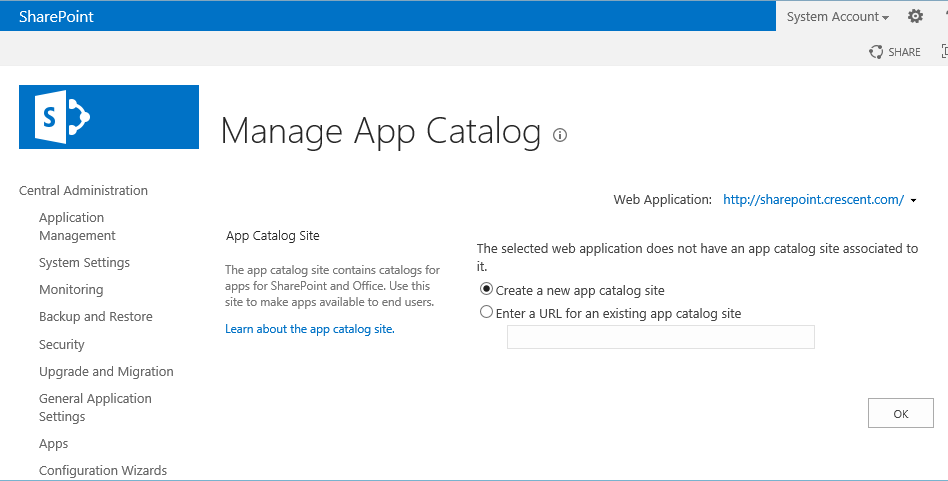
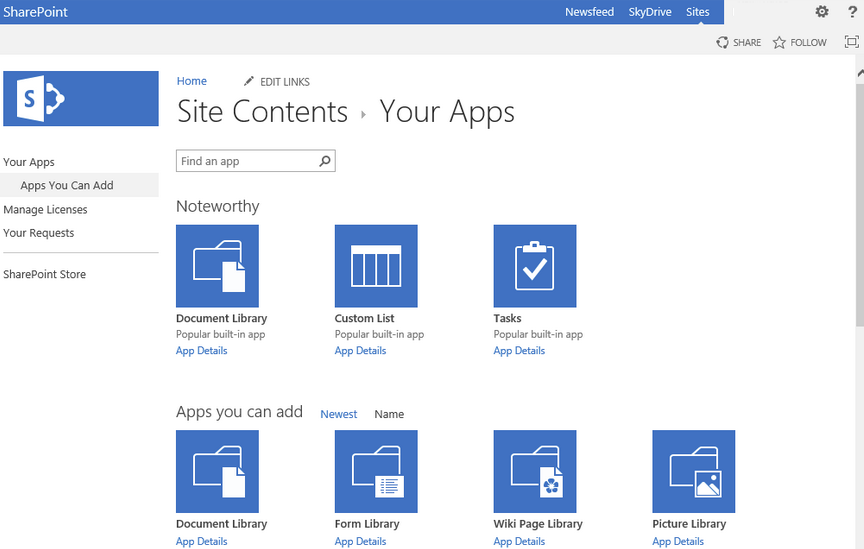
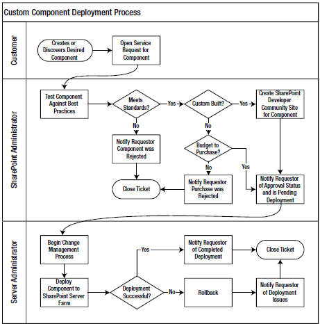

​**Personalizando el servicio.**

Aquellos que personalizan el servicio de SharePoint también comprueban un alto grado de satisfacción en su experiencia con el entorno mediante dicha personalización. En este último artículo sobre la gobernanza, nos centraremos en los factores específicos del diseño y desarrollo personalizado que se relacionan con el gobierno del servicio de SharePoint, destacando estrategias y claves para los diferentes tipo de personalizaciones, incluyendo enfoques sobre cómo podemos diseñar, desarrollas y realizar pruebas de procesos.

*"No todo a lo que nos enfrentamos se puede cambiar, pero nada se puede cambiar si no nos enfrentamos"*

Un enfoque para organizar las personalizaciones globales con los propietarios de las personalizaciones es desplegarlos en el Catálogo de Aplicaciones de SharePoint. Los desarrolladores pueden desarrollar aplicaciones que contienen funcionalidad para una aplicación, la funcionalidad que se ejecuta en otro servidor fuera de nuestra granja de SharePoint. Estas aplicaciones también proporcionan funcionalidad a cualquier propietario del sitio que quiere añadir la App a su sitio, y pueden descubrirla mediante el catálogo de aplicaciones.

Podemos crear un sitio de SharePoint para alojar y administrar el catálogo interno de Apps. Además, podemos compartir el catálogo entre granjas, lo que le permite centralizar el alojamiento y la gestión de su granja principal, mientras otras granjas subordinados pueden consumir el catálogo y las aplicaciones que se enumeran.



Una vez que se configura el catálogo y se habilitan las Apps, los administradores del sitio y los diseñadores de páginas pueden añadir las aplicaciones adicionales a su sitio, también los usuarios finales pueden seleccionar la Aplicaciones disponibles que deseen agregar a su sitio. Desde aquí, pueden agregar las aplicaciones publicadas internamente, así como aquellas que vienen con SharePoint. Además, los administradores del sitio pueden ir a comprar Aplicaciones adicionales disponibles de los vendedores que publican sus aplicaciones en la tienda de Microsoft.



Habilitar la tienda de SharePoint y permitir que los propietarios de sitios puedan comprar sus propias aplicaciones directamente proporcionará una forma efectiva para que los usuarios puedan adquirir  la funcionalidad que necesiten sin tener que solicitar un cambio global en el entorno de SharePoint.

***Delegar responsabilidades en los Administradores de Sitio.***

Una de las razones por las que SharePoint tiene éxito es su capacidad para distribuir y delegar la administración. Se elimina la carga (y cuello de botella) para el departamento de TI a la hora de responder a todas las peticiones de los usuarios. Suele ocurrir muy a menudo que los administradores de sitio no estén preparados para adquirir esa responsabilidad y sobre todo que no estén interesados en adquirirla, pero se puede cambiar dicho enfoque si, a través de procesos sencillos, como pueda ser cambiar el aspecto de un sitio a través de las plantillas que nos ofrece el entorno, vayan tomando sus propias decisiones.

***Facilitar y Aislar las personalizaciones del Usuario Final.***

*"Ningún copo de nieve en una avalancha se puede sentir responsable de la misma"*

Tengo el total convencimiento de que el éxito del servicio de SharePoint radica en potenciar y enriquecer el manejo de los usuarios avanzados a los que les interese la herramienta, y dotarlos en la mayor medida posible de flexibilidad y libertad en sus acciones. Esto a muy corto plazo nos pueden aportar beneficios tales como:

- Mayor adopción global ya que los usuarios pueden adaptar sus experiencias para    satisfacer sus necesidades.


- Reducir las cargas y cuellos de botellas al departamento de IT para cambios y personalizaciones
- Menos demanda de aplicaciones globales ya que los usuarios pueden desarrollar soluciones aisladas.
- Mejorar la sensación de enriquecimiento del usuario y su apoyo a nuestro objetivo.


La clave para lograr esta designación comienza en la decisión de en qué medida vamos a dotar de poder a nuestros usuarios. SharePoint no ofrece una herramienta muy útil como es SharePoint Designer para poder dotar a nuestros usuarios del enriquecimiento necesario para convertirse en usuarios autónomos que puedan gestionar sus propias necesidades y sus tiempos. Podemos comenzar enseñando aspectos como:

- Administrar niveles de subscripción de sitio y permisos.
- Crear recipientes de contenido como nuevas listas o bibliotecas.
- Adquirir aplicaciones a través del Catálogo de Aplicaciones.
- Cerrar o Eliminar un sitio.
- Construir flujos de trabajo personalizado.
- Construir paquetes de diseño personalizados.
- Implementar paquetes de soluciones de usuario.
- Activar y Desactivar características del sito
- Cambiar el tema, logo o aspecto del sitio


No se tiene que capacitar a estos usuarios con todas las capacidades disponibles para un administrador de colección de sitios. Sin embargo, tenemos que decidir y luego tomar las acciones a implementar y gobernar y cuáles desea permitir y cuales se desea bloquear y restringir. Si decidimos capacitar a sus usuarios, dándoles la opción de personalizar sus sitios, entonces querremos asegurarnos de proporcionar un lugar seguro y aislado para sus personalizaciones. Por ejemplo, no queremos interrumpir el servicio para toda la comunidad por temas de consumo de recursos, y desde luego no queremos que se realicen cambios que entren en conflicto con otros usuarios. La solución es el aislamiento de la  colección de sitios.

Yo prefiero un diseño del sitio que distribuye a los usuarios y contenidos a través de muchas colecciones de sitios en lugar de estructurar una profunda jerarquía de sitios y sitios secundarios dentro de sólo unas colecciones de sitios. Me gusta el diseño con muchas colecciones de sitios por varios motivos, y el uso de una colección de sitios como contenedor para aislar los usuarios y sus personalizaciones es uno de los motivos. SharePoint utiliza colecciones de sitios como el límite principal para el contenido y la seguridad, por lo que sirven como recipientes naturales a utilizar en la planificación de sus diseños de sitios para el aislamiento y la delegación de la administración.

Una colección de sitios proporciona un área para que los usuarios puedan gestionar su experiencia en el sitio como mejor les parezca. Esto les permite hacer esto sin tener que preocuparse por la superposición con otros usuarios o experiencias. Esta segregación de la personalización de sitio puede tomar la forma de diseños visuales de sitios o aplicaciones personalizadas tales como los flujos de trabajo. También puede simplemente proporcionar un espacio para la forma en la que organizar las aplicaciones para el contenido y la forma en que quieren mostrar elementos web en la página de bienvenida. La mayoría de los usuarios estarán encantados con lo que el valor predeterminado que se les proporciona, lo que para ellos la colección de sitios es simplemente un contenedor para ayudarles a organizar su contenido. También le ayudará a mantenerse a salvo de los usuarios de otras colecciones de sitios que deseen personalizar sus sitios.

***Diseñando nuestro desarrollo y proceso de pruebas***

*"Calidad significa hacer lo correcto cuando nadie está mirando.".*

Se debe elaborar y proporcionar un documento de normas para el desarrollo y un proceso de pruebas para los mismos, con el objetivo de minimizar los riesgos que puedan afectar a la disponibilidad del servicio de SharePoint. Para ello, defino los puntos claves a tener en cuenta en la elaboración de dichos estándares:

- Explicar el rol de un arquitecto.
- Considerar la disponibilidad Global.
- Decidir entre las soluciones de SharePoint y Aplicaciones.
- Establecer los límites para los desarrolladores.
- Definir puntos de referencias de pruebas.
- Incorporar desarrollo basado en pruebas.
- Automatizar los controles de calidad de código.


El arquitecto tiene que proporcionar el equilibrio entre el desarrollo y la distribución de la funcionalidad, el análisis de los impactos a largo plazo y las consideraciones de un diseño sostenible. La arquitectura juega un papel crítico en un proyecto de desarrollo, ya que abarca tanto el diseño de una solución que pueda satisfacer la necesidad actual, como las necesidades que se puedan presentar a futuro. Necesita considerar todas las piezas en movimiento y visualizar como se unirán los diferentes aspectos. Se debe pensar en el ciclo de vida de una solución, no sólo tener presente la funcionalidad inmediata a desarrollar.

Se debe hacer especial énfasis a la envergadura de las personalizaciones en las colecciones de sitio, ya que pueden afectar a una aplicación web completa o incluso a la granja de servidores. Suele haber personalizaciones globales que un administrador de la granja despliega y pueden tener en su alcance un impacto potencial si algo sale mal, por lo que puede afectar a todos los usuarios del servicio de SharePoint. Para ello los desarrolladores deben tener siempre presente los peligros inherentes que pueden llevar un desarrollo erróneo. Los principales puntos que se han de tener en cuenta en un despliegue global son:

- Acceso a los datos compartidos o cualquier otro recurso compartido.
- Ejecución con privilegios elevados.
- Gestión de cualquier estado de la sesión o el almacenamiento en caché
- Añadir datos de varios objetos desechables.
- La integración con sistemas externos directamente.


Una limitación de las apps, es que no se puede ejecutar código personalizado en los servidores de SharePoint en la granja, el código en su lugar se tiene que ejecutar en el cliente, como puede ser el uso de JavaScript, o ejecutar en un host, o a través de una solución de la nube como puede ser Azure. Si nuestra solución necesita ejecutar código en los servidores de SharePoint, necesitaremos utilizar un paquete de soluciones de SharePoint. También tendrá que usar paquetes de soluciones para desarrollar ciertos otros componentes para su granja de SharePoint. En particular, es necesario implementar lo siguiente a través de una solución de SharePoint en lugar de una App:

- Definiciones de sitios personalizados.
- Controles Delegados.
- Temas personalizados.
- Acciones personalizadas.
- Controles de usuario.


Los límites no tienen que venir como un montón de restricciones de áreas. Deben tomar la forma de directrices generales o áreas específicas para evitar ciertas cosas que desea restringir. Para todo lo demás, podemos decidir si dejarlos o no trabajar con un arquitecto y usar su propia creatividad para diseñar una solución, o si se quiere definir los límites para desarrolladores a nivel granular. A continuación, se enumeran los principales límites que se deben establecer para evitar estas cosas específicas:

- Todas las personalizaciones deben empaquetar los archivos de implementación y los archivos de manifiesto tanto en un paquete de solución o un paquete de aplicación para su despliegue en la granja de SharePoint.
- El paquete de implementación debe incluir todas las instrucciones de implementación y configuración de SharePoint para aplicar automáticamente, incluyendo cualquier configuración Web.config o cambios.
- Ninguna personalización puede modificar o sobrescribir los archivos del producto y del "core" de SharePoint directamente, incluyendo todos los archivos ASPX, XML, JavaScript, CSS y de imagen.
- Todas las personalizaciones que almacenan datos se deben persistir en una base de datos de SharePoint a través del API de SharePoint o proporcionando su propio almacén de datos dedicado.
- Ninguna Personalización puede realizar consultas directas sobre la BBDD de SharePoint.
- Todas las personalizaciones sólo deben acceder al sistema de archivos en modo de sólo lectura, a excepción de una copia de archivos de la propia personalización y ensamblados durante su despliegue inicial.
- Ninguna Personalización puede implementar su propia solución de almacenamiento en caché y en su lugar utilizar el SharePoint AppFabric u otra estrategia de persistencia disponible a través de la API de SharePoint.
- Todas las personalizaciones deben controlar todas las excepciones y proporcionar un mensaje de error amigable mientras graba cualquier detalle del error en el log de registro cuando existe una condición de error o excepción.


Escribir información para el registro de seguimiento (trazas) es muy fácil de incluir en el código. En su forma más simple, se puede escribir información básica información mediante una llamada al método SPDiagnosticsService.Local.WriteTrace y establecer la categoría correspondiente y la gravedad. Por ejemplo, se podría incluir el siguiente código en el bloque de la captura de una excepción al escribir el mensaje de la excepción en el registro de seguimiento. Podemos encontrar estos diagnósticos en el espacio de nombre Microsoft.SharePoint.Administration:

```
SPDiagnosticsCategory diagnosticsCategory =
```

```
diagnosticsService.Areas["SharePoint Foundation"].Categories["General"];
```

```
SPDiagnosticsService.Local.WriteTrace(
```

```
0,
```

```
diagnosticsCategory,
```

```
TraceSeverity.Unexpected,
```

```
ex.Message
```

```
);
```

Esto puede proporcionar información útil para detectar y rastrear el origen de un error mientras se ejecuta el código del entorno de producción. También se puede escribir esta información en el registro de eventos de Windows llamando al método WriteEvent en su lugar, como muestro en el siguiente ejemplo de código:

```
SPDiagnosticsCategory diagnosticsCategory =
```

```
diagnosticsService.Areas["SharePoint Foundation"].Categories["General"];
```

```
SPDiagnosticsService.Local.WriteEvent(
```

0,

```
diagnosticsCategory,
```

```
EventSeverity.Error,
```

```
ex.Message);
```

Para escribir la información de error en el registro de eventos de Windows para que sea más fácil para los Administradores identificar el error:

```
SPDiagnosticsCategory diagnosticsCategory = new SPDiagnosticsCategory(
```

```
"Ejemplo Personalizado", // "Poner la cateroría deseada aquí"
```

```
TraceSeverity.Unexpected,
```

```
EventSeverity.Error);
```

Para supervisar las estadísticas del uso de un código específico, se coloca el código en un bloque de código usando esa instancia un nuevo Objeto SPMonitoredScope. Se ejecuta dentro del bloque utilizando, el alcance monitoreado mide las estadísticas del código y los escribe en el registro de SharePoint ULS log y el panel del desarrollador. El espacio de nombres Microsoft.SharePoint.Utilities contiene la clase MonitoredScope.

```
using (new SPMonitoredScope("Nombre del ámbito"))
```

```
{
```

```
// Código a supervisar
```

```
}
```

```
 
```

Varias métricas de rendimiento que se pueden utilizar para medir y monitorizar los diferentes niveles de rendimiento en el servicio de SharePoint. Estas medidas pueden ser útiles para monitorizar el desempeño de una aplicación personalizada, y sobre todo si para supervisar las tendencias de rendimiento antes y después de implementar una personalización. Estas métricas y tendencias pueden darle una idea general del impacto en el rendimiento en el servidor y en toda la granja, mientras que las herramientas descritas en la sección anterior proporcionan estadísticas detalladas de uso de un componente en una página individual.

Se puede usar el siguiente código para crear sus propios contadores de rendimiento en cada servidor SharePoint en la granja:

```
if (!PerformanceCounterCategory.Exists("Aplicación Personalizada"))
```

```
{
```

```
PerformanceCounterCategory.Create (
```

```
" Aplicación Personalizada ", // categoría del contador
```

```
"Descripción de la categoría personalizada",
```

```
PerformanceCounterCategoryType.SingleInstance,
```

```
"Contador de Aplicación", // Este es el nombre del contador
```

```
"Descripción del Contador");
```

```
}
```

Una vez que se crea un contador de rendimiento personalizado en el servidor, puede comprobar que existe y empezar a ver sus indicadores con la herramienta de Windows: Monitor de Rendimiento. Por supuesto, tener una categoría de monitor de rendimiento y el contador no será hasta que empecemos a grabar los datos de rendimiento en su aplicación personalizada. Se puede utilizar el siguiente código dentro de la aplicación para crear una instancia del contador de rendimiento y luego incrementar su contador:

```
PerformanceCounter counter = new PerformanceCounter();
```

```
counter.CategoryName = "Aplicación Personalizada";
```

```
counter.CounterName = "Contador de Aplicación";
```

```
counter.ReadOnly = false;
```

```
// Incrementar el rendimiento del contador.
```

```
counter.Increment();
```

```
counter.Close();
```

Tener un proceso de prueba eficaz puede servir como su última línea de defensa para asegurar que todas sus normas y directrices son aplicadas en un desarrollo personalizado. También puede ayudar a evitar los problemas relacionados con las personalizaciones, en particular para los problemas comunes que se pueden detectar. Un proceso de prueba da un proceso formal para asegurar que las personalizaciones son de calidad, y esto le puede dar la confianza en la sostenibilidad de su servidor SharePoint, incluso después de añadir varios componentes personalizados a la misma. Tras un proceso de pruebas formales también puede establecer las expectativas de sus desarrolladores, para que sepan el baremo de calidad que tienen que cumplir a medida que desarrollan. Se puede diseñar su proceso de pruebas para que tome la forma de un proceso sistemático para revisar las solicitudes, validación de las normas, y luego trabajar a través de un procedimiento de gestión de cambios. Seguir un proceso disciplinado, mejorará la estabilidad general en la granja de SharePoint. Este resultado positivo se consigue tomando decisiones conscientes y coordinadas entre diferentes roles - dos actividades tienen un impacto positivo significativo, incluso si las pruebas reales no son demasiado sofisticadas o completas.

Expongo un ejemplo de un proceso de prueba para desarrollos personalizados:



Lo primero y más fácil de testear en su proceso de pruebas son las pruebas de las normas y directrices que hemos definido, y esto es especialmente más fácil si hemos automatizado estas pruebas a través de una secuencia de comandos. Por ejemplo, se puede utilizar las clases del espacio de nombres Reflection de .NET para obtener información sobre los ensamblados cargados y los tipos definidos dentro de ellos para probar si utiliza conexiones de base de datos o cualquier otra cosa. Esto puede ayudarnos a crear un informe rápido de las áreas que desea resaltar y realizar un seguimiento con el equipo de desarrollo. El ejemplo de código siguiente se utiliza la reflexión para poner a prueba un ensamblado y recorrer todos los ensamblados a los que hace referencia:

```
Assembly assembly = Assembly.LoadFile("EjemploComponente.dll");
```

```
foreach (AssemblyName a in assembly.GetReferencedAssemblies())
```

```
{
```

```
// Código
```

```
}
```

El desarrollo basado en pruebas (TDD) es una práctica de desarrollo ágil, donde los desarrolladores codifican un test unitario por función, antes de codificar la funcionalidad global. La idea es que si siempre construir la prueba primero, entonces tendremos una prueba por cada método de funcionalidad en nuestra aplicación personalizada cuando terminemos el desarrollo.

El desarrollo basado en pruebas generalmente sigue un ciclo de adición de pruebas en el que, inicialmente, se producirá un error (debido a que la funcionalidad en la aplicación aún no existe), y luego se codifica la funcionalidad y la lógica para obtener la prueba para pasar. Por último, limpiar el código por refactorización tanto el de la  aplicación como la prueba unitaria. Este proceso se resume a menudo como "rojo, verde, Refactor." resumo este proceso en los siguientes 7 pasos:

- Escribir una prueba unitaria para probar una parte específica de la funcionalidad o condición.
- Ejecutar la prueba para verificar no pasa la prueba (rojo).
- Tan pronto como sea posible, escribir la cantidad mínima de código necesario para hacer que pase la prueba.
- Ejecutar la prueba para verificar la validez de la prueba (verde).
- Refactorice su código para eliminar la duplicación, ineficiencias, las convenciones pobres de nomenclatura, o cualquier otra cosa que refactorizar y mejorar (Refactor).
- Ejecutar todas las pruebas unitarias para asegurar que todas las pruebas aún pasan.
- Repetir este proceso para la siguiente parte de la funcionalidad que desee añadir.


A continuación, expongo un ejemplo de prueba unitaria:

```
[TestMethod()]
```

```
public void SiteTitleTest()
```

```
{
```

```
string title = "titulo del sitio";
```

```
MockWeb web = new MockWeb();
```

```
SiteConfigurer c = new SiteConfigurer();
```

```
c.UpdateTitle(title, web);
```

```
Assert.AreEqual<string>(title, web.Title);
```

```
Assert.IsTrue(web.HasCalledUpdate);
```

```
}
```

En este punto, la prueba sería un fracaso, porque aún no he implementado la funcionalidad. El siguiente código proporciona un ejemplo de a implementación de la funcionalidad de esta hipotética clase. Nótese que he utilizado la interfaz IWeb para el parámetro del sitio.

```
public class SiteConfigurer
```

```
{
```

```
public void UpdateTitle(string title, IWeb web)
```

```
{
```

```
web.Title = title;
```

```
web.Update();
```

```
}
```

```
}
```

Por motivos de integridad, el siguiente código muestra un ejemplo de envolver el objeto real de SharePoint en un objeto que implementa la interfaz. En el código de la aplicación, este objeto envoltorio sería el objeto que pase al método; mientras tanto en mi código de pruebas unitarias, paso el objeto "falso". Esto funciona porque ambos comparten el mismo interfaz.

```
public class Web : IWeb
```

```
{
```

```
SPWeb web;
```

```
public Web(SPWeb web)
```

```
{
```

```
this.web = web;
```

```
}
```

```
public Title
```

```
{
```

```
get { return web.Title; }
```

```
set { web.Title = value; }
```

```
}
```

```
public void Update()
```

```
{
```

```
web.Update();
```

```
}
```

```
}
```


**Conclusiones**

En estos tres artículos sobre gobernanza, he intentado abarcar algunas de las medidas que se pueden tomar para gobernar el entorno de SharePoint. La documentación puede ayudar a establecer un entendimiento compartido de cómo su servicio de SharePoint se ejecuta y las acciones que se necesitan para gobernarlo. Os animo a considerar muchas de las plantillas y normativas de orientación sobre la documentación de artefactos de gobierno, debido a que muchos de ellos podrían tener partes interesantes y valiosas que se pueden adoptar y adaptar.


**Francisco Ricardo Gil González**
 MVP CLUSTER | Especialista en SharePoint & Office 365
 [francisco.gil@fiveshareit.es](mailto:francisco.gil@fiveshareit.es)
 https://es.linkedin.com/pub/ricardo-gil-gonzalez/63/99b/689
 [http://www.mvpcluster.es](http://www.mvpcluster.es/)

 
 
import LayoutNumber from '../../../components/layout-article'
export default LayoutNumber
