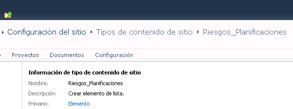
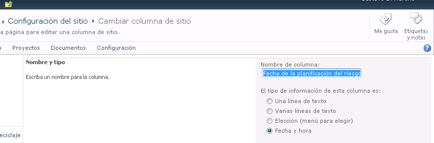
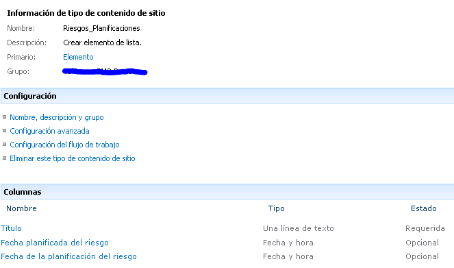
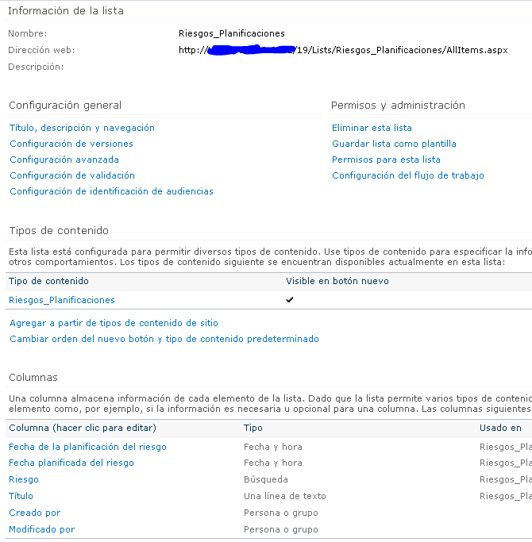

​Los tipos de contenido de SharePoint nos permiten crear listas basadas en estructuras de datos. Facilitan la replicación de cambios dentro de la colección de sitios. Por ejemplo, podemos crear listas en distintos sitios, que hereden su estructura de un tipo de contenido del sitio raíz. De esta forma, un cambio en una columna del tipo de contenido, se replica en todas las listas que lo consumen.

**Crear el tipo de contenido**

El primer paso es crear un nuevo tipo de contenido. Para ello trabajamos con esta función:

```
public string nuevoTipoContenido(SPSite sitio, string nombre)
```

```
{
```

```
    SPContentType viejoTC = sitio.RootWeb.ContentTypes[nombre];
```

```
    if (viejoTC == null)
```

```
    {
```

```
        SPContentType nuevoTC = new SPContentType(sitio.RootWeb.ContentTypes["Elemento"], sitio.RootWeb.ContentTypes, nombre);
```

```
        sitio.RootWeb.ContentTypes.Add(nuevoTC);
```

```
        nuevoTC.Group = "Surpoint";
```

```
        nuevoTC.Update();
```

```
        return "<span style='color: green'>Tipo de contenido " + nombre + " creado.</span><br />";
```

```
    }
```

```
    else
```

```
    {
```

```
        return "<span style='color: blue'>Tipo de contenido " + nombre + " ya existente.</span><br />";
```

```
    }
```

```
}
```

Finalmente ejecutamos esta función desde nuestro programa:

contenido.InnerHtml = "";

```
try
```

```
{
```

```
    SPSite oSiteCollection = SPContext.Current.Site;
```

```
 
```

```
    // Nuevos tipos de contenido
```

```
    contenido.InnerHtml += nuevoTipoContenido(oSiteCollection, "Riesgos_Planificaciones");
```

```
 
```

```
}
```

```
catch (Exception error)
```

```
{
```

```
    contenido.InnerHtml += "<span style='color: red'>Error: " + error + "</span><br />";
```

```
}
```

En la siguiente imagen vemos el resultado:



**Creación de columnas**

En el segundo paso vamos a crear columnas de sitio y luego las vamos a incorporar dentro del tipo de contenido. Para ello armamos una primera función para crear columnas:

```
public string nuevaColumnaSitioFecha(SPSite sitio, string internalName, string displayName, bool obligatoriedad, string descripcion)
```

```
{
```

```
    if (!sitio.RootWeb.Fields.ContainsField(internalName))
```

```
    {
```

```
        string nombreInternoNuevo = sitio.RootWeb.Fields.Add(internalName, SPFieldType.DateTime, obligatoriedad);
```

```
        SPFieldDateTime campoNuevo = (SPFieldDateTime)sitio.RootWeb.Fields.GetFieldByInternalName(nombreInternoNuevo);
```

```
        campoNuevo.Title = displayName;
```

```
        campoNuevo.DisplayFormat = SPDateTimeFieldFormatType.DateOnly;
```

```
        campoNuevo.Description = descripcion;
```

```
        campoNuevo.Group = "Surpoint";
```

```
        campoNuevo.Update();
```

```
        return "<span style='color: green'>Columna " + internalName + " creada.</span><br />";
```

```
    }
```

```
    else
```

```
    {
```

```
        return "<span style='color: blue'>Columna " + internalName + " ya existente.</span><br />";
```

```
    }
```

```
}
```

Ejecutamos esta función desde nuestro programa:

```
contenido.InnerHtml += nuevaColumnaSitioFecha(oSiteCollection, "Planificado_Riesgo", "Fecha planificada del riesgo", false, "");
```

```
contenido.InnerHtml += nuevaColumnaSitioFecha(oSiteCollection, "Fecha_Planificacion_Riesgo", "Fecha de la planificación del riesgo", false, "");
```

En la siguiente imagen vemos el resultado:



Para incorporar las columnas dentro del tipo de contenido, creamos una nueva función:

```
public string agregarColumnaTipoContenido(SPSite sitio, string columna, string tipoContenido)
```

```
{
```

```
    SPContentType actualTC = sitio.RootWeb.ContentTypes[tipoContenido];
```

```
    if (!actualTC.Fields.ContainsField(columna))
```

```
    {
```

```
        SPField nuevaCol = sitio.RootWeb.Fields.GetFieldByInternalName(columna);
```

```
        SPFieldLink nuevaColLink = new SPFieldLink(nuevaCol);
```

```
        actualTC.FieldLinks.Add(nuevaColLink);
```

```
        actualTC.Update(true);
```

```
        return "<span style='color: green'>Columna " + columna + " agregada a " + tipoContenido + ".</span><br />";
```

```
    }
```

```
    else
```

```
    {
```

```
        return "<span style='color: blue'>Columna " + columna + " ya existente en " + tipoContenido + ".</span><br />";
```

```
    }
```

```
}
```

Ejecutamos esta función desde nuestro programa y luego vemos la imagen con el resultado:

```
contenido.InnerHtml += nuevaColumnaSitioFecha(oSiteCollection, "Planificado_Riesgo", "Fecha planificada del riesgo", false, "");
```

```
contenido.InnerHtml += nuevaColumnaSitioFecha(oSiteCollection, "Fecha_Planificacion_Riesgo", "Fecha de la planificación del riesgo", false, "");
```



**Creación de listas**

En el último paso crearemos listas basadas en el tipo de contenido en varios subsitios de nuestra colección de sitios. Seguimos estos pasos:

- Recorremos todos los sub sitios.
- Verificamos si existe la lista Riesgos (padre).
- Verificamos si existe la lista Riesgos\_Planificaciones (nueva).
- Creamos la lista nueva.
- Le incorporamos el tipo de contenido.
- Le activamos el versionado.
- Le creamos un campo propio dependiente de otra lista.


```
SPWebCollection collWebsite = oSiteCollection.AllWebs;
```

```
for (int i = 0; i < collWebsite.Count; i++)
```

```
{
```

```
    using (SPWeb oWebsite = collWebsite[i])
```

```
    {
```

```
        SPList listaRiesgos = oWebsite.Lists.TryGetList("Issues y riesgos");
```

```
        if (listaRiesgos != null)
```

```
        {
```

```
            // Nueva lista PR
```

```
            SPList listaPR = oWebsite.Lists.TryGetList("Riesgos_Planificaciones");
```

```
 
```

```
            if (listaPR == null)
```

```
            {
```

```
                SPListCollection listas = oWebsite.Lists;
```

```
                listas.Add("Riesgos_Planificaciones", "", SPListTemplateType.GenericList);
```

```
                contenido.InnerHtml += "<span style='color: green'>" + oWebsite.Title + "Lista PR creada</span><br />";
```

```
                // Tipo de contenido y versionado
```

```
                SPList listaPRNueva = oWebsite.Lists["Riesgos_Planificaciones"];
```

```
                listaPRNueva.EnableVersioning = true;
```

```
                listaPRNueva.ContentTypesEnabled = true;
```

```
                listaPRNueva.Update();
```

```
                        listaPRNueva.ContentTypes.Add(oSiteCollection.RootWeb.ContentTypes["Riesgos_Planificaciones"]);
```

```
                contenido.InnerHtml += "<span style='color: green'>" + oWebsite.Title + "Lista PR - Tipo de Contenido agregado</span><br />";
```

```
                listaPRNueva.ContentTypes["Elemento"].Delete();
```

```
                contenido.InnerHtml += "<span style='color: green'>" + oWebsite.Title + "Lista PR - Tipo de Contenido elemento ajustado</span><br />";
```

```
                // Creación de columna propia de la lista (no heredadas del tipo de contenido)
```

```
                listaPRNueva.Fields.AddLookup("Riesgo", listaRiesgos.ID, true);
```

```
            }
```

```
            else
```

```
            {
```

```
                contenido.InnerHtml += "<span style='color: blue'>" + oWebsite.Title + ": Ya existe la lista PR</span><br />";
```

```
            }
```

```
 
```

```
        }
```

```
        else
```

```
        {
```

```
            contenido.InnerHtml += "<span style='color: blue'>" + oWebsite.Title + ": No existe la lista Padre Riesgos</span><br />";
```

```
        }
```

```
    }
```

```
}
```

En la imagen podemos ver la lista creada, el tipo de contenido y las columnas:



**Conclusión**

En esta primera versión del artículo hemos visto como trabajar con tipos de contenido en forma programática, no declarativa. En próximos artículos veremos algunos temas más avanzados. Espero les haya resultado de utilidad.


**Juan Pablo Pussacq Laborde**
SharePoint MVP
Blog: [http://surpoint.blogspot.com/](http&#58;//surpoint.blogspot.com/)

