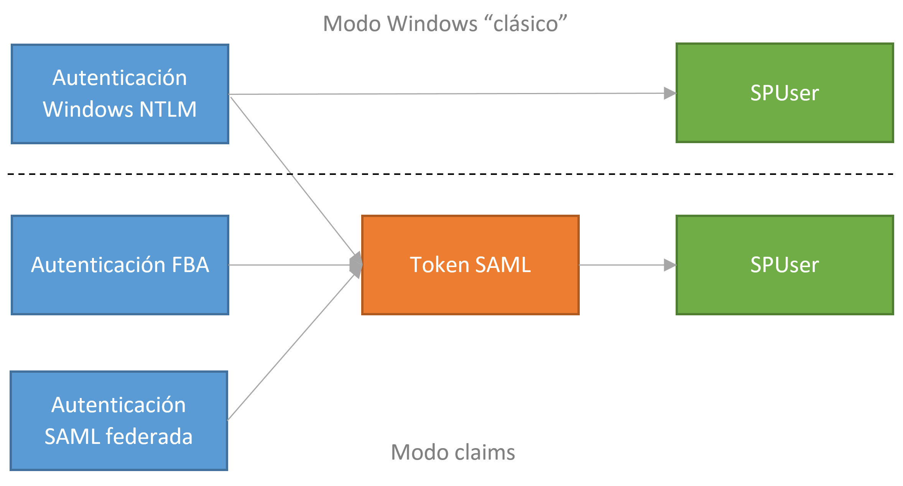
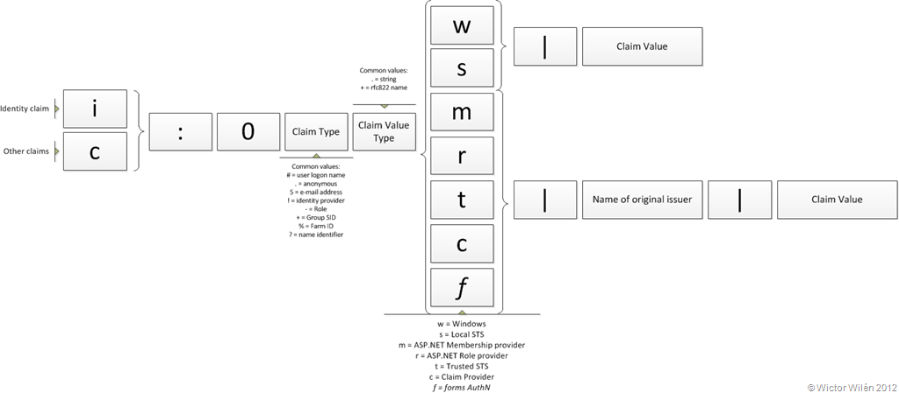
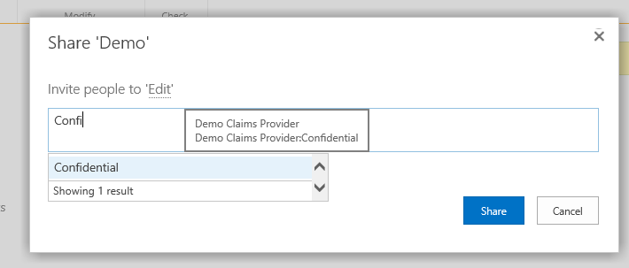
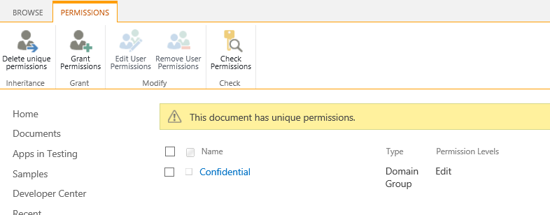
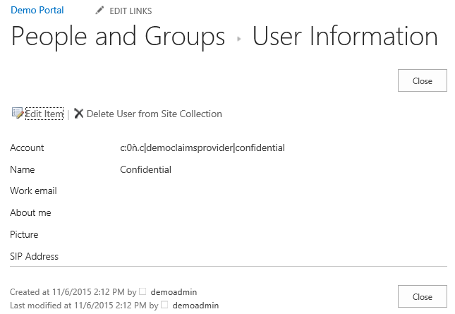
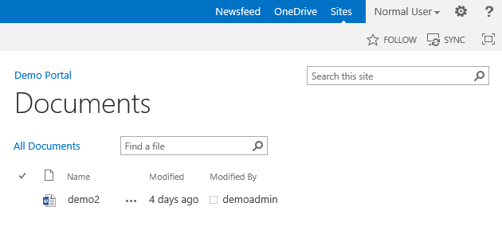
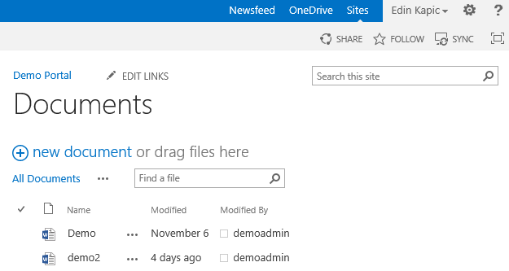

import ArticleHeader from '../../../components/article-header'

<ArticleHeader frontmatter={props.pageContext.frontmatter} />


​En nuestro uso diario de SharePoint, solemos asignar permisos a grupos y a usuarios, como se ha hecho durante años. En este artículo introduciré el concepto de permisos con claims, usando un proveedor de claims a medida, para una mayor flexibilidad a la hora de asignar permisos.

**Los claims y los permisos**

SharePoint introduce la autenticación basada en los claims (o notificaciones, según la traducción oficial de Microsoft) en la versión de SharePoint Server 2010. En SharePoint 2013 la autenticación claims se establece por defecto para todas las aplicaciones web creadas desde la interfaz de usuario. En SharePoint 2016 Preview, de momento, la autenticación por claims es la única opción disponible.

Pero, ¿qué son los claims? En palabras sencillas, los claims son nada más que una característica sobre nuestra identidad, sostenida (en inglés "claimed", de allí el nombre) por alguna autoridad. En cierto modo, en nuestra vida real usamos claims: los documentos de identidad como el pasaporte, el pase de empleado, los vales nominales…no dejan de ser sino cosas que alguien asevera sobre nosotros. Dependiendo de la confianza que tenemos la autoridad que lo expide y la seguridad de que el claim (el documento) no haya sido alterado, decidimos aceptar estos claims para identificar a la persona o no.

Los claims de SharePoint son más sencillos. Los claims tal como los usa SharePoint y Windows Identity Foundation (WIF) son cadenas de texto con un tipo (o espacio de nombres) y un valor. Por ejemplo, uno de los claims estándares es el **UPN (User Profile Name)**. El usuario "**edin**" del dominio de Active Directory **spdemo.local** tendría el UPN **edin@spdemo.local**. El claim correspondiente sería **http://schemas.xmlsoap.org/ws/2005/05/identity/claims/upn**:**edin@spdemo.local**.

Visto así, podemos tratar un claim como una generalización de las propiedades de un usuario. El nombre del usuario, su dirección de correo, su teléfono, etc son claims. Entonces, la **identidad del usuario no es más que un conjunto de claims**, algunos de los cuales son identificadores (como el email, el UPN, el samAccountName) y otros no lo son (departamento, teléfono, país).

¿Qué tiene que ver esto con SharePoint? Es sencillo: SharePoint trata a todos los usuarios como un conjunto de claims, vengan de la autenticación que vengan. Un usuario que se autentica como Windows tendrá unos claims de Windows, uno de autenticación basada en formularios (FBA) tendrá sus claims de FBA, pero para SharePoint los dos serán un usuario con una identidad de claims. Para los desarrolladores, es entender que un **SPUser** es un **ClaimsIdentity** de WIF.



Al tratar a todos los usuarios como claims, SharePoint tiene que usar un mecanismo coherente para identificarlos. Para ello, codifica los claims siguiendo un patrón[\[i\]](file&#58;///C&#58;/Users/adiaz/Downloads/Extendiendo%20los%20permisos%20de%20SharePoint%20con%20un%20proveedor%20de%20claims.docx). El usuario anterior para SharePoint sería **i:0#.w|spdemo\edin**o **i:0n.w|edin@spdemo.local**. Así sabemos que "i" es un claim identificador, "#" es un claim de tipo username, "n" es un claim UPN y "w" es la autenticación de Windows. Después del símbolo "|" viene el valor del claim.



Entonces, cuando asignamos los permisos en SharePoint a un usuario, realmente le estamos asignando los permisos a un claim de este tipo. Visto así, no nos debería sorprender que además de asignar permisos a claims de tipo identificador también podemos asignarlos a cualquier otro claim. Sí, a partir de SharePoint 2010 es posible asignar permisos a cualquier claim. Por ejemplo, podemos asignar los permisos de unos documentos confidenciales a un claim del usuario que refleja su nivel de autorización (Confidencial, Normal etc). Estamos desvinculando los permisos de los usuarios y grupos concretos para convertirlos a permisos según las propiedades del usuario. Para mí, esto es un gran avance respecto a las versiones anteriores de SharePoint.

¿Cómo podemos asignar estos permisos? En las cajas de texto para poner los permisos (People Picker) de SharePoint sólo salen los claims de tipo usuario y grupo. Sin embargo, podemos hacer algo al respecto construyendo un proveedor de claims propio (claim provider) que sepa mostrar los claims personalizados.

**Construyendo un Claim Provider**

Un claim provider es una derivada de la clase abstracta **SPClaimProvider**. Al heredar de esta clase, tenemos que implementar unos cuantos métodos. A grandes rasgos, los métodos a implementar son de dos tipos: SupportsX (para indicar que el claim provider provee la funcionalidad X) y FillX (donde está la lógica de la funcionalidad X).


| **Para la funcionalidad de ...** | **Implementamos ...** |
| --- | --- |
| Aumento de claims | FillClaimsForEntity<br /> SupportsEntityInformation |
| Ver claims en People Picker | FillSchema<br /><br />FillClaimTypes<br /><br />FillClaimValueTypes<br /><br />FillEntityTypes |
| Tener jerarquía de claims | FillHierarchy<br /><br />SupportsHierarchy |
| Resolver los claims escritos en People Picker | FillResolve<br /><br />SupportsResolve |
| Buscar claims en People Picker | FillSearch<br /><br />SupportsSearch |


Las funcionalidades de claim provider son también de dos tipos. Una es **aumentar o enriquecer los claims de un usuario**. Esta funcionalidad se llama después de que entre un usuario a SharePoint y aquí el claim provider puede inyectar claims adicionales de ese usuario. Por ejemplo, si tenemos una base de datos de RRHH podemos usar el método **FillClaimsForEntity** para añadir las características adicionales como claims del usuario.

La otra funcionalidad de un claim provider es **mostrar los claims en la interfaz de SharePoint (control People Picker) para poder asignarlos como permisos**. Para ello, tenemos que rellenar unos métodos obligatorios y luego podemos elegir dar soporte a tres características: resolución de un claim al escribirlo, búsqueda (al escribir tres o más caracteres) y jerarquía (para aquellos claims que son de naturaleza jerárquica como las regiones, por ejemplo).

Vamos a hacer el claims provider de ejemplo que expone un tipo de claims que refleja el nivel de seguridad para documentos ("Security Clearance"). El claim es del tipo [http://schema.spdemo.local/clearance](http&#58;//schema.spdemo.local/clearance) y puede ser "Normal" o "Confidential". Para ello definimos una nueva clase llamada **DemoClaimsProvider** que hereda de SPClaimProvider.

Para declarar los nuevos claims, definimos la propiedad ClearanceClaimType de tipo string que devuelve el texto http://schema.spdemo.local/clearance. Tenemos que definir también el tipo del valor que devuelve el claim, así que hacemos una propiedad llamada ClearanceClaimValueType que devuelve el valor de  Microsoft.IdentityModel.Claims.ClaimValueTypes.String. Para los que ya usáis WIF en NET Framework 4.5, al ser SharePoint un código de NET 4.0 tenemos que usar el namespace Microsoft.IdentityModel en vez de System.IdentityModel. Además, tenemos que devolver estas propiedades en los métodos FillClaimTypes y FillClaimValueTypes del proveedor.

```
private static string ClearanceClaimType
```

```
  {
```

```
      get
```

```
      {
```

```
          return "http://schema.spdemo.local/clearance";
```

```
      }
```

```
  }
```

```
 
```

```
  private static string ClearanceClaimValueType
```

```
  {
```

```
      get
```

```
      {
```

```
          return Microsoft.IdentityModel.Claims.ClaimValueTypes.String;
```

```
      }
```

```
  }
```

```
 
```

```
  protected override void FillClaimTypes(List<string> claimTypes)
```

```
  {
```

```
      if (claimTypes == null)
```

```
          throw new ArgumentNullException("claimTypes");
```

```
      claimTypes.Add(ClearanceClaimType);
```

```
  }
```

```
 
```

```
  protected override void FillClaimValueTypes(List<string> claimValueTypes)
```

```
  {
```

```
      if (claimValueTypes == null)
```

```
          throw new ArgumentNullException("claimValueTypes");
```

```
      claimValueTypes.Add(ClearanceClaimValueType);
```

```
  }
```

Una vez puestos estos cimientos, vamos a aplicar los claims. Lo primero es añadir el claim de nivel de seguridad al usuario actual. Para ello, implementamos el método FillClaimsForEntity. Aquí nos pasan el claim identificador del usuario actual en el parámetro entity y tenemos que devolver los claims extra en el parámetro claims. Para la demo, sencillamente miro si el usuario soy yo (nombre de usuario *ekapic*) y si es así le doy el nivel de autorización *Confidential*. Para los demás usuarios devuelvo el claim *Normal*.

```
protected override void FillClaimsForEntity(Uri context, SPClaim entity, List<SPClaim> claims)
```

```
{
```

```
    if (entity == null)
```

```
        throw new ArgumentNullException("entity");
```

```
 
```

```
    if (claims == null)
```

```
        throw new ArgumentNullException("claims");
```

```
    
```

```
    var clearance = "Normal";
```

```
    
```

```
    if (entity.Value.Contains("ekapic"))
```

```
    {
```

```
        clearance = "Confidential";
```

```
    }
```

```
 
```

```
    claims.Add(CreateClaim(ClearanceClaimType, clearance, ClearanceClaimValueType));
```

```
} 
```

Para añadir los claims estoy usando un método auxiliar de SPClaimProvider llamado CreateClaim, que me permite crear los claims indicando el tipo, el valor y el tipo de valor.

Ahora tenemos el usuario con los claims correctos, pero en ningún momento le hemos asignado los claims a los documentos en SharePoint, así que no hay ningún beneficio de momento. Para ello, vamos a implementar los métodos FillResolve y FillSearch. La implementación es muy parecida: devolvemos los dos valores posibles dentro de un objeto PickerEntity que usará el control People Picker para mostrarlos. En el caso de la búsqueda miraremos si el texto está presente dentro del nombre de los valores de los claims, mientras en la resolución miraremos el texto completo. Hay dos métodos FillResolve: uno nos pasa un array de strings y el otro un array de claims.

```
protected override void FillResolve(Uri context, string[] entityTypes, SPClaim resolveInput, List<Microsoft.SharePoint.WebControls.PickerEntity> resolved)
```

```
{
```

```
    List<PickerEntity> matches = new List<PickerEntity>();
```

```
    if (resolveInput.Value.ToLower() == "normal")
```

```
    {
```

```
        matches.Add(GetPickerEntity("Normal"));
```

```
    }
```

```
    if (resolveInput.Value.ToLower() == "confidential")
```

```
    {
```

```
        matches.Add(GetPickerEntity("Confidential"));
```

```
    }
```

```
    resolved.AddRange(matches);
```

```
}
```

```
 
```

```
protected override void FillResolve(Uri context, string[] entityTypes, string resolveInput, List<Microsoft.SharePoint.WebControls.PickerEntity> resolved)
```

```
{
```

```
    List<PickerEntity> matches = new List<PickerEntity>();
```

```
    if (resolveInput.ToLower() == "normal")
```

```
    {
```

```
        matches.Add(GetPickerEntity("Normal"));
```

```
    }
```

```
    if (resolveInput.ToLower() == "confidential")
```

```
    {
```

```
        matches.Add(GetPickerEntity("Confidential"));
```

```
    }
```

```
    resolved.AddRange(matches);
```

```
}
```

```
 
```

```
protected override void FillSearch(Uri context, string[] entityTypes, string searchPattern, string hierarchyNodeID, int maxCount, Microsoft.SharePoint.WebControls.SPProviderHierarchyTree searchTree)
```

```
{
```

```
    List<PickerEntity> matches = new List<PickerEntity>();
```

```
    if ("Normal".ToLower().Contains(searchPattern.ToLower()))
```

```
    {
```

```
        matches.Add(GetPickerEntity("Normal"));
```

```
    }
```

```
    if ("Confidential".ToLower().Contains(searchPattern.ToLower()))
```

```
    {
```

```
        matches.Add(GetPickerEntity("Confidential"));
```

```
    }
```

```
    searchTree.AddEntities(matches);
```

```
}
```

Los tres métodos Fill usan un método auxiliar GetPickerEntity que he creado para poder construir una instancia de PickerEntity con el valor correcto. En esa entidad va el nombre a mostrar en el People Picker, el claim y su valor, así como el tipo de entidad que estamos devolviendo. Si nuestra claim es de tipo identificador del usuario, usaremos el esquema User. Si no lo es (el caso más normal), usaremos el esquema FormsRole. Para SharePoint, los claims no identificadores se tratan como si fueran grupos. El método existente de la clase SPClaimProvider llamado CreatePickerEntity() nos devuelve una instancia del objeto PickerEntity sobre el que trabajamos.

```
private PickerEntity GetPickerEntity(string ClaimValue)
```

```
{
```

```
    PickerEntity pe = CreatePickerEntity();
```

```
    pe.Claim = CreateClaim(ClearanceClaimType, ClaimValue, ClearanceClaimValueType);
```

```
    pe.Description = DemoClaimsProvider.ProviderDisplayName + ":" + ClaimValue;
```

```
    pe.DisplayText = ClaimValue;
```

```
    pe.EntityData[PeopleEditorEntityDataKeys.DisplayName] = ClaimValue;
```

```
    pe.EntityType = SPClaimEntityTypes.FormsRole;
```

```
    pe.IsResolved = true;
```

```
    pe.EntityGroupName = "Associated clearance";
```

```
    return pe;
```

```
}
```

**Aplicando permisos**

Para instalar este claim provider, tenemos que meterlo dentro de una feature del ámbito de granja que en el evento de activación registre el claim provider. Para ello SharePoint nos da una clase existente llamada SPClaimProviderFeatureReceiver y sólo tenemos que indicarle el tipo y la clase del proveedor a registrar.

```
public class ClaimsProviderDemoFeatureEventReceiver : SPClaimProviderFeatureReceiver
```

```
{
```

```
    public override void FeatureActivated(SPFeatureReceiverProperties properties)
```

```
    {
```

```
        ExecBaseFeatureActivated(properties);
```

```
    }
```

```
 
```

```
    public override string ClaimProviderAssembly
```

```
    {
```

```
        get
```

```
        {
```

```
            return typeof(DemoClaimsProvider).Assembly.FullName;
```

```
        }
```

```
    }
```

```
 
```

```
    public override string ClaimProviderDescription
```

```
    {
```

```
        get
```

```
        {
```

```
            return "A sample provider written by Edin Kapic";
```

```
        }
```

```
    }
```

```
 
```

```
    public override string ClaimProviderDisplayName
```

```
    {
```

```
        get
```

```
        {
```

```
            return DemoClaimsProvider.ProviderDisplayName;
```

```
        }
```

```
    }
```

```
 
```

```
    public override string ClaimProviderType
```

```
    {
```

```
        get
```

```
        {
```

```
            return typeof(DemoClaimsProvider).FullName;
```

```
        }
```

```
    }
```

```
 
```

```
    private void ExecBaseFeatureActivated(Microsoft.SharePoint.SPFeatureReceiverProperties properties)
```

```
    {
```

```
        base.FeatureActivated(properties);
```

```
    }
```

```
}
```

Al instalar la feature dentro de un paquete WSP, ya podemos asignar los permisos de documentos usando los nuevos claims.



Fijaos que el claim aparece en la lista de permisos como si fuera un grupo.



Y si clicamos encima, podemos ver que se trata de un claim no identificador ("**c**") del tipo no estándar ("**ǹ**") proveniente del claim provider ("**c**") llamado **democlaimsprovider**con el valor **confidential**.



Vamos a probar la seguridad por claims. Voy a poner dos documentos en SharePoint: uno con nivel de seguridad Confidential (demo.docx) y otro con nivel de seguridad Normal (demo2.docx). Entraré con el usuario normal de Windows SPDEMO\NormalUser a ver que veo.  Es importante recalcar que estamos añadiendo claims propios a un usuario de Windows. No tenemos que usar una autenticación federada de claims ni nada extraño. Un claim provider inyecta claims a todos los proveedores de identidad que sea necesario (Windows, FBA o federados).



Y con el usuario que tiene claims de nivel confidencial, SPDEMO\ekapic, podemos ver que el documento confidencial es visible.



**Conclusión**

El uso de los claims como autenticación de los usuarios por defecto en SharePoint nos permite asignar permisos mucho más discretos que las categorías rígidas existentes de usuario y grupo. Podemos asignar permisos a los diferentes claims de los usuarios y añadir estos claims en tiempo de ejecución usando un claim provider. Para que los claims se vean en la interfaz de asignación de permisos, tenemos que sobrescribir unos métodos de la clase base de claim provider.

De esta manera somos mucho más flexibles para gestionar la seguridad de los elementos de SharePoint.

La solución de completa del claim provider de este artículo está disponible en mi OneDrive[\[ii\]](file&#58;///C&#58;/Users/adiaz/Downloads/Extendiendo%20los%20permisos%20de%20SharePoint%20con%20un%20proveedor%20de%20claims.docx).


**Edin Kapić**
 Arquitecto SharePoint
 [edin.kapic@sogeti.com](mailto&#58;edin.kapic@sogeti.com) 
@ekapic
 [www.edinkapic.com](http&#58;//www.edinkapic.com/)

[\[ii\]](file&#58;///C&#58;/Users/adiaz/Downloads/Extendiendo%20los%20permisos%20de%20SharePoint%20con%20un%20proveedor%20de%20claims.docx) [http://1drv.ms/1PupReW](http&#58;//1drv.ms/1PupReW)

[\[i\]](file&#58;///C&#58;/Users/adiaz/Downloads/Extendiendo%20los%20permisos%20de%20SharePoint%20con%20un%20proveedor%20de%20claims.docx) [http://social.technet.microsoft.com/wiki/contents/articles/13921.sharepoint-2013-claims-encoding-also-valuable-for-sharepoint-2010.aspx](http&#58;//social.technet.microsoft.com/wiki/contents/articles/13921.sharepoint-2013-claims-encoding-also-valuable-for-sharepoint-2010.aspx)

