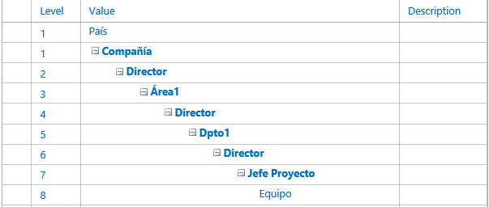
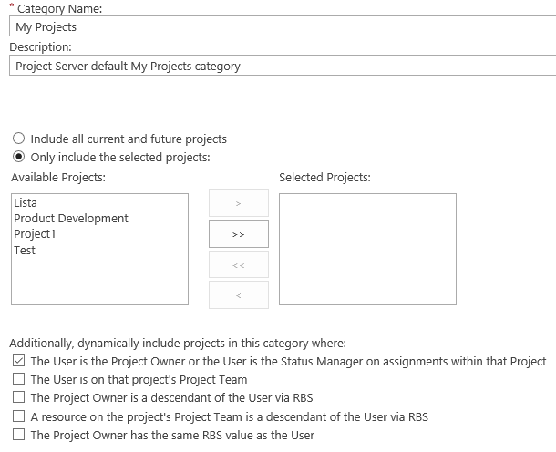
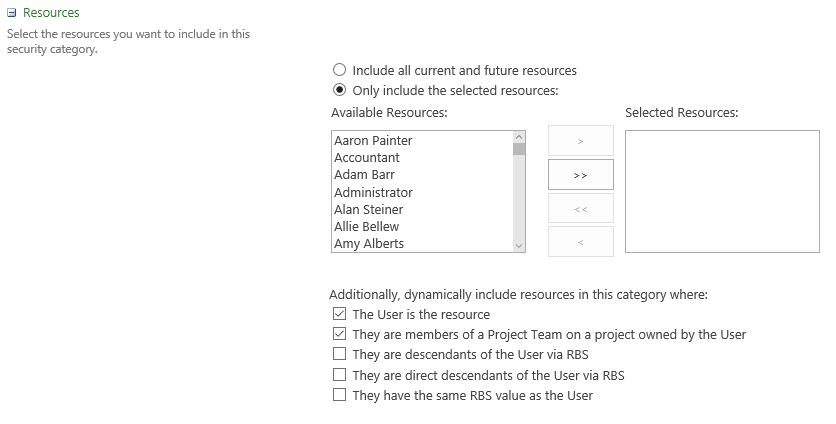
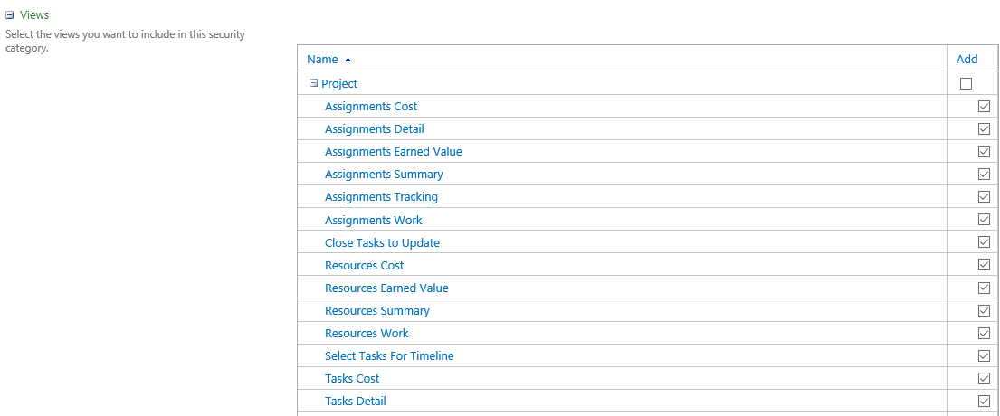
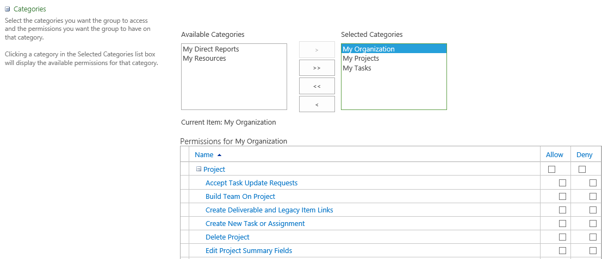
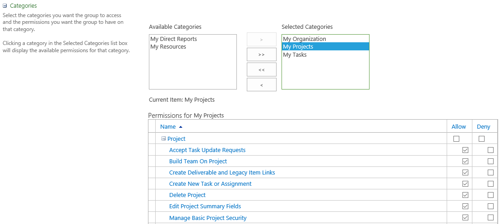
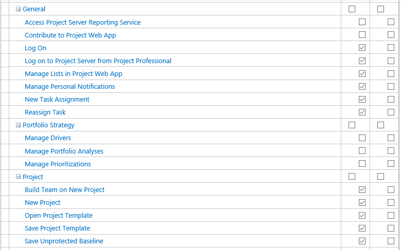
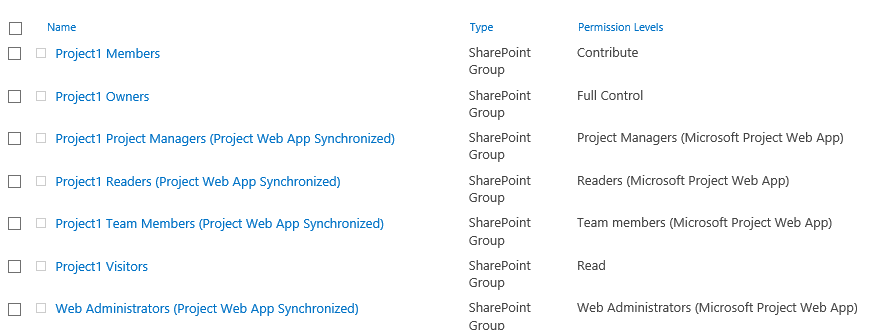

Sinceramente, configurar los permisos de Project en el modo clásico no es una tarea fácil. Así que Microsoft trató de simplificar el proceso creando un nuevo modelo de seguridad más sencillo y basado únicamente en los grupos de SharePoint correspondientes a los grupos de seguridad de Project. Y, para impulsarlo, este es el modelo por defecto en cualquier instalación de Project, tanto en OnPremises como Online. No obstante, su sencillez y su rigidez son su mayor hándicap. En la vida real, la mayoría de proyectos requieren del modelo de seguridad clásico ya que ofrece mucha más flexibilidad.

**Modelo de seguridad basado en los permisos de Sharepoint**

En este [modelo](https&#58;//technet.microsoft.com/es-es/library/jj219510%28v=office.15%29.aspx), simplemente hay que añadir a los usuarios a alguno de los grupos que detallaremos a continuación para que, automáticamente, se les apliquen unos permisos predeterminados en los proyectos (excepto los integrantes de grupo, que necesitan ser miembros del equipo de un proyecto):

·       **Administradores:** Los usuarios disponen de todos los permisos globales y de los permisos de categoría de la categoría Mi organización. Por lo tanto, tienen acceso ilimitado a todos los elementos de Project Web App.
·       **Visores de carteras de proyectos**: Los usuarios disponen de permisos para ver proyectos y los datos de Project Web App. Este grupo se ha diseñado para usuarios de alto nivel que necesitan disfrutar de visibilidad en los proyectos, aunque no se han asignado específicamente a las tareas de los mismos.
·       **Jefes de proyecto**: Los usuarios disponen de permisos para crear y administrar proyectos. Este grupo se ha diseñado para los propietarios de proyectos que asignan tareas a recursos.
·       **Jefes de cartera de proyectos**: Los usuarios disponen de varios permisos de creación de equipos y proyectos. Este grupo se ha diseñado para los jefes de alto nivel de grupos de proyectos.
·       **Administradores de recursos**: Los usuarios disponen de la mayoría de los permisos de recursos globales y de nivel de categoría. Este grupo se ha diseñado para los usuarios que administran y asignan recursos, y editan los datos de los mismos.
·       **Responsables de equipo:** Los usuarios disponen de permisos limitados en relación con la creación de tareas y los informes de estado. Este grupo se ha diseñado para personas con capacidad de dirección que no cuentan con asignaciones regulares en los proyectos.
·       **Integrantes de grupo:** Los usuarios cuentan con permisos generales para usar Project Web App, pero sus permisos son limitados en el nivel de proyecto. Este grupo se ha diseñado para proporcionar a todos los usuarios acceso básico a Project Web App.

Sin embargo, no se pueden crear grupos nuevos ni cambiar los permisos que aplican a estos grupos out-of-the-box. ¿Y eso es muy grave? Bueno, aunque los permisos aplicados por defecto a estos grupos tienen, en general, bastante sentido, siempre me he encontrado que es necesario cambiarlos por razones de negocio. Por ejemplo, los Jefes de Proyecto no pueden realizar algunas de estas funciones:

·       **Acceso al servicio de informes de Project Server**: sin este permiso no podrían ver informes de estado que se mostraran dentro del propio proyecto, normalmente se habilita.
·       **Cambiar flujo de trabajo**: puede ser que los Jefes de Proyecto deban reiniciar un flujo de trabajo ya en ejecución, sin esto no podrían.

Además, no se pueden aplicar los permisos a partir de una EDR (Estructura Detallada de Recursos), algo así como el organigrama de la empresa. Esto implica que no se pueden hacer cosas como, por ejemplo, que un Director de Dpto. vea sólo los proyectos de su Dpto. y que su Jefe de Área vea todos los proyectos de todos los departamentos de su área (pero no el del resto de áreas).

Para cambiar al modelo de seguridad clásico se deben realizar las siguientes acciones:

·       Si nuestra instalación es Project Server 2013 (On Premise) se debe abrir una consola de administración de SharePoint como administrador y ejecutar el siguiente comando:

Set-SPPRojectPermissionMode -Url http://Server/pwa -AdministratorAccount domain\user -Mode ProjectServer

·       Para Project Online se deben seguir los pasos del siguiente artículo: [Cambiar la administración de permisos en Project Web App para Project Online](https&#58;//support.office.com/es-es/article/Cambiar-la-administraci%C3%B3n-de-permisos-en-Project-Web-App-para-Project-Online-3537c79a-1a5f-4b1e-9de0-c437673352c6?ui=es-ES&amp;rs=es-ES&amp;ad=ES)

**Modelo de seguridad clásico de Project Server**

A nivel de Project Web App la seguridad se define mediante categorías y grupos. Las categorías se utilizan para indicar a qué proyectos, recursos y vistas tienen acceso los grupos a los que aplique dicha categoría. Además, sirven como plantilla para aplicar unos permisos por defecto a los grupos.

Los grupos de seguridad utilizan una o varias categorías. De esta forma, pueden combinarse la visibilidad de proyectos y recursos de unas con otras, superponiéndose sus permisos. Esto permite generar categorías que ofrezcan una visión muy granular de los proyectos y/o recursos y combinar las necesarias para los grupos que interesen. Es a nivel de grupo donde se definen los permisos que tendrán los usuarios sobre los objetos de Project y sobre algunos elementos de SharePoint que se sincronicen (páginas de detalle de proyectos, sitios de proyectos…).

**Estructura Detallada de Recursos (EDR)**

Dentro de la configuración de los campos personalizados de empresa existe una tabla de consulta que se debe completar para aplicar la seguridad sobre recursos y proyectos. Esta tabla es la EDR (Estructura Detallada de los Recursos). En inglés se conoce como RBS (Resource Breakdown Structure). Se usa exclusivamente en el modo clásico de seguridad para filtrar los proyectos y recursos que puede ver un usuario a partir del organigrama, como se verá posteriormente al analizar las categorías y los grupos. No necesariamente tiene que tener la misma estructura departamental que la empresa: se debe definir una estructura jerárquica que cumpla con los requisitos de visibilidad definidos por el negocio. A continuación se muestra un ejemplo de EDR para una empresa multinacional con varios países y compañías dentro de los mismos:

*Categorías*

Como bien se indica en el siguiente [documento](https&#58;//technet.microsoft.com/es-es/library/cc197354%28v=office.15%29.aspx#section3), mediante las categorías se pueden filtrar los **proyectos** sobre los que se tiene visibilidad mediante las siguientes opciones:

·       **El usuario es el propietario del proyecto o el administrador del estado en las asignaciones de dicho proyecto**: Los usuarios con permisos en la categoría donde está seleccionada esta opción pueden ver proyectos en los que son propietarios del proyecto o administradores de estado.
·       **El usuario está en el equipo del proyecto**: Los usuarios con permisos en la categoría donde está seleccionada esta opción pueden ver proyectos en los cuales son un recurso.
·       **El propietario del proyecto deriva del usuario mediante EDR**: Los usuarios con permisos en la categoría en la que está seleccionada esta opción pueden ver proyectos que son propiedad de sus descendientes en la EDR.
·       **Un recurso del equipo del proyecto deriva del usuario mediante EDR**: Los usuarios con permisos en la categoría en la que está seleccionada esta opción pueden ver proyectos en los cuales sus descendientes de EDR son un recurso.
·       **El propietario del proyecto tiene el mismo valor de EDR que el usuario**: Los usuarios con permisos en la categoría en la que está seleccionada esta opción pueden ver proyectos que son propiedad de otros usuarios con el mismo valor de EDR.

Además, en la categoría también se define la visibilidad de los recursos:

·       **El usuario es el recurso:** Los usuarios con permisos en la categoría en la que está seleccionada esta opción pueden verse ellos mismos como recursos.
·       **Son integrantes del equipo del proyecto de uno propiedad del usuario:** Los usuarios con permisos en la categoría en la que está seleccionada esta opción pueden ver recursos asignados a los proyectos de los cuales son propietarios.
·       **Derivan del usuario mediante EDR**: Los usuarios con permisos en la categoría en la que está seleccionada esta opción pueden ver a sus descendientes en la EDR.
·       **Derivan directamente del usuario mediante EDR**: Los usuarios con permisos en la categoría en la que está seleccionada esta opción pueden ver a sus descendientes directos en la EDR.
·       **Tienen el mismo valor de EDR que el usuario**: Los usuarios con permisos en la categoría en la está seleccionada esta opción pueden ver a otros usuarios con el mismo valor de EDR.

Y, por último, se seleccionan qué vistas son visibles para la categoría. Si se añaden nuevas vistas en el sistema, probablemente haya que revisar su estado en las diferentes categorías:

​

También se podrían definir los permisos para la categoría, pero no es una práctica recomendable ya que estos se definen en los grupos y sería bastante difícil de mantener la seguridad al solaparse unos permisos con otros.

*Grupos*

Los grupos de seguridad indican qué acciones y permisos puede realizar un usuario según el grupo al que pertenezca en Project Server. Para cada grupo de seguridad se indican las categorías que dan visibilidad al mismo: un grupo de seguridad puede tener más de una categoría. Se debe intentar que las categorías sean lo más granulares posibles para poder afinar la visibilidad de los diferentes perfiles. De esta forma, un grupo puede tener dos categorías con opciones de visibilidad diferentes para cada una de ellas, de tal forma que al grupo le aplicaría la totalidad de las mismas.

Por ejemplo, para el grupo "Jefes de Proyecto" se aplican, por defecto, tres categorías: Mi Organización, Mis Proyectos y Mis Tareas. Para ver los [permisos](https&#58;//technet.microsoft.com/es-es/library/cc197622%28v=office.15%29.aspx) que aplican a cada una de las categorías, simplemente hay que pinchar en su nombre (queda resaltado en azul). Si pulsamos en "Mi Organización", apenas hay permisos configurados para dicha categoría:

Sin embargo, para la categoría “Mis Proyectos”, sí hay seleccionados muchos permisos:

Además, para cada grupo se pueden definir lo que se conoce como “[Permisos Globales](https&#58;//technet.microsoft.com/es-es/library/cc197631%28v=office.15%29.aspx)”, es decir, permisos asignados directamente al grupo y que no dependen de ninguna de sus categorías:

¿Y cómo se combinan dentro de un grupo sus categorías? En este caso, nuestro grupo "Jefes de Proyecto" podrá ver los proyectos, recursos y vistas que estén definidos en las categorías "Mi Organización", "Mis Proyectos" y  "Mis Tareas". Y, además, tendrá todos los permisos que se hayan definido en el grupo para cada una de estas tres categorías: las configuraciones de seguridad de las categorías se solapan para el grupo que las contiene.

Desarrollemos un poco más el ejemplo. La categoría "Mi Organización" se suele utilizar para definir los permisos de los usuarios de alto nivel que no tienen que trabajar habitualmente con los proyectos: Directores de Área, Directores de Departamento... Como queremos que sólo puedan ver los proyectos correspondientes a su área o departamento, marcaríamos en la categoría las siguientes opciones:

·       El propietario del proyecto deriva del usuario mediante EDR.
·       Un recurso del equipo del proyecto deriva del usuario mediante EDR.

De esta forma, los usuarios podrán ver los proyectos cuyos propietarios o cuyos recursos estén por debajo de ellos en el organigrama definido en el EDR.

Por otro lado, para la categoría "Jefes de Proyecto" se podría seleccionar la siguiente opción:

•         El usuario es el propietario del proyecto o el administrador del estado en las asignaciones de dicho proyecto.

La intención es que el Jefe de Proyecto pueda ver los proyectos de los que sea propietario lo que, a efectos prácticos, significa que es el PM.

Muy bien, si ahora en el grupo "Jefes de Proyecto" incluimos las dos categorías, el resultado es que su visibilidad sobre los proyectos sería la adición de las opciones de las mismas:

·       El propietario del proyecto deriva del usuario mediante EDR. En este caso, como no habría ningún otro PM por debajo de él en el organigrama, no aplicaría.
·       Un recurso del equipo del proyecto deriva del usuario mediante EDR. Con esto, vería todos los proyectos cuyos recursos estuvieran por debajo de él en el EDR. Si un usuario de su Dpto. trabajase para un proyecto de otro Dpto. vería estos proyectos. Esto puede ser deseable o no, depende del negocio.
·       El usuario es el propietario del proyecto o el administrador del estado en las asignaciones de dicho proyecto. Vería los proyectos de los que fuese PM.

El mismo razonamiento se debe aplicar al resto de configuraciones de las categorías: los recursos y las vistas.

**Seguridad en SharePoint**

En paralelo a los grupos por defecto de Project se generan en SharePoint unos grupos que se corresponden lógicamente con los mismos. Sin embargo, no todos ellos se sincronizan automáticamente con los grupos de Project, es decir, aunque tengan el mismo nombre, los usuarios añadidos a un grupo de Project Server no se sincronizan automáticamente con el grupo de SharePoint. Esto sólo sucede con los grupos de SharePoint cuyo nombre incluye el texto "(Project Web App Synchronized)". Los grupos de SharePoint que se sincronizan con los de Project son los siguientes:

•         **Web Administrators (Project Web App Synchronized):** en este grupo se sincronizan los usuarios que tienen el permiso "Administrar Microsoft SharePoint Foundation" en Microsoft Project App.
•         **Project Managers (Project Web App Synchronized**): se incluyen en este grupo aquellos usuarios que han publicado el proyecto o los que tienen el permiso "Guardar Proyecto" en Microsoft Project Web App.
•         **Team Members (Project Web App Synchronized):** aquellos usuarios que pertenecen al equipo de un proyecto, tengan o no tareas asignadas.
•         **Readers (Project Web App Synchronized)**: en la versión 2010 eran los usuarios que pertenecían al equipo de proyecto y no tenían tareas asignadas, pero ahora mismo ya no se utiliza al quedar englobados en el grupo "Team Members".

Así pues, los que no se sincronizan son los restantes:

•         Administrators for Project Web App 
•         Portfolio Managers for Project Web App 
•         Portfolio Viewers for Project Web App 
•         Project Managers for Project Web App 
•         Resource Managers for Project Web App 
•         Team Leads for Project Web App 
•         Team Members for Project Web App

Si se utilizan estos grupos en los flujos de Project Server/Online para asignar tareas o enviar correos no queda más remedio que gestionar manualmente los usuarios de los mismos.

Respecto a la sincronización de los grupos de Project en los sitios de proyecto, la cosa cambia un poco. En los sitios de proyecto solo se sincronizan los siguientes grupos:

•         **Web Administrators (Project Web App Synchronized):** los mismos usuarios que a nivel de colección de sitios. 
•         **Project Managers (Project Web App Synchronized):** los usuarios que sean o hayan sido propietarios del proyecto.
•         **Team Members (Project Web App Synchronized):** los miembros del equipo del proyecto al que pertenezca el sitio.
•         **Readers (Project Web App Synchronized)**

****

**Conclusiones**

Como se ha podido comprobar, definir la seguridad en Project Server no es baladí: implica organizar tanto la visibilidad y permisos que tendrán los usuarios a nivel de Project como a nivel de SharePoint. Y gestionar los permisos de Project conlleva entender las necesidades de negocio y tratar de darles forma gestionando adecuadamente las categorías y su solapamiento en los diferentes grupos. Además, aplicar el EDR a los filtros de categoría complica un poco más todo el asunto.

Mi recomendación es definir las categorías con la mayor granularidad posible para poder aplicarlas más fácilmente en los diferentes grupos. Y tener paciencia, al final, la experiencia es un grado y, tras el primer proyecto, se va comprendiendo mejor cómo funcionan los permisos y cómo aplicarlos para dar respuesta a los requerimientos de los clientes.

**José Rafael García**

[josex1975@gmail.com](mailto&#58;josex1975@gmail.com)

Blog: [www.projectservernotes.com](http&#58;//www.projectservernotes.com/) | Twitter: jrgarcia1975​

