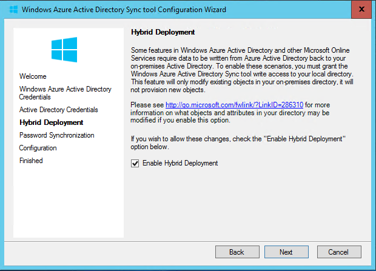
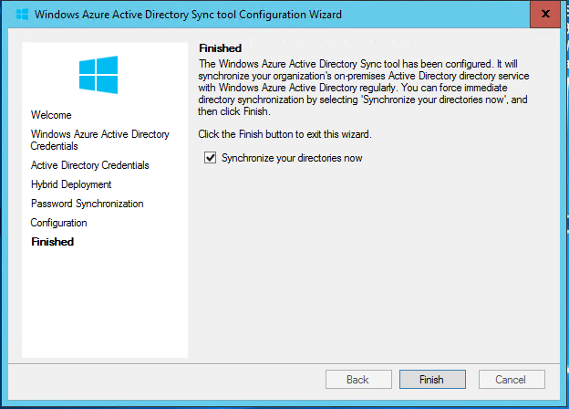
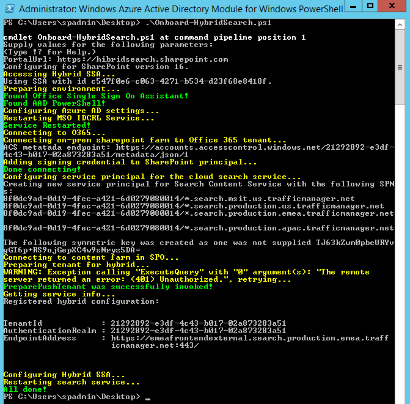

Un paso que siempre ha parecido natural en el roadmap de SharePoint y su alineación con el stack Cloud de Microsoft, en especial con SharePoint Online, con el lanzamiento de SharePoint 2016 y con la capacidad de consumir y servir recursos a/desde Azure, ha sido por qué tener todos los componentes de una granja en un entorno OnPremise. A estas alturas muchas organizaciones han detectado las ventajas de llevar servicios hacia la nube, tanto a nivel de coste como a nivel de disponibilidad del servicio. Por ello, la posibilidad de subir a la nube uno de los servicios más importantes de cara al trabajo de los usuarios como es la búsqueda adquiere una gran relevancia, y con la nueva implementación de *Hybrid Search* hay que reconocer que Microsoft se ha salido, simplificando el establecimiento del servicio y con unos resultados realmente espectaculares. Adicionalmente, esta capacidad nos trae de regalo la capacidad de usar Delve con la información sin importar que esta se encuentre en el entorno OnPremise… ¡Todo son ganancias!

Pero no adelantemos acontecimientos… primero, fijémonos en la idea generatriz del sistema de búsqueda hibrida. El nuevo sistema se base en un "*Single Index File*" que estará alojado en la nube… ¿Esto nos compromete la seguridad? Pues… no, en modo alguno, puesto que toda la metadata indexada viaja a la nube de forma cifrada, por lo que nuestro entorno OnPremise permanece securizado en todo momento. Este fichero reside en la aplicación de búsqueda de O365, la cual es consumida desde nuestra implementación OnPremise. Esto tiene una gran ventaja de cara al coste… nos permite eliminar los servidores específicos de búsqueda, o liberar capacidad en la capa de aplicación o backend de la granja SharePoint.

Las ventajas de esta aproximación hibrida son las siguientes:

·       El factor crítico del tamaño del fichero de índice deja de ser una preocupación para los administradores de Sistemas, lo que permite reducir recursos para albergarlo, puesto que ahora residirá en 365
·       En versión definitiva, esta solución permitirá rastrear granjas de 2007, 2010, 2013 y 2016
·       Los resultados de búsqueda estarán **unificados**, de forma que son clasificados para la relevancia de forma conjunta, y se permite aplicar refinamientos tanto sobre contenido OnPremise como Online
·       Los usuarios dispondrán de la última experiencia de búsqueda sin necesidad de actualizar la plataforma
·       En caso de actualización no es necesario migrar el fichero de índice a la nueva versión, ya que Office 365 lo hace de forma automática

Los únicos impactos que tiene su implementación a día de hoy serán los siguientes:

·       La búsqueda de sitio deja de funcionar, aunque se pueden hacer configuraciones para que funcione a través de la Cloud Search Service Application (CSSA)
·       A día de hoy, no funciona en escenarios de eDiscovery o en Cross Site Publishing

Para montar el ejemplo del presente artículo partimos de la siguiente plataforma:

·       SharePoint 2016: Tenemos montada una granja en una subscripción Azure con los siguientes servidores:
o   Controlador de Dominio Windows 2016 (ya que nos ponemos, probamos todo).
o   Servidor Windows 2012 R2 Server con SQL Server 2014 SP1.
o   Servidor Windows 2012 R2 Server con la Technical Preview de SharePoint 2016.
·       La preview de búsqueda solo funcionará con SP2013 con SP1 y CU agosto 2015 instalado y en SP2016
·       Subscripción Office 365 con licencias E3 (trial) 
·       Se tiene que haber establecido la federación entre el Azure AD de Office 365 y el Dominio local.
·       Se deben tener configuradas las cuentas administradas para SharePoint en nuestro AD y la granja levantada
·       Adicionalmente, hay que descargar los siguientes scripts de MS Connect: 
o   Onboard-HybridSearch.ps1
o   CreateCloudSSA.ps1

Los pasos que vamos a seguir son los siguientes:

1.       Configurar la Sincronización de Directorio entre Office 365 y nuestro entorno SharePoint.
2.       Verificar que la granja dispone de una cuenta de Servicio de Búsquedas, y una cuenta administrada de acceso al contenido.
3.       Crear una aplicación de Servicio de Búsquedas Cloud.
4.       Configurar la autenticación entre servidores.
5.       Crear un origen de contenidos para rastrear.
6.       Lanzar un rastreo completo. Tras su finalización, el contenido del entorno OnPremise estará disponible en el centro de búsquedas online, y en Delve.

¿Todo claro hasta ahora? Pues… ¡Manos a la obra!

**Sincronización del Directorio Activo con 365**

Para realizar la sincronización de directorio activo, para este ejemplo lo vamos a implementar con el clásico DirSync, aunque siempre es deseable en un futuro el disponer de *Single Sign On*para evitar que nuestros usuarios tengan que introducir las credenciales de nuevo cuando accedan a un sitio en Office 365. En especial, como vamos a mover nuestro centro de búsquedas a la nube. Para cumplir estos requisitos sería deseable configurar el Active Directory Federation Services (ADFS), aunque en este caso nos implicaría el despliegue de al menos dos máquinas adicionales: Una para DirSync y otra para ADFS, siendo deseable en contar para estas máquinas de una configuración de Alta Disponibilidad (al menos 4 máquinas, y deseable estando distribuidas entre entorno OnPremise y la nube).

Para realizar esta configuración, en primer lugar, desde el portal de Administración del tenant de Office 365, vamos a ir a Usuarios à Usuarios Activos , y vamos a añadir un usuario administrador de AD:

A continuación, desde la misma ventana, pulsaremos sobre Configurar la sincronización del Directorio Activo. Esta acción nos llevará a una ventana donde podremos descargar:
· La herramienta de FixIt para el AD on Premise:

· La herramienta de Directory Sync:

**Nota:** Para establecer una sincronización de directorios, es necesario haber añadido y verificado antes un dominio público, siendo el de pruebas (XXX.onmicrosoft.com) no valido para realizar esta sincronización

Es conveniente, en este paso, el activar la sincronización de directorio, para que en las siguientes fases no tengamos problemas en la detección de dicha activación.

Al descargar el software, guardarlo en local, puesto que lo vamos a utilizar en las máquinas controladora de Active Directory y servidor DirSync. El siguiente paso será subir y ejecutar, con la cuenta de administrador del dominio, la herramienta FixIt en el controlador de Dominio. Esta herramienta recorrerá el directorio activo buscando identificadores y valores de los objetos (e incluso duplicados) que nos pudieran dar errores a la hora de sincronizar el directorio con nuestro AD en la nube.

A continuación, vamos a subir la herramienta de sincronización al servidor de DirSync, y lo ejecutamos. Conviene tener claras las opciones de las que disponemos para realizar la sincronización:

·       **Entornos de sincronización de un solo bosque**
o   Sincronización de Directorio con Sincronización de Password. Esta es la opción recomendada para el entorno de búsqueda hibrida.
o   Sincronización de Directorio con Single Sign-On (SSO).
·       **Entornos de sincronización multibosque**
o   Sincronización de Directorio con Single Sign-On (SSO).
o   Azure Active Directory Synchronization Services (AAD Sync).
o   Forefront Identity Manager 2010 R2 + Windows Azure Active Directory Connector for Forefront Identitiy Manager 2010 R2.

Tal y como hemos comentado anteriormente, vamos a subir el DirSync descargado desde el portal de 365 a la máquina virtual que realizará las funciones de sincronización, y ejecutamos el wizard:

**NOTA:** El wizard de DirSync tiene como requisitos previos el .Net Framework 3.5 SP1 y el .Net Framework 4.5.

Pulsamos siguiente, aceptamos el texto legal, y en la siguiente ventana, seleccionamos la ruta en la que vamos a instalar el DirSync. A continuación, el sistema realiza la instalación (puede llevarse un rato).

Al final de la instalación, el sistema ofrecerá lanzar la configuración de la sincronización.

**Configuración de la Sincronización**

El wizard de configuración nos va a ir solicitando los datos necesarios para establecer la sincronización:

Los datos solicitados son:
· Credenciales del administrador global de Office 365 365.
· Credenciales de un administrador del dominio OnPremise.

En la siguiente ventana, es **imprescindible** pulsar sobre los checks de configuración híbrida, y de replicación de password. En caso contrario, la contraseña no se sincronizará con la nube y nuestro escenario no funcionará correctamente:

Tras estos dos pasos, el sistema comenzará la configuración y tras cierto tiempo, nos informará del final de la configuración correcta y nos permitirá lanzar la sincronización de directorios:​

**Configuración de la Aplicación de Servicio de Búsqueda híbrida**

Para realizar este paso, no es conveniente tener configurada la aplicación de servicio de búsquedas, puesto que nos la vamos a llevar al entorno Cloud. Para configurar esta aplicación de servicio vamos a usar el script de configuración que comentábamos en el comienzo del artículo, llamado CreateCloudSSSA.ps1.

Para ello, en el servidor que contenga la administración central del SharePoint Server 2013/2016 realizamos los siguientes pasos:

1.       Subir el script denominado CreateCloudSSA.ps1, y ejecutarlo desde una ventana de PowerShell abierta con la cuenta de administración
2.       Cuando lo vaya solicitando rellenar:
a.       El nombre del servidor de SharePoint Server destinado a alojar la aplicación de servicio.
b.       La cuenta de servicio de búsquedas en formato dominio\nombre usuario.
c.       Nombre de la aplicación de servicio de búsquedas en nube.
d.       El nombre del servidor de bases de datos de la granja.
3.       Esperar el mensaje de confirmación de éxito en la creación de la aplicación de servicio.

El script puede ser modificado para que no pida estos parámetros, y es necesario revisar:

·       Que en el cmdlet NewSPEnterpriseSearchServiceApplciation incluimos el modificador –CloudIndex $true.
·       Que la cuenta utilizada como cuenta del servicio de búsqueda sea una cuenta administrada dada de alta previamente en la configuración de la granja.

**Configuración de Autenticación Servidor a Servidor**

Al igual que hacíamos en entornos multigranja, cuando configurábamos granjas dedicadas para la búsqueda o el cacheo, es necesario establecer un "estado de confianza" entre los servidores de las diferentes granjas, para lo cual vamos a configurar la autenticación "*Server to Server*". Esta autenticación permite acceder y solicitar recursos entre ambos entornos en nombre de los usuarios.

Para ello vamos a seguir los siguientes pasos en el servidor SharePoint Server 2013/2016:

1.       Descargar e instalar el complemento [Microsoft Online Services Sign-In Assistant for IT Professionals RTW](http://www.microsoft.com/en-us/download/details.aspx?id=41950)  desde el Centro de Descargas Microsoft

​

2. Instalar el módulo de Azure Active Directory para Windows Powershell (64 bits)

3. Subir el script que comentábamos al comienzo del artículo denominado Onboard-HybridSearch.ps1 y ejecutarlo desde una ventana de PowerShell en modo administrador.

4. Cuando el sistema lo solicite, teclear la dirección base del SharePoint Online de la subscripción 365, e introducir las credenciales del administrador global

**Creación de un origen de Contenido**

Además del origen de contenido "todos los sitios", que por defecto contiene todas las colecciones de sitios creadas, vamos a hacer una prueba adicional, configurando otro origen de contenido que rastree un "file share" local al servidor. Esta configuración es una forma sencilla de permitir que nuestros documentos en file share estén disponibles también para ser visualizados por Delve, y eliminar los silos de información.

Para realizar este ejemplo, debemos partir de un file share que hemos creado en el mismo servidor de SharePoint:

Para añadir el nuevo origen de contenido, desde el servidor OnPremise:

1.       Verificar que la cuenta con la que está logado es administradora de la aplicación de servicio de búsqueda Cloud.

2.       Desde la página home de la administración Central, navegar a Gestión de aplicaciones à Gestionar aplicaciones de servicio.

> 3. Pulsar sobre la aplicación de servicio de búsquedas Cloud que hemos creado.

> 4. En la página de administración de la búsqueda, en la sección de Crawling, pulsar en Content Sources.

> 5. En la página de gestión de Orígenes de Contenido, pulsar sobre nuevo origen de contenido.
> 6. Teclear el nombre del Origen de Contenidos, seleccionar “File Shares”, e introducir la ruta al file share configurado.

> 7. Pogramar los rastreos incrementales y full y aceptar

**Configuración Adicional**

Para que las búsquedas sean siempre a través de la nube, y en particular evitarnos el tener que configurar un centro de búsquedas, podemos antes de abandonar esta sección configurar el centro de búsquedas en la ruta de SharePoint Online en Office 365 a través del mensaje de advertencia de la parte superior.

Esta configuración funciona especialmente bien en aquellos casos en los que se haya establecido el ***Single Sign On*** entre ambos entornos mediante DirSync y AD FS.

**Lanzar rastreo completo**

Estamos acabando este tutorial, y ahora vamos a lanzar un rastreo completo para comprobar que efectivamente desde 365 nuestros datos están accesibles y se pueden realizar búsquedas sobre ellos. Para ello:

1.       Verificar que la cuenta de usuario que está realizando este procedimiento es administrador de la aplicación de servicio de búsquedas Cloud.
2.       Desde la administración central à Gestión de Aplicaciones à Gestión de aplicaciones de Servicio.
3.       Pulsar sobre la aplicación de servicio de búsquedas en Cloud.
4.       En la ventana de administración, en la sección "*Crawling*" seleccionar "*Content Sources*"
5.       En la lista de orígenes de contenido, pulsar sobre el origen configurado en el paso anterior, y seleccionar Comenzar rastreo completo (*Start Full Crawl*).

Ahora, desde la ventana de log de rastreo podemos realizar el seguimiento del proceso, aunque normalmente es el momento adecuado para ir a por un vaso de agua, o bajar a fumar un cigarro mientras acaba la operación.

**Comprobación de búsqueda híbrida**

Para comprobar si ha funcionado correctamente toda la configuración, la forma más rápida es abrir el centro de búsquedas online, y seleccionando el origen "Everything", buscar isexternalcontent:1. Si todo ha ido correctamente, nuestra ventana de resultados mostrará la información contenida tanto en los sitios de SharePoint Online y OnPremise, como del FileShare adicional

**NOTA:** Es muy importante que el usuario que realiza la búsqueda tenga permisos sobre todos los contenedores, ya que, en caso contrario, no saldrá aquella documentación para la que no tenga permisos y puede dar la impresión de que no está funcionando correctamente (es la típica situación en la que puedes estar media hora preguntándote por que no funciona…)

**Conclusiones**

Como hemos visto a lo largo del artículo, no resulta especialmente complicado configurar la hibridación de la búsqueda, y sigue la tendencia de Microsoft de aproximar ambos mundos, Cloud y OnPremise, de forma que la interacción con toda la plataforma corporativa sea transparente para el usuario.

Con esta nueva búsqueda, podemos ahorrar en costes y mantenimiento, conservando el mismo servicio y ganando nuevas funcionalidades como Machine Learning que difícilmente se adaptarán al entorno OnPremise en el corto a medio plazo.

**Notas:** Mis agradecimientos para Luis Emilio López, por su estupendo artículo sobre configuración y administración de DirSync en [No me toques el router!](http://blogs.encamina.com/nometoqueselrouter/) y a Alberto Diaz por lanzarme la idea para este artículo.

**Fabián Calvo**
 Gerente Soluciones Cloud & Pseller

[fcalvo@encamina.com](mailto:fcalvo@encamina.com) 
@fcvspain

[http://blogs.encamina.com/sextosharepoint/](http://blogs.encamina.com/sextosharepoint/) 
[http://www.encamina.com](http://www.encamina.com/)

 
 
import LayoutNumber from '../../../components/layout-article'
export default LayoutNumber
