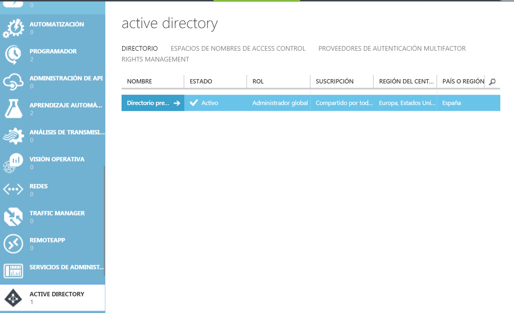
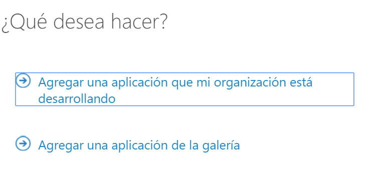
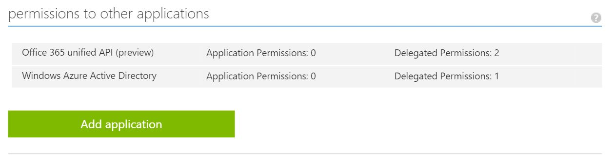

​Para todos los que seguimos las novedades que hay en el desarrollo de Office 365, hemos podido observar que desde la división de Office 365 se están realizando muchos esfuerzos en cumplir la hoja de ruta impulsada por Satya Nadella: todo servicio de Microsoft debe de poder ejecutarse en cualquier dispositivo y cualquier plataforma. En un primer lugar, todo lo que estamos viendo son esfuerzos para que todo servicio de Office 365 disponga de una API REST y un sistema de autenticación bastante claro. Esto lo podemos observar en la cantidad de API's disponibles y su posterior unificación en una única API. Para el tema de la Autenticación disponemos de la librería ADAL de la cual ya hemos hablado en anteriores artículos. Recientemente habían pocas novedades en cuanto a poder utilizar herramientas en otras plataformas no Windows, pero desde los últimos meses y propiciado por la salida de Visual Studio Code todo esto está cambiando. En muchos productos de la misma forma que sacan un SDK para Windows, el equipo de producto también proporciona herramientas para los desarrolladores de Android e IOS.

Ahora bien, ¿cómo podemos utilizar Office 365 en todas las plataformas? Por un lado, tenemos el mensaje que en SharePoint Online no es posible utilizar las Soluciones de Tipo Granja para extender la plataforma, la única posibilidad es o bien utilizando JavaScript o bien desarrollando aplicaciones o Add-Ins. Ya hemos visto cómo implementar Add-Ins dentro de una aplicación ASP.NET MVC, ahora vamos a ver cómo hacer una aplicación con Node.js.

**¿Qué es Node.js?**

Node.js es un servidor de aplicaciones cuya principal característica es que está implementado en JavaScript. Este motivo ha hecho que haya incrementado mucho su popularidad entre los desarrolladores Web. No hace falta conocimientos avanzados para tener levantado un sitio web con la ventaja de que es multiplataforma y su motor de ejecución es V8 (el motor de ejecución del navegador Google Chrome). Con un código tan sencillo como el siguiente tenemos el clásico "Hola mundo" en el servidor:

```
var http = require('http');
http.createServer(function (request, response) {
    response.writeHead(200, {'Content-Type': 'text/plain'});
    response.end('Hello World\n');
}).listen(8000);
console.log('Server running at http://127.0.0.1:8000/');
```

Pero Node.js, no  se ha popularizado solamente por ser  un servidor, sino por dos motivos más :

1. La posibilidad de extender Node.js mediante módulos a través de Node Package Manager (NPM). Dentro de estos paquetes seguro que nos suenan algunos como Bower, Grunt, Gulp, Express, etc.
2. Desarrollo homogéneo entre cliente y servidor, seguro que nos suena el stack llamado MEAN, que significa que tiene una base de Datos MongoDB y Express, AngularJS y Node.js como servidor.

**Visual Studio Code**

Mucho estamos hablando de herramientas Open Source y en las que Microsoft se ha posicionado en cuanto a su uso e incluso evolución. Pero si hay algo que podemos decir es que la joya de la corona de la multinacional de Redmond en cuanto a herramientas no es otra que Visual Studio, el IDE de desarrollo más completo del mercado. El único defecto que tiene (si se puede llamar defecto) es que solamente se puede ejecutar en un entorno Microsoft. Para paliar este problema, Microsoft anunció un IDE totalmente gratuito y multiplataforma: Visual Studio Code.  Una herramienta 100% diseñada para desarrolladores Web.

Este pequeño Visual Studio tiene alguna de las características de su hermano mayor, como es su fácil uso, el Intellisene, el refactoring y los snippets. Además como gran ventaja es que se complementa muy bien con Node.js y con todo el stack Web. Incluso disponemos de una plantilla de Youman (Youman es una herramienta para crear proyectos, similar a los templates de Visual Studio pero para el mundo FrontEnd) para poder personalizar a nuestro gusto los colores del IDE.

Tras esta introducción  vamos a ver como comenzar con un desarrollo sobre la API Unificada de Office 365.

**Ejemplo Aplicación Angular con la API Unificada y alojada en Node.js**

**Requisitos Previos:**

- Instalación Node.js -&gt; [https://Node.js.org/en/](https&#58;//nodejs.org/en/)
- Instalación Visual Studio Code -&gt; [https://code.visualstudio.com/](https&#58;//code.visualstudio.com/)

**Manos a la obra:**

1. Registrar la aplicación en Azure. Para ello tendremos que realizar los siguientes pasos:
    - Ir al portal de Azure ([http://manage.windowsazure.com](http&#58;//manage.windowsazure.com/))  y logarse.
    - Seleccionar al Active Directory.



    - Seleccionamos la pestaña Aplicaciones y en el lateral de abajo agregamos una nueva aplicación.
    - Se mostrará un mensaje sobre el Tipo de Aplicación que vamos a implementar, si es una aplicación desarrollada por nuestra organización o si es una aplicación de la Galería de Azure . En nuestro caso vamos a optar por la primera opción.




    - A continuación nos solicita el nombre de la Aplicación que estamos desarrollando y el tipo: Desarrollo Web o desarrollo Nativo. En nuestro caso optamos por desarrollo Web.
    - Para finalizar la creación de la App nos solicitará el punto de entrada donde se autenticará el usuario (al estar en un entorno de desarrollo indicaremos https://localhost:44300) y el URI de la Aplicación (por ejemplo puede ser nuestro Tenant de Office 365).
    - Al finalizar el aprovisionamiento de la aplicación, pulsaremos sobre la opción Configuración del menu superior para obtener el CliendID y generaremos la KEY válida. Estas valores lo guardaremos para poder utilizarlos posteriormente dentro de nuestro desarrollo.
    - El siguiente paso que realizaremos es indicar a que API's va a tener acceso nuestra Aplicación.




    - Pulsamos clic en el botón ADMINISTRAR MANIFIESTO en el pie de página y luego seleccionamos Descargar Manifiesto. Con cualquier editor de Texto abrimos el manifiesto  y modificamos el valor de la variable oauth2AllowImplicitFlow true.
    - Una vez modificado el manifiesto, lo subimos dentro del mismo botón Administrar Manifiesto, pero en esta ocasión pulsamos sobre Cargar Manifiesto.


2. Provisionando el esqueleto del proyecto:

    - Creamos una nueva carpeta de proyecto en alguna parte de  nuestro equipo.
    - Abrimos un consola de Shell en la que estén cargadas las variables de entorno de Node.js, y nos ubicamos dentro de la carpeta creada en el paso anterior.
    - Inicializamos Bower para ello ponemos la siguiente instrucción:

```
>bower init
```

    - Creamos un fichero de configuración en la raíz de nuestros proyectos llamado .bowerrc.

```
>touch .bowercc
```

    - Abrimos el fichero .bowercc y especificamos la ubicación donde van a estar los scripts descargados.

```
{
    "directory": "lib"
}
```

    - Especificamos la ubicación donde van a estar los scripts descargados.

```
>bower install bootstrap angular angular-route adal-angular --save
```

    - A continuación utilizamos bower para descargarnos las siguientes librerías, mediante la siguiente instrucción
    - Para finlizar creamos un fichero index.html y una carpeta app.


3. Construyendo la Aplicación:

    - Abrimos la carpeta con Visual Studio Code. File-&gt; Open Folder.


    - Abrimos el Index.html y añadimos todas las referencias necesarias


```
<!DOCTYPE html>
<html lang="en">
<head>
               <meta charset="UTF-8">
               <title>Compartimoss My Organization</title>
               <link rel="stylesheet" href="lib/bootstrap/dist/css/bootstrap.min.css">
</head>
<body ng-app="app">
               <div ng-view></div>
               <!-- JQuery and Bootstrap references -->
               <script type="text/javascript" src="lib/jquery/dist/jquery.min.js"></script>
               <script type="text/javascript" src="lib/bootstrap/dist/js/bootstrap.min.js"></script>
               <!-- Angular reference -->
               <script type="text/javascript" src="lib/angular/angular.min.js"></script>
               <script type="text/javascript" src="lib/angular-route/angular-route.min.js"></script>
               <!-- ADAL reference -->
               <script type="text/javascript" src="lib/adal-angular/dist/adal.min.js"></script>
               <script type="text/javascript" src="lib/adal-angular/dist/adal-angular.min.js"></script>
               <!-- App scripts -->
               <script type="text/javascript" src="app/app.js"></script>
</body>
</html>
```


    - Creamos un archivo app.js en la carpeta de aplicaciones, en él definiremos los  módulos de Angular para app.services , app.controllers y app ( con referencias de dependencia en los otros dos módulos ).


```
angular.module("orgExplorer",[app.services", "app.controllers", "ngRoute", "AdalAngular"])
```

    - La Aplicación aprovechará la ruta entre Angular y ADAL para realizar la autenticación por lo necesitaremos ampliar el modulo de la aplicación de la siguiente forma:


```
angular.module("orgExplorer", [app.services", "app.controllers", "ngRoute", "AdalAngular"])
.config(["$routeProvider", "$httpProvider", "adalAuthenticationServiceProvider", function ($routeProvider, $httpProvider, adalProvider) {
    $routeProvider.when("/login", {
        controller: "loginCtrl",
        templateUrl: "/app/templates/view-login.html",
        requireADLogin: false
    })
    .when("/user", {
        controller: "meCtrl",
        templateUrl: "/app/templates/view-user.html",
        requireADLogin: true
    })
    .when("/user/:id", {
        controller: "userCtrl",
        templateUrl: "/app/templates/view-user.html",
        requireADLogin: true
    })
    .otherwise({ redirectTo: "/login" });
```

    - A continuación, configurarmos las Rutas que utilizará nuestra aplicación utilizando la dependencia de $routeprovider. Fíjese en las dependencias ADAL adicionales y el uso de requireADLogin en cada ruta ( esto obligará a un inicio de sesión cuando es necesario).


```
adalProvider.init({
    instance: "https://login.microsoftonline.com/",
    tenant: "encamina.onmicrosoft.com",
    clientId: "11111-111-2111-111111",
    endpoints: {
        "https://graph.microsoft.com/": "https://graph.microsoft.com"
    }
}, $httpProvider);
```

    - También es necesario inicializar el proveedor de ADAL con los detalles de la implementación de la inscripción antes. Asegúrese de actualizar sus datos a continuación con su inquilino y ClientID
    - A continuación rellenaremos la lógica que va a ir dentro de los controladores de AngularJs. El ejemplo quedaría de la siguiente forma:


```
(function() {
               "use strict";
               angular.module("app.services", [])
               .factory("appService", ["$http", "$q", function ($http, $q) {
                              var appService = {};        
                              appService.getUser = function(path) {
                                            var deferred = $q.defer();                                       
                                            var user = { user: null, manager: null, directReports: null, files: null };                                 
                              $http.get("https://graph.microsoft.com/beta/" + path).then(function(r) { 
                                                           user.user = r.data;
                                                           if (user.user !== null && user.manager !== null && user.directReports !== null && user.files !== null)
                                                                          deferred.resolve(user); 
                                            });
                                            $http.get("https://graph.microsoft.com/beta/" + path + "/manager").then(function(r) { 
                                                           user.manager = r.data;
                                                           if (user.user !== null && user.manager !== null && user.directReports !== null && user.files !== null)
                                                                          deferred.resolve(user); 
                                            }, function(er) {
                                                           user.manager = {};
                                                           if (user.user !== null && user.manager !== null && user.directReports !== null && user.files !== null)
                                                                          deferred.resolve(user); 
                                            });
                              $http.get("https://graph.microsoft.com/beta/" + path + "/directReports").then(function(r) { 
                                                           user.directReports = r.data;
                                                           if (user.user !== null && user.manager !== null && user.directReports !== null && user.files !== null)
                                                                          deferred.resolve(user); 
                                            });
```

    - Para finalizar la aplicación tan solo nos quedará por crear las dos vistas en la que se muestra la información de obtenida de la API de Office 365.  Por un lado, crearemos una view llamada view-login.html con el siguiente contenido:


```
 <button class="btn btn-primary btn-block" ng-click="login()">Sign-in with Office 365</button>
```

    - Y una vista llamada view-user.html con la siguiente estructura:


```
<div class="row">
               <div class="col-xs-6">
                              <h2>Manager: <a href="#/user/{{data.manager.objectId}}">{{data.manager.displayName}}</a></h2>
                              <h2>Employee: {{data.user.displayName}}</h2>
                              <h2>Direct Reports: 
                                            <span ng-repeat="report in data.directReports.value">
                                                           <a href="#/user/{{report.objectId}}">{{report.displayName}}</a>
                                                           <span ng-show="$index < data.directReports.value.length - 1">, </span>
                                            </span>
                              </h2>
               </div>
               <div class="col-xs-6">
                              <h2 ng-show="data.user.displayName">{{data.user.displayName}}'s files</h2>
                              <ul>
                                            <li ng-repeat="file in data.files.value">{{file.name}}</li>
                              </ul>
               </div>
</div>
```

4. Ahora para ejecutar la aplicación desde Visual Studio Code tendremos que crearnos un fichero de inicialización de nuestra aplicación, por convención se suele utilizar un fichero app.js dentro de la raíz de nuestro. En dicho fichero vamos a levantar un servidor Web y lo dejaremos en escucha en el Puerto deseado. Para realizar esta acción utilizaremos Express, que es un paquete de Node.js que tiene muchas características entre las que destaca la función de ejercer de servidor Web (muy ligero y muy óptimo para los entornos de desarrollo). En caso de que no lo tengamos instalado con la siguiente instrucción lo instalamos: npm install express –g -save

```
   var express  = require('express');
    var app      = express();                               // create our app w/ express
    var morgan = require('morgan');             // log requests to the console (express4)
    var bodyParser = require('body-parser');    // pull information from HTML POST (express4)
    var methodOverride = require('method-override'); // simulate DELETE and PUT (express4)
    // configuration =================
    app.use(express.static(__dirname));                 
    app.use(morgan('dev'
    app.use(bodyParser.urlencoded({'extended':'true'}));            
    app.use(bodyParser.json());                                     
    app.use(bodyParser.json({ type: 'application/vnd.api+json' })); 
    app.use(methodOverride());
    // listen (start app with node server.js) ======================================
    app.listen(8080);
```


Ahora si ejecutamos nuestra aplicación, visualizamos en primer lugar un botón para logarnos en Office 365, que nos dirige a la página de Login de Office 365 y posteriormente se vuelve a la aplicación, donde se muestran los usuarios de nuestra organización.

**Conclusión**

Microsoft cada vez está haciendo más accesibles todos sus servicios y todas sus herramientas, de forma que los desarrolladores de Office/SharePoint cuenten con múltiples posibilidades para desarrollar en cuanto a lenguajes de programación y entornos de desarrollo. Tenemos la posibilidad de poder hacer que todos los servicios de Office se puedan consumir independientemente del entorno en el que nos encontremos. Esto hace muy enriquecedor nuestro día a día y con lo cual podemos plantear muchos escenarios posibles y acceder a diversos entornos donde anteriormente no eran posibles ejecutar nuestros desarrollos.


**Adrián Diaz Cervera**
Software Architect Lead at Encamina
MVP Office Servers and Services 
[http://blogs.encamina.com/desarrollandosobresharepoint](http&#58;//blogs.encamina.com/desarrollandosobresharepoint)
[http://geeks.ms/blogs/adiazcervera](http&#58;//geeks.ms/blogs/adiazcervera)      
adiaz@encamina.com @AdrianDiaz81

