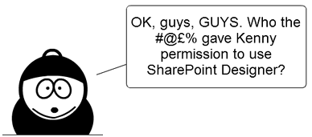
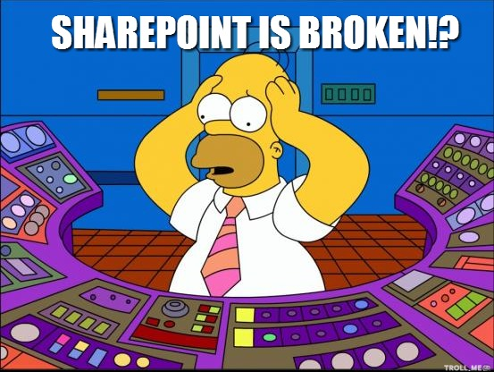

En esta ocasión quisiera presentarle algunos puntos para que los tengan en cuenta:

**Primero definamos: ¿A qué se le puede llamar "fracaso"?**

Recordemos que un proyecto tiene 4 variables fundamentales que pueden determinar si es o no un fracaso según su variación: Tiempo, coste, alcance, calidad. Cuando alguna de estas variables se ve afectada y el resultado es este por ejemplo (No aplica si es un control de cambios):

1.       Para mantener el alcance, nos vamos a demorar más y le va a costar más señor cliente.

2.       Para entregarle el proyecto en esa fecha, vamos a quitar estos puntos del alcance (X, Y, Z).

3.       Para entregar completamente el proyecto (todo el alcance) vamos a tener que bajar la calidad del producto

Que el proyecto "podría" o "tienda" a ser un fracaso depende de cuanta sea la desviación de las variables a la hora de evaluar el proyecto, en algunos casos pueden verse afectadas estas variables sin que el proyecto fracase (cuando la variación no tiene un impacto fuerte en el proyecto).

*Nota**: ¡¡Simplemente, si al cliente no le gusta el resultado, el proyecto es un fracaso!!*

**Ahora sí, Working on it:**
 
**Punto 1: Vender por vender**

No se preste para escribir la historia de Santiago Nasar, esta historia ya la escribió Gabriel García Márquez en su libro "Crónica de una muerte anunciada", si se da cuenta que el proyecto que se vendió a un cliente no es ni el 50% de lo que el realmente espera, levántese y corra lejos… o mejor aún, levante la mano y ponga en contexto a todos los involucrados, es mejor hacerlo cuando se está iniciando la implementación que a la hora de entregar.

**Punto 2: Escuche al cliente (definición del alcance)**

Si los requerimientos no son claros o están mal desde el arranque del proyecto, nunca vamos a triunfar. Escuche detenidamente al cliente, entienda que es lo que quiere y defina qué es lo que NECESITA, socialice la propuesta y sea enfático en el alcance del proyecto, así nunca recibirá como respuesta "Pero eso no fue lo que le pedí… ¿qué es esto?"

**Punto 3: Historia**

Usted no es el primer proveedor o partner de negocios que ha intentado hacer realidad ese proyecto, puede ser hasta el 4 en línea, ósea, viene de 3 fracasos consecutivos. Es importante que en la relación con el cliente indague este tipo de datos… y si este es el caso, es su obligación investigar porque fracasaron los otros proyectos y no incurrir en los mismos errores.

**Punto 4: ¡Esta bonito! pero NO funciona**

****

Nunca pierda el foco del entregable / producto final, muchas veces el "Look & Feel" es bastante importante, pero nunca le van a recibir y aprobar un proyecto con un buen look y nada funcional, puede tener los mejores menús despegables, controles con efectos geniales, etc. pero si no es funcional NO SIRVE.

**Punto 5: Identificación deficiente de stakeholders**

Los usuarios / personas involucradas en el proyecto influyen en el éxito del mismo o por el contrario lo sentencian, por lo tanto:

Evite:

·       Falta de confianza.

·       Exceso de confianza.

Identifique:

·       Nivel de impacto.

·       Nivel de poder.

·       Nivel de interés.

Analice y trate a cada persona dependiendo su nivel de impacto, poder e interés. ¡Sea inteligente a la hora de mover sus fichas!

**Punto 6: Permisos elevados a usuarios "CREATIVOS" (Ya sabemos de qué tipo de usuarios hablamos)**

Evite a toda costa incluir a este tipo peculiar de personas en grupos con permisos elevados del sitio, son peculiares porque no tienen maldad en su ser, pero pueden ser el caos total.

*¿Por qué pueden ser perjudiciales estos usuarios?*

Si son creativos y constructivos:

·       Extiende o cambian el alcance (es malo siempre y cuando no se dé un control de cambios).

·       Realizan bastantes preguntas: retardan las actividades.

·       Quieren entender todo y poder reproducir todo lo que el consultor realiza: retardan las actividades.

Si son creativos, pero no constructivos y críticos:

·       Dañan las cosas… ¡pero ellos nunca fueron!

***Importante:*** usted es el único que decide dar o no permisos elevados a un usuario, pongo este punto en la mesa porque es importante tener en cuenta el tema, pero en todas las ocasiones no es así, en ocasiones nos encontramos con usuarios muy productivos que hacen la implementación  fluida y ayudan en el proceso.

**Punto 7: Resistencia al cambio**

Cuando llegue a su cliente y tenga una idea/actitud diferente a aportar, no se queje cuando los usuarios hagan que su proyecto fracase por la falta de uso, por ejemplo! Recuerde lo que se dijo previamente, ellos son su camino al éxito la mayoría de ocasiones.

La manera de entrar (abordar) al usuario a la hora de presentarle su nueva herramienta de trabajo es muy importante, quiétese un "enemigo" de la implementación.

La idea es que se ponga en los zapatos de él, comparta y apruebe su feedback, que el usuario sienta que usted lo comprende y que si usted le dice que sirve lo que implementó, ¡ES PORQUE EN REALIDAD LE SIRVE!... Llévele la onda, pero NUNCA le mienta, explíquele: "si hay que dar un clic más es porque va a tener un beneficio por este clic, no es por generarle más trabajo".

**Punto 8: Adopción**

Como es importante revisar la resistencia al cambio, es igual de importante tener un plan de adopción de lo entregado, el éxito de una herramienta o plataforma es su uso y posicionamiento.

Además, puede llegar al lapso donde el proyecto este entregado y al entregarlo fue todo un éxito, pero el tiempo pasa y recuerde, puedo ser un éxito hoy y mañana un fracaso. Una llamada, un e-mail para saber cómo va todo, que problemas se han presentado, como se ha comportado lo entregado, *Primero*: fidelizan al cliente, *Segundo*: demuestra su entrega e interés y genera fuertes lazos de negocios.

**Punto 9: Falta de conocimiento de la herramienta**

Deje este punto para el final luego de tocarlo al inicio del artículo, dije -*Muchas veces tener al mejor "en cuanto a conocimientos técnicos**"**no asegura el éxito de una implementación de SharePoint*- pero no quiere decir que el conocimiento técnico no sea fundamental… ¡es fundamental!,  además no dije que el NO tenerlo (o al menos en un buen nivel) SI representa el fracaso de una implementación. Evite enviar al consultor a la guerra, se tiene que estar seguro del nivel de la persona que va a ejecutar determinado proyecto según sus características.

*Bueno, hasta aquí llegamos esta vez, espero que al leer el artículo allá disfrutado tanto como yo al escribirlo y además le sirva para su**SharePoint Life*.

**Fernando Chiquiza Ramos**
 Office Servers and Services MVP
 MundoSharePoint@outlook.com
 @fchiquiza
 http://fernando-chiquiza.blogspot.com/

