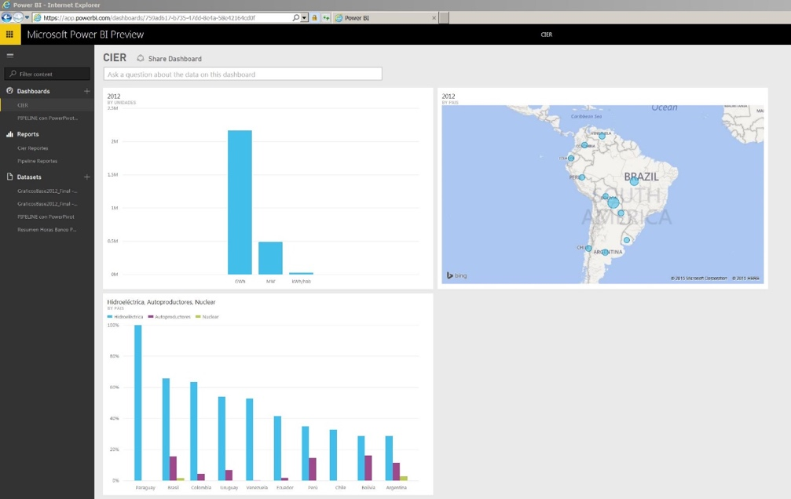
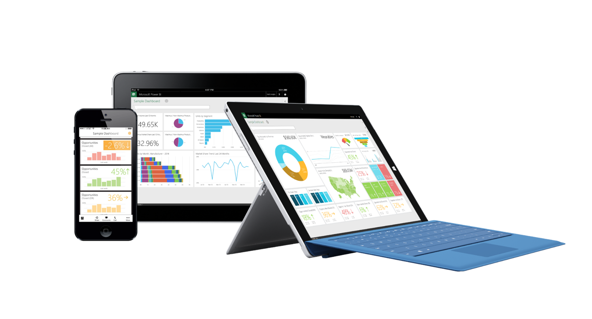
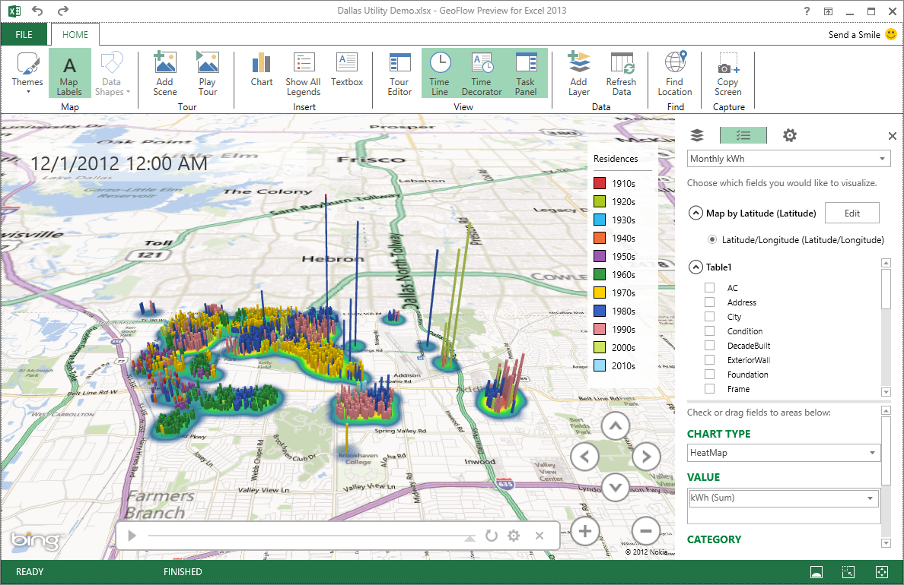
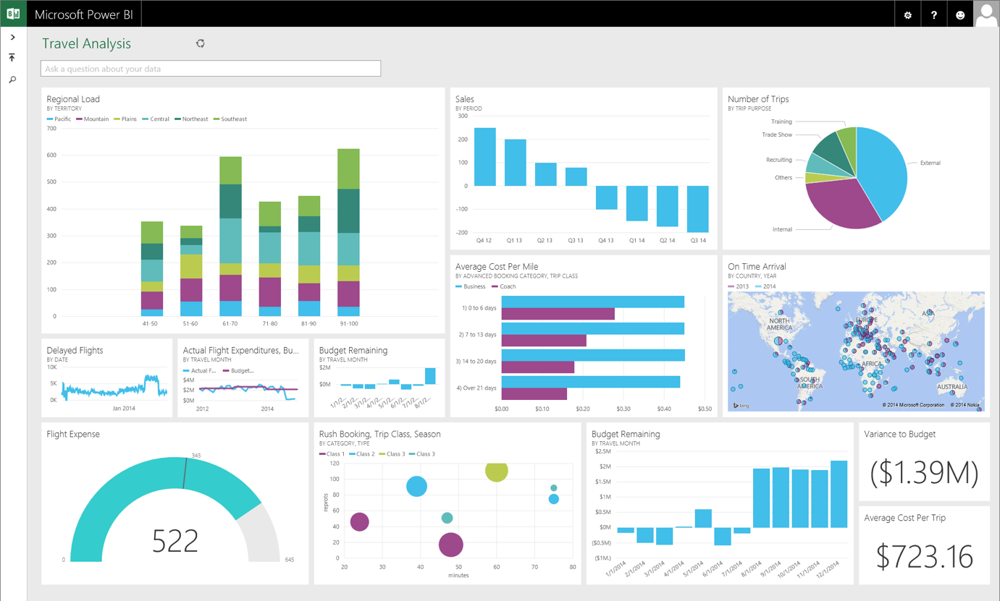
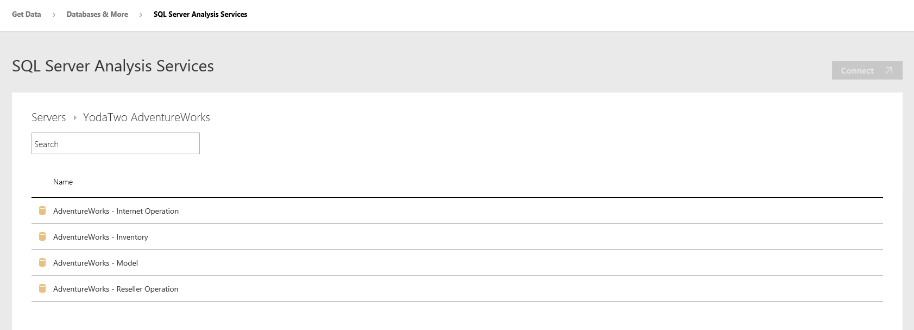
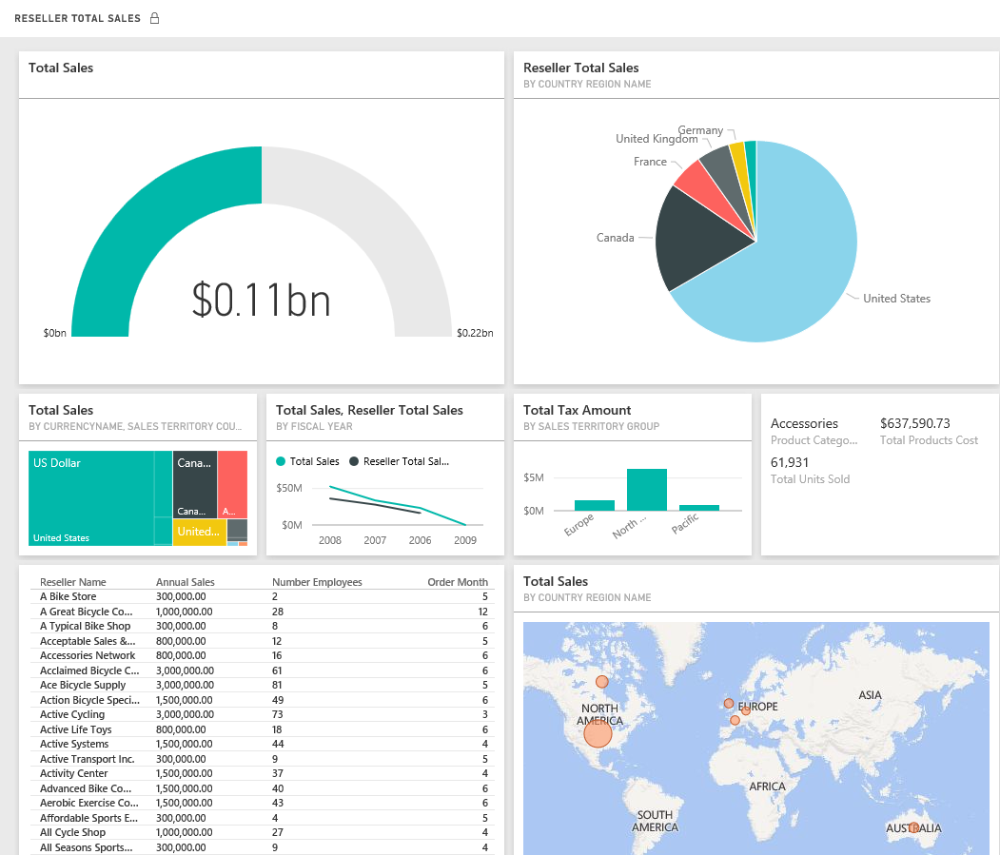

Dentro del abanico de soluciones Microsoft, surgió una que perfecciona lo que antes generaba Excel a través de varios complementos: Power BI. La herramienta genera informes y visualizaciones interactivas, vinculadas entre sí, con Dashboards que brindan información vital para el negocio al instante, con actualización dinámica, con la facilidad de realizar drill down para mayor detalle de los datos recopilados.

Power BI permite además realizar conexión a datos con múltiples orígenes en forma simultánea, y el modelado de la información (limpieza y transformación de datos). Se agrega a su vez en la herramienta la posibilidad de realizar preguntas en lenguaje natural (Q&A) para que el sistema genere rápidamente tablas y reportes gráficos utilizando las variables con las que cuenta el modelo.

Existen 2 versiones: escritorio y web, utilizando un navegador y un login/usuario. Las mismas son simplemente descargables desde el sitio de Power BI (https://powerbi.microsoft.com). También se cuenta con aplicaciones nativas disponibles para dispositivos móviles con sistema iOS, Android.

**Evolución de Power BI**
El mundo BI (Inteligencia de Negocios por sus siglas en inglés) viene trabajando hace años sobre el concepto Self Service BI, que pretende brindarle al analista de negocios herramientas con las cuales no solo generar su propio modelo de negocios, sino además explotar reportabilidad utilizando variedad de fuentes de datos (online y on premises), así como también visualizaciones con alto impacto para el usuario. Microsoft también comenzó a trabajar sobre varios complementos que brindaba Excel para incorporar herramientas de BI que permitían, en un principio, desarrollar un modelo de datos pero además aportando valor al negocio generando columnas calculadas, medidas y KPI's.

Por otro lado, se complementó con PowerView, una herramienta que permite agregar un estilo gráfico dinámico conectando al modelo de datos y obteniendo información de una manera práctica, ágil y con gran impacto visual de cara al usuario final.

Con Power Map, como complemento de Excel, se buscó agregar layers que permitieran tener visualización de datos en un entorno geográfico determinado. Respecto a Power Query, como complemento, se agregaron consultas Web para incorporar información al modelo de datos.

La herramienta no es otra sino la evolución de un instrumento cuya finalidad es ejecutar el ciclo de vida de análisis completo.

**Casos prácticos**

Con el foco en diferentes proyectos con verticales en el mundo de Finanzas, Forestación y Energía se pueden desarrollar Dashboards que permiten a clientes tener una visión general en base a parámetros clave de su negocio (medidas, KPI's, indicadores a macro nivel). Desde dicho Dashboard cuentan con la posibilidad de recibir alertas ante cambios, compartir dicha información con colegas de su organización, disponibilizar los mismos en dispositivos móviles (iOS, Android, Windows) y realizar comentarios sobre dudas de negocio que se puedan plantear.

**Orígenes de Datos**

Con esta consigna la suite nos permite contar con un pool de diferentes vinculaciones a orígenes de datos tales como los que se pueden visualizar en la siguiente imagen.

Estos orígenes de datos van siendo actualizados en forma oportuna en la herramienta y con cambios que van siendo incorporados en forma semanal por parte de Microsoft.

**Acceso a datos On Premises – Gateway**

Power BI Gateway actúa como un puente que permite la transferencia de datos entre los orígenes de datos de servicio y locales de Power BI que admiten la actualización de datos de servidores On Premises.

El Gateway se instala y se ejecuta como un servicio en el equipo. Como servicio, se ejecuta con la cuenta de Windows que especifica durante la configuración. En algunos casos, la puerta de enlace se ejecuta como una aplicación.

Cuando Power BI actualiza los datos de un origen de datos local, la puerta de enlace garantiza que la cuenta de Power BI tiene los permisos adecuados para conectarse a los datos y consultarlos desde el origen.

La transferencia de datos entre Power BI y la puerta de enlace se protege mediante el servicio de Azure. El bus de servicio crea un canal seguro entre el servicio de Power BI y el equipo. Dado que la puerta de enlace proporciona esta conexión segura, normalmente no es necesario abrir un puerto en el firewall.

De acuerdo a la imagen anterior podemos visualizar una conexión generada contra un ambiente On Premises para extraer información de un cubo de SSAS (Analysis Services) para generar Dashboards y Reportes. Una vez realizada la configuración y establecida la conexión ya sea en versión web o en la herramienta desktop se podrá utilizar para generar informes tal como se refleja en la siguiente imagen:

**Conclusiones**
El mundo de análisis de negocios está en pleno auge y Microsoft nos presenta una suite de herramientas para universalizar el concepto de Self Service y que la explotación de datos quede en manos de analistas, que no solo van a encontrar una forma simple y rápida de explotar la información sino también en la construcción de un robusto modelo de datos.

**Gastón Cruz**
CSM, SharePoint Managed Services
MCSE: SharePoint
MCSA: Office 365​

 
 
import LayoutNumber from '../../../components/layout-article'
export default LayoutNumber
