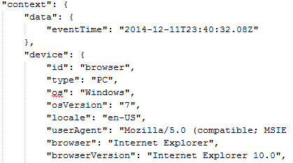

Muchos de los servicios ofrecidos por Azure se pueden utilizar para ampliar y mejorar el funcionamiento de SharePoint, tanto on-premises como en la nube. Uno de los servicios que ofrece Azure es "Visual Studio Application Insights", que es una solución de Software como Servicio (SaaS) específicamente diseñada para ayudar a recolectar, guardar y analizar datos de utilización, salud e información interna de aplicaciones, desde cualquier centro de datos o desde la nube, y desde cualquier tecnología de programación disponible en el momento. Con los datos almacenados es posible tomar decisiones en tiempo real para solucionar problemas o mejorar las aplicaciones monitoreadas.

El servicio permite recolectar y agregar información obtenida desde múltiples aplicaciones y centralizarla en un solo repositorio de datos para analizar patrones de utilización e identificar la causa de problemas en ellas. El servicio dispone de un sistema de paneles de control que se pueden configurar por medio de consultas a los datos almacenados, utilizando paneles predefinidos, o creando nuevos a la medida.

Adicionalmente el servicio dispone de un sistema de alertas que envía alarmas por Email cuando se han traspasado límites programables, permite diagnosticar problemas de rendimiento y tiempos de respuesta y registrar y analizar excepciones generadas por las aplicaciones.

El servicio funciona instalando un agente en el código de la aplicación o en los archivos de configuración a monitorear. El agente recopila y envía información de telemetría a Azure y el portal permite analizar la información almacenada para mostrar graficas estadísticas en un Dashboard. El impacto de rendimiento sobre la aplicación es muy reducido y el envío de la información a Azure se realiza en un hilo separado para minimizar las posibilidades de interferencia con el funcionamiento de la aplicación.

Por el momento, Applicaciones Insights se puede utilizar en aplicaciones ASP.NET en servidores en Azure o en servidores IIS on-premises, Azure Cloud Services, servidores J2EE, páginas Web (HTML + JavaScript), Windows Phone, Windows Store, Windows 10 Universal Apps, Windows Desktop, iOS, Android y otras múltiples plataformas como Node.js, PHP, Python, Ruby, Joomla, SharePoint y WordPress.

**Creación de un servicio de Application Insights en Azure**

Para comenzar a utilizar el servicio es necesario crear primero un Recurso de Trabajo de Application Insights:

1.       Desde el portal de administración de Azure ([https://portal.azure.com/](https://manage.windowsazure.com/)), haga un login con sus credenciales
2.       Utilice el botón de "+" en la esquina superior izquierda para agregar un nuevo servicio
3.       Seleccione "Developer Services" – "Application Insights" – asígnele un nombre al servicio, un tipo de aplicación (seleccione "ASP.NET web application" si se desea utilizar para SharePoint), un grupo de recursos, suscripción y localización (en el momento solo disponible en el centro de datos "Central US")


1.       Después de utilizar el botón de "Create", Azure crea y activa el Recurso, lo que puede durar algunos minutos
2.       Cuando el proceso de creación termine, haga clic sobre el nombre del Recurso (si no abre automáticamente); en la ventana que aparece, haga clic sobre "Settings". En el panel de Settings, use el botón de "Quota + pricing". Se pueden utilizar tres tipos de cuentas en Application Insights: gratis (permite 5 millones de puntos de recolección de datos con un periodo de retención de una semana y datos agregados por un año), estándar (15 millones de puntos de recolección, 15 días de retención y datos agregados sin límite) y Premium (50 millón de puntos de recolección, un mes de retención y datos agregados ilimitados). Se puede comprar capacidad extra si es necesario

**Configuración de Application Insights en un servidor de SharePoint (on-premises o 365)**

Hay tres formas para agregar el agente en sitios ya existentes de SharePoint: añadiendo un fragmento de JavaScript en cada página que se desee monitorear, agregándolo en la Pagina Maestra de tal forma que monitoree todos los sitios y páginas que la utilizan o inyectándolo en todas las paginas por medio de JavaScript.

1.       Utilice el botón de "QuickStart" que se encuentra en el panel inicial del Recurso (icono con una nube), lo que abre un panel al lado derecho:

​

2. Utilice el botón de "Get code to monitor my web pages". Copie localmente el código que aparece en el panel del lado derecho, que debe ser de la forma:


4. El parámetro en "instrumentationKey" aparecerá automáticamente configurado con los datos del Recurso creado. De otra forma, se puede encontrar en el panel de "Settings" – "Properties" bajo el nombre "Instrumentation Key"
4. Para instalar el agente en una página determinada de SharePoint (on-premises o 365, el siguiente ejemplo utiliza una suscripción de SharePoint 365), siga los siguientes pasos:


> a. Abra la página en donde que se desea monitorizar.
> b. Utilice el botón de "Editar página".
> c. Abra la pestaña de "Insertar" y utilice el botón de "Código para insertar" en el menú de cinta.
> d. Copie el código del punto 7 en la casilla de código para insertar.
> e. Guarde los cambios de la página.
> f. Después de algunos segundos se puede observar en la página del Recurso de Application Insights en Azure que los datos comienzan a llegar y se pueden ver las estadísticas iniciales.​


5. Para instalar el agente en la Página Maestra (SharePoint on-premises o 365), haciendo posible la monitorización de todas las páginas que la utilizan, siga los siguientes pasos. Recuerde que Microsoft no recomienda ni hacer modificaciones a la Pagina Maestra ni utilizar una Pagina Maestra diferente de la por defecto de SharePoint Online en Office 365. En el siguiente ejemplo se utiliza SharePoint 2013 on-premises:


> a. Desde la página de "Configuración del sitio" en la raíz de una Colección de Sitios, vaya a "Paginas Maestras", desproteja y descargue una copia de "seattle.master". Modificar la Pagina Maestra por defecto no es recomendable, pero se hace en este ejemplo por simplificar los pasos a seguir.
> b. Abra el archivo acabado de descargar con un editor ASCII y agregue el código del punto 7 precisamente antes de la etiqueta "&lt;/head&gt;".


> a. Guarde los cambios y suba la página de nuevo a la "Galería de páginas principales" (protéjala de nuevo si es necesario).
> b. Después de unos cuantos segundos se comienza a ver la monitorización de las páginas en Azure. Note que se pueden mezclar diferentes servidores si es necesario en el mismo Recurso de Application Insight


6. La tercera forma de utilizar el agente es inyectarlo en todos los sitios de una Colección de Sitios sin modificar la Página Maestra. Esta es la mejor forma para utilizar el servicio en SharePoint Online, pues no es necesario modificar la Pagina Maestra ni aplicar el código en cada una de las paginas por separado:


> a. Guarde el código del punto 7 en un archivo, súbalo a la "Biblioteca de Estilos" en la raíz de la Colección de Sitios. Antes de guardarlo, elimine las líneas de código que contienen "&lt;script type=text/javascript&gt;" y "&lt;/script&gt;". Una vez el archivo está en la Biblioteca, protéjalo utilizando una Versión principal
> b. Ejecute el siguiente script desde una consola de PowerShell. El código utiliza el Modelo de Objetos de Cliente para agregar una CustomAction, siguiendo las indicaciones dadas por Microsoft en el artículo https://msdn.microsoft.com/EN-US/library/office/dn913116.aspx


| `[System.Reflection.Assembly]::LoadWithPartialName(``"Microsoft.SharePoint.Client"``)` |
| --- |

| `[System.Reflection.Assembly]::LoadWithPartialName(``"Microsoft.SharePoint.Client.Runtime"``)` |
| --- |

| ` ` |
| --- |

| `$nombreUsuario =``"usuario@dominio.com"` |
| --- |

| `$pwUsuario =``"clave"` |
| --- |

| `$siteCollUrl      =``"https://dominio.sharepoint.com/sites/mySiteColl"` |
| --- |

| `$scriptUrl    =``"$siteCollUrl/Style%20Library/MyApplicationInsights.js"` |
| --- |

| ` ` |
| --- |

| `$securePassword = ConvertTo-SecureString $pwUsuario -AsPlainText -Force` |
| --- |

| `$clientContext = New-Object Microsoft.SharePoint.Client.ClientContext($siteCollUrl)` |
| --- |

| `$clientContext.Credentials = New-Object Microsoft.SharePoint.Client.SharePointOnlineCredentials($nombreUsuario, $securePassword)` |
| --- |

| ` ` |
| --- |

| `if` `(!$clientContext.ServerObjectIsNull.Value)` |
| --- |

| `{` |
| --- |

| `      ``$scriptId =``"MyAppInsights"` |
| --- |

| `      ``$scriptRevision = [guid]::NewGuid().ToString().Replace(``"-"``,``""``)` |
| --- |

| `      ``$jsLink =``"$($scriptUrl)?rev=$scriptRevision"` |
| --- |

| `      ``$scriptBlock = "var headID = document.getElementsByTagName(``'head'``)[0];` |
| --- |

| `                    ``var newScript = document.createElement(``'script'``);` |
| --- |

| `                    ``newScript.type =``'text/javascript'``;` |
| --- |

| `                    ``newScript.src =``'$jsLink'``;` |
| --- |

| `                    ``headID.appendChild(newScript);"` |
| --- |

| `       ` |
| --- |

| `      ``$myWeb = $clientContext.Web` |
| --- |

| `       ` |
| --- |

| `      ``$existingActions = $myWeb.UserCustomActions` |
| --- |

| `      ``$clientContext.Load($existingActions)` |
| --- |

| `      ``$clientContext.ExecuteQuery()` |
| --- |

| `       ` |
| --- |

| `      ``foreach` `($action``in` `$existingActions)` |
| --- |

| `      ``{` |
| --- |

| `         ``if` `($action.Description -eq $scriptId -and $action.Location -eq``"ScriptLink"``)` |
| --- |

| `         ``{` |
| --- |

| `                    ``$action.DeleteObject()` |
| --- |

| `                    ``$clientContext.ExecuteQuery()` |
| --- |

| `         ``}` |
| --- |

| `      ``}` |
| --- |

| `       ` |
| --- |

| `      ``$newAction = $existingActions.Add()` |
| --- |

| `      ``$newAction.Description = $scriptId` |
| --- |

| `      ``$newAction.Location =``"ScriptLink"` |
| --- |

| `      ``$newAction.ScriptBlock = $scriptBlock` |
| --- |

| `      ``$newAction.Update()` |
| --- |

| `      ``$clientContext.Load($web)` |
| --- |

| `      ``$clientContext.ExecuteQuery()` |
| --- |

| `}` |
| --- |

**El Panel de Control de Application Insight**

La parte inferior del Panel de Control de Application Insight (panel al lado izquierdo) ofrece varias vistas sobre los datos almacenados:


La baldosa de "Search" muestra los eventos que se han capturado, indicando, entre otros, el URL de la página, el tiempo de descarga, el tipo de evento y su distribución en el tiempo. Por medio de la casilla de "Search" se pueden filtrar los eventos para encontrar los datos de uno determinado. La escala de tiempo se puede ajustar para localizar los eventos con más precisión.

"Usage" muestra las estadísticas sobre el número de usuarios, sesiones y vistas de páginas, junto con las sesiones distribuidas por país, el tipo de navegadores utilizados, la duración de las sesiones y el número de usuarios activos. Haciendo clic sobre las gráficas se puede realizar un drill-down para analizar un aspecto de ellas más en detalle.

La baldosa de "Browser" muestra una gráfica con los tiempos de procesamiento de las respuestas al lado del cliente, el tiempo de envío de las consultas, tiempo de carga de las paginas, lo mismo que las estadísticas para cada página. Esta baldosa permite agregar graficas (botón en el menú superior "Add chart"), las que a su vez se pueden conectar a un set de contadores, como por ejemplo la memoria disponible, uso de CPU y tiempo de procesador, junto a muchas otras posibilidades. El botón de "Alert rules" en el menú superior permite crear alertas que envían un Email al administrador del Recurso y a una cuenta adicional (configurable para cada Alerta) cuando se ha traspasado un límite estipulado de un evento determinado; los eventos se pueden seleccionar de una lista proporcionada por el sistema.

"Availability" permite crear un subsistema que envía pings a un (o varios) sitio Web, y si el sitio no retorna un código 200 (configurable), se envía una alerta. Si un ping no es suficiente, se puede crear un archivo con pasos a seguir en la página, y si alguno de ellos falla, se envía la alerta.

**Creación de un AddIn de SharePoint con Application Insights**

Application Insights se puede utilizar con Aplicaciones de SharePoint. El siguiente ejemplo demuestra cómo crear una Aplicación Provider Hosted de SharePoint en la que se utiliza Application Insights tanto para la recopilación de información sobre su uso, como para utilizarla como medio de registro de errores y otra información valiosa para su mantenimiento. Para el ejemplo se utiliza un Aplicación Provider Hosted en Azure, SharePoint Online en Office 365 y Visual Studio 2015. Para utilizar Application Insights con una Aplicación SharePoint Hosted, se puede hacer uso de su SDK de JavaScript, que ofrece la misma funcionalidad al SDK de DotNet utilizado en el ejemplo.

1.       Cree el sitio Web en Azure como se describe en el artículo [http://www.gavd.net/servers/sharepointv5/spsv5\_item.aspx?top=art&itm=2008](http://www.gavd.net/servers/sharepointv5/spsv5_item.aspx?top=art&amp;itm=2008).
2.       Cree el proyecto de Visual Studio tal como se indica en el articulo [http://www.gavd.net/servers/sharepointv5/spsv5\_item.aspx?top=art&itm=2012](http://www.gavd.net/servers/sharepointv5/spsv5_item.aspx?top=art&amp;itm=2012).
3.       Agréguele a la página Default.aspx, en la sección de "body" un botón asp y reemplace el parámetro de "Text" por "Generar Error".
4.       Seleccione el proyecto Web en el Explorador de soluciones de Visual Studio, seleccione "Agregar telemetría de Application Insights" desde su menú contextual.


5. Una ventana nueva aparece para configurar la cuenta de Azure en donde se tiene el Recurso de Application Insight creado, e introducir la clave respectiva. Seleccione también la cuenta de Azure en donde está el Recurso y el nombre del Recurso mismo. Visual Studio agrega todas las referencias a los dlls necesarios y hace las modificaciones en el archivo .config para que Azure reconozca la aplicación. Si la ventana no acepta las credenciales, cancele la operación y vuelva a intentarlo; normalmente la segunda vez aparece la ventana con las credenciales aceptadas


6. Agregue una directiva using a "Microsoft.ApplicationInsights" en el code-behind de la página Default.aspx y añada el siguiente código en el evento del botón de la aplicación Web:

```
        protected void Button1_Click(object sender, EventArgs e)
```

```
        {
```

```
            TelemetryClient myTelemetria = new TelemetryClient();
```

```
 
```

```
            try
```

```
            {
```

```
                throw new Exception("Este es un error");
```

```
            }
```

```
            catch (Exception ex)
```

```
            {
```

```
                Dictionary<string, string> telePropiedades = new Dictionary<string, string>();
```

```
                telePropiedades.Add("Propiedad uno", "Valor propiedad uno");
```

```
 
```

```
                Dictionary<string, double> teleMedidas = new Dictionary<string, double>();
```

```
                teleMedidas.Add("Medida uno", 12.34);
```

```
 
```

```
                myTelemetria.TrackException(ex, telePropiedades, teleMedidas);
```

```
            }
```

```
        }
```


7. En el código se crea primero un objeto del tipo "TelemetryClient". Cuando una excepción ocurre en el estamento try/catch, se crean dos diccionarios, uno para las propiedades a almacenar y otro para las medidas, y finalmente se llama el método "TrackException, enviando la información del error y los dos diccionarios. Los diccionarios se pueden utilizar para capturar información valiosa al detectar el error. El objeto de telemetría dispone de otros métodos que se pueden utilizar para enviar información a Application Insights: TrackEvent, TrackMetric, TrackPageView, TrackRequest y TrackTrace. En el sitio de Microsoft con toda la información sobre el SDK de Application Insights (https://azure.microsoft.com/en-us/documentation/articles/app-insights-api-custom-events-metrics/#track-exception) se puede encontrar más información sobre los métodos.
8. Publique la Aplicación Web en Azure tal como se indica en el articulo http://www.gavd.net/servers/sharepointv5/spsv5\_item.aspx?top=art&itm=2015.
9. Publique la Aplicación de SharePoint en SharePoint Online, como se describe en el articulo http://www.gavd.net/servers/sharepointv5/spsv5\_item.aspx?top=art&itm=2019.
10. Inicie la Aplicación de SharePoint y utilice el botón de "Generar Error".
11. Vaya al panel de control de Application Insights en Azure y utilice la baldosa de "Search" para ver las estadísticas de utilización de la Aplicación. Podrá ver que hay varias entradas de utilización de la página Default.aspx (cuando el usuario inicio la página y cuando el Azure Access Control la autorizó), y una entrada con el error generado por el botón ("Exception"):


12. Haciendo clic sobre la entrada con la Excepción se pueden ver sus detalles, entre los que se encuentran el mensaje del error generado y los valores enviados como propiedades y medidas, bajo la sección "Custom Data":


13. Bajo la baldosa de "Failures" se pueden ver de nuevo los errores que se han registrado:


**Exportación Continua**

"Exportación Continua" ("Continuos Export") es una posibilidad en Application Insight que permite mover toda la información que recibe un Recurso a una Base de Datos externa. Esto permite manipular la información en formas que no es posible con el servicio por defecto, y mantener records por periodos de tiempo más extendidos que los permitidos en Application Insights.

La información es exportada desde Application Insights en formato JSON en forma similar a la mostrada en la siguiente imagen:



Los datos corresponden exactamente a los que el Recurso recibe de su fuente de datos, menos los datos de localización que son primero calculados en base a la dirección IP. Algunos otros datos calculados como la utilización de CPU no son exportados. Hay dos posibilidades para exportar datos: a una Base de Datos SQL en Azure, o a Power BI usando "Stream Analytics" de Azure. No es posible exportar datos a una Base de Datos on-premises.

Adicionalmente, algunas de las baldosas (Failures, Performance, Servers, Browser) del Panel de Control permiten exportar una serie reducida de datos por medio del botón "Export", en formato Excel.


**Conclusiones**

Dentro de las múltiples maneras de utilizar los servicios de Azure para mejorar el funcionamiento de SharePoint, Application Insights ofrece posibilidades para capturar estadísticas de utilización que SharePoint no puede hacer por sí mismo.

Además, las posibilidades de agregar información de varios sistemas en uno solo sitio permite monitorear diferentes implementaciones sin necesidad de escribir código adicional, reduciendo el tiempo para salir en producción y los costos de implementación.

El problema común de captura y almacenaje de excepciones en código de SharePoint, que se presenta en muchos proyectos, especialmente de SharePoint Online en Office 365, se puede solucionar de forma eficiente y elegante utilizando Application Insights.


**Gustavo Velez**
 MVP SharePoint
 [gustavo@](mailto:gustavo@)gavd.net
 http://www.gavd.net​​

 
 
import LayoutNumber from '../../../components/layout-article'
export default LayoutNumber
