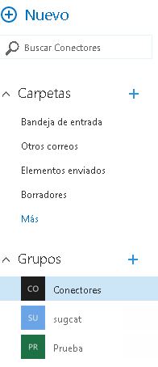
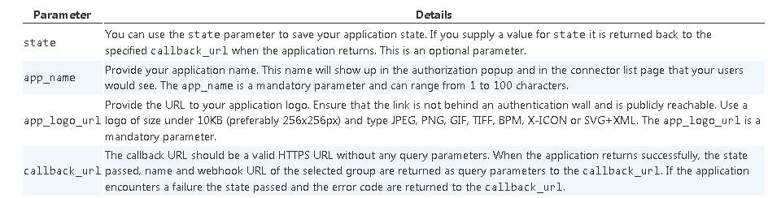

​Primero de todo empezaremos explicando que son los conectores para Grupos de Office 365. Un conector es una característica que nos permite enviar información en tiempo real a nuestros grupos de office 365, desde otros servicios o plataformas, desde un sistema externo o un sistema propio.

**Ejemplo:**

Conectar Trello con office 365 groups y recibir notificaciones cuando un board es modificado.


**Introducción a Grupos de Office 365**

Para acceder a esta funcionalidad:

- Simplemente entrando a nuestro correo de office 365, veremos un apartado que pone Grupos.




- En este menú podremos ver los grupos que hemos creado o en los que somos administradores. Una vez creado el grupo, nos permite agregar personas de nuestra compañía y tener un sitio donde compartir correos, calendario, archivos, bloc de notas, etc...


**Cómo habilitar Conectores de Grupos de Office 365**

Esta característica actualmente está en preview, por lo tanto, aún no es visible para todos los usuarios.

Si queremos habilitar esta característica debemos agregar a la url de nuestra página la siguiente cadena: *&EnableConnectorDevPreview=true*

En mi caso particular, me he creado un grupo llamado conectores y la URL de acceso al conector sería así:

*https://outlook.office.com/owa/#path=/group/conectores@sug.cat/mail&EnableConnectorDevPreview=true*

Una vez hemos entrado con esta URL, nos aparecerá una opción extra en el menú del Grupo: Conectores


**Conectores Existentes**

Una vez habilitados los conectores para nuestro grupo de office 365, tenemos dos opciones de trabajo con conectores: usar conectores por defecto o usar conectores customizados. Si pulsamos en la opción conectores nos aparecerá un listado de conectores ya existentes.


**Ejemplo: Uso del Conector de Github**

En nuestro ejemplo vamos a usar Github, para que nos notifique cuando haya actividad en nuestros proyectos:

- Pulsamos en Add para este conector de manera que aparece la pantalla de login en GitHub.


- Pulsamos en login y una vez conectados nos aparece la ventana para dar permisos a la aplicación.


- Una vez autorizado, se genera una Url única (webhook) para esta aplicación y este grupo en office 365 que será donde hará las llamadas para añadir información. A continuación, nos pide de qué tipo de acciones queremos ser notificados, que cuenta y que repositorio de código.


- Una vez hecho esto, en el menú de conectores, nos aparecerá que el conector se ha configurado correctamente.


- Por supuesto, el conector añadido se puede modificar, visualizar, eliminar.
- Si vamos a nuestro GitHub, en la sección Applications, veremos como también está configurado el conector.


- Si volvemos a nuestra bandeja de entrada, nos aparecerán dos nuevas notificaciones conforme se ha creado correctamente nuestro conector con GitHub.


**Conector de GitHub en funcionamiento**

Una vez que tenemos el conector configurado, cuando hagamos algún cambio sobre el repositorio nos notificará a nuestro Grupo de Office 365:

- Hacemos un commit de un nuevo fichero en GitHub y añadimos los correspondientes comentarios. A continuación, en el Grupo de Office 365 verificamos que aparecen las notificaciones de la actividad realizada.


**Conectores Customizados**

A continuación, describiremos como crear un conector customizado, para lo que tenemos varias opciones. Una de ellas es la manual:

- De nuevo en la sección Conectores, pulsamos el botón Add de la opción Incoming webhook.


- Esto nos va a permitir configurar la conexión y poder enviar información a nuestro Grupo de Office 365 desde nuestra aplicación customizada.
- Seleccionamos un nombre, una imagen y lo creamos.


- Este nos va a generar una Url como la siguiente:


[https://outlook.office365.com/webhook/38884380-1870-42d0-9140-9f3889c4814b@d48595fc-ac3b-4f2c-9cd3-b502041ddf18/IncomingWebhook/](https&#58;//outlook.office365.com/webhook/38884380-1870-42d0-9140-9f3889c4814b%40d48595fc-ac3b-4f2c-9cd3-b502041ddf18/IncomingWebhook/)

- Y con esta Url, qué es única por Grupo y aplicación, ya podremos empezar a enviar mensajes.


- Y aparecerá en la actividad del Grupo como configurado.


- Ahora sólo tenemos que hacer un POST Request hacia esta dirección con el texto de nuestra card, y nos llegará el mensaje a nuestro grupo. No es necesario autenticación, ya que la url generada es única.

**Ejemplo:**
- El JSON de ejemplo para una card sería el siguiente:


```
{  
```

```
  "summary": "New Comment by Rubén on Conectores\"",
```

```
  "title": null,
```

```
  "text": null,
```

```
  "themeColor": "#3479BF",
```

```
  "sections": [
```

```
    {
```

```
      "title": null,
```

```
      "text": null,
```

```
      "markdown": true,
```

```
      "facts": [
```

```
        {
```

```
          "name": "Added By",
```

```
          "value": "Rubén"
```

```
        },
```

```
        {
```

```
          "name": "Date",
```

```
          "value": "15-12-2015"
```

```
        },
```

```
        {
```

```
          "name": "Priority",
```

```
          "value": "Medium"
```

```
        },
```

```
        {
```

```
          "name": "State",
```

```
          "value": "Active"
```

```
        }
```

```
      ],
```

```
      "images": null,
```

```
      "activityTitle": "Rubén commented",
```

```
      "activitySubtitle": "on \"Conectores\"",
```

```
      "activityText": "We should prioritize this effort.",
```

```
      "activityImage": "https://cdn0.iconfinder.com/data/icons/PRACTIKA/256/user.png"
```

```
    }
```

```
  ],
```

```
  "potentialAction": [
```

```
    {
```

```
      "@context": "http://schema.org",
```

```
      "@type": "ViewAction",
```

```
      "name": "View in Sandbox",
```

```
      "target": [
```

```
        "http://microsoft.com"
```

```
      ]
```

```
    }
```

```
  ]
```

```
}
```

**Pruebas de Conectores Custom**

Para seguir experimentado con Conectores Custom contamos con la página:

[http://connectplayground.azurewebsites.net/](http&#58;//connectplayground.azurewebsites.net/)

Donde nos permite conectarnos a través de una aplicación hospedada en Azure por Microsoft, enviar mensajes de ejemplo a nuestros Grupos de Office 365. Sólo necesitamos conectarnos, nos generará un webhook Url, y ya podremos enviar un mensaje.


**Office 365 connector card**

Las cards es la manera en la que se visualizan los mensajes enviados por un servicio por defecto o nuestro servicio customizado. Es la manera de enviar un mensaje de manera genérica para todas las aplicaciones y con la misma interfaz gráfica. Y hay de diferentes tipos:

- Mensaje.
- Mensaje con Título.
- Mensaje con Link.
- Mensaje con Acción.


Los parámetros necesarios para llenar la información de una card son los siguientes:

- **Connector Card:** Es el contenedor de la card


- **Section:** Es el contenido dentro de la card.


Y una vez hagamos la llamada estas serán las diferentes respuestas.


**Office 365 Connect Button**

A continuación, vamos a describir la otra alternativa para poder configurar un conector customizado, a través del botón de conexión. En nuestra aplicación crearemos un botón que se conectará a los Grupos de Office 365 vía API y nos dejará seleccionar los grupos existentes, una vez seleccionado este nos devolverá la Url del webhook para poder hacer las llamadas con las Cards. La composición es la siguiente:

```
<a href="https://outlook.office.com/connectors/ConnectToO365?state=xxx&app_ name=xxx&app_logo_url=xxx&callback_url=xxx">
```

```
  </img>
```

```
</a>
```

Con los siguientes parámetros.



Y este es el resultado.


**Ejemplo Creando Conector Custom.**

Para finalizar el artículo, vamos a crear un Conector personalizado en Visual Studio:

- Primero de todo creamos una aplicación ASP MVC en Visual Studio.


- Habilitamos el SSL a nuestro proyecto a través de la ventana de propiedades del IDE.


- Agregamos nuestro botón Connect to Office 365 Groups en nuestra vista Home.


- Agregamos en la ruta start una vista y un controlador, donde haremos la llamada con el webhookurl


- Arrancamos nuestra aplicación y nos aparecerá la siguiente pantalla y le damos a Connect


- Al hacer clic en el botón "Connect to Office 365", aparecerá la pantalla de autorización, seleccionamos el Grupo y autorizamos.


- Una vez autorizada, nos enviará  a la vista start, donde tenemos el botón de enviar mensaje.


- Pulsamos en enviar y si funciona correctamente nos saldrá el siguiente mensaje


- Si vamos a nuestro Grupo de Office 365 veremos el mensaje.


**Conclusiones:**

A través de los ejemplos mostrados hemos podido ver cómo crear conectores para Grupos de Office 365, tanto con aplicaciones por defecto como aplicaciones customizadas y como personalizar estos mensajes.


**Rubén Toribio**
 SharePoint Architect en Beezy
 @rtoribiog

