​El uso de Azure AD Connect con Office 365 proporciona los siguientes beneficios:

- Los usuarios pueden firmar con una identidad común tanto en la nube y local. No necesita recordar múltiples contraseñas o cuentas y administradores no tienen que preocuparse acerca de la sobrecarga adicional que pueden traer múltiples cuentas.
- Una sola herramienta y experiencia guiada para conectar tus directorios locales con Azure Active Directory. Una vez instalado el asistente implementa y configura todos los componentes necesarios para conseguir su integración de directorio y funcionamiento incluyendo servicios de sincronización, sincronización de contraseña o AD FS y requisitos previos como el módulo de AD PowerShell de Azure.

**Por qué usar Azure Connect de AD**

La integración de un Directorio Activo local con Azure AD facilita que los usuarios sean más productivos proporcionando una identidad común para acceder a los recursos de la nube y local. Con esta integración los usuarios y las organizaciones pueden aprovecharse de las siguientes ventajas:

- Proporcionar a los usuarios con una identidad híbrida a través de locales o servicios en la nube aprovechando Windows Server Active Directory y luego conectar a Active Directory de Azure.
- Los administradores pueden proporcionar acceso condicional basado en recursos de aplicación e identidad de usuario, ubicación de red y autenticación de múltiples factores.
- Los usuarios pueden aprovechar su identidad común a través de cuentas en Azure para Office 365, Intune, aplicaciones SaaS y aplicaciones de terceros.
- Los desarrolladores pueden crear aplicaciones que aprovechan el modelo de identidad común, integración de aplicaciones en Active Directory local o Azure para aplicaciones basadas en cloud.

Azure Connect facilita esta integración y simplifica la gestión de su local y la nube infraestructura de identidad.

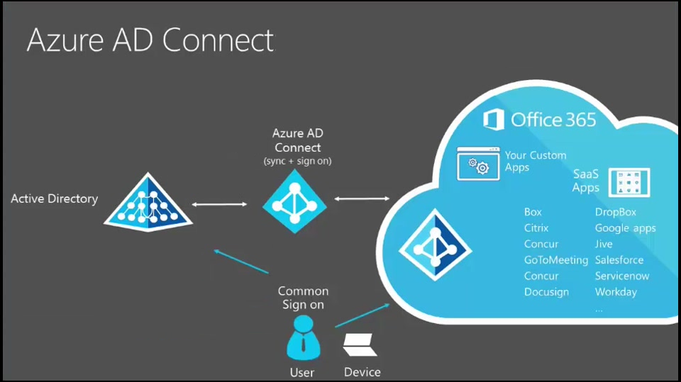

A continuación, se detalla el proceso a seguir para sincronizar un Directorio Activo de Azure AD con Office 365:

1. Procedemos a ingresar al portal y nos ubicamos en el AD Azure –&gt; pestaña **Integración de Directorios****.**

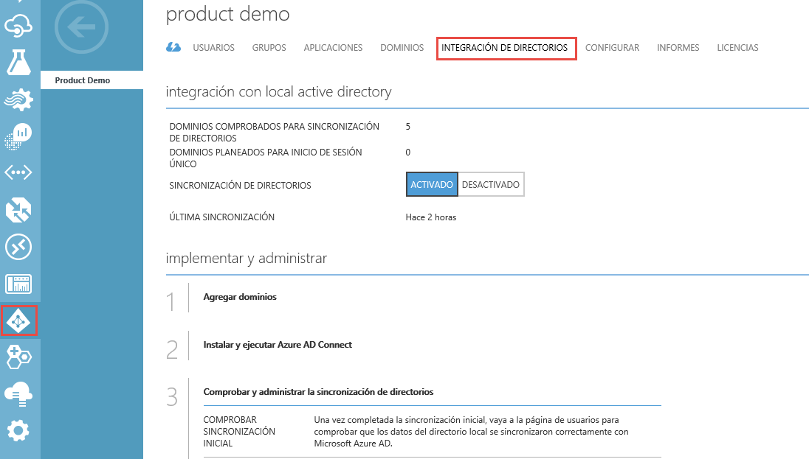

2. Antes de iniciar el procedimiento de instalación tenga en cuenta lo siguiente:

Se debe ingresar con una cuenta que este en AD en mi caso el usuario es Administrador y que además está en el grupo de Enterprise Admins y pertenezca al grupo de administradores del equipo local.

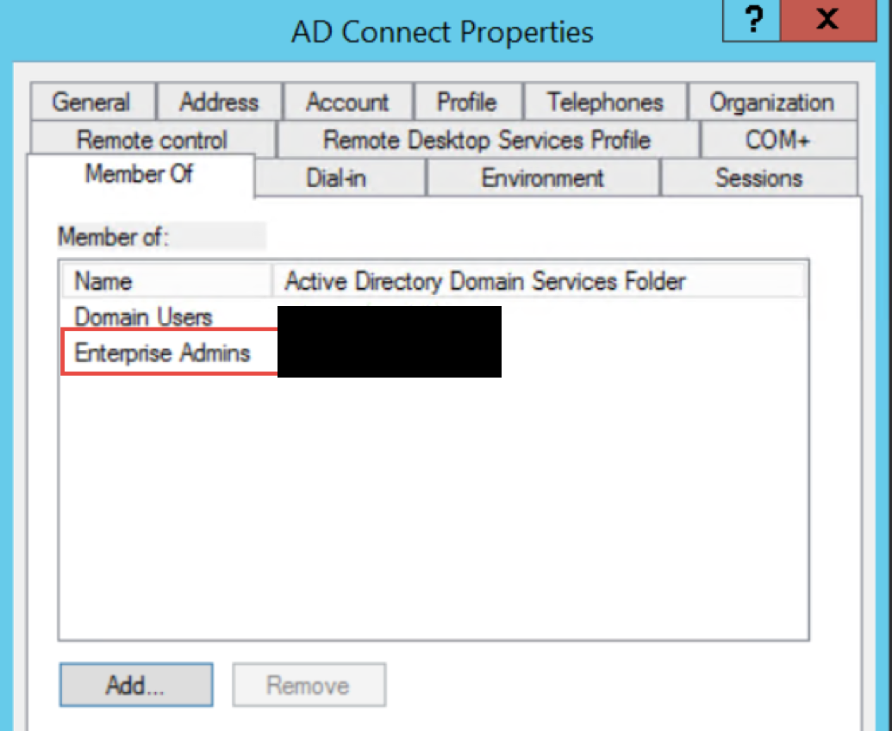

3. Descargar el Azure Connect AD

Para empezar a usar Azure Connect AD puede descargar la versión más reciente utilizando el siguiente: [Descargar AD de Azure Connect](http://go.microsoft.com/fwlink/?linkid=615771&amp;clcid=0x409)

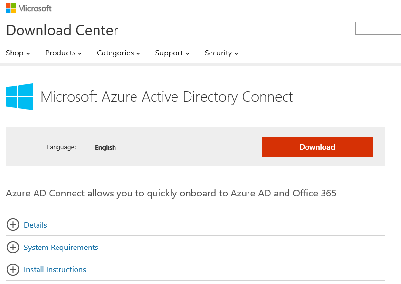

Una vez completado todos los pasos anteriores entramos en la fase de instalación y configuración del servicio Azure AD Connect, para ello aplicamos el siguiente procedimiento:

1. En el servicio de sincronización de Azure AD Connect realizaremos la configuración rápida en nuestro ambiente teniendo en cuenta las opciones que se realizarán por defecto.

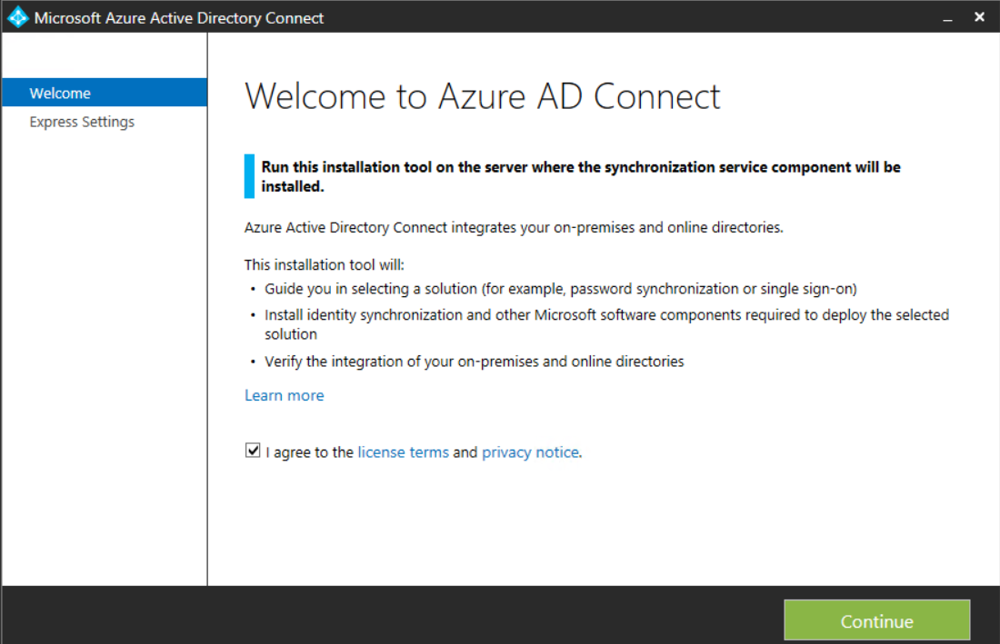

2. A continuación, se muestra la pantalla de Express Settings. Hacemos clic en el botón "Use express settings" que nos permite hacer una sincronización rápida.

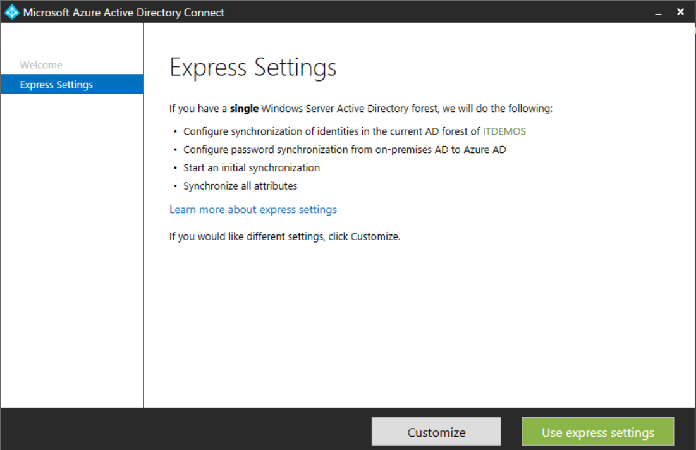

3. La siguiente pantalla, "Express Settings" realiza todo el proceso de instalación y configuración que se necesita para poner en marcha Azure AD Connect.

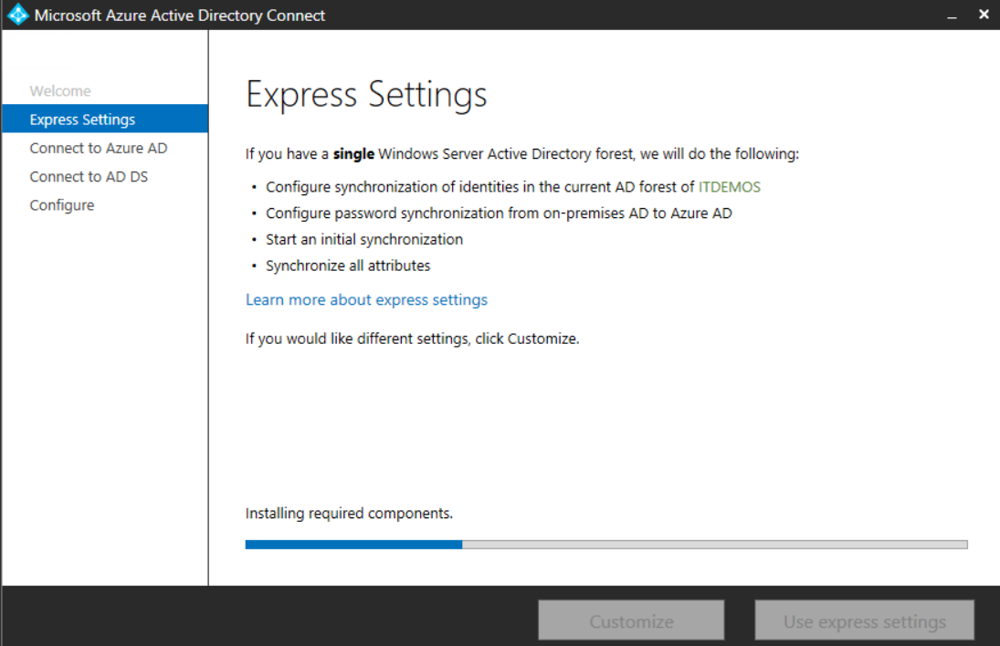

4. Deberemos proporcionar el nombre de usuario de Azure AD que es un miembro de la función de administrador Global y un usuario de Active Directory que está en el grupo de Enterprise Admins.

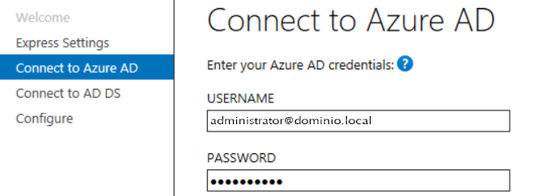

5. Se debe utilizar la cuenta que pertenece a Domain Admin. Recuerde que en un dominio de Windows los domain admin por defecto son administradores locales en los servidores miembros y estaciones de trabajo del dominio.

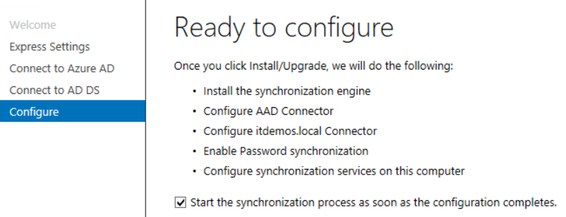

6. Finalmente se muestra el resultado de la configuración, que mostrará un mensaje de que todo ha ido bien si la configuración se ha realizado de forma correcta.

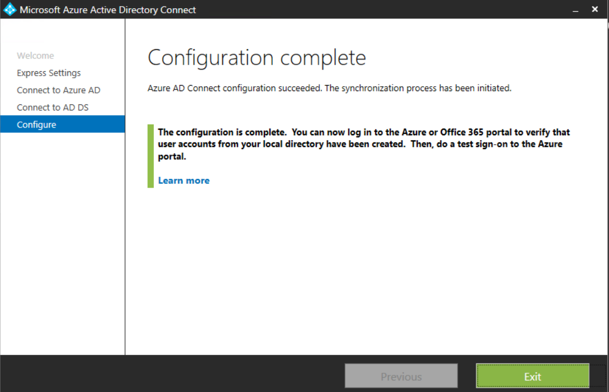

**Nota:** Al momento de finalizar el asistente ya ha replicado las cuentas según se lo hemos indicado (via express), ahora nos toca verificar si la réplica ha sido exitosa mediante el monitor de replicaciones.

**Verificando la configuración:**

Para verificar la configuración, seguiremos los siguientes pasos:

1. Abrimos el servicio de sincronización la herramienta (miisclient.exe) se encuentra en el siguiente directorio: C:\Program Files\Microsoft Azure AD Sync\UIShell\miisclient.exe

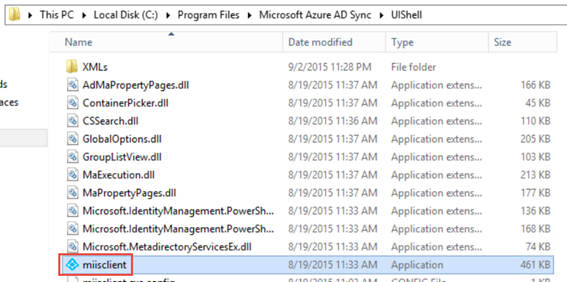

**Nota:**Es importante ejecutar el fichero siempre con permisos elevados en el caso que el UAC este activo.

2. Procedemos abrir y veremos la última sincronización completada.

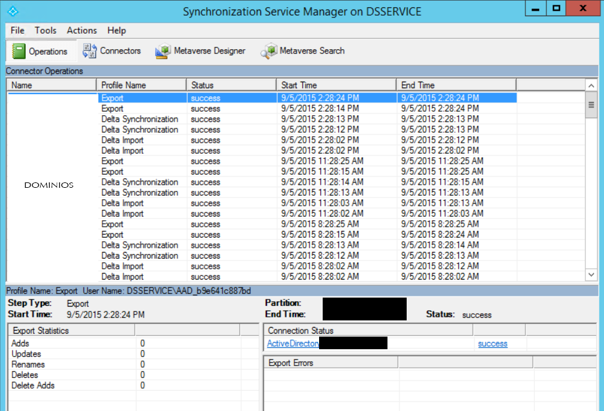

3. Vemos las cuentas que están sincronizadas con Office 365 y el Azure AD.

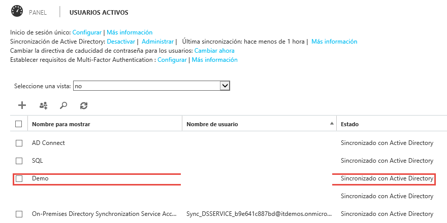

**Conclusiones**

Es importante verificar por medio del monitor de sincronización si las replicaciones de nuestro Directorio Activo son exitosas constantemente, sobre todo si nuestra empresa ha tenido movimientos de objetos a nivel de directorio (Usuarios/Grupos). Particularmente recomiendo instalar el Azure AD Connect en el controlador de dominio, esto ayudara que las consultas sean más rápidas y nos aseguramos que tenemos todos los privilegios necesarios para hacer dicha replicación, basándonos en teoría básica de Windows Server hago esta recomendación porque solo los administradores pueden iniciar sesión local dentro de un controlador de dominio.

Finalmente, es muy importante verificar que la cuenta con que se esté haciendo la replicación sea Domain Admin, porque solo los miembros de este grupo tienen privilegios para extraer los SIDs de los usuarios, SIDs que copiara Azure desde nuestro directorio activo para lograr hacer el Single SingOn y la replicación del esquema del directorio.

**Darwin Castro**
 MCSE Windows Server 2012 \*Charter
 [darwin.castro@ancadia.com](mailto:fabiani@siderys.com.uy)
 @ancadiasystems
 http://www.ancadia.com

