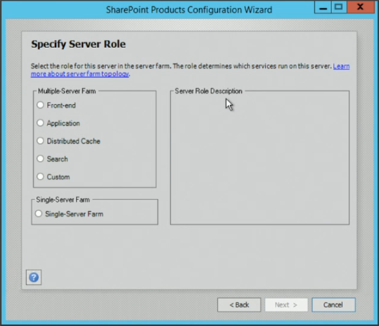
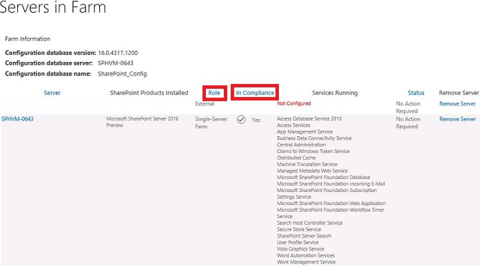
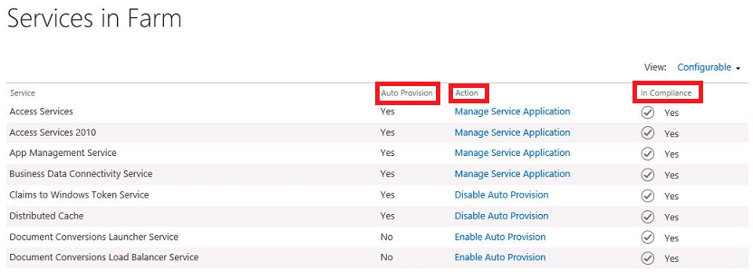
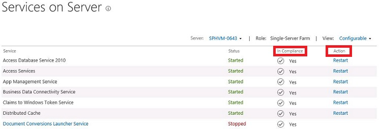
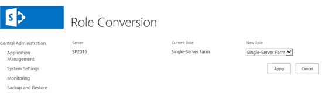
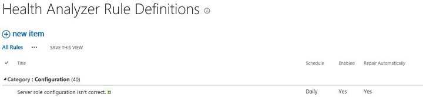

​Una de las primeras novedades de SharePoint 2016 con la que nos tendremos que enfrentar es el nuevo concepto de la estrategia MinRole, que estará presente desde que comencemos a configurar nuestra primera granja de servidores.

Durante los últimos años ofreciendo el servicio de Office 365, Microsoft ha identificado muchas restricciones o problemas de gestión a nivel de infraestructura cuando ha querido diseñar grandes granjas de SharePoint que pudieran ofrecer distintos servicios a millones de usuarios. En numerosas ocasiones, la tradicional división entre servidores frontal web y servidores de aplicación ha sido insuficiente, con multitud de servicios duplicados entre estos dos tipos de servidor, así como falta de optimización de recursos hardware y problemas de configuración que esta organización supone.

Es por ello que SharePoint 2016 implementa el nuevo concepto de MinRole, que permite asociar roles concretos a los distintos servidores de la granja y así optimizar al máximo el rendimiento y conseguir un diseño, administración y escalado más cómodo. Las principales mejoras de MinRole son:

- Se evitan problemas de configuración. Anteriormente, la posibilidad de distribuir los distintos servicios en los distintos servidores, independientemente del rol, provocaba multitud de problemas técnicos en las granjas de SharePoint.
- Se consigue mejoras notables en el rendimiento y fiabilidad del servicio. Gracias a la experiencia conseguida por Microsoft manejando el servicio de Office 365 durante los últimos años se ha conseguido que la distribución de servidores por roles optimice al máximo la gestión de recursos como memoria, E/S de disco y latencia de red.
- Se logra un escalado más sencillo y la minimización del tiempo de downtime cuando se realizan actualizaciones en la granja.

Cuando se configure un servidor para entrar en la granja, el asistente de configuración de SharePoint solicitará el rol que llevará dicho servidor (Imagen 1).

Los roles que se pueden configurar son:

- **Front-end**: frontal web que servirá las aplicaciones web de SharePoint. Únicamente aceptará peticiones web de los usuarios. No hospedará servicios.
- **Application**: contendrá distintos servicios y aplicaciones de servicio de SharePoint que requieran peticiones al backend (excepto caché distribuida y búsquedas).
- **Distributed Cache**: hospedará el servicio de cache distribuida.
- **Search**: hospedará el servicio de búsquedas (administración, index, rastreo, consulta).
- **Custom (o Special Load)**: destinado a servicios, aplicaciones de servicio y componentes personalizados que no se integran con la estructura MinRole.
    - El uso de este rol es principalmente por retro compatibilidad. Es posible diseñar una granja tradicional usando servidores con el rol "custom", ya que nos permitirá configurar aplicaciones, servicios y aplicaciones de servicio a nuestro antojo.
- **Single Server Farm**: solo para desarrollo y pruebas. Instalación de todos los componentes en una única máquina.

El uso de MinRole permite no sólo diseñar granjas con todos los servicios (frontal web, aplicaciones de servicio, caché y búsqueda), sino que facilita en gran medida la creación de granjas dedicadas a un único servicio (por ejemplo, granja de búsquedas, granja con varios servicios compartidos, granjas de metadatos…).

La posibilidad de contar con granjas dedicadas es muy necesaria principalmente en entornos SharePoint muy grandes, en los que determinados servicios requieren un uso intensivo de recursos hardware. Estos servicios se pueden ejecutar en una granja central para minimizar la sobrecarga de la administración y escalar horizontalmente de forma fácil y eficiente según crecen las necesidades. En estos casos MinRole reluce porque permite aprovechar al máximo los recursos de las granjas dedicadas al rol en concreto que queremos.

El diseñar una granja con una estrategia basada en MinRole precisa disponer obligatoriamente de determinados roles. La siguiente tabla muestra los roles obligatorios según el tipo de granja que se desee diseñar (granja para contenido, granja de servicios compartidos o granja de servicio de búsqueda):

| **Rol del servidor** | **¿Requerido para granja de contenido?** | **¿Requerido para granja de servicios compartidos?** | **¿Requerido para granja de búsqueda?** |
| --- | --- | --- | --- |
| **Servidor frontal web** | Sí | Sí | No |
| **Servidor de aplicación** | Sí | Sí | No |
| **Caché distribuida** | Sí | Sí | No |
| **Búsqueda** | Sí, si se implementan las búsquedas | Sí, si se implementan las búsquedas | Sí |
| **Custom** | Opcional | Opcional | Opcional |

El nuevo modelo de MinRole proporciona nuevas funcionalidades en la Administración Central de SharePoint 2016 que permiten gestionar los distintos servidores y servicios.

La página de servidores en la granja (Imagen 2) muestra dos nuevas columnas para cada servidor:

- **Role**: indica el rol que se le ha asignado a cada servidor de la granja.
- **In Compliance**: detalla si el servidor está cumpliendo únicamente con su rol. Si no es así, aparecerá un botón que permite repararlo para hacer que cumpla con la configuración que se espera de su rol.

Aparece una nueva página llamada servicios en la granja (Imagen 3) que muestra el estado de cada servicio de la granja. En esta página, aparecen tres columnas para cada servicio:

- **Auto Provision**: muestra si el servicio está arrancado en el servidor correcto. Si el valor es Yes, las instancias para este servicio están correctamente arrancadas en los servidores que le corresponden de la granja. Si el valor es No, hay instancias para este servicio que están paradas en los servidores que le corresponden.
- **Action**: dependiendo del tipo de servicio y si está habilitado mostrará una acción posible:
    - **Manage Service Application**: indica que el servicio está asociado a una aplicación de servicio y que se debe arrancar o apagar desde la aplicación de servicio. El enlace lleva a la app de servicio.
    - **Disable Auto Provision**: desactiva el servicio en la granja.
    - **Enable Auto Provision**: activa el servicio en la granja.

- **In Compliance**: detalla si el servicio está en cumpliendo su función y que está habilitado en los servidores correctos. Si hay un problema, aparece un botón de reparación.

La página de **servicios en el servidor** (Imagen 4) muestra una nueva columna y cambia el funcionamiento de otra:

- **In Compliance**: detalla si el servicio está arrancado en el servidor y si es el servidor en el que se corresponde. En el caso de estar parado, o pertenecer a otro rol, aparece un botón de reparación.
- **Action**: se cambia su funcionamiento. Al tener un servidor dedicado a un rol, sus servicios deben estar en todo momento arrancados, con lo que no tiene sentido parar un servicio. Ahora sólo permite reiniciar el servicio. Si se necesitara parar o arrancar un servicio por algo, hay que hacerlo en la página de servicios en la granja mediante el "Enable Auto Provision" o el "Disable Auto Provision" mencionados anteriormente.

Si se deseara cambiar el rol de un servidor, se puede completar esta tarea desde la nueva página de conversión de roles (Imagen 5):

Además, aparece una nueva regla en el Health Analyzer de SharePoint que comprueba si la configuración de rol del servidor es correcta:

También se dispone de nuevos comandos PowerShell para administrar la configuración de roles y servicios en los roles:

| **Nombre del Cmdlet** | **Descripción** | **Ejemplo de sintaxis** |
| --- | --- | --- |
| **Get-SPService** | El cmdlet [Get-SPService](https&#58;//msdn.microsoft.com/es-es/mt427448%28v=office.16%29) obtiene un servicio en la granja. | Get-SPService -Identity "Microsoft SharePoint Foundation Sandboxed Code Service" |
| **Start-SPService** | El cmdlet [Start-SPService](https&#58;//msdn.microsoft.com/es-es/mt427447%28v=office.16%29) habilita un servicio en la granja. Las instancias de servicio para este servicio se inician en los servidores correspondientes en la granja. | Start-SPService -Identity "Microsoft SharePoint Foundation Sandboxed Code Service" |
| **Stop-SPService** | El cmdlet [Stop-SPService](https&#58;//msdn.microsoft.com/es-es/mt427446%28v=office.16%29) deshabilita un servicio en la granja. Las instancias de servicio para este servicio se detienen en los servidores correspondientes en la granja. | Stop-SPService -Identity "Microsoft SharePoint Foundation Sandboxed Code Service" |

Es importante conocer en profundidad estos nuevos conceptos, ya que van a ser clave de aquí en adelante para cualquier nueva instalación de SharePoint Server 2016. Recomiendo familiarizarse cuanto antes con ellos y hacer pruebas de creación de granjas en laboratorio. Para estas pruebas, os recomiendo el uso de los scripts [AutoSPInstaller](http&#58;//autospinstaller.codeplex.com/), que ya soportan el uso de MinRole.

**Miguel Tabera Pacheco**
 SharePoint Lead en Plain Concepts 
MVP de Office Servers and Services
 miguel.tabera@outlook.com
 @migueltabera
 [http://docs.com/migueltabera](http&#58;//docs.com/migueltabera)

