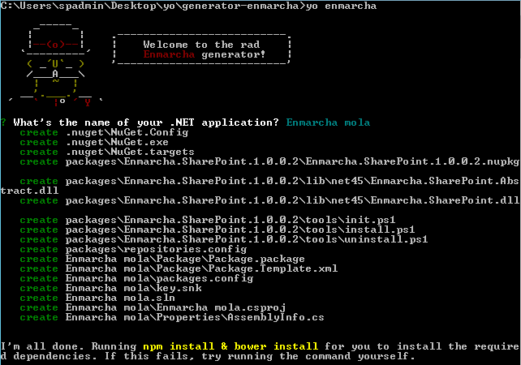
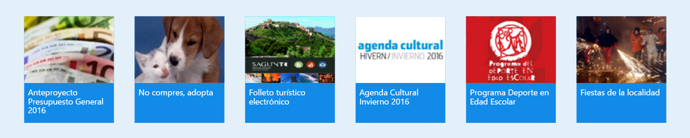

Este mes de Febrero, en [ENCAMINA](http://www.encamina.com/) hemos liberado como proyecto Open Source, bajo [licencia MIT](https://opensource.org/licenses/MIT), [Enmarcha](https://github.com/encamina), un Framework, Componentes o una serie de librerías para ayudar a los desarrolladores de SharePoint/Office 365 a agilizar los desarrollos y sobre todo estandarizar la forma en la que se desarrolla, de tal forma que desarrollar sobre SharePoint sea exactamente igual que en otras plataformas.

**Un poco de historia**

ENMARCHA nace internamente en ENCAMINA hace aproximadamente tres años, el motivo es que intentábamos aprovechar todo el conocimiento que se había ido aprendiendo por el equipo a lo largo de muchos proyectos, y que fuera el punto de partida para estandarizar la forma en la que desarrollábamos sobre nuestro servidor favorito.

Uno de los problemas que teníamos es que teníamos implementadas muchas utilidades, pero el equipo no las conocía, lo que provocaba que, si alguien tenía que hacer una utilidad, en muchas ocasiones se volvía a implementar. El volver a hacer este código, además del tiempo de desarrollo, se le unía los problemas sobre cómo implementarlo y sus posibles errores. Otro de los problemas que teníamos era la forma en la que se accedía a las listas, muchas veces teníamos problemas en saber cómo se debe de acceder a las columnas dependiendo del tipo de Columna o como se utiliza la paginación sobre las listas.

Junto con estos inconvenientes, se unió que queríamos desarrollar en SharePoint de una forma similar a como se desarrollaría en cualquier otra plataforma, lo que nos aportaría muchas cosas como reutilización de componentes, buenas prácticas y mejorar la gestión del ciclo de vida de los desarrollos.  Con estas premisas creamos nuestra primera versión de ENMARCHA que ha ido evolucionando, proyecto a proyecto, hasta ver lo que actualmente está en el repositorio de GitHub.

*Este proyecto no es solamente solo sobre la versión OnPremises de SharePoint 2013, sino que también estará disponible para Office 365, PowerShell y SharePoint 2016, en un futuro próximo.*

**Como utilizarlo**

Para poder hacer uso de ENMARCHA lo podemos hacer bien a través del gestor de paquetes Nuget o utilizar el generador de proyecto Yeoman.

Desde Nuget, el gestor de paquetes de Visual Studio, podemos buscarlo mediante la interfaz de usuario o bien desde el Package Manager Console son la siguiente instrucción:

Install-Package Enmarcha.SharePoint

Este proceso lo que hace es agregarnos dos librerías:

- Enmarcha.SharePoint.Abstract: En esta librería están todas las Interfaces que hay dentro del FrameWork.
- Enmarcha.SharePoint: Aquí está la implementación de las interfaces para SharePoint OnPremises 2013.


Desde Yeoman, lo que nos descargaremos es un proyecto de SharePoint en el que ya tenemos estas librerías instaladas y listas para utilizarla en nuestro desarrollo. Para poder utilizar esta plantilla debemos de instalar NodeJS. Una vez instalado NodeJS, deberemos de instalar Yeoman con la siguiente instrucción:

Npm install –g yo

Una vez ya tenemos instalado, tendremos que instalar el generador de ENMARCHA dentro con el siguiente comando:

npm i generator-enmarcha

Si ahora ejecutamos: yo enmarcha se nos muestra una pantalla donde se nos pregunta el nombre de nuestro proyecto:



**Un ejemplo de un WebPart haciendo uso de ENMARCHA**

En este ejemplo vamos a implementar una WebPart con en el que vamos a mostrar las imágenes en formato de Galería de Imágenes de una forma similar a la siguiente:



Para realizar este ejemplo por un lado vamos a tener una lista donde vamos a tener los campos necesarios para que se muestre. De tal forma que es posible que en un futuro necesitemos utilizar la búsqueda de SharePoint vamos a hacer buenas practicas dentro de la gestión documental y nos crearemos un Tipo de contenido basado en las columnas de sitio que va a tener esta lista y posteriormente este tipo de Contenido se le agregará a la lista. Por último, realizaremos un WebPart Visual en el que realizaremos una consulta a esta lista y la mostraremos según el diseño indicado arriba.

**Requisitos previos:**

- Visual Studio 2013
- SharePoint On Premises 2013


**Manos a la obra:**

En primer lugar, se crea una solución en Visual Studio, que está compuesta por tres proyectos:

- Compartimoss.Enmarcha.Model =&gt; En esta proyecto  se agrega  la definición de las listas que se utilizan en el desarrollo.
- Compartimoss.Enmarcha.Service =&gt; Este proyecto corresponde con la  capa  de servicios donde  se incluye la lógica de negocio (bussines logic).
- Compartimoss.Enmarcha.SP =&gt; Es un  proyecto de SharePoint donde se definen varias Features para desplegar los diversos artefactos necesarios.


Una vez creada la solución, añadiremos a los tres proyectos el Nuget de ENMARCHA de la misma forma que hemos comentado al inicio del artículo.

Ahora en la Solución CompartiMOSS.Enmarcha.Modelo se crea una Clase  que la llamaremos ImageGalery.cs con la siguiente definición:

```
public class ImageGallery
    {
        [Enmarcha(AddPrefeix = false, Create = false, Type = TypeField.Text)]
        public string ID { get; set; }
        [Enmarcha(AddPrefeix = false, Create = false, Type = TypeField.Text)]
        public string Title { get; set; }
        [Enmarcha(AddPrefeix = false, Create = true, Type = TypeField.Boolean, DisplayName = "Visible in ImageGallery")]
        public bool Visible { get; set; }
        [Enmarcha(AddPrefeix = false, Create = true, Type = TypeField.Boolean, DisplayName = "Open Link in new Page")]
        public bool OpenWindows { get; set; }
        [Enmarcha(AddPrefeix = false, Create = true, Type = TypeField.Url, DisplayName = "Url of image")]
        public UrlField Image { get; set; }
        [Enmarcha(AddPrefeix = false, Create = true, Type = TypeField.Url, DisplayName = "Url of new")]
        public UrlField UrlNew { get; set; }
        [Enmarcha(AddPrefeix = false, Create = true, Type = TypeField.Text, DisplayName = "Descripcion")]
        public string Description { get; set; }
        public string NewUrl      {    get { return UrlNew.Url;} }            
        public string PictureUrl    {  get { return Image.Url; }  }
        public string TargetBlank    {
     get { return (OpenWindows == true) ? " target='_blank'" : string.Empty; }
        }
    } 
```

Dentro de esta clase se han agregado varios atributos, estos son propios de ENMARCHA. Se utilizan para "mapear" nuestras clases en C# con el artefacto en SharePoint correspondiente. El significado de estos atributos es el siguiente:

- AddPrefix-&gt; Le añada un prefijo cuando crea el campo de forma que se evita que coincida con algún campo ya declarado.
- Create -&gt; Indica si esta propiedad hay que crearla o no.
- Type -&gt; Tipo de SharePoint con el que representa esta propiedad.


Una vez creada la clase, agregaremos una Feature dentro de la solución de CompartiMOSS.Enmarcha.SharePoint y utilizando ENMARCHA crearemos:

- un Tipo de Contenido partiendo de la clase Image Gallery.
- una Lista en SharePoint a la que se le añade ese tipo de contenido.


Para ello dentro de la Feature se añade el siguiente código que se ejecuta en el momento que se active dicha característica:

```
  public override void FeatureActivated(SPFeatureReceiverProperties properties)
        {
            var site = properties.Feature.Parent as SPSite;
            var web = site.RootWeb;
            ILog log = new LogManager().GetLogger(new StackTrace().GetFrame(0)); ;
            var columnSiteCollection = web.CreateColumnSite("Image Galery", typeof(ImageGallery));
            web.CreateContentType(Constants.ContentType.ImageGallery, "Enmarcha ContentType", "Elemento", columnSiteCollection);
            web.CreateList(Constants.List.ImageGallery, "Lista de la galeria de imagenes", TypeList.GenericList, true);
           var list = web.Lists.TryGetList(Constants.List.ImageGallery);
            if (list != null)
            {
                list.AddContentTypeLibrary("Image Galery");
            }
}
```

De dicho código, comentar por un lado que hacemos uso de una utilidad de Log, incluida dentro de ENMARCHA. Este log lo que hace es guardar los errores de nuestros desarrollos dentro del propio Log de SharePoint.

Por otro lado, hay cuatro métodos extensores que son propios de ENMARCHA, cuya finalidad es extender el funcionamiento de la API de SharePoint y facilitarnos nuestros desarrollos, estos cuatro métodos son los siguientes:

- CreateColumnSite: Que dado una Clase de C# nos crea las columnas de sitio correspondiente, para la creación hará uso de los atributos que previamente hemos definido.
- CreateContenType: Un método que crea un Tipo de Contenido, y en el que le pasaremos una lista de Strings donde están las columnas de sitio que va a tener dicho tipo de contenido. En caso de que queramos pasar un GUID a dicho tipo de contenido también tiene la opción.
- CreateList: Crea una lista de SharePoint sobre el objeto SPWeb en el que estamos ubicados, a esta lista le pasamos como valores: nombre, descripción, tipo de Lista e indicamos si queremos romper la herencia de los permisos o no.
- AddContentTypeLibrary: Le añadimos un tipo de contenido a nuestra lista.


Una vez ya está desplegada la infraestructura, vamos a crear el WebPart. En primer lugar, nos crearemos el "Service" que va a consultar los elementos de la lista. El motivo es claro, tener separada la lógica de negocio de la interfaz y no producir un acoplamiento entre ambas capas. Por lo que dentro de nuestra solución CompartiMOSS.Enmarcha.Service, por un lado se  crea una Interfaz del Servicio con la siguiente definición:

```
public interface IImageGaleryService
    {
         IList<ImageGallery> GetNews();
    }
```

y posteriormente desarrollamos dicha interfaz de la siguiente forma:

```
public  class ImageGaleryService:IImageGaleryService
    {
        public SPList List { get; set; }
        public ILog Logger { get; set; }
        public int Items { get; set; }
        public ImageGaleryService(SPList list,int items)
        {
            this.List = list;
            this.Items = items;
            this.Logger = new LogManager().GetLogger(new StackTrace().GetFrame(0));
    }
        public IList<ImageGallery> GetNews()
        {
            try
            {
                var repositorySharePoint = new SharePointRepository<ImageGallery>(this.List.ParentWeb, this.Logger,   this.List.Title, this.Items);
                var imageCollection = repositorySharePoint.GetAll();
                return imageCollection.ToList();
            }
            catch (Exception exception)
            {
                this.Logger.Error(string.Concat("Error GetNews",exception.Message));
                return null;
            }
        }
    }
```

Del código anterior, cabe mencionar el objeto SharePointRepository. Este objeto se le pasa como parámetro de que clase va a devolver los datos, en nuestro caso ImageGallery, y en el constructor por un lado le tenemos que indicar el objeto SPWeb, el Log que se va a utilizar (está adaptado para que cada desarrollador pueda utilizar el Log que desee conveniente), el nombre de la lista a la que se va a realizar la consulta, y el número de elementos que vamos a devolver como máximo en cada petición.

En el objeto SharePointRepository, dispone de opciones para realizar un CRUD, utilizando los métodos Insert, Save o Delete y también se pueden hacer consultas mediante el uso de sintaxis CamlQuery, LINQ o bien devolver todos los elementos. En este caso, se consultan todos los elementos.

Una vez se ha creado la lógica de negocio, lo que vamos a realizar llamar a este servicio desde el Code-Behind del WebPart:

```
try
            {
                var listSharePoint = SPContext.Current.Web.Lists.TryGetList(Constants.List.ImageGallery);
                var imageGaleryService = new ImageGaleryService(listSharePoint, 5);
                var imageGaleryCollection = imageGaleryService.GetNews();
                listViewImageGalery.DataSource = imageGaleryCollection;
                listViewImageGalery.DataBind();
            }
            catch (Exception exception)
            {
                Logger.Error(string.Concat("Error Concat LoadData",exception.Message));
            }
```

Ester ejemplo se puede descargar desde el Repositorio [GitHub](https://github.com/Encamina/Enmarcha-SharePoint)

**Colaborar con****ENMARCHA**

Como he dicho en principio ENMARCHA es un proyecto Open Source y está abierto a la colaboración por parte de todo el mundo que así lo desee. Puedes participar en el proyecto con:

- [Enviando bugs y solicitando nuevas funcionalidades](https://github.com/encamina/enmarcha-sharepoint/issues)
- [Revisar cambios en el código fuente](https://github.com/encamina/enmarcha-sharepoint/pulls)


Para nosotros en ENCAMINA es fundamental el uso de este Framework en nuestros proyectos, y, por lo tanto, seguiremos evolucionándolo y corrigiendo posibles errores que se puedan producir. Liberarlo como proyecto Open Source forma parte de nuestro ser y de nuestras aportaciones a la comunidad y a nuestros clientes. Desde aquí, os invitamos a probar y usar el Framework en vuestros desarrollos y, en la medida que os sea posible, aportar vuestro granito de arena al mismo, a través de nuestro repositorio en [Github](https://github.com/encamina).

**Adrián Diaz Cervera**

Software Architect Lead at ENCAMINA -  MVP Office Servers and Services 
[http://blogs.encamina.com/desarrollandosobresharepoint](http://blogs.encamina.com/desarrollandosobresharepoint) 
[http://geeks.ms/blogs/adiazcervera](http://geeks.ms/blogs/adiazcervera)  
[adiaz@encamina.com](mailto:adiaz@encamina.com) @AdrianDiaz81

 
 
import LayoutNumber from '../../../components/layout-article'
export default LayoutNumber
