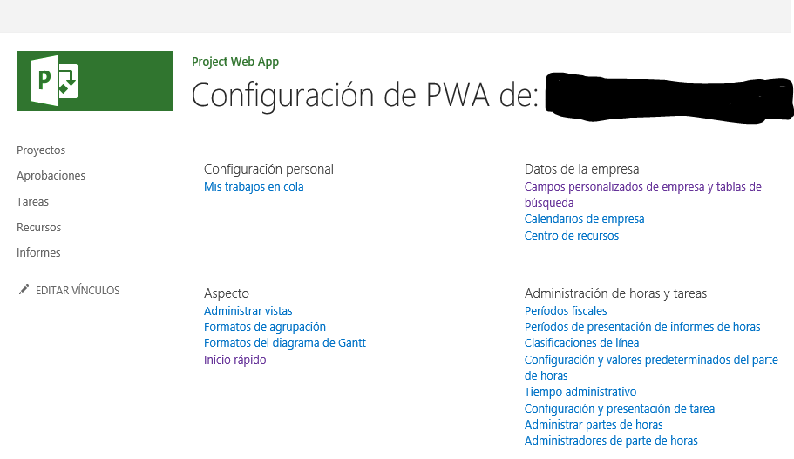
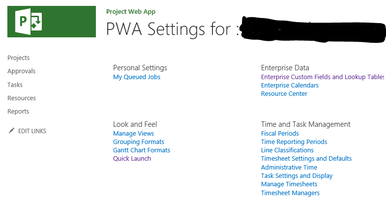
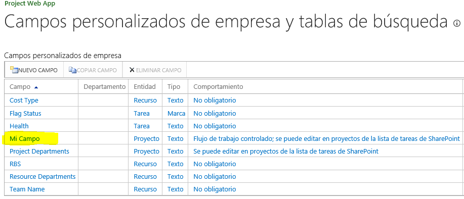
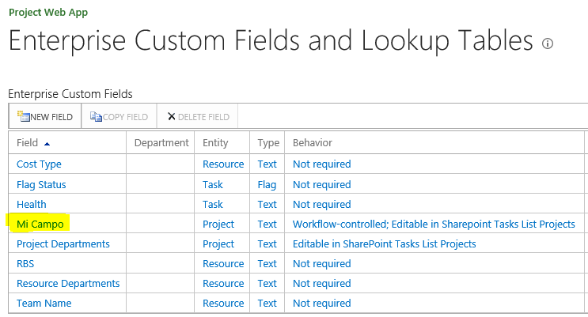
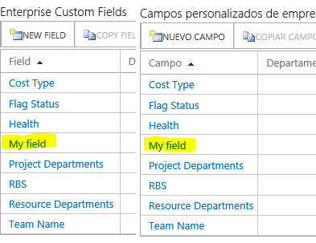

​En un proyecto para un cliente que tenía sedes en varios países se planteó la posibilidad de hacer que el sitio de PWA fuese multiidioma y no desplegarlo todo sólo en inglés. Según Microsoft, Project Server (y, por lo tanto, Project Online) soporta el multiidioma: se pueden instalar los Language Packs correspondientes tanto para SharePoint como para Project Server y, de esta forma, la interfaz se adaptará al idioma por defecto del usuario:

Sitio de pwa en español:

El mismo sitio, cambiando el idioma por defecto del usuario a inglés:

Hasta aquí, aparentemente todo bien. Sin embargo, ¿qué pasa si creo un campo personalizado nuevo? Pues que el nombre del campo no puede crearse en varios idiomas. Si, por ejemplo, creamos el campo "Mi campo", en la interfaz en español:

Cuando cambiemos a la interfaz en inglés seguirá llamándose "Mi campo":

Hasta aquí podría parecerse al comportamiento de SharePoint ya que, cuando creamos un campo nuevo para una lista en un idioma, hasta que no se cambia de interfaz y se modifica su título adaptándolo al nuevo lenguaje no se guarda para el mismo. Sin embargo, esto no funciona así para Project Server. Si modificamos el nombre del campo para el idioma inglés, se queda en inglés también en español:

Está claro que las bases de datos de Project Server no permiten mantener la información de los nombres de los campos en más de un idioma. Bueno, hay una excepción: [las tablas de búsqueda personalizadas (Enterprise Lookup Tables)](https&#58;//msdn.microsoft.com/es-es/library/ms447495%28v=office.12%29.aspx#Anchor_6). Curiosamente, este componente sí permite la creación de sus elementos en múltiples idiomas, pero sólo mediante desarrollo utilizando el API de la PSI, no a través de la interfaz de usuario:

*Lookup tables can be localized through the PSI. Neither Project Web Access nor Project Professional includes a way to localize lookup tables. Project Web Access always shows lookup table values using the highest preference Internet Explorer language available. If no lookup table language is found that matches an Internet Explorer language, then Project Web Access uses the primary lookup table language.*

Incluso, para acabar de salir de dudas, podemos consultar la información nuestros proyectos mediante el API REST, que permite el multiidioma. Para ello, simplemente tenemos que realizar la siguiente llamada:

[http://Mi\_Instancia\_PWA/\_api/ProjectData/\[es-ES\]/Proyectos](http&#58;//mi_instancia_pwa/_api/ProjectData/%5bes-ES%5d/Proyectos)

Y, si buscamos en el xml nuestro campo, aparecerá tal y como ha quedado modificado al inglés:

*&lt;d:Myfield m:null="true" /&gt;&lt;/m:properties&gt;&lt;/content&gt;&lt;/entry&gt;*

Esta limitación afecta a todos los elementos de la interfaz de usuario que contengan campos personalizados: PDP's, vistas, Inicio rápido (Quick Launch), etc.

Sin embargo, ¿se podría hacer algo para aparentar, al menos, el multiidioma? La respuesta es sí: duplicarlo todo por tantos idiomas cómo sea necesario. Y podemos duplicarlo de dos formas: usando una sola instancia de PWA o usando tantas como idiomas se requieran.

**Multiidioma con una sola instancia de PWA**

Como hemos comentado antes, habría que generar los campos personalizados por todos los idiomas como sea necesario soportar, lo que significa que cuánto más complejo sea el sistema a implementar más complejo será su mantenimiento. Además, también habría que multiplicar el resto de elementos de Project Server / Online por el número de idiomas como, por ejemplo, las PDP's y, con ellas los tipos de proyectos y flujos, para que cada tipo de proyecto muestre las páginas con los campos en el idioma correspondiente. Y, si hay algún workflow, entonces habrá que generarlo tantas veces como tipologías de proyectos a las que esté asociado, ya que los campos que se usarán para cada idioma serán diferentes, así como los correos.

Otro tema son las vistas: no sólo habría que generarlas tantas veces como lenguajes sino que, además, habría que controlar su visibilidad para que sólo se muestren a los usuarios del país que corresponda. Esto nos obligaría a tener que utilizar el modelo de seguridad clásico de Project Server, ya que es la única forma de controlar la seguridad de las vistas tal y como necesitamos. Y, por último, habría que implementar tantos grupos de seguridad como grupos de usuarios con un idioma común.

En resumen, un suplicio. Funcionaría, pero sería una pesadilla tanto su implementación como su mantenimiento.

**Multiidioma con varias instancias de PWA**

La otra opción es generar tantas instancias de PWA como idiomas sean necesarios. Así, aunque se debería replicar todo igualmente, al menos tendríamos la información organizada de una forma lógica. En una instalación On Premise se podrían generar tantas colecciones de sitios de PWA como idiomas sean necesarios. En Project Online, oficialmente solo se permiten siete instancias de PWA, pero puede ser más que suficiente.

Otra ventaja es que, si se usan básicamente los grupos de seguridad estándar de Project, no será necesario replicarlos en cada uno de los sitios.

La mayor dificultad de esta solución estriba en la visibilidad de la cartera de proyectos de forma global (ver el estado de los proyectos de todos los países a la vez), pero esto se podría solventar con informes a medida para aglutinar la información necesaria de todas las instancias de PWA.

**Conclusiones**

Como se ha podido comprobar, Project Server / Online no está pensado para el multiidioma, lo que lleva a que la mayoría de implementaciones en entornos internacionales se hagan en inglés. Quizás la integración de las bases de datos de Project en la base de datos de contenido de SharePoint sea un primer paso para mejorar este aspecto. La verdad es que no he encontrado software de terceros que permita hacer multiidioma la interfaz de usuario. A mí se me ha ocurrido un "workaround" basado en JavaScript y una lista de SharePoint de traducciones que podría dar una solución a esta carencia del producto.

**José Rafael García**

[josex1975@gmail.com](mailto&#58;josex1975@gmail.com)

Blog: [www.projectservernotes.com](http&#58;//www.projectservernotes.com/) | Twitter: jrgarcia1975

