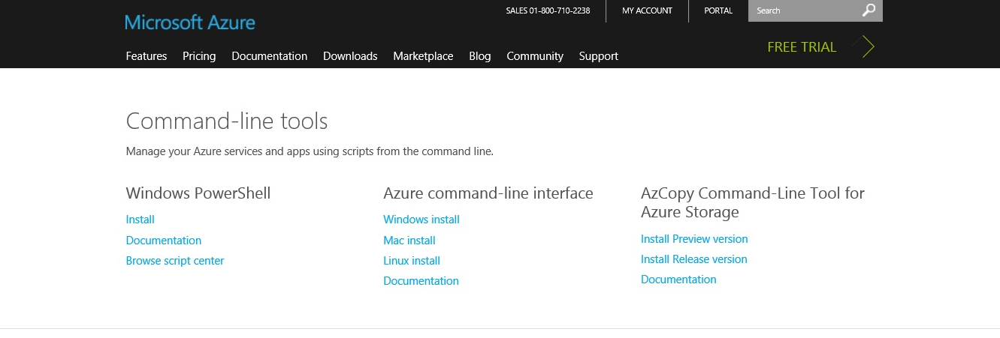
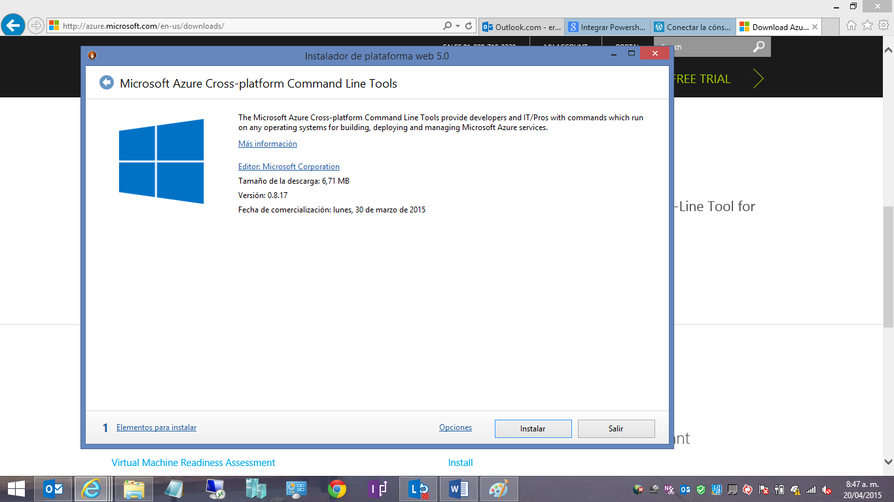
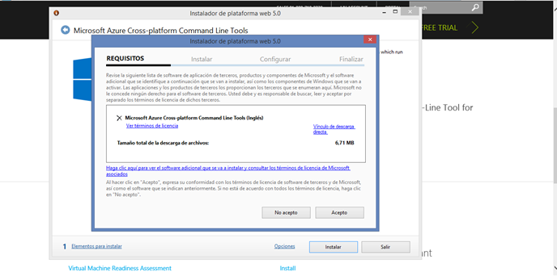
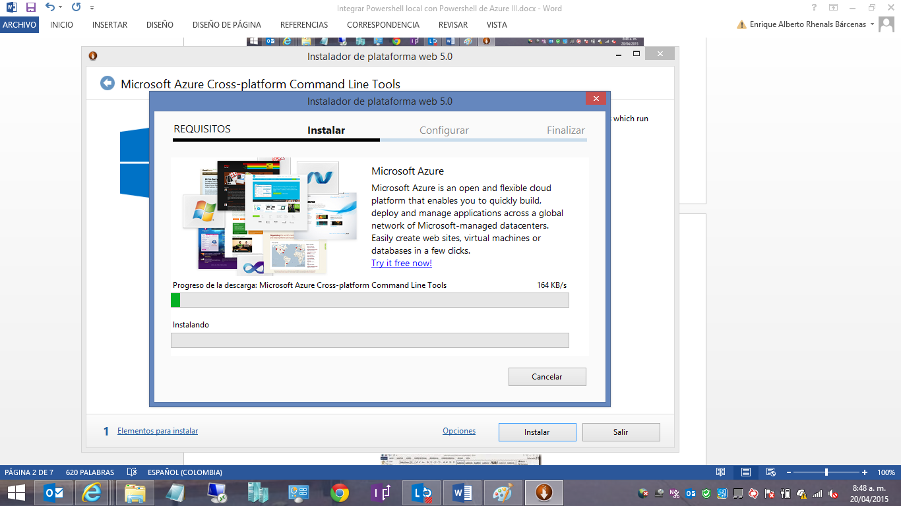
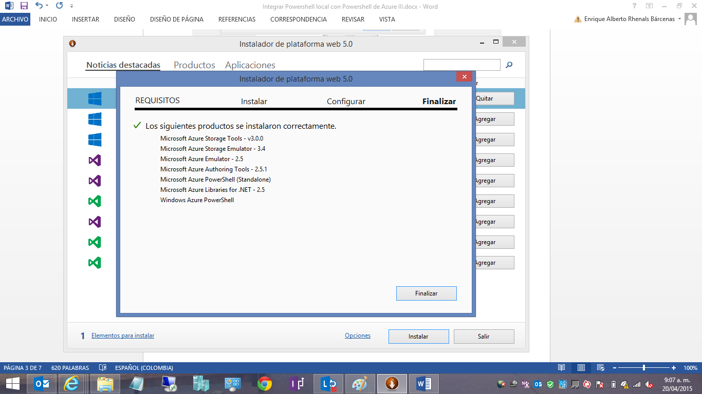
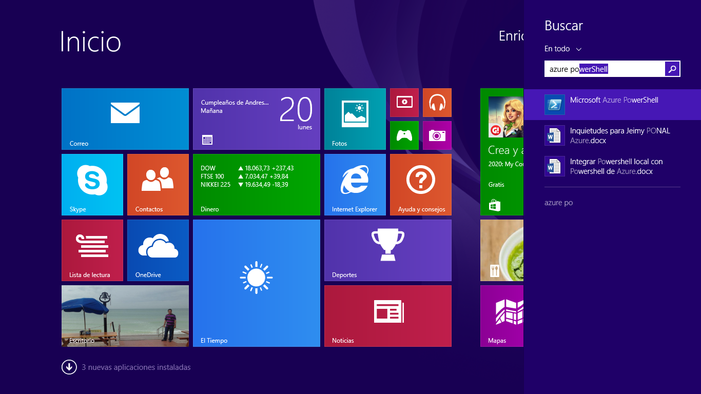
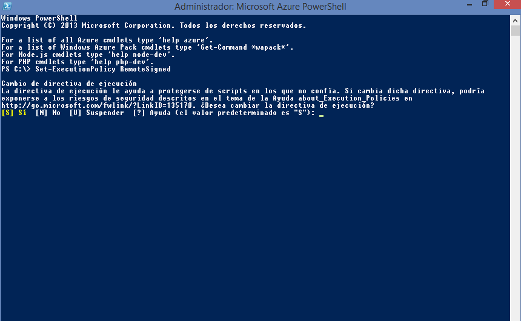
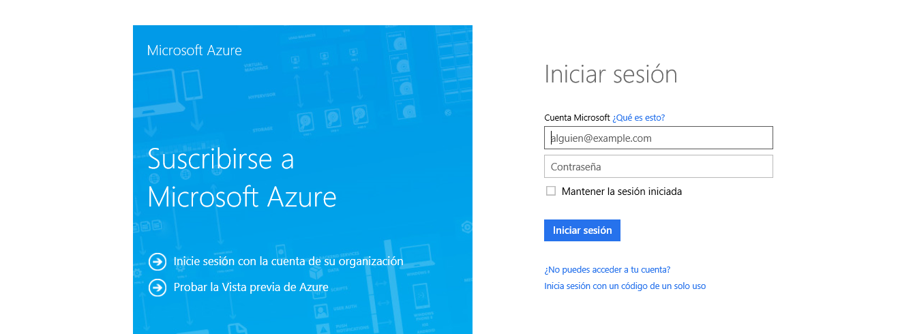
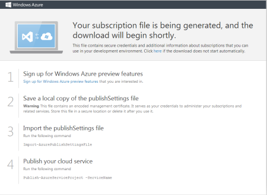

import ArticleHeader from '../../../components/article-header'

<ArticleHeader frontmatter={props.pageContext.frontmatter} />


​PowerShell puede ser utilizado tanto de forma local en nuestro equipo haciendo uso de las funciones disponibles, como de forma remota para configurar y administrar servicios OnPremises o en la nube. En este artículo hablaremos de cómo integrar PowerShell local con PowerShell de Azure para poder realizar de manera más ágil nuestras operaciones en Azure.

**Pasos a seguir para la integración**

Para integrar nuestro PowerShell local con PowerShell en Azure hay que seguir los pasos que se indican a continuación:

- Llegamos a la dirección: [http://azure.microsoft.com/en-us/downloads/](http&#58;//azure.microsoft.com/en-us/downloads/), en la cual encontramos diferentes herramientas que podemos utilizar para interactuar con Azure. Elegimos la opción: Azure command-line interface, Windows Install (Download .exe )




- Procedemos a la instalación del mismo presionando el botón "Instalar"




- En requisitos, tomamos la opción Windows Azure PowerShell y aceptar. Se iniciará el proceso de descarga e instalación de los componentes para PowerShell de Azure.






- Y aquí continuamos con la finalización de la instalación inicial.




- Luego de tener instalada la herramienta procedemos a ir al panel de Windows y elegimos Azure PowerShell y tomamos la opción "ejecutar como administrador".




- Estando en la opción de Azure PowerShell ejecutamos la sentencia Set-ExecutionPolicy RemoteSigned que nos sirve para dar permisos de ejecución de scripts PowerShell en nuestro ambiente.




- Luego de realizar lo anterior procedemos a integrar las herramientas de Azure al ambiente normal de PowerShell ejecutamos lo siguiente:


```
Import-Module “C:\Program Files (x86)\Microsoft SDKs\Windows Azure\PowerShell\Azure\Azure.psd1″ 
```

- Allí elegimos la opción "Certificate".
- Posteriormente nos aparece la opción de loguearnos en Azure, para lo cual entramos con el usuario y contraseña que tenemos asignada para realizar esta operación.




- Posteriormente procedemos a salvar el archivo que utilizaremos para la suscripción.




- Si queremos establecer una conexión entre nuestra cuenta en la nube de Azure y nuestro equipo debemos instalar un certificado en nuestro PC proveniente de Azure.


```
Import-AzurePublishSettingsFile-PublishSettingsFile D:\V2\credentials.publishsettings
```

Donde D:\V2\ es la ubicación del archivo

- Realizamos la verificación de nuestra suscripción del comando PowerShell a nuestro pc con la sentencia: Get-AzureSubscription .


Con la siguiente sentencia verificamos nombre de suscripción que tenemos por PowerShell:

```
Get-AzureSubscription 
```

**Conclusiones**

En este artículo vimos como configurar nuestro pc local para poder conectarnos a Windows Azure desde el Shell de sistema, y así poder administrar desde línea de comandos cualquier aspecto de nuestra infraestructura en la nube.


**Enrique Rhenals Bárcenas**
 MVP Office Servers and Services

MCT
[erhenalsb@hotmail.com](mailto&#58;erhenalsb@hotmail.com)
@enriquerhenals
 [http://enriquerhenalsb.blogspot.com](http&#58;//enriquerhenalsb.blogspot.com/)

