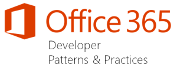
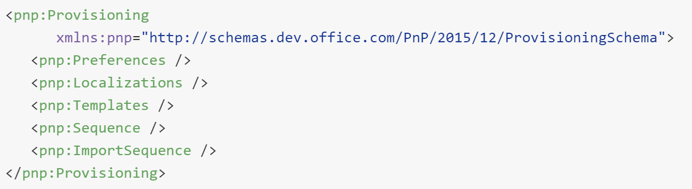
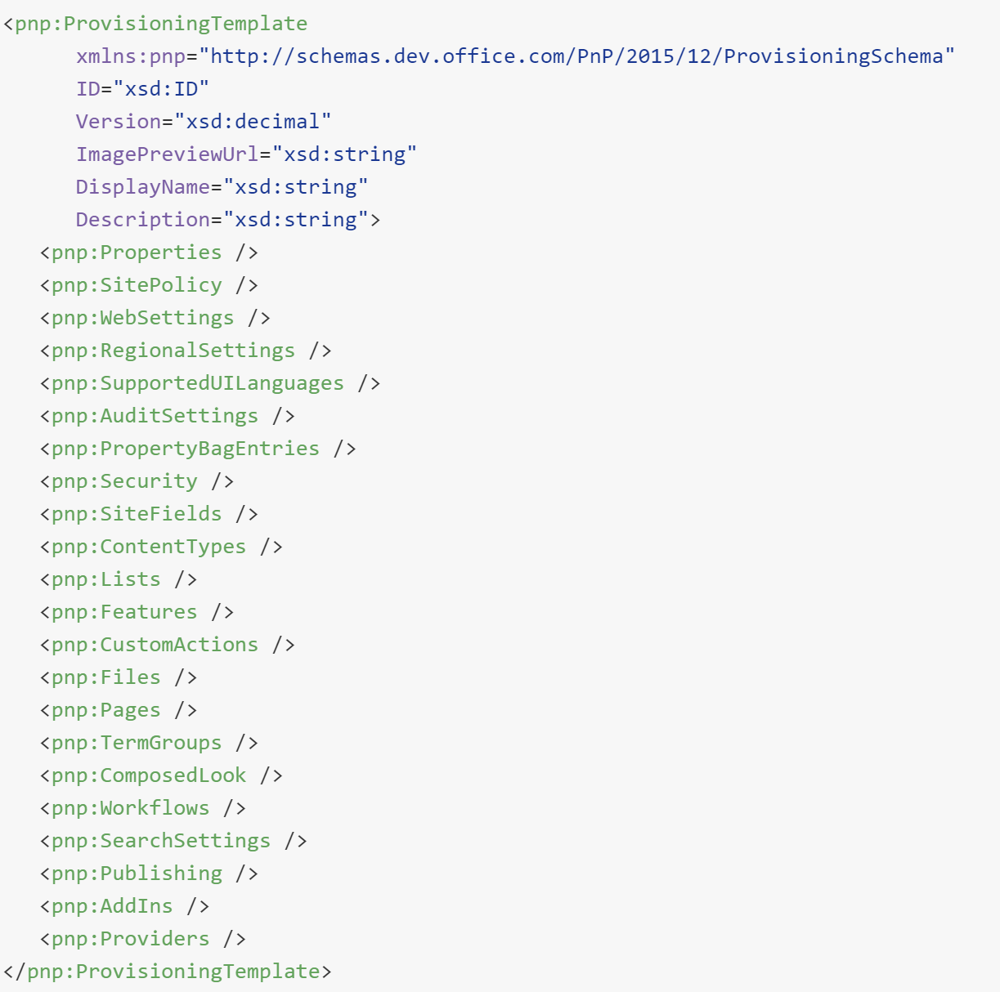

import ArticleHeader from '../../../components/article-header'

<ArticleHeader frontmatter={props.pageContext.frontmatter} />

​Desde hace cerca ya de dos años, un grupo de Patterns and Practices de Microsoft, liderado por Vesa Juvonen ([http://blogs.msdn.com/b/vesku](http&#58;//blogs.msdn.com/b/vesku)), inicio el programa Office 365 Dev PnP, con la idea principal de ayudar a los clientes a transformar y realizar la transición del modelo Soluciones Full Trust de SharePoint, al modelo de AddIns, tratando de establecer unas guías y buenas prácticas para hacer ese paso.´

**Componentes del programa PnP**

El Office 365 Dev PnP se liberó en GitHub, y poco tiempo después se dividió en distintos repositorios. Estos son algunos de los componentes principales:

- **PnP-Sites-Core**:
    - [https://github.com/OfficeDev/PnP-Sites-Core](https&#58;//github.com/OfficeDev/PnP-Sites-Core)
 Es el componente principal del PnP. Se trata de una .dll con diferentes clases y métodos que nos harán la vida más fácil al trabajar con el modelo cliente de SharePoint (CSOM). Además, incluye el framework de Provisioning del que hablaremos en breve.
- **PnP-Provisioning-Schema**:
    - [https://github.com/OfficeDev/PnP-Provisioning-Schema](https&#58;//github.com/luismanez/PnP-Provisioning-Schema)
 Este proyecto contiene el Schema XML que es utilizado por el framework de provisioning. Este XML nos recordara bastante al XML utilizado en las "antiguas" soluciones SharePoint, y desde él se pueden definir la mayoría de los componentes de una solución de SharePoint: Fields, ContentTypes, Lists, Files, Pages, RegionalSettings, etc.
- **PnP-PowerShell**:
    - [https://github.com/OfficeDev/PnP-PowerShell](https&#58;//github.com/luismanez/PnP-PowerShell)
 Power-Shell CommandLets con más utilidades.
- **PnP**:
    - [https://github.com/OfficeDev/PnP](https&#58;//github.com/OfficeDev/PnP) Este fue el repositorio original, que posteriormente fue dividido en varios repositorios, entre los que se encuentran los anteriores. Actualmente este repositorio contiene varios ejemplos de uso del PnP y otras buenas prácticas.

**Ejemplos interesantes**

El siguiente listado contiene algunos de los ejemplos más interesantes que podemos encontrar en el PnP, si bien es muy recomendable revisar todos los ejemplos.

- Branding.ApplyBranding: [https://github.com/OfficeDev/PnP/tree/master/Samples/Branding.ApplyBranding](https&#58;//github.com/OfficeDev/PnP/tree/master/Samples/Branding.ApplyBranding)
 Muestra buenas practicas a la hora de aplicar branding y otras características de publishing.
- Core.CreateContentTypes: [https://github.com/OfficeDev/PnP/tree/master/Samples/Core.CreateContentTypes](https&#58;//github.com/OfficeDev/PnP/tree/master/Samples/Core.CreateContentTypes)
 Permite crear Tipos de Contenido usando el PnP Core.
- Core.EmbedJavaScript: [https://github.com/OfficeDev/PnP/tree/master/Samples/Core.EmbedJavaScript](https&#58;//github.com/OfficeDev/PnP/tree/master/Samples/Core.EmbedJavaScript)
 Buena práctica a la hora de inyectar JavaScript y actualizar la Interfaz de Usuario.
- Core.MMSSync: [https://github.com/OfficeDev/PnP/tree/master/Samples/Core.MMSSync](https&#58;//github.com/OfficeDev/PnP/tree/master/Samples/Core.MMSSync)
 Sincronización de Términos del Almacén de Metadatos a través de múltiples TermStores.
- Provisioning.Cloud.Async.Webjob: [https://github.com/OfficeDev/PnP/tree/master/Samples/Provisioning.Cloud.Async.WebJob](https&#58;//github.com/OfficeDev/PnP/tree/master/Samples/Provisioning.Cloud.Async.WebJob)
 Creación de Colecciones de Sitios desde un WebJob en Azure.
- UserProfile.Manipulation.CSOM.Console: [https://github.com/OfficeDev/PnP/tree/master/Samples/UserProfile.Manipulation.CSOM.Console](https&#58;//github.com/OfficeDev/PnP/tree/master/Samples/UserProfile.Manipulation.CSOM.Console)
 Actualización de los Perfiles de Usuario mediante el Modelo de Objetos en Cliente (CSOM).

**Extensiones y utilidades con CSOM**

Algunas de las clases y métodos que extienden CSOM:

- ClientContextExtensions.ExecuteQueryRetry
 Similar al método ExecuteQuery(), pero gestiona posibles errores de conexión y aplica varios reintentos (10, por defecto, con un retardo de 500 ms).
- FieldAndContentTypeExtensions: Clase con varias extensiones para trabajar con Campos y Tipos de contenido.
- ListExtensions: Extensiones para trabajar con Listas (crear Listas, Vistas, obtener listas, etc.).
- TaxonomyExtensions: Extensiones para trabajar con Campos de tipo Metadato Administrados (crear campos de tipo Metadato, crear Términos, Crear Grupos, etc).

**Provisioning Framework**

Probablemente sea la estrella del PnP. Este framework pretende sustituir el antiguo modelo de despliegue de soluciones SharePoint basadas en soluciones WSP y hacerlo basado en un modelo remoto, usando CSOM, y un esquema XML propio para la definición de Columnas, Listas, Paginas, etc.

Como hemos mencionado anteriormente, el esquema XML está definido en el proyecto **PnP-Provisioning-Schema**y estos son los nodos principales:

Y la definición de una Plantilla se compone de:

La definición completa del esquema la podéis encontrar en:

[https://github.com/OfficeDev/PnP-Provisioning-Schema/blob/master/ProvisioningSchema-2015-12.md](https&#58;//github.com/OfficeDev/PnP-Provisioning-Schema/blob/master/ProvisioningSchema-2015-12.md)

**Nota**: Es importante saber que no todos los nodos del Esquema son posteriormente soportados por el framework de provisioning. Por ejemplo, el Nodo Sequence permite definir SiteCollections (Colecciones de Sitios) y Sites (Sitios) dentro de él, por lo que sería lógico pensar que el framework permite crear Colecciones de Sitio y Sitios, sin embargo, por desgracia, esto es algo que (todavía) no está soportado por el framework.

Un sencillo, pero completo ejemplo de XML lo tenemos en:

[https://github.com/OfficeDev/PnP-Provisioning-Schema/blob/master/Samples/ProvisioningSchema-2015-12-ReferenceSample-01.xml](https&#58;//github.com/OfficeDev/PnP-Provisioning-Schema/blob/master/Samples/ProvisioningSchema-2015-12-ReferenceSample-01.xml)

Y el siguiente código C# provisionaría el XML sobre un sitio existente:

| `XMLFileSystemTemplateProvider provider =` |
| --- |

| `                ``new` `XMLFileSystemTemplateProvider(``@"c:\temp\pnpprovisioningdemo"``,``""``);` |
| --- |

| `string` `templateName =``"template.xml"``;` |
| --- |

| `ctx.Web.ApplyProvisioningTemplate(template);` |
| --- |

Lo bueno es que el framework también permite crear el XML desde un sitio ya existente (no se exporta absolutamente todo, por ejemplo, no se exportan todas las paginas existentes). Para exportar un sitio y guardar el XML generado, podemos utilizar el siguiente código:

| `XMLFileSystemTemplateProvider provider =``new`    `XMLFileSystemTemplateProvider(``@"c:\temp\pnpprovisioningdemo"``,``""``);` |
| --- |

| `string` `templateName =``"template.xml"``;` |
| --- |

| `provider.SaveAs(template, templateName);` |
| --- |

También podemos exportar un sitio como Template, o aplicar una plantilla XML desde PowerShell, con los comandos:

- *Apply-SPOProvisioningTemplate*
    - [https://github.com/OfficeDev/PnP-PowerShell/blob/c1cacc5394908c996fd543f887463702cf63a9d9/Documentation/ApplySPOProvisioningTemplate.md](https&#58;//github.com/OfficeDev/PnP-PowerShell/blob/c1cacc5394908c996fd543f887463702cf63a9d9/Documentation/ApplySPOProvisioningTemplate.md)
- *Get-SPOProvisioningTemplate*
    - [*https://github.com/OfficeDev/PnP-PowerShell/blob/c1cacc5394908c996fd543f887463702cf63a9d9/Documentation/GetSPOProvisioningTemplate.md*](https&#58;//github.com/OfficeDev/PnP-PowerShell/blob/c1cacc5394908c996fd543f887463702cf63a9d9/Documentation/GetSPOProvisioningTemplate.md)

**Seguimiento del programa PnP**

Además de los proyectos de GitHub, el equipo de PnP sigue liberando continuamente material muy interesante sobre el desarrollo para Office 365:

- Yammer Network:
    - [https://www.yammer.com/itpronetwork](https&#58;//www.yammer.com/itpronetwork). Esta es posiblemente la mejor manera de seguir informado sobre el PnP. Además, podrás dejar tus dudas y comentarios y ser ayudado por el mismo equipo del PnP.
- Canal PnP en Channel 9:
    - [https://channel9.msdn.com/blogs/OfficeDevPnP](https&#58;//channel9.msdn.com/blogs/OfficeDevPnP) Videos con demostraciones y ejemplos de uso del PnP.
- Blog del PnP: [http://dev.office.com/blogs](http&#58;//dev.office.com/blogs)
- Community call mensual del PnP:
    - [https://github.com/OfficeDev/PnP/wiki/Community-call](https&#58;//github.com/OfficeDev/PnP/wiki/Community-call) Apunta esta cita en tu calendario. Cada mes el equipo de PnP hace un meeting donde informa del estado del programa, el roadmap, muestra ejemplos, etc. Un verdadero lujo poder reunirse con el equipo del PnP y recibir las actualizaciones de mano del mismísimo Vesa.

**Luis Mañez**

SharePoint / Cloud Solutions Architect en ClearPeople LTD
 @luismanez
 [http://geeks.ms/lmanez/](http&#58;//geeks.ms/lmanez/)

