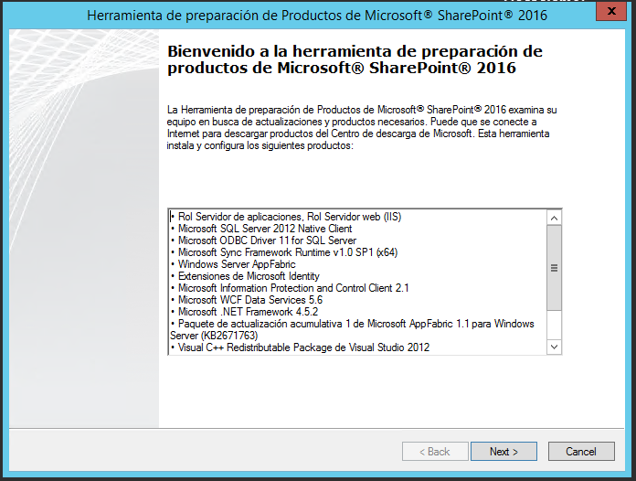
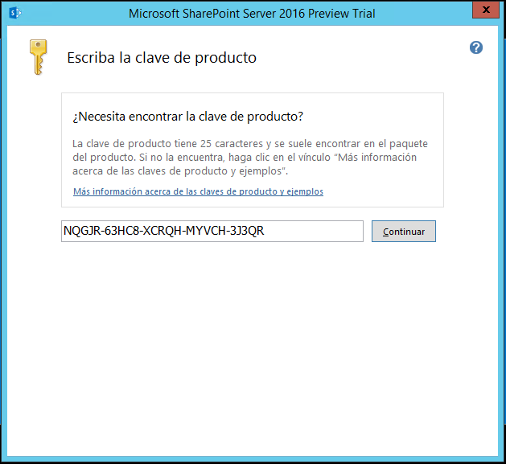
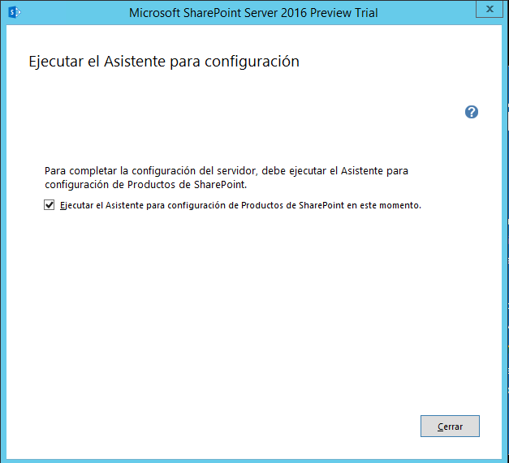
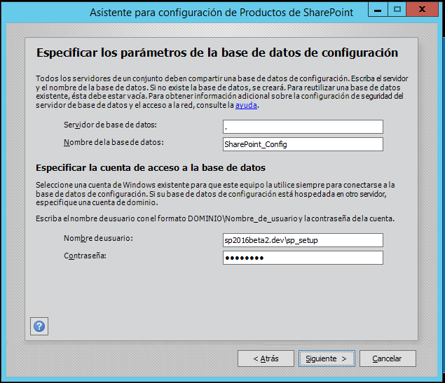

​El proceso de instalación de SharePoint Server 2016 viene determinado por el tipo de Granja:

- Granja de servidor único, es decir, todos las Aplicaciones de Servicio y Componentes necesarios se instalan en un único servidor.  Este tipo de Granja está pensado para el despliegue rápido de entornos de desarrollo o de pruebas.
- Granja de varios servidores, es decir, los distintos roles que pueden formar parte de una Granja (Frontal Web, Búsquedas, Aplicaciones, Caché y Personalizado) se configuran en varios servidores de acuerdo a la topología de Granja elegida.

La principal novedad en cuanto a tipos de Granja de SharePoint server 2016 la aporta el concepto de MinRole que aplica a un escenario de configuración y despliegue de una Granja de varios servidores. La característica de minRole de SharePoint Server 2016 permite a los administradores especificar el rol concreto que un servidor va a desempeñar en una Topología de Granja de acuerdo a los siguientes Roles disponibles:

- **Frontal Web**, los servidores con este Rol están optimizados para proporcionar baja latencia de manera que hospedan Aplicaciones de Servicio, Servicios y Componentes que se encargar de dar respuesta a las peticiones de usuario relativas a servidores Frontales como por ejemplo el acceso a un Sitio de la Granja, lanzar una Consulta de Búsqueda, etc.
- **Aplicación**, en este caso los Servidores con este Rol se han optimizado para proporcionar alto rendimiento por lo que hospedan Aplicaciones de Servicio, Servicios y Componentes que sirven peticiones de backend como por ejemplo las peticiones de rastreo del buscador.
- **Caché Distribuida, h**ospedan Aplicaciones de Servicios, Servicios y Componentes que se requieren para la Caché Distribuida en Servidores de Caché Distribuida.
- **Búsqueda**, Servidores que hospedan Aplicaciones de Servicios, Servicios y Componentes que se requieren para realizar búsquedas en Servidores de Búsqueda.
- **Personalizado**, es decir, Servidores que hospedan las Aplicaciones de Servicio, Servicios y Componentes personalizados que están fuera de la topología de MinRole. Un ejemplo de Aplicación de Servicio que se hospedaría en un servidor con este Rol es la de Reporting Services.

Como se verá a continuación, el Rol de un servidor se especifica en el momento en el que se crea una nueva Granja o bien se une un nuevo servidor a una Granja existente. SharePoint se encarga de configurar de forma automática los servicios de cada servidor de la Granja de acuerdo al Rol asignado. Para más información sobre MinRole: [**https://technet.microsoft.com/EN-US/library/mt346114(v=office.16).aspx**](https://technet.microsoft.com/EN-US/library/mt346114%28v=office.16%29.aspx).

**Particularidades en la instalación de una Granja de varios Servidores**

A continuación, se detallan las particularidades en la instalación de una Granja de varios Servidores de SharePoint 2016 (versión Release Candidate – RC) bajo la característica de minRole asumiendo las siguientes premisas de partida:

- Existe un Directorio Activo creado y pre-configurado al que previamente se han unido cada uno de los Servidores de la Granja.
- Existe un Servidor en el que se ha instalado y configurado una versión de SQL Server soportada por SharePoint Server 2016 (SQL Server 2014 o bien SQL Server 2016 CTP 3.3).
- Se han creado las cuentas de instalación y configuración necesarias para instalar y configurar SharePoint Server 2016. A modo de ejemplo, recomiendo seguir el siguiente artículo de Vlad Catrinescu como referencia de cuentas requeridas: [https://absolute-sharepoint.com/2013/01/sharepoint-2013-service-accounts-best-practices-explained.html](https://absolute-sharepoint.com/2013/01/sharepoint-2013-service-accounts-best-practices-explained.html)

Con estas premisas de partida, el proceso de instalación de cada uno de los Roles de la Granja es el siguiente:

- Descargar SharePoint Server 2016 Beta2 y el parche relativo a la RC de los siguientes enlaces:
    - SharePoint Server 2016 Beta 2:
        - [https://www.microsoft.com/en-us/download/details.aspx?id=49961](https://www.microsoft.com/en-us/download/details.aspx?id=49961)
    - SharePoint Server 2016 RC:
        - [https://www.microsoft.com/en-us/download/details.aspx?id=50737](https://www.microsoft.com/en-us/download/details.aspx?id=50737)

Adicionalmente, para la RC necesitaremos seguir las instrucciones de instalación específicas y descargar e instalar (dependiendo del idioma base para la Beta 2) el paquete o paquetes de idiomas necesarios:

    - Instrucciones de instalación de la RC:
    - [https://technet.microsoft.com/library/mt674910(v=office.16).aspx](https://technet.microsoft.com/library/mt674910%28v=office.16%29.aspx)
    - Paquetes de idioma para la RC:
        - [https://www.microsoft.com/en-us/download/details.aspx?id=50736](https://www.microsoft.com/en-us/download/details.aspx?id=50736)

- Instalación y configuración de los pre-requisitos de software necesarios para SharePoint 2016. Durante el proceso de instalación y configuración de los pre-requisitos, el servidor se re-iniciará 1-2 veces.

- Con los pre-requisitos instalado, podemos proceder a instalar en cada uno de los servidores de la Granja los bits de SharePoint 2016. Para la versión RC, lo que haremos es instalar SharePoint 2016 Beta2 en cada servidor y posteriormente aplicar el parche correspondiente a la RC. Como primer paso del proceso de instalación tendremos que especificar la correspondiente clave de producto de manera que se pueda iniciar la instalación de los bits en el servidor:

- Como en versiones previas, el proceso de instalación de los bits de SharePoint Server 2016 en el primer servidor de la granja concluye mostrando la pantalla "Ejecutar el Asistente para configuración" con la opción "Ejecutar el Asistente para configuración de Productos de SharePoint en este momento" seleccionada. Si se hace clic en el botón "Cerrar", se iniciará el asistente de configuración.

- En la primera pantalla del asistente, presione "Siguiente" de forma que se muestre el correspondiente mensaje de advertencia que informa sobre los servicios se van a reiniciar o restablecer durante la configuración. A continuación, la ventana "Conectar a un conjunto de servidores" nos permite indicar si el servidor actual va a formar parte de una Granja de servidores existente o bien se va a crear una nueva Granja. En este caso, como se está instalando el primer servidor de la Granja, seleccione la segunda opción y haga clic en "Siguiente".
- La siguiente pantalla permite especificar los parámetros relativos a la BD de Configuración que se requiere en la Granja:

- A continuación, especifique la frase de contraseña. Es importante recordar / guardar la misma puesto que será necesaria para poder añadir a la Granja el resto de Roles.
- En la pantalla especificar el Rol del servidor es dónde empiezan las particularidades de SharePoint Server 2016 a la hora de desplegar y configurar una Granja de varios servidores: es necesario elegir el Rol en la Granja del Servidor que se está configurando. Como este servidor es el primero que se configura en la Granja, es recomendable elegir el Rol de Aplicación lo que implica, entre otros, que este servidor va a hospedar la Administración Central de SharePoint 2016 y todos las Aplicaciones de Servicio de la plataforma que se requieran a excepción de la Aplicación de Servicio de Búsquedas.

- Los dos últimos pasos del asistente, previos al inicio del asistente de configuración, permiten por un lado configurar el puerto para la Administración Central de SharePoint 2016 y el método de autenticación (opción NTLM por defecto) y visualizar el resumen de las parametrizaciones que se van a realizar. A partir de aquí, se inicia el proceso de configuración que, si todo va bien, concluye lanzando la Administración Central para iniciar el Asistente de configuración de las Aplicaciones de Servicio que hospedará el servidor en la Granja.

Una vez que se ha configurado el primer servidor de la Granja con el Role de Aplicación, el proceso para agregar el resto de servidores y el resto de Roles consiste en seguir los siguientes pasos que se repiten por cada nuevo Role a añadir y configurar:

- En la ventana "Conectar a un conjunto de servidores" indicaremos que el servidor actual va a formar parte de una Granja de servidores existente.
- A continuación, la ventana "Especificar los parámetros de la base de datos de configuración" permite indicar el nombre del Servidor de BD y validar la misma mediante el botón "Recuperar nombres de bases de datos" que permite cargar el nombre de la BD de Configuración.

**Nota**: Puede ocurrir que al intentar recuperar la BD de configuración del Servidor de BD se muestre un error indicando que no es posible realizar la comunicación con el servidor. Este problema puede ser debido a que en el servidor de BD no se ha configurado el Firewall de Windows para abrir los puertos requeridos tal y como se detalla en el siguiente artículo de Microsoft TechNet: [https://msdn.microsoft.com/en-us/library/cc646023.aspx](https://msdn.microsoft.com/en-us/library/cc646023.aspx)

- En la ventana "Especificar configuración de seguridad del conjunto de servidores" especifique la frase de contraseña configurada al instalar el Rol de "Aplicación" y haga clic en "Siguiente" de forma que se muestre la pantalla "Especifique el rol del servidor".  Seleccione en este caso "Buscar" y presione "Siguiente".

- La pantalla la pantalla "Finalizando el asistente para configuración de Productos SharePoint" muestra el resumen de las configuraciones que se van a realizar en el servidor y además dispone de un botón "Configuración avanzada" que permite indicar si el servidor que se está configurando va a hospedar o no la Administración Central de SharePoint 2016 (la opción por defecto es No).

- De vuelta a la pantalla de "Finalizando el asistente para configuración de Productos SharePoint", haga clic en "Siguiente" para que se inicie la configuración de SharePoint en el servidor actual.

Una vez se ha configurado el segundo servidor de la Granja, el proceso a seguir para el resto de servidores es idéntico al que se ha detallado para el Rol de "Buscar".

**Conclusiones**

SharePoint Server 2016 únicamente permite realizar instalación y configuración en modo Granja de Servidores que a su vez incluye dos tipos de instalación: Granja de un único servidor y Granja de varios servidores. En el primer caso, todas las Aplicaciones de Servicio y Componentes necesarios se instalan en un mismo servidor. En el segundo, los distintos roles que pueden formar parte de una Granja (Frontal Web, Búsquedas, Aplicaciones, Caché y Personalizado) de SharePoint se configuran en varios servidores de acuerdo a la topología de Granja elegida

**Juan Carlos González Martín**
 Office Servers and Services MVP
 Cloud & Productivity Advisor en MVP CLUSTER
 [jcgonzalez](mailto:jcgonzalez)martin1978@hotmail.com
 @jcgm1978 | [https://jcgonzalezmartin.wordpress.com/](https://jcgonzalezmartin.wordpress.com/)

 
 
import LayoutNumber from '../../../components/layout-article'
export default LayoutNumber
