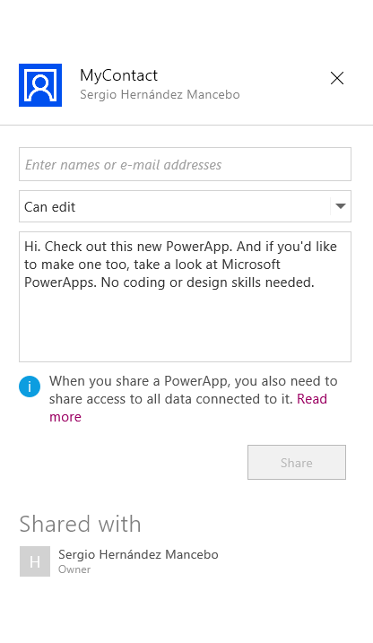

import ArticleHeader from '../../../components/article-header'

<ArticleHeader frontmatter={props.pageContext.frontmatter} />

​Si accedemos a la página de Microsoft y buscamos la definición de PowerApp nos encontraremos algo como "Aplicaciones para conectar, crear y compartir aplicaciones que impulsen su negocio". Analizando la definición debemos empezar por el final, ya que, después de trabajar un poco con esta nueva herramienta, he podido observar que  un usuario con conocimientos en office puede hacer uso de las PowerApps y crear una aplicación de forma totalmente autónoma sin necesidad de tener conocimientos en programación por lo que podemos decir desde ya que las PowerApps están pensadas para conseguir una autonomía  de los empleados de negocio respecto a los departamentos de IT en el proceso de creación de este tipo de aplicaciones.

Como podéis ver he definido PowerApps como una "herramienta" y muy ligada al paquete Office; y en verdad es eso, una herramienta que permite crear aplicaciones de negocio tanto para móviles como para tablets que aporta una serie de conectores con nuestros servicios en la nube (Office 365, Dynamics CRM, OneDrive…), como con nuestros datos (SharePoint, SQL Server, Oracle, SAP, etc).

Como veremos más adelante en el ejemplo, el usuario puede desarrollar las aplicaciones de una forma muy parecida a como podemos crear una presentación en PowerPoint, y conectar sus datos haciendo uso de las conexiones a servicios o a datos. El tercer punto fuerte de las PowerApps es, bajo mi punto de vista, el concepto "Compartir" que incluye la herramienta. Podemos compartir nuestras aplicaciones móviles como a día de hoy compartimos un archivo en OneDrive. De forma sencilla podemos dar acceso a la aplicación a usuarios de nuestra organización para que puedan empezar a hacer uso de la plataforma.

Por último, agregar que PowerApps no solo es creación de aplicaciones, sino que también permite la creación de flujos de trabajo que posteriormente podremos utilizar en nuestras aplicaciones.

**¿Cómo empezamos con PowerApps?**

Para empezar a trabajar con PowerApps debemos adquirir la aplicación que encontraremos en la tienda de Windows 10. Una vez descargada necesitaremos una licencia para poder hacer uso de ella. Existe la posibilidad de solicitar una licencia de prueba directamente a Microsoft [https://powerapps.microsoft.com/es-es/pricing/](https&#58;//powerapps.microsoft.com/es-es/pricing/) , y ahí podremos ver que hay varias versiones del producto.

Como vemos existe una versión totalmente gratis un poco limitada en cuanto al número de conectores que podemos utilizar, pero que nos puede servir para iniciarnos en la tecnología. La versión estándar sí es una versión de pago, que viene incluida con la licencia de O365 y aporta un uso ilimitado de conexiones a datos y mayor capacidad que la versión gratuita.

Y la versión Enterprise (de la cual hablaremos en siguientes artículos), es una versión aún por llegar ya que está en beta para empresas y desarrolladores, que incluye una visión más programática de la aplicación ya que permite desarrollar APIS personalizadas y almacenarlas en Azure para conectar nuestros datos con las apps y que no vienen en el catálogo de conectores estándar.

**CREANDO NUESTRA PRIMERA APLICACION**

Una vez tenemos nuestra aplicación PowerApp, instalada y descargada podemos empezar a crear nuestra aplicación de prueba.

- Lo primero que se nos va a solicitar es una cuenta de usuario con licencia como hablamos en el punto anterior.
- Una vez logados en la plataforma se necesita configurar una conexión donde alojar nuestras aplicaciones (OneDrive, Dropbox, SharePoint Online, GoogleDrive…). Después de elegir donde guardaremos nuestra aplicación seleccionamos "Nuevo", y veremos que tenemos varias opciones de crear la aplicación:
    - **Desde una plantilla predefinida.** Se nos aporta una variedad de plantillas base con las que nos podemos ahorrar trabajo y solamente con adaptarla podemos conseguir el objetivo que buscamos.
    - **Desde una conexión de datos.**Podemos crear una aplicación en base a un modelo de datos, desde una hoja Excel a una base de datos SQL en Azure. Desde este modelo la aplicación nos implementa las pantallas necesarias para conseguir un CRUD, al más puro estilo LightSwitch.
    - **En blanco.**Total libertad para implementar lo que necesitemos en una aplicación desde cero.

- En nuestro caso para este primer ejemplo vamos a elegir una plantilla para ahorrarnos trabajo, y en concreto una plantilla de Contactos para una aplicación móvil. Esta plantilla genera una aplicación básica que permite gestionar una lista de contactos almacenados en una hoja de Excel llamada "data.xlsx", con una pestaña Contacts.
 Esta hoja Excel se guarda junto a nuestra aplicación PowerApps (OneDrive en este caso).
- Todo el poder de PowerApps reside en la ribbon superior desde la cual podemos utilizar todas las herramientas existentes.

- Como explicar cada uno de los controles que existen podía darnos para un manual extenso, vamos a centrarnos en modificar un poco la aplicación para poder adaptarla a nuestras necesidades. Si revisamos de arriba abajo la aplicación que nos genera la plantilla de contactos no es más que un CRUD de nuestra base de datos Contacts (Excel), tal y como vemos en la apartado Content/Data Source en la ribbon superior.
- Vamos a añadir un nuevo campo a nuestra hoja Excel que será el país de nacimiento del usuario y que gestionaremos desde las pantallas de la aplicación. Para ello vamos a guardar nuestra aplicación en la Conexión que configuramos al inicio del artículo, en mi caso he seleccionado una conexión a mi OneDrive personal, con el nombre de MyContact.
- Al guardar la aplicación se genera una carpeta PowerApps/Templates/Contacts + **idPowerApps**/, y dentro encontramos tanto las imágenes que consume la app como la hoja Excel que mantiene la información de los contactos.
- Vamos a añadir en esa hoja Excel una columna llamada Country para poder guardar el país de nacimiento del usuario.

- Una vez actualizada la Excel, vamos a modificar las pantallas de la aplicación móvil para poder controlar este nuevo campo. En el margen izquierdo de nuestro editor de PowerApps, encontramos todas las pantallas de la aplicación.

- La primera pantalla no es más que un buscador de usuarios por lo que no tenemos que modificar nada en esta, aunque un poco más adelante vamos a hacer una nueva versión de ella ya que es bastante interesante. Nos vamos a centrar en la segunda y tercera pantalla que son la vista de detalle y de edición del contacto.
- Añadiremos un label y un campo de texto para nuestro campo. Para ello en la ribbon seleccionamos insert, y posteriormente le daremos el formato necesario con la pestaña "Home" en la ribbon.
- Además, añadiremos de forma similar un textBox pero en este caso para mapear el campo Country que añadimos en nuestra Excel de Contactos.
- Para conseguir esto nos vamos a fijar en la ribbon de propiedades del campo. Teniendo seleccionado el campo en pantalla, seleccionamos la propiedad "Text" y la configuramos tal cual vemos en la imagen.

- Como vemos tenemos un objeto "Record" que contiene el metadato country del contacto que estamos visualizando, cuando analicemos la pantalla buscadora de contactos veremos cómo le pasamos el metadato del contacto a las distintas pantallas.
- Este proceso lo repetiremos para la vista de edición (aunque en este caso el segundo campo será un control del tipo text input) de forma que nuestras pantallas queden de la siguiente forma:

- Es posible que la conexión Contacts que teníamos configurada como origen de datos no refresque el dato "Country" que hemos añadido. Para evitar problemas, lo mejor es que en el apartado Content/Data Sources borremos la antigua conexión a nuestra excel data.xslx, y volvamos a  añadirla llamando a la nueva conexión Contacts consiguiendo así refrescar la conexión.
- Además de actualizar la conexión debemos configurar el proceso de Update que tenemos en el formulario de edición. Si seleccionamos el botón "chekck" del formulario y seleccionamos en la ribbon "OnSelect", podemos ver la fórmula de actualización o creación del modelo.

- Deberemos modificar la formula y dejarla de forma similar a la imagen anterior, agregando nuestro campo Country de la forma “Country:ID\_TEXTBOX”. El identificador del campo de texto lo encontramos seleccionando el control, y en la pestaña “Home” encontraremos algo similar a esto.
- Dado que ya hemos añadido nuestro nuevo campo a nuestro origen de datos y a las dos pantallas que lo consumen, vamos a probar que todo está correcto, lanzando la aplicación y grabando un nuevo usuario.

- Si accedemos a la Excel de datos, podemos comprobar que el nuevo campo country se refresca de forma correcta.
- Una vez hemos conseguido añadir un nuevo campo a nuestra aplicación, vamos a replicar la pantalla del buscador, que posiblemente sea la más interesante. Necesitamos lo primero añadir una nueva pantalla a nuestra aplicación, para ello sobre una pantalla ya existente seleccionamos "New Screen".

- Sobre la nueva pantalla vamos a insertar una nueva "Custom Gallery" con orientación vertical, y después editando la galería podemos ir añadiendo controles. En este caso vamos a insertar una imagen y un campo de texto.
- Al seleccionar en nuestra galería veremos una propiedad llamada "Items", vamos a inicializarla a nuestro valor de Conexión, en nuestro caso Contacts.

- Al añadir un control del tipo Imagen, necesitamos mapear nuestro campo con el campo Imagen de nuestro origen de datos, para ello inicializamos el control de la forma "thisItem = Field", o para nuestro caso "ThisItem = Image".

- Siguiendo este proceso podemos además de añadir la imagen, el campo Nombre y el Title quedando la pantalla como que viene por defecto.
- Solo nos quedaría una cosa para simular la pantalla original, y es la navegación a la vista de detalle de las fichas del usuario.
- Para ello, vamos a añadir un control del tipo Shape, y desde la pestaña Home de la ribbon le damos estilos quitándole el relleno, dándole un color al borde y ajustando en pantalla para que contenga a la imagen y a los campos de texto que hemos añadido.

- Como vemos en la imagen, ya tenemos algo muy similar a la pantalla del buscador, para poder añadir la navegación en el evento OnSelect del control Shape insertamos la formula Navigate (ContactDetail,ScreenTransition.Fade,{Record:ThisItem}).
- Si analizamos la formula, lo que hace es redirigir a la vista "ContacDetail", con una transición "Fade", y lo más importante mandar por contexto el ítem seleccionado, así desde la vista de detalle o en la de edición podemos tener acceso al objeto Contacto que necesitamos (Record).
- Con todo esto podemos decir que sabemos crear una aplicación desde una plantilla, gestionar las conexiones a datos (en este caso desde una Excel, pero no es muy distinto gestionar una conexión SQL contra Azure) y hemos empezado a manejar la navegación y los eventos en nuestros controles.

**Compartir Nuestra Aplicación**

Siguiendo un poco el hilo de nuestra introducción, hemos visto que PowerApps nos permite, sin necesidad de desarrollar código a medida, conectar contra nuestros orígenes de datos nuestra aplicación; hemos podido hacer una aplicación móvil con poco esfuerzo, y nos queda ver como compartir nuestra aplicación de Contactos.

Si accedemos a nuestra aplicación de escritorio PowerApps, lo primero que nos encontramos es el listado de nuestras aplicaciones.

Para nuestro ejemplo he guardado la aplicación bajo el nombre MyContact, en la conexión al OneDrive que configuramos al inicio. Si seleccionamos el icono del "+" podemos ver los permisos de esta aplicación, y nos permite compartir con nuestra organización (en mi caso los contactos de Office 365) la aplicación de forma directa.

Basta con insertar el mail del usuario y asignarle el nivel de permisos para que, tanto desde la aplicación PowerApps de W10 o desde la aplicación cliente de iOS, pueda utilizar nuestra aplicación (por ahora no tenemos versión Android, aunque está en fase de desarrollo tal y como indica Microsoft).

**Conclusiones: ¿Hasta dónde podemos llegar con PowerAPP?**

Posiblemente hacer un juicio o valoración de hasta dónde va a llegar este modelo de aplicación, sea cuanto menos temerario con el poco recorrido que tiene a día de hoy. Pero si podemos empezar a hacernos una ligera idea de cómo vamos a tener que usar esta tecnología. Después de este primer repaso puedo asegurar a todo aquel que no haya tenido el gusto de crear una PowerApp que el esfuerzo invertido respecto al resultado obtenido es más que bueno: es bastante agradecido hacer una aplicación con esta herramienta. Para los poco enamorados de la maquetación, HTML o XAML para hacer sus aplicaciones móviles, con PowerApps pueden encontrar un aliado.

Pero todo esto sin volvernos locos, en mi humilde opinión PowerApps viene a complementar a otras formas de hacer aplicaciones móviles, para casos en los que usuarios de negocio no quieran tener dependencia total con equipos de desarrollo para modificaciones en la app, o por ejemplo para aplicaciones que necesiten tener un coste muy ajustado.

Centrándonos un poco más en la herramienta, y sin entrar en la parte de PowerApps Enterprise que va aportar mucho más a la implementación; esta versión nos aporta un potente editor de formularios, que bien se puede quedar corto en algunos casos como puede ser el control de la navegación, gestión de las conexiones o eventos de nuestros controles. Por corto me refiero a que al final acabamos requiriendo de nociones importantes en desarrollo o infraestructuras, como hemos podido ver con las fórmulas para actualizar nuestro modelo Contacts en la vista de edición, por este motivo se me hace difícil ver a un usuario de negocio manejando este tipo de eventos.

Por el resto queda mucho por andar en cuanto a conexiones a servicios o datos, ya que a nivel de usabilidad / rendimiento está por ver el resultado, pero el concepto de poder conectar nuestros entornos en una app móvil sin mucho esfuerzo cuanto menos es ilusionante.
 Pero en mi modesta opinión, el mundo más interesante por descubrir va a ser el de la generación de formularios desde un modelo de datos, que sin duda trataremos en el próximo artículo, y de conseguir funcionar mejor que sus predecesores va a ser un ahorro en tiempo y coste muy importante.

¡En líneas generales una herramienta más que interesante y recomendable su uso a la espera de lo que nos vaya regalando con su evolución!

**Sergio Hernández Mancebo**

Team Leader en ENCAMINA
 shernandez@encamina.com

