import ArticleHeader from '../../../components/article-header'

<ArticleHeader frontmatter={props.pageContext.frontmatter} />


​Del mismo modo que en la versión 2010 de SharePoint utilizábamos XLST y CSS para hacer cambios en el diseño de las intranets construidas en SharePoint. Ahora con el éxito del JavaScript y gracias a que cada vez son más potentes los dispositivos cliente y navegadores, cambia un poco el panorama. Por esto es que Microsoft para su versión 2013 se inventó el client-side rendering (en adelante CSR) de cara a diseñar un mecanismo para poder personalizar el estilo y diseño de las listas y bibliotecas de SharePoint usando un lenguaje algo más agradable que XSLT.

**Introducción**

CSR es un Framework que permite personalizar el diseño en las vistas y formularios que trae SharePoint de forma predeterminada. Digamos que este Framework aplica tanto a SharePoint 2013 como a Office 365 (al menos por ahora, febrero 2016).

Básicamente, lo que hace CSR es transformar un objeto de JavaScript en HTML y después insertarlo en el [DOM](https&#58;//developer.mozilla.org/en-US/docs/Web/API/Document_Object_Model).

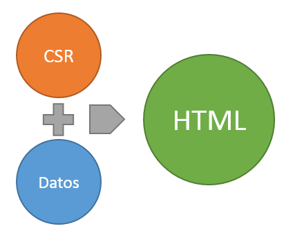

Además, esta transformación la realiza por etapas o ámbitos según la parte de la vista o el formulario que queramos cambiar. En la figura de abajo vemos los distintos ámbitos que podemos definir a la hora de configurar una plantilla para CSR:

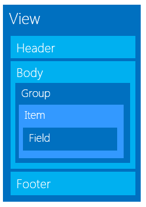

Para los que ya hemos trasteado con CSR y JSLink es muy importante saber que estos dos conceptos son diferentes cosas:

- **CSR**: es un Framework de JavaScript que nos expone a los desarrolladores una serie de métodos que podemos usar para modificar el comportamiento grafico de las vistas y formularios de SharePoint.
- **JSLink**: es un modo de asociar un fichero de JavaScript a un objeto de SharePoint.


Ambos pueden convivir juntos, pero también el uno sin el otro. Por ejemplo, podemos asociar un JS a un XSLTListViewWebPart de SharePoint y que este fichero de JS no tenga nada de CSR y seguirá ejecutándose el código que hay dentro cuando se carga la página donde este ese webpart. Y por el contrario también podemos usar CSR directamente asociando un fichero JS a la master page usando una Custom Action, y el CSR se ejecutaría y sobrescribiría el comportamiento nativo de la vista que estemos reescribiendo.

A continuación, en este artículo veremos cómo es esta interfaz que nos proporciona Microsoft para poder sobrescribir las plantillas y registrar plantillas nuestras personalizadas.

**Relación entre CSR y clienttemplates.js**

En SharePoint 2013 hay un montón de ficheros de JavaScript creados con el objetivo de mejorar la experiencia de usuario. Por ejemplo, el fichero clienttemplates.js es donde está el núcleo del Framework CSR, es decir, todos los objetos, "clases" y funciones de JS que definen toda la lógica y que es cargado en las páginas de SharePoint y Office 365 de forma predeterminada. Véase en la imagen como y en qué orden se carga usando, en este caso, la plantilla de Team Site:

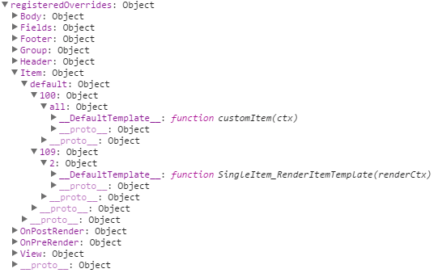

Lo que también es interesante es que después de clienttemplates.js se cargan otros ficheros, donde se utilizar la función RegisterTemplateOverrides, que fue previamente creada en clienttemplates.js y cuya finalidad es permitir definir una plantilla y registrarla, veremos de qué forma más adelante.

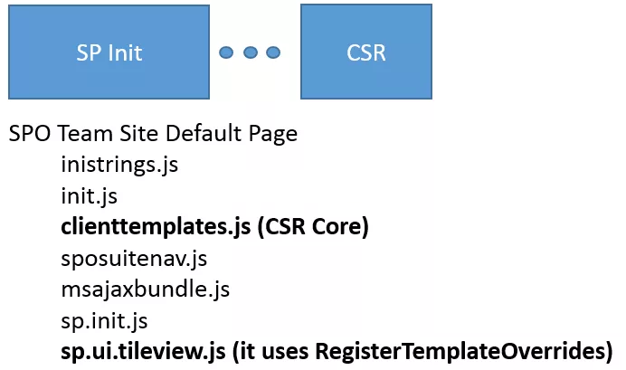

**Husmeando dentro de clienttemplates.js**

El fichero clienttemplates.js se encuentra, de forma predeterminada, en la ruta: C:\Program Files\Common Files\microsoft shared\Web Server Extensions\15\TEMPLATE\LAYOUTS

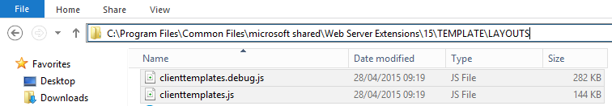

Como somos muy curiosos, veamos a ver que está ocurriendo dentro de este JS. Siendo sincero, hay muchas partes de este código que no entiendo y que no he tenido tiempo de investigar, pero veamos un poco las partes más importantes. Estas son las primeras líneas de código:

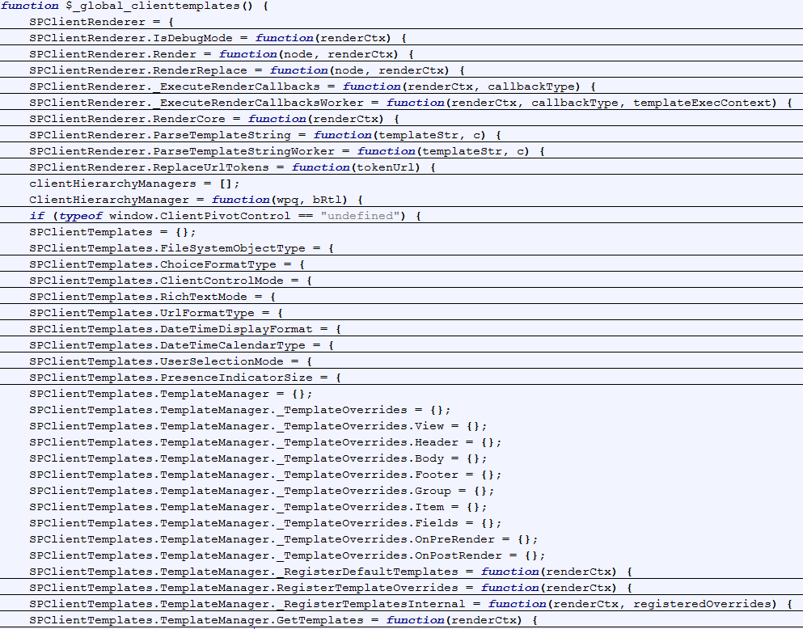

- **$\_global\_clienttemplates**: es el contenedor, la función principal que contiene todos los objetos y funciones que necesita CSR. Esta función es ejecutada al final del fichero clienttemplates.js de forma que se carguen todas las variables iniciales y funciones en el motor de ejecución de JS.
- **SPClientRenderer**: "Clase" de JavaScript cuyo objetivo es definir todas las funciones "core" usadas en el framework de renderizado. Las funciones más importantes son:
    - **SPClientRenderer.ReplaceUrlTokens (tokenUrl):** reemplaza los tokens típicos como ~sitecollection por las URLs correctas en cada entorno.
    - **SPClientRenderer.Render (node, renderCtx):** Función Render que divide la ejecución en tres partes invocando a las funciones OnPreRender, RenderCore and OnPostRender.


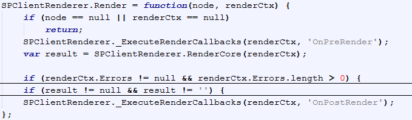

    - **SPClientRenderer.RenderCore (renderCtx):** esta función define una plantilla "Template", para cada ámbito de CSR (View, Header, Body, Footer, Groups, Items and Fields). La ventaja de esto es que podemos decidir que parte de los formularios o vistas cambiar y podemos ahorrarnos bastantes líneas de código sobrescribiendo la vista completa, si, por ejemplo, lo único que queremos cambiar es un color de fondo, o una imagen de un campo. Si echamos un vistazo dentro del código de la función, vemos como es la función ResolveTemplate (véase la figura) la que internamente escogerá entre usar una plantilla por defecto, o una nuestra personalizada si la hay, y luego veremos en qué objeto de JS se basa para tomar esta decisión.


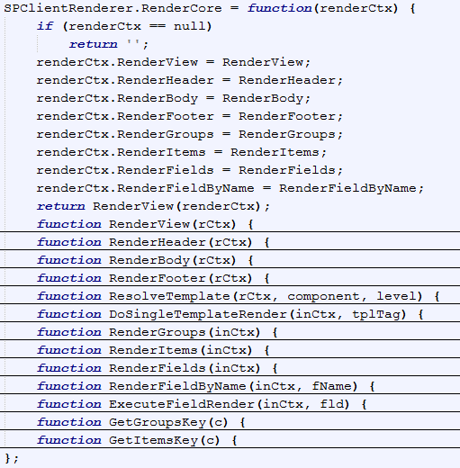

- **SPClientTemplates**: De la misma forma que el objeto SPClientRenderer contiene todas las funciones relativas al "render", esta clase contiene las variables y funciones que implementan el sub-framework de plantillas "Templates". El cual será usado para gestionar todos los ámbitos explicados anteriormente dentro de una misma vista común. Nótese que este objeto contiene la función SPClientTemplates.TemplateManager.RegisterTemplateOverrides que nos permitirá definir nuestras plantillas personalizadas para cada ámbito.


**Analizando la función RegisterTemplateOverrides**

La función RegisterTemplateOverrides se basa en el objeto interno TemplateManager.\_TemplateOverrides para mantener y guardar el estado de todas las personalizaciones de plantillas que se han hecho hasta el momento, por lo que lo primero que se hace es obtener ese objeto y luego pasárselo a la función \_RegisterTemplatesInternal, como se puede observar en el código:

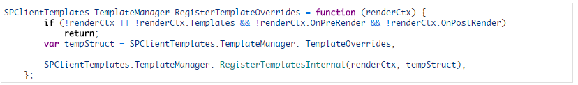

También vemos que se le pasa como parámetro un objeto llamado "renderCtx". Es un objeto de tipo RenderContext y está disponible en tiempo de ejecución para proveer algunas variables y mantener el estado del framework completo y que se pueda usar de forma consistente creando varios templates desde distintos ficheros JavaScript.

**RenderContext Object**

Este objeto es usado en casi todas las funciones de clienttemplates.js. Es un objeto dinámico compuesto de propiedades dinámicas. Propiedades que para cada función pueden ser distintas. En el caso concreto de la función RegisterTemplateOverrides las propiedades más importantes de este objeto son:

```
var renderContext = {
```

```
  BaseViewID: /* ID en Schema.xml. Ver más  en este post de Andrey */,  
```

```
  ListTemplateType: /* List Template ID. Lista completa de template IDs */,  
```

```
  ViewStyle: /* View Style: Boxed, no labels (12), Boxed(13),… */,
```

```
  OnPreRender: /* function or array of functions */,
```

```
  Templates: {
```

```
    View: /* function or string */,
```

```
    Body: /* function or string */,
```

```
    Header: /* function or string */,
```

```
    Footer: /* function or string */,
```

```
    Group: /* function or string */,
```

```
    Item: /* function or string */,
```

```
    Fields: {
```

```
      'Field1 Internal Name': {
```

```
          View: /* function or string */,
```

```
          EditForm: /* function or string */,
```

```
          DisplayForm: /* function or string */,
```

```
          NewForm: /* function or string */
```

```
      },
```

```
      'Field2 Internal Name': {
```

```
          View: /* function or string */,
```

```
          EditForm: /* function or string */,
```

```
          DisplayForm: /* function or string */,
```

```
          NewForm: /* function or string */
```

```
      },
```

```
    },
```

```
  },
```

```
  OnPostRender: /* function or array of functions */
```

```
};
```

Es muy importante echarle un ojo despacio a estas propiedades para tener e incluso guardarse esta plantilla en favoritos de cara a poder reusarla luego cada vez que tengamos que definir una nueva plantilla de CSR.

Hasta ahora hemos echado un vistazo al código fuente que forma el Framework de los Templates, pero como realmente se conoce y aprende es depurando la aplicación y viendo qué valor van obteniendo cada una de las propiedades y variables con respecto al momento de ejecución.

A continuación, veremos un ejemplo en el que depuramos "hacemos debug" de esta función usando el debugger de Chrome (F12). En el ejemplo aplicaremos una personalización básica usando CSR a nivel de Item que aplique solamente a las listas Custom (100):

```
SP.SOD.executeFunc("clienttemplates.js", "SPClientTemplates", function() {
```

```
 SPClientTemplates.TemplateManager.RegisterTemplateOverrides({
```

```
  Templates: {
```

```
    Item: function(ctx) {
```

```
      return String.format("Hi world");
```

```
    }
```

```
  },
```

```
  ListTemplateType: 100
```

```
});
```

```
})
```

**Depurando la función RegisterTemplateOverrides**

A veces, lo más difícil cuando se quiere depurar un fichero de JavaScript en SharePoint (o cualquier web) es encontrar la línea donde poner el punto de interrupción. En este caso es doblemente difícil, porque el fichero clienttemplates.js de primeras no aparece en la pestaña Sources y de segundas el fichero está en su versión reducida.

Veamos como he conseguido poner ese punto de interrupción:

1. Abrimos el sitio de SharePoint y pulsamos F12 (en mi caso usando Chrome).

2. Vamos a la sección Network.

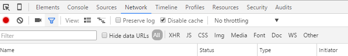

3. Usamos el textbox para filtrar por "clienttemplate".

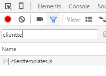

4. Botón derecho en el fichero clienttemplates.js y clicamos "Open in Sources panel".

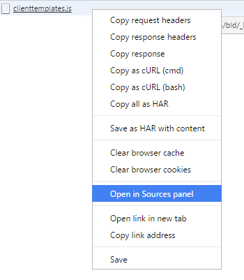

5. Ahora veremos el fichero clienttemplates.js en una única línea, por lo que usamos el botón "Pretty Print" para obtener el código formateado.

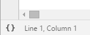

6. Una vez tenemos el código formateado, clicamos Control + F para buscar sobre él.

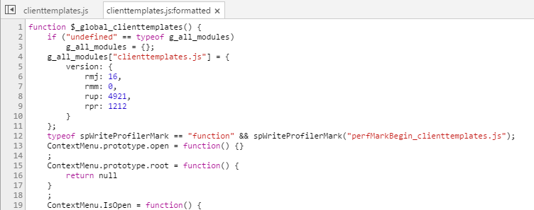

7. Buscamos el nombre de la función y le asignamos el punto de interrupción.

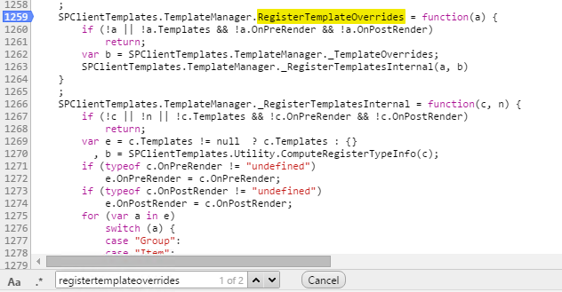

8. Feliz depuración!

Veamos el ejemplo ahora realizado con un SharePoint OnPrem y con la depuración activada para que saque los ficheros .debug en lugar de los ficheros reducidos. Lo primero que comprueba la función RegisterTemplateOverrides es si le hemos pasado por parámetro el objeto renderContext con alguna personalización sobre algunos de los Templates, OnPreRender u OnPostRender. Si no es así, se sale de la función sin hacer nada, como es lógico.

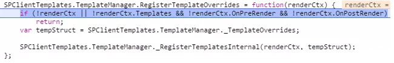

Si por el contrario hemos configurado algún Template que aplicar, lo primero que se hace es obtener las Templates que ya han sido registradas hasta el momento usando la línea de código:

```
var tempStruct = SPClientTemplates.TemplateManager._TemplateOverrides;
```

La estructura del objeto mediante el cual se mantiene el estado de todas las personalizaciones o Templates es la siguiente:

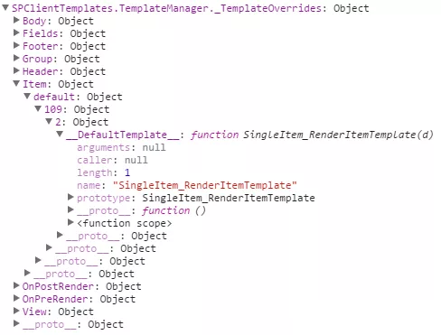

Vemos como para cada ámbito o Template se almacena una sub-estructura de datos que contiene la siguiente forma:

**Template Scope** (Body, FIelds, Footer, Group, Header, Item y View)
    **ViewStyle** (default en este caso) 
      **ListTemplateType** (109 in this case)
          **BaseViewID** (2 in this case)
             **Nombre de la función**

Para ver más información sobre:

- ViewStyle: [http://www.codeproject.com/Articles/620110/SharePoint-Client-Side-Rendering-List-Views](http&#58;//www.codeproject.com/Articles/620110/SharePoint-Client-Side-Rendering-List-Views)
- ListTemplateType: [http://msdn.microsoft.com/en-us/library/microsoft.sharepoint.client.listtemplatetype](http&#58;//msdn.microsoft.com/en-us/library/microsoft.sharepoint.client.listtemplatetype)
- BaseViewID: [http://sharepoint.stackexchange.com/questions/28349/how-can-i-use-normal-paging-on-a-custom-view/28538#28538](http&#58;//sharepoint.stackexchange.com/questions/28349/how-can-i-use-normal-paging-on-a-custom-view/28538#28538)


Después se invoca a la función \_RegisterTemplatesInternal que hace un merge entre las Templates aplicadas hasta el momento, obtenidas en el objeto anteriormente mostrado y las Templates pasadas como parámetro.

```
SPClientTemplates.TemplateManager._RegisterTemplatesInternal = function(renderCtx, registeredOverrides) { … }
```

Template pasada como parámetro: **renderCtx**:

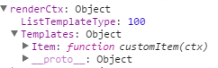

Templates aplicadas hasta el momento:**registeredOverrides**:

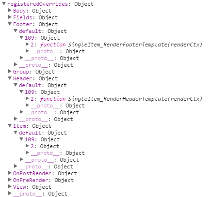

Y después de hacer el merge:


Nótese como en la versión final del objeto que mantiene el estado "registeredOverrides" tenemos aplicadas dos personalizaciones distintas para Item, una para las listas de tipo 109 y otra para listas de tipo 100 (Custom List), y concretamente como en el código del ejemplo no especificamos BaseViewID, se asigna para todas usando el nombre "all".

**Conclusiones**

El objetivo de este artículo es conocer a fondo la tecnología Client-side rendering y JSLink de cara a poder saber qué tipo de personalizaciones podemos hacer y hasta donde podemos llegar. Me gustaría remarcar y compartir algunos aspectos descubiertos durante esta investigación:

- Client-side Rendering / CSR es un framework de "renderizado" y JSLink es un mecanismo para asociar un fichero JavaScript a un objeto de SharePoint.
- Podemos usar CSR sin JSLink, simplemente haciendo una llamada a RegisterTemplateOverrides después de que se ejecute el fichero clienttemplates.js. Por ejemplo, desde un Script Editor.
- Con CSR es posible implementar diferentes personalizaciones para la misma vista y lista en páginas de SharePoint distintas.
- No se puede usar CSR para aplicar dos personalizaciones diferentes para la misma vista y lista dentro de la misma página de SharePoint. Por ejemplo, tenemos una custom list y queremos aplicar diferentes presentaciones de ella en la misma página usando la misma vista. Esto no sería posible porque como hemos visto en el artículo, solamente se almacena una función JS por ListTemplateType y BaseViewID. Hay diferentes formas para hacerle workaround a esto, pero no estoy seguro que estén 100 soportadas.
- Debemos tener en cuenta que cuando se usan múltiples instancias de un List View Web Part en la misma página y se aplica CSR a una de las instancias, el diseño del resto de los List View Web Part puede también cambiar porque internamente SharePoint utiliza el mismo framework. ([https://msdn.microsoft.com/en-us/magazine/dn745867.aspx](https&#58;//msdn.microsoft.com/en-us/magazine/dn745867.aspx))
- No lo he probado, pero parece posible usar diferentes funciones para la misma vista y lista si se cambia el ViewStyle. Esto podría darnos alguna flexibilidad en algunos escenarios.


**Referencias**

- Artículo de Andrei (en inglés) [http://www.codeproject.com/Articles/620110/SharePoint-Client-Side-Rendering-List-Views](http&#58;//www.codeproject.com/Articles/620110/SharePoint-Client-Side-Rendering-List-Views)
- Artículo original en inglés ([http://josharepoint.com/2016/01/14/sharepoint-2013-client-side-rendering-register-templates-overrides-in-detail](http&#58;//josharepoint.com/2016/01/14/sharepoint-2013-client-side-rendering-register-templates-overrides-in-detail))


**José Quinto**
 @jquintozamora
 [http://www.josharepoint.com](http&#58;//www.josharepoint.com/)

