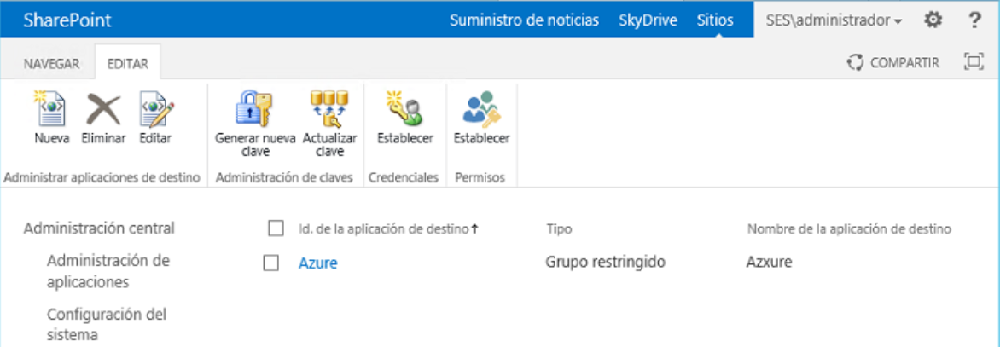

import ArticleHeader from '../../../components/article-header'

<ArticleHeader frontmatter={props.pageContext.frontmatter} />


​Muchos de los servicios ofrecidos por Azure se pueden utilizar para ampliar y mejorar el funcionamiento de SharePoint, tanto on-premises como en la nube. Uno de los servicios que ofrece Azure es "Cloud Services", que es una solución de Plataforma como Servicio (PaaS) que proporciona toda la infraestructura física más el software de base para ejecutar aplicaciones Web personalizadas. Utilizando Azure Cloud Services solamente es necesario construir (desarrollar) la aplicación, compilarla, empaquetarla y desplegarla al servicio; de todo el resto, crear máquinas virtuales, configurarlas, darles mantenimiento y respaldo, se encarga Azure.

Azure Cloud Services ofrece una máquina virtual para cada servicio que se crea, en la que el usuario es administrador y puede controlar todo su funcionamiento. En contraposición, Azure Web Apps permite crear aplicaciones Web de la misma forma que Cloud Services, pero toda la infraestructura es compartida y el usuario no tiene ni derechos de administrador del servicio ni en la máquina virtual que hospeda el servicio.

Cuando se crea un Azure Cloud Service, el motor de servicios de Azure (llamado el "Fabric Controller") despliega y configura todos los aspectos necesarios para que el servicio funcione inspeccionando el paquete de despliegue. De esta forma, si por alguna razón el servicio deja de funcionar, el Fabric Controller puede en cualquier momento crear un nuevo servicio, instalar el paquete y seguir funcionando con una caída del sistema de solamente algunos minutos. Lo mismo ocurre cuando se necesita incrementar el poder de procesamiento del servicio: si el usuario indica que necesita más CPU o memoria, el Controller se encarga de crear la (o las) máquina virtual necesaria, configurarla, instalar el paquete y configurar el balanceador de carga para que todo funcione apropiadamente, sin que el usuario tenga que intervenir de ninguna manera. Una consecuencia importante de esta arquitectura es que no se debe mantener ningún tipo de dato localmente en un servidor del Cloud Service, es decir, el software creado tiene que ser "stateless". Tampoco se deben realizar configuraciones manualmente en los servidores, todo debe ser hecho por medio de scripts.

Azure Cloud Service permite crear dos tipos de roles: "Web Role" y "Worker Role". La principal diferencia es que el primero dispone de IIS instalado por defecto y el segundo no. El Web Role es un servicio ideal para crear servicios WCF (Windows Communication Foundation) que se pueden utilizar de diferentes maneras con SharePoint. Por medio de un servicio WCF se pueden conectar sistemas externos con SharePoint de tal forma que los datos que contienen se pueden procesar dentro de SharePoint mismo y se pueden hacer interactuar con el Business Connectivity Service de SharePoint, haciéndolos, al mismo tiempo, indexables con el motor de búsqueda.

**Creación de un servicio de Azure Cloud Service**

Para comenzar a utilizar el servicio es necesario crear primero un Recurso de Trabajo de Cloud Service:

1. Desde el portal de administración de Azure ([https://portal.azure.com/](https&#58;//manage.windowsazure.com/)), haga un login con sus credenciales.
2. Utilice el botón de "+" en la esquina superior izquierda para agregar un nuevo servicio.
3. Seleccione "Compute" – "Cloud Service" – "Create".


> 4. En el nuevo panel defina un nombre para el servicio ("ZooCS" en el ejemplo), la suscripción de Azure a utilizar, el grupo de recursos de Azure (o crear uno nuevo) y la localización del centro de datos de Azure. Utilice el botón de "Create". Después de algunos segundos, el nuevo servicio aparece en la lista de "Cloud Services" del portal.


**Creación de un servicio Web WCF (SOAP)**

WCF permite crear servicios Web que pueden ser utilizados por múltiples tipos de sistemas. Por defecto, las plantillas de Visual Studio para WCF crean servicios SOAP (Simple Object Access Protocol) que utiliza XML para el intercambio de información estructurada entre los sistemas conectados. WCF SOAP es, también, el protocolo indicado para conectar sistemas externos con el Business Connectivity Service de SharePoint. El siguiente ejemplo crea un servicio Web WCF con Visual Studio 2015 (aunque el procedimiento es igual a con Visual Studio 2013) que no utiliza datos de ningún otro sistema, sino que maneja datos creados y mantenidos en memoria. El objetivo del ejemplo es mostrar cómo crear el servicio; después de creado, el servicio se puede conectar de forma sencilla con cualquier tipo de fuente de datos (Base de Datos, sistema externo, etc.). Note, además, que el código fuente del ejemplo solamente contiene rutinas básicas para atrapar excepciones, por lo que no está listo para ser utilizado en sistemas de producción.


> 5. Instale el Azure SDK para Visual Studio 2015 si no lo tiene instalado en VS. Desde el sitio de Microsoft ([https://azure.microsoft.com/en-us/downloads/archive-net-downloads/](https&#58;//azure.microsoft.com/en-us/downloads/archive-net-downloads/)) se puede descargar e instalar.
> 
> 6. Inicie Visual Studio 2015 y cree un nuevo proyecto del tipo "Cloud" - "Azure Cloud Service" y asígnele un nombre ("ZooWCF" en el ejemplo).


7. En la ventana de "New Microsoft Azure Cloud Service" seleccione "WCF Service Web Role" y utilice la flecha hacia la derecha para mover el tipo de servicio al panel de la derecha. Haga clic sobre el nombre en el panel de la derecha y cambie el nombre de "WCFServiceWebRole1" a "ZooWebRole"."OK"


8. Visual Studio inicia el proyecto y abre el archivo "Service1.svc.cs". Usando el "Solution Explorer" de Visual Studio, renombre los archivos "IService1.cs" en "IZoo.cs" y "Service1.svc en "Zoo.svc".

9. En el archivo "Service1.svc.cs", renombre la clase "Service1" a "Zoo". Elimine todos los comentarios agregados por defecto por la plantilla.


10. Si está utilizando Visual Studio 2015, el proyecto "ZooWebRole" es creado utilizando .NET Framework 4.5.2. En el momento (cambió en enero del 2016 a 4.5.2, pero servicios creados anteriormente siguen funcionando con 4.5.0), Azure utiliza la versión 4.5.0, por lo que es indispensable cambiar el framework en el proyecto de Visual Studio desde su pantalla de propiedades. Otra posibilidad es que después de desplegar el proyecto en Azure, utilizando su máquina virtual se instale el framework 4.5.2 (vea el punto 29 que trata sobre la máquina virtual del servicio).

11. Abra el archivo "IZoo.cs" y reemplace el código dentro de la función "public class CompositeType" con el siguiente fragmento. Esta es la entidad que se va a utilizar para definir los objetos de tipo "Animal" del Zoológico. Note que las tres variables iniciales utilizadas para las propiedades tienes que tener alcance "public", de otra forma el servicio de SharePoint BDC no podrá utilizar el servicio WCF:

```
    [DataContract]
```

```
    public class Animal
```

```
    {
```

```
        Int32 animalID;
```

```
        string animalName;
```

```
        string animalDanger;
```

```
 
```

```
        [DataMember]
```

```
        public Int32 AnimalID
```

```
        {
```

```
            get { return animalID; }
```

```
            set { animalID = value; }
```

```
        }
```

```
 
```

```
        [DataMember]
```

```
        public string AnimalName
```

```
        {
```

```
            get { return animalName; }
```

```
            set { animalName = value; }
```

```
        }
```

```
 
```

```
        [DataMember]
```

```
        public string AnimalDanger
```

```
        {
```

```
            get { return animalDanger; }
```

```
            set { animalDanger = value; }
```

```
        }
```

```
    }
```

12. En el mismo archivo "IZoo.cs" reemplace el código dentro de la función "public interface IZoo" con el siguiente fragmento. Esta es la interface que se va a utilizar en la definición de los métodos de tipo "Zoo":

```
    [ServiceContract]
```

```
    public interface IZoo
```

```
    {
```

```
        [OperationContract]
```

```
        IEnumerable<Animal> ReadList();
```

```
 
```

```
        [OperationContract]
```

```
        Animal ReadItem(int animalID);
```

```
 
```

```
        [OperationContract]
```

```
        Animal Create(Animal newAnimal);
```

```
 
```

```
        [OperationContract]
```

```
        void Update(Animal animal);
```

```
 
```

```
        [OperationContract]
```

```
        void Delete(int animalID);
```

```
    }
```

13. Abra el archivo "Zoo.svc.cs" y reemplace todo el código dentro de la función "public class Zoo : IZoo" con el siguiente código. Este fragmento crea e inicializa una lista genérica de objetos "myZoo" del tipo "Animal" que se va a utilizar como fuente de datos. Visual Studio indica un error en "IZoo" porque los métodos de la interface todavía no se han definido:

```
        static List<Animal> myZoo = new List<Animal>
```

```
        {
```

```
            new Animal(){ AnimalID = 1, AnimalName = "Cucaracha", AnimalDanger = "Poco" },
```

```
            new Animal(){ AnimalID = 2, AnimalName = "Pulga", AnimalDanger = "Mucho" }
```

```
        };
```


14. En seguida del código del punto 13, incluya la siguiente función que define el método "ReadList" encargado de leer la fuente de datos y devolver un objeto con todos los animales en ella. El método utiliza internamente LINQ para Objetos:

```
        public IEnumerable<Animal> ReadList()
```

```
        {
```

```
            try
```

```
            {
```

```
                IEnumerable<Animal> animalList =  // Using LINQ
```

```
                  from oneAnimal in myZoo
```

```
                  orderby oneAnimal.AnimalID
```

```
                  select new Animal
```

```
                  {
```

```
                      AnimalID = oneAnimal.AnimalID,
```

```
                      AnimalName = oneAnimal.AnimalName,
```

```
                      AnimalDanger = oneAnimal.AnimalDanger
```

```
                  };
```

```
 
```

```
                return animalList;
```

```
            }
```

```
            catch (Exception ex)
```

```
            {
```

```
                throw new Exception("There was a problem reading animal data - ", ex);
```

```
            }
```

```
        }
```

15. El siguiente método define como encontrar con LINQ un animal especifico y devolver su valor. Agregue el código después del código del punto 14:

```
        public Animal ReadItem(int animalID)
```

```
        {
```

```
            try
```

```
            {
```

```
                IEnumerable<Animal> animalList =
```

```
                  from oneAnimal in myZoo
```

```
                  where oneAnimal.AnimalID == animalID
```

```
                  select new Animal
```

```
                  {
```

```
                      AnimalID = oneAnimal.AnimalID,
```

```
                      AnimalName = oneAnimal.AnimalName,
```

```
                      AnimalDanger = oneAnimal.AnimalDanger
```

```
                  };
```

```
 
```

```
                return animalList.First();
```

```
            }
```

```
            catch (Exception ex)
```

```
            {
```

```
                throw new Exception("There was a problem reading animal data - ", ex);
```

```
            }
```

```
        }
```

16. La creación de un nuevo animal en el zoológico no implica más que agregar un nuevo objeto en la colección. Añada el siguiente fragmento después del código indicado en el punto 15:

```
        public Animal Create(Animal newAnimal)
```

```
        {
```

```
            try
```

```
            {
```

```
                myZoo.Add(newAnimal);
```

```
 
```

```
                return newAnimal;
```

```
            }
```

```
            catch (Exception ex)
```

```
            {
```

```
                throw new Exception("There was a problem creating a new animal - ", ex);
```

```
            }
```

```
        }
```

18. Para modificar los valores de un animal, es necesario primero encontrar el objeto en la colección y luego aplicarle los cambios. En el método indicado a continuación, se utiliza como ejemplo una expresión Lambda para encontrar el animal, aunque es posible utilizar LINQ como en los otros métodos. Agregue el fragmento después del indicado en el punto 16:

```
        public void Update(Animal animal)
```

```
        {
```

```
            try
```

```
            {
```

```
                int animalIndex = myZoo.FindIndex(a => a.AnimalID == animal.AnimalID);  // Using Lambda Expressions
```

```
                if (animalIndex >= 0)
```

```
                    myZoo[animalIndex] = animal;
```

```
            }
```

```
            catch (Exception ex)
```

```
            {
```

```
                throw new Exception("Problem updating animal with ID = " + animal.AnimalID.ToString() + " - ", ex);
```

```
            }
```

```
        }
```

19. Finalmente, para eliminar un animal del zoológico, es necesario encontrarlo primero, y luego sacarlo de la colección (en el ejemplo se indica cómo hacerlo con LINQ y con una expresión Lambda):

```
        public void Delete(int animalID)
```

```
        {
```

```
            try
```

```
            {
```

```
                IEnumerable<Animal> animalList =
```

```
                  from oneAnimal in myZoo
```

```
                  where oneAnimal.AnimalID == animalID
```

```
                  select oneAnimal;
```

```
 
```

```
                myZoo.Remove(animalList.First());
```

```
 
```

```
                //myZoo.Remove(myZoo.Find(a => a.AnimalID == animalID));  // Using Lambda Expressions
```

```
            }
```

```
            catch (Exception ex)
```

```
            {
```

```
                throw new Exception("Problem deleting animal with ID = " + animalID.ToString() + " - ", ex);
```

```
            }
```

```
        }
```

20. En principio, el servicio WCF contiene todo el código para definir la entidad, la interface y los métodos CRUD y está listo para funcionar. Ejecute el proyecto en forma de debuggeo. Esto inicia el Emulador de Azure y también IIS Express. Verifique que el proyecto compila y ejecuta correctamente (una instancia de IE debe iniciarse automáticamente con algunos mensajes indicando que el servicio está ejecutando sin problemas). Visual Studio incluye un Emulador de Azure Service Cloud que permite hacer funcionar el servicio WCF localmente sin necesidad de subirlo a Azure. De igual manera, se inicia IIS Express de forma automática para hostear el servicio. Es importante hacer notar que, si el computador en donde se está desarrollando el código es también un servidor de SharePoint, la combinación de Emulador e IIS Express destruye totalmente algunos de los servicios de SharePoint (BCS, Apps entre otros) y no hay forma de volverlos a hacer funcionar fuera de reinstalar totalmente a SharePoint.

21. Detenga la ejecución del proyecto. Agréguele a la Solución de Visual Studio un nuevo proyecto del tipo "Console Application" llamado "ZooWCFTest"

22. Después de que el proyecto ha sido creado, seleccione su directorio de "References" y utilizando el menú contextual, seleccione "Add Service Reference". En la ventana de "Add Service Reference" utilice el botón de "Discover". En el panel de "Services" debe aparecer el servicio acabado de crear. Selecciónelo y utilice el botón de "OK" para crear la referencia


23. Abra el archivo "Program.cs" de la aplicación de consola, y agregue el siguiente fragmento de código en la rutina "static void Main(string[] args)". En la aplicación de consola se hace una llamada a cada uno de los métodos del servicio WCF para comprobar que todo funciona bien:

```
        static void Main(string[] args)
```

```
        {
```

```
            ZooWCFTest.ServiceReference1.ZooClient myclient = new ZooWCFTest.ServiceReference1.ZooClient();
```

```
            Console.Clear();
```

```
 
```

```
            Console.WriteLine("** ReadList test");
```

```
            Console.WriteLine("Numero inicial de animales = " + myclient.ReadList().Count().ToString());
```

```
 
```

```
            Console.WriteLine("** ReadItem test");
```

```
            ZooWCFTest.ServiceReference1.Animal myResponse = myclient.ReadItem(1);
```

```
            Console.WriteLine("Animal con ID 1 = " + myResponse.AnimalName + " " + myResponse.AnimalDanger);
```

```
 
```

```
            Console.WriteLine("** Delete test");
```

```
            myclient.Delete(2);
```

```
            Console.WriteLine("Animal con ID 2 eliminado");
```

```
            Console.WriteLine("Numero de animales = " + myclient.ReadList().Count().ToString());
```

```
 
```

```
            Console.WriteLine("** Create test");
```

```
            ZooWCFTest.ServiceReference1.Animal newAnimal = new ServiceReference1.Animal();
```

```
            newAnimal.AnimalID = 10;
```

```
            newAnimal.AnimalName = "Elefante";
```

```
            newAnimal.AnimalDanger = "Ninguno";
```

```
            ZooWCFTest.ServiceReference1.Animal myAnimal = myclient.Create(newAnimal);
```

```
            Console.WriteLine("Nuevo animal = " + myAnimal.AnimalName + " " + myAnimal.AnimalDanger);
```

```
            Console.WriteLine("Numero de animales = " + myclient.ReadList().Count().ToString());
```

```
 
```

```
            Console.WriteLine("** Update test");
```

```
            ZooWCFTest.ServiceReference1.Animal updateAnimal = new ServiceReference1.Animal();
```

```
            updateAnimal.AnimalID = 1;
```

```
            updateAnimal.AnimalName = "Cucaracha";
```

```
            updateAnimal.AnimalDanger = "Peligrosisima";
```

```
            myclient.Update(updateAnimal);
```

```
            myResponse = myclient.ReadItem(1);
```

```
            Console.WriteLine("Animal con ID 1 = " + myResponse.AnimalName + " " + myResponse.AnimalDanger);
```

```
        }
```

24. Compile el programa de prueba. Inicie el servicio WCF de nuevo (F5) para que esté funcionando cuando se hacen las llamadas desde el programa de prueba (si da un error, detenga a IIS Express e inicie el servicio de nuevo). Inicie la aplicación de consola y ejecute el programa. Cada uno de los métodos del servicio WCF debe reaccionar de la forma esperada:


25. Detenga el servicio WCF. Una vez comprobado que el servicio funciona correctamente en el Emulador local, es necesario subirlo a Azure. En el Solution Explorer de Visual Studio seleccione el proyecto "ZooWCF" y utilizando el menú de contexto seleccione "Publish". En la ventana de "Publish Azure Application" que aparece, introduzca la cuenta y clave de Azure en donde se ha creado el Cloud Service del punto 1

26. Una vez las credenciales han sido aceptadas, la casilla de "Choose your subscription" permite seleccionar la suscripción utilizada para crear el servicio del punto 1. "Next":

****

27. La siguiente ventana permite seleccionar los detalles de la publicación. Seleccione el servicio creado en el punto 1 en la casilla "Cloud Service", y el tipo de ambiente que se quiere utilizar (Cloud Service permite publicar un servicio en Producción o en Staging, de tal forma que se pueda testear antes de que los usuarios lo utilicen). De la misma forma, la pestaña "Advanced Settings" permite ajustar la etiqueta del servicio y seleccionar si se desea utilizar "IntelliTrace" y "Remote Debugger": la primera opción permite ver los logs de utilización del servicio desde Visual Studio divididos en entradas para excepciones, consultas, información del sistema, hilos de Windows y módulos utilizados. Con el debugeo remoto se puede acoplar el Visual Studio local con el servicio en Azure para detectar problemas.

En la primera pestaña ("Common Settings") se puede seleccionar también "Enable Remote Desktop for all roles". Un Servicio Cloud en Azure crea una máquina virtual a la que es posible acceder por medio de Remote Desktop. Cuando se selecciona esta opción, es necesario definir las credenciales del usuario de Remote Desktop en la ventana que aparece automáticamente.

****

28. La ultima ventana del asistente presenta un resumen de las opciones; si es necesario, se puede utilizar el botón de "Previous" para modificar cualquiera de ellas. Utilice el botón de "Publish" para publicar el servicio en Azure. Después de algunos segundos, Visual Studio abre la ventana de "Microsoft Azure Activity Log" que permite seguir los pasos del despliegue y revisar su estado:

****

29. Una vez desplegado en Azure, el servicio se puede testear con la Aplicación de Consola creada en el punto 20 cambiando el URL de la referencia de servicio, o utilizando alguna otra herramienta como "WcfTestClient". Note que WcfTestClient ya no viene incluida con Visual Studio 2015, pero se puede descargar desde varios sitios en Internet. El URL del servicio es el configurado en el punto 4 cuando se creó el Cloud Service en Azure, seguido por ".cloudapp.net/[NombreClase].svc" (en el ejemplo seria "http://zoocs.cloudapp.net/zoo.svc"). Desde la consola de manejo de Azure se puede encontrar también el URL, junto con todas sus opciones de configuración.

30. Si se seleccionó la opción de "Enable Remote Desktop for all roles" en el punto 26 de despliegue, se puede interactuar directamente con la máquina virtual del Cloud Service. En Visual Studio abra el "Server Explorer" y expanda la sección de "Azure" - "Cloud Services". Utilizando el menú contextual sobre la entrada de la instancia aparece una opción para iniciar el Remote Desktop de Windows y conectarse con la máquina virtual. Utilice la clave configurada en el punto 26.


31. El servicio también se puede desplegar desde Azure mismo, sin necesidad de hacerlo desde Visual Studio. Primero compile el paquete de instalación: desde el Solution Explorer de Visual Studio, seleccione el proyecto "ZooWCF" y utilizando su menú contextual seleccione "Package". En la ventana que abre seleccione la configuración que se desea empacar ("Cloud") y la configuración de compilación ("Release"). También puede seleccionar si se desea utilizar el Remote Desktop y/o el debugeo remoto. El botón de "Package" compila todo el proyecto y crea dos archivos "ServiceConfiguration.Cloud.cscfg" y "ZooWCF.cspkg" (los dos son archivos .zip que se pueden descomprimir fácilmente). Desde el panel de control de Azure, seleccione "Cloud Services", seleccione el servicio creado en el punto 1 y en el panel con los detalles del servicio utilice el botón de "Update". En el nuevo panel que abre al lado derecho, hay casillas para subir el archivo del paquete (.cspkg) y el archivo de configuración (.cscfg), lo mismo que para definir el título del despliegue.

**Utilización del servicio SOAP en el servicio de BCS de SharePoint**

Una vez el servicio WCF está instalado y configurado en Azure Cloud Services, puede ser consumido por el Business Connectivity Service de SharePoint. Esto permite no solo integrar los datos e interactuar con ellos directamente desde SharePoint, sino que también se pueden indexar para poderlos consultar por medio del motor de búsqueda, y utilizarlos como metadatos por medio de la columna de datos externos.

32. Desde la Administración Central de SharePoint, vaya a "Administración de aplicaciones" - "Administrar aplicaciones de servicio" - "Servicio de almacenamiento seguro". Si el servicio no ha sido configurado, comience por generar una clave para activarlo.

33. Utilice el botón de "Nueva" (en la cinta). En la nueva página, defina el ID (una cadena cualquiera), nombre para mostrar y correo electrónico; seleccione "Grupo restringido" en la sección "Tipo de aplicación de destino" - "Siguiente".

34. Para los nombres de campo utilice "Nombre de usuario" y "Contraseña" y en las casillas de "Tipo de campo" seleccione "Nombre de usuario" y "Contraseña". Conserve las otras opciones por defecto. "Siguiente".

35. En la siguiente página seleccione el (o los) usuario que va a ser administrador y los usuarios que serán miembros del grupo de seguridad. "Aceptar".

36. Una vez la aplicación de destino ha sido creada aparece en la lista de SharePoint. Selecciónela y utilice el botón de "Establecer". En la ventana que abre introduzca el nombre de usuario de Azure que tiene acceso al servicio WCF y su contraseña (dos veces). De esta forma se está dando acceso a un determinado número de usuarios de SharePoint al servicio de WCF en Azure. Note que desde el portal de Azure, en la sección del Cloud Service creado en el punto 1, es posible definir tanto los usuarios (dentro de Azure) que tienen acceso al servicio, como los roles que se le pueden asignar

****

37. Abra el sitio de SharePoint en donde se quiera utilizar el servicio WCF, utilice la pestaña de "Pagina" e inicie SharePoint Designer desde "Editar" - "Editar en SharePoint Designer".

38. En SharePoint Designer haga clic sobre "Tipos de contenido externo" en el menú vertical al lado izquierdo. Utilice el botón de "Tipo de contenido externo" en la sección de "Nueva" de la cinta.

39. Asígnele un nombre al Tipo de Contenido ("Zoo") y utilice el vínculo de "Haga clic aquí para detectar orígenes de datos externos…".

40. En la nueva página utilice el botón de "Agregar conexión". Seleccione "Servicio WCF" como "Tipo de origen de datos" y "Aceptar".

41. En la casilla de "Dirección URL de metadatos de servicio" introduzca el URL del servicio WCF en Azure (punto 28) seguido por "?wsdl", así que en el ejemplo quedaría "http://zoocs.cloudapp.net/zoo.svc?wsdl". En "Dirección URL de extremo de servicio" utilice el mismo URL pero sin "?wsdl" esta vez ("http://zoocs.cloudapp.net/zoo.svc"). Seleccione la opción "Conectar con identidad personalizada suplantada" en la sección de "Configuración de autenticación del servicio WCF", y en la casilla de "Id. de aplicación de almacenamiento seguro" utilice el valor creado en el punto 32. No modifique las opciones restantes. "Aceptar". SharePoint Designer hace contacto con el servicio en Azure y muestra los métodos del servicio WCF:

****

42. La conexión con el servicio WCF está asegurada, pero los métodos no están mapeados a los que utiliza el BDC. Seleccione "ReadList" en el panel del BDC y utilizando el menú contextual seleccione "Nueva operación Leer lista". Utilice el botón de "Siguiente" - "Siguiente" en la ventana que aparece y en la ventana de "Parámetro de devolución" seleccione "AnimalID" en el panel central y "Asignar a identificador" en el panel de "Propiedades" - "Finalizar".

43. Seleccione "ReadItem" en el panel del BDC y utilizando el menú contextual seleccione "Nueva operación Leer elemento". Utilice el botón de "Siguiente" en la ventana que aparece y en la ventana de "Parámetro de entrada" seleccione "AnimalID" en el panel central y "Asignar a identificador" en el panel de "Propiedades" - "Siguiente". En la ventana de "Parámetro de devolución" seleccione "AnimalID" en el panel central y "Asignar a identificador" en el panel de "Propiedades" - "Finalizar".

44. Seleccione "Create" en el panel del BDC y utilizando el menú contextual seleccione "Nueva operación Crear". Utilice el botón de "Siguiente" en la ventana que aparece y en la ventana de "Parámetro de entrada" seleccione "AnimalID" en el panel central y "Asignar a identificador" en el panel de "Propiedades" - "Siguiente" - "Finalizar".

45. Seleccione "Delete" en el panel del BDC y utilizando el menú contextual seleccione "Nueva operación Eliminar". Utilice el botón de "Siguiente" en la ventana que aparece y en la ventana de "Parámetro de entrada" seleccione "AnimalID" en el panel central y "Asignar a identificador" en el panel de "Propiedades" - "Finalizar".

46. Seleccione "Update" en el panel del BDC y utilizando el menú contextual seleccione "Nueva operación Actualizar". Utilice el botón de "Siguiente" en la ventana que aparece y en la ventana de "Parámetro de entrada" seleccione "AnimalID" en el panel central y "Asignar a identificador" en el panel de "Propiedades" - "Finalizar".

47. Guarde la configuración del BDC (icono con un disco en la esquina superior izquierda).

48. Utilice el botón de "Crear lista y formulario" en la cinta. En la nueva ventana que aparece asígnele un nombre a la Lista (campo "Nombre de lista") y "Aceptar".

49. Regrese al sitio de SharePoint (punto 36), vaya a "Contenidos del sitio" y haga clic sobre la nueva Lista creada. SharePoint muestra la Lista con los datos del servicio WCF en Azure. Todas las operaciones CRUD están disponibles desde SharePoint.

****

**Convertir el servicio WCF a REST**

Aunque un servicio SOAP se puede utilizar con una multitud de tecnologías, es mucho más fácil de programar y mucho más compatible con otros sistemas si dispone de una interface REST (Representational State Transfer). El servicio SOAP se puede extender para que soporte las dos interfaces, permitiendo que un programador lo utilice en la forma que sea más apropiada.

Para hacer el servicio WCF compatible con REST es necesario crear dos modificaciones en el código fuente: decorar el contrato de la entidad, y modificar el web.config para que el servicio tenga doble punto de entrada.

50. Abra el archivo "IZoo.cs" del proyecto "ZooWebRole" en Visual Studio. Decore cada uno de los métodos en el contrato de servicio con una propiedad "WebGet" o "WebInvoke" como indica el siguiente fragmento. Cada propiedad indica el método a utilizar ("WebGet" siempre produce un método "GET"), la ruta para acceder al método usando el URL de REST ("UriTemplate") y la forma en la que los resultados serán enviados al cliente ("ResponseFormat"), JSON en el caso del ejemplo.

```
    public interface IZoo
```

```
    {
```

```
        [WebGet(UriTemplate = "/ReadList", ResponseFormat = WebMessageFormat.Json)]
```

```
        [OperationContract]
```

```
        IEnumerable<Animal> ReadList();
```

```
 
```

```
        [WebGet(UriTemplate = "/ReadItem?AnimalID={animalID}", ResponseFormat = WebMessageFormat.Json)]
```

```
        [OperationContract]
```

```
        Animal ReadItem(int animalID);
```

```
 
```

```
        [WebInvoke(Method = "POST", UriTemplate = "/Create", ResponseFormat = WebMessageFormat.Json)]
```

```
        [OperationContract]
```

```
        Animal Create(Animal newAnimal);
```

```
 
```

```
        [WebInvoke(Method = "PUT", UriTemplate = "/Update", ResponseFormat = WebMessageFormat.Json)]
```

```
        [OperationContract]
```

```
        void Update(Animal animal);
```

```
 
```

```
        [WebInvoke(Method = "DELETE", UriTemplate = "/Delete?AnimalID={AnimalID}", ResponseFormat = WebMessageFormat.Json)]
```

```
        [OperationContract]
```

```
        void Delete(int animalID);
```

```
    }
```


51. Abra el archivo "web.config" del proyecto "ZooWebRole" (asegúrese de que es el archivo web.config, no uno de los sub-archivos "Web.Debug.config" o "Web.Release.config". Reemplace toda la sección "system.serviceModel" con la que se indica a continuación. En esta configuración se indican dos "endpoint": uno para REST y otro para SOAP. El primero indica que la ruta para accederlo será "restservice" (parámetro "address") y el segundo sigue utilizando la ruta por defecto, para no afectar el BDC configurado anteriormente. Note también la diferencia en el "binding" para cada uno de los puntos de entrada.

```
  <system.serviceModel>
```

```
    <behaviors>
```

```
      <serviceBehaviors>
```

```
        <behavior name ="servicebehavior">
```

```
          <serviceMetadata  httpGetEnabled="true"/>
```

```
          <serviceDebug  includeExceptionDetailInFaults="true"/>
```

```
        </behavior>
```

```
      </serviceBehaviors>
```

```
      <endpointBehaviors>
```

```
        <behavior name="restbehavior">
```

```
          <webHttp />
```

```
        </behavior>
```

```
      </endpointBehaviors>
```

```
    </behaviors>
```

```
    <services>
```

```
      <service name="ZooWebRole.Zoo" behaviorConfiguration="servicebehavior" >
```

```
        <endpoint name="RESTEndPoint" contract="ZooWebRole.IZoo" binding="webHttpBinding" address="restservice" behaviorConfiguration="restbehavior"/>
```

```
        <endpoint name="SOAPEndPoint" contract="ZooWebRole.IZoo" binding="basicHttpBinding" address="" />
```

```
      </service>
```

```
    </services>
```

```
    <serviceHostingEnvironment multipleSiteBindingsEnabled="true" />
```

```
  </system.serviceModel>
```

52. Agregue el código indicado a continuación al final de la sección "system.webServer" (justo entre las líneas "&lt;directoryBrowse enabled="true"/&gt;" y "&lt;/system.webServer&gt;". Esta configuración permite reducir los problemas con CORS, como se indicará al final del artículo:

```
    <httpProtocol>
```

```
      <customHeaders>
```

```
        <add name="Access-Control-Allow-Origin" value="*" />
```

```
        <add name="Access-Control-Allow-Headers" value="Origin, X-Requested-With, Content-Type, Accept" />
```

```
        <add name="Access-Control-Allow-Methods" value="GET, POST, PUT, DELETE, OPTIONS" />
```

```
      </customHeaders>
```

```
    </httpProtocol>
```

53. Despliegue la solución de nuevo tal como se indicó en el punto 24. Si la ventana de publicación muestra un icono de error en la suscripción de Azure, utilice el botón de "Previous" dos veces y "Reenter your credentials"; luego de logeado en Azure puede publicar de nuevo. Después de un par de segundo, aparece una ventana preguntando si desea reemplazar el despliegue que ya existe ("Replace").

54. Para testear el servicio REST se puede utilizar un navegador yendo al URL "http://[NombreCloudService].cloudapp.net/[NombreServicio].svc/[DireccionEndPoint]/[Metodo]"  , para el ejemplo seria "http://zoocs.cloudapp.net/zoo.svc/restservice/ReadList" para utilizar el método ReadList. Los resultados aparecen en formato JSON, tal como se indicó en el contrato:

****

Un navegador solamente da acceso a métodos GET básicos (de hecho, solamente al método ReadList). Para testear todos los métodos se pueden utilizar otro tipo de herramientas que interceptan el tráfico y pueden inyectar parámetros, como por ejemplo Fiddler.

**Utilización del servicio REST en una aplicación SharePoint Hosted**

Cuando se desea conectar una aplicación SharePoint Hosted con un servicio WCF es indispensable que el servicio tenga una interface REST para poder utilizarlo por medio de JavaScript. El siguiente ejemplo crea una aplicación SharePoint Hosted y la conecta con el servicio WCF REST desarrollado en la sección anterior.

55. Inicie Visual Studio y cree una nueva solución del tipo "Office/SharePoint" - "Aplicaciones" - "Aplicación para SharePoint". Asígnele un nombre.

56. En la ventana de "Nueva aplicación para SharePoint" configure el URL del sitio de desarrollador de SharePoint y seleccione "Hospedado por SharePoint".

57. En la siguiente ventana del asistente de creación seleccione "SharePoint2013" (aunque la aplicación puede funcionar, y se programa, de forma exactamente igual que para "SharePoint Online").

58. Cuando el proyecto termina de cargar, en el archivo "Default.aspx" reemplace todo el código en la sección bajo el placeholder "PlaceHolderMain" con el código siguiente, que simplemente crea cinco botones que llaman funciones respectivas:

```
    <div>
```

```
        <p>
```

```
            <input id="btnReadList" type="button" value="Read List" onclick="btnReadList_Click()" />
```

```
            <input id="btnReadItem" type="button" value="Read Item" onclick="btnReadItem_Click()" />
```

```
            <input id="btnCreate" type="button" value="Create" onclick="btnCreate_Click()" />
```

```
            <input id="btnUpdate" type="button" value="Update" onclick="btnUpdate_Click()" />
```

```
            <input id="btnDelete" type="button" value="Delete" onclick="btnDelete_Click()" />
```

```
        </p>
```

```
    </div>
```


59. Abra el archivo "App.js" y reemplace todo el código por el siguiente fragmento. Aquí se define una función general de JavaScript llamada "CallService" que recibe como parámetros el método HTML a utilizar, el URL del servicio con el método a utilizar y el tipo de contenido. Funciones individuales para cada uno de los métodos del servicio WCF simplemente llaman la función general con los parámetros correctos.

```
'use strict';
```

```
 
```

```
var baseUrl = "http://[NombreCloudService].cloudapp.net/zoo.svc/Service1.svc/restservice/";
```

```
 
```

```
function btnReadList_Click() {
```

```
    CallService("GET", baseUrl + "ReadList", "application/xml", "");
```

```
}
```

```
 
```

```
function btnReadItem_Click() {
```

```
    CallService("GET", baseUrl + "ReadItem?AnimalID=1", "application/xml", "");
```

```
}
```

```
 
```

```
function btnCreate_Click() {
```

```
    CallService("POST", baseUrl + "Create", "application/json; charset=utf-8", '{"AnimalID": 4, "AnimalName": "Elefante", "AnimalDanger": "Muy Poco"}');
```

```
}
```

```
 
```

```
function btnUpdate_Click() {
```

```
    CallService("PUT", baseUrl + "Update", "application/json; charset=utf-8", '{"AnimalID": 4, "AnimalName": "Elefantico", "AnimalDanger": "Excesivamente"}');
```

```
}
```

```
 
```

```
function btnDelete_Click() {
```

```
    CallService("DELETE", baseUrl + "Delete?AnimalID=4", "application/xml", "");
```

```
}
```

```
 
```

```
function CallService(csType, csUrl, csContentType, csData) {
```

```
    $.ajax(
```

```
    {
```

```
        type: csType,
```

```
        url: csUrl,
```

```
        contentType: csContentType,
```

```
        data: csData,
```

```
        success: CallbackSuccess,
```

```
        error: CallbackError
```

```
    });
```

```
 
```

```
    function CallbackSuccess(response) { alert("Bingo! --> " + response.text); }
```

```
    function CallbackError(err) { alert("Nopes! --> " + err.statusText); }
```

```
}
```

60. Compile y despliegue la aplicación en SharePoint. Si se utiliza IE como navegador, todos los botones darán un error. Esto ocurre porque CORS (Cross-Origin Resource Sharing) impide que el programa que el navegador está ejecutando haga consultas a un servicio en un dominio diferente al de la llamada original. Aunque el código en la configuración del servicio (punto 51) alivia la situación un poco, ningún navegador moderno permite CORS por defecto.

Para hacer que IE acepte CORS, abra sus "Opciones de Internet" y la pestaña de "Seguridad". Utilice el botón de "Nivel personalizado" y seleccione la opción "Habilitar" de "Tener acceso a origen de datos entre dominios". Desde este momento la aplicación funciona sin problemas. Todos los navegadores modernos tienen la posibilidad de configurar CORS (menos Microsoft Edge hasta el momento de escribir este artículo).

Cuando se utiliza una aplicación de SharePoint Provider Hosted las posibilidades de programación son mucho más amplias. Por ejemplo, utilizando ASP.NET en una aplicación SharePoint Provider Hosted, el código de la interface en una página aspx podría ser de la forma siguiente para producir exactamente el mismo efecto que el del ejemplo con JavaScript (y sin problemas de CORS):

```
<body>
```

```
    <form id="form1" runat="server">
```

```
    <div>
```

```
        <asp:Button ID="btnReadList" runat="server" Text="Read List" OnClick="btnReadList_Click" />&nbsp;&nbsp;
```

```
        <asp:Label ID="lblReadList" runat="server" Text="Result"></asp:Label>
```

```
    </div><br />
```

```
    <div>
```

```
        <asp:Button ID="btnReadItem" runat="server" Text="Read Item" OnClick="btnReadItem_Click" />&nbsp;&nbsp;
```

```
        <asp:Label ID="lblReadItem" runat="server" Text="Result"></asp:Label>
```

```
    </div><br />
```

```
    <div>
```

```
        <asp:Button ID="btnCreate" runat="server" Text="Create" OnClick="btnCreate_Click" />&nbsp;&nbsp;
```

```
        <asp:Label ID="lblCreate" runat="server" Text="Result"></asp:Label>
```

```
    </div><br />
```

```
    <div>
```

```
        <asp:Button ID="btnUpdate" runat="server" Text="Update" OnClick="btnUpdate_Click" />&nbsp;&nbsp;
```

```
        <asp:Label ID="lblUpdate" runat="server" Text="Result"></asp:Label>
```

```
    </div><br />
```

```
    <div>
```

```
        <asp:Button ID="btnDelete" runat="server" Text="Delete" OnClick="btnDelete_Click" />&nbsp;&nbsp;
```

```
        <asp:Label ID="lblDelete" runat="server" Text="Result"></asp:Label>
```

```
    </div>
```

```
    </form>
```

```
</body>
```

Y el código behind de la página tal como el del siguiente fragmento:

```
namespace ZooWebApp
```

```
{
```

```
    public partial class myZooASPNET : System.Web.UI.Page
```

```
    {
```

```
        string baseUrl = "http://[NombreCloudService].cloudapp.net/zoo.svc/restservice/";
```

```
 
```

```
        protected void btnReadList_Click(object sender, EventArgs e)
```

```
        {
```

```
            string url = baseUrl + "ReadList";
```

```
 
```

```
            var syncClient = new WebClient();
```

```
            var content = syncClient.DownloadString(url);
```

```
 
```

```
            List<Animal> readAnimals = (List<Animal>)JsonConvert.DeserializeObject(content, typeof(List<Animal>));
```

```
 
```

```
            lblReadList.Text = "Done";
```

```
        }
```

```
 
```

```
        protected void btnReadItem_Click(object sender, EventArgs e)
```

```
        {
```

```
            string url = baseUrl + "ReadItem?AnimalID=1";
```

```
 
```

```
            var syncClient = new WebClient();
```

```
            var content = syncClient.DownloadString(url);
```

```
 
```

```
            Animal readAnimal = (Animal)JsonConvert.DeserializeObject(content, typeof(Animal));
```

```
 
```

```
            lblReadItem.Text = "Done";
```

```
        }
```

```
 
```

```
        protected void btnCreate_Click(object sender, EventArgs e)
```

```
        {
```

```
            string url = baseUrl + "Create";
```

```
 
```

```
            Animal myAnimal = new Animal { AnimalID = 3, AnimalName = "Elefante", AnimalDanger = "Muy poco" };
```

```
            string jsonAnimal = JsonConvert.SerializeObject(myAnimal);
```

```
 
```

```
            var syncClient = new WebClient();
```

```
            syncClient.Headers[HttpRequestHeader.ContentType] = "application/json";
```

```
            syncClient.Encoding = Encoding.UTF8;
```

```
            var content = syncClient.UploadString(url, "POST", jsonAnimal);
```

```
 
```

```
            lblCreate.Text = "Done";
```

```
        }
```

```
 
```

```
        protected void btnUpdate_Click(object sender, EventArgs e)
```

```
        {
```

```
            string url = baseUrl + "Update";
```

```
 
```

```
            Animal myAnimal = new Animal { AnimalID = 3, AnimalName = "Elefantico", AnimalDanger = "Muy peligroso" };
```

```
            string jsonAnimal = JsonConvert.SerializeObject(myAnimal);
```

```
 
```

```
            var syncClient = new WebClient();
```

```
            syncClient.Headers[HttpRequestHeader.ContentType] = "application/json";
```

```
            syncClient.Encoding = Encoding.UTF8;
```

```
            var content = syncClient.UploadString(url, "PUT", jsonAnimal);
```

```
 
```

```
            lblUpdate.Text = "Done";
```

```
        }
```

```
 
```

```
        protected void btnDelete_Click(object sender, EventArgs e)
```

```
        {
```

```
            string url = baseUrl + "Delete?AnimalID=3";
```

```
            var syncClient = new WebClient();
```

```
            var content = syncClient.UploadString(url, "DELETE", "");
```

```
 
```

```
            lblDelete.Text = "Done";
```

```
        }
```

```
    }
```

```
 
```

```
    public class Animal
```

```
    {
```

```
        public Int32 AnimalID { get; set; }
```

```
        public string AnimalName { get; set; }
```

```
        public string AnimalDanger { get; set; }
```

```
    }
```

```
}
```

En el código se define una clase con la entidad de la misma forma que está definida en el servicio WCF. Luego, para los dos métodos GET, cada uno de los eventos de los botones llama el servicio utilizando el método "DownloadString" de la clase "WebClient" de System.Net y deserializa la respuesta JSON utilizando el método "DeserializeObject" de JsonConvert. Los métodos PUT, POST y DELETE crean primero un objeto del tipo Animal con los valores apropiados, lo serializa a JSON utilizando el método "SerializeObject" de JsonConvert y lo envía al servicio WCF utilizando el método "UploadString" de la clase "WebClient".

**Conclusiones**

Dentro de las múltiples maneras de utilizar los servicios de Azure para complementar el funcionamiento de SharePoint, Cloud Services permite crear servicios Web WCF que sirven como la puerta de entrada a cualquier tipo de sistema externo.

Con Azure Cloud Services se pueden crear servicios WCF con interfaces SOAP y/o REST que pueden ser consumidos directamente por el BCS de SharePoint (y su motor de búsqueda), o por Aplicaciones de SharePoint, Provider o SharePoint Hosted. Por medio de la interface REST se pueden crear aplicaciones SharePoint Hosted o Provider Hosted que consuman los datos ofrecidos por el servicio WCF.

CORS puede constituirse en un problema cuando se utiliza JavaScript con la interface REST del servicio, pero este es un problema general de JavaScript y los navegadores modernos, no un problema de SharePoint o Azure Cloud Services.


**Gustavo Velez**
 Office Severs and Services MVP
 [gustavo@](mailto&#58;gustavo@)gavd.net
 http://www.gavd.net

