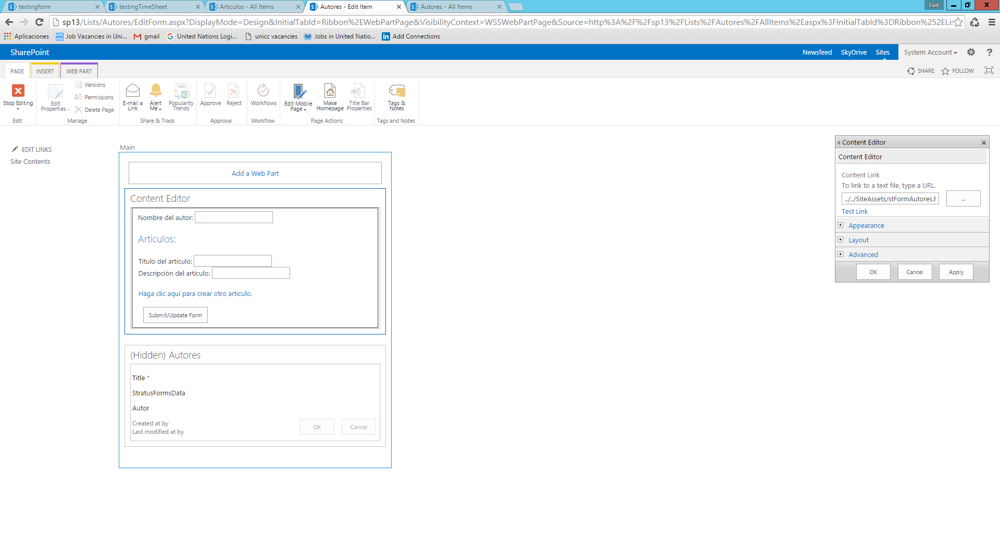
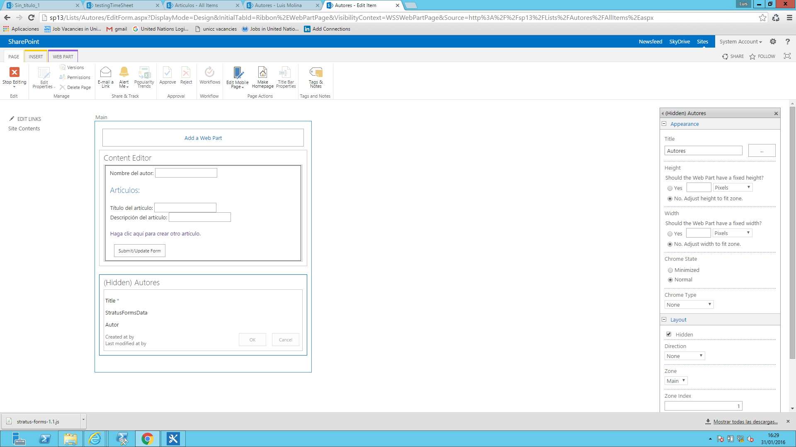
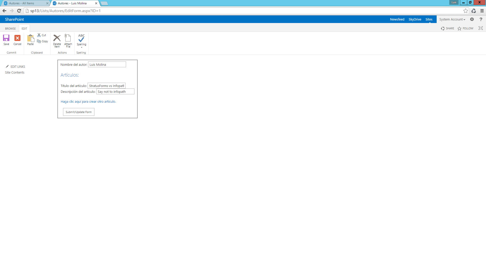

​Microsoft no nos ha dado ninguna alternativa a InfoPath y por tanto nosotros seguimos buscando soluciones para poder realizar formularios de la forma más eficiente. Entre las diferentes alternativas que van apareciendo destaca StratusForms, presentando una versión gratuita y otra de pago que además de las características básicas de la versión gratuita nos permitiría enlazar con otros sistemas como SAP.

Todos nosotros hemos utilizado JavaScript para crear formularios customizando la entrada de datos en nuestras listas, lo que nos ofrece StratusForms es olvidarnos de la parte tediosa de la realización de formularios, en concreto del código de inserción y actualización de datos, con lo cual nosotros sólo nos tenemos que ocupar de la parte de UX.

Para probar el funcionamiento de StratusForms vamos a crear dos listas, Autores y Artículos y vamos a cambiar el formulario de edición por defecto de la lista de autores por otro formulario que nos permitirá editar los datos del autor y los datos de sus artículos. A continuación, se indican las columnas de cada una de las listas:


| Lista Autores | ​ |
| --- | --- |
| Columna | Tipo |
| Autor | Single line of text |
| *StratusFormsData* | Multiple lines of text<br /><br />– Plain text |


| Lista Artículos | ​ |
| --- | --- |
| Columna | Tipo |
| Articulo | Single line of text |
| Descripcion | Single line of text |
| *Autores* | Lookup – apunta a la tabla Autor campo ID |
| [*StratusFormsRowID*](http://sp13/_layouts/15/FldEdit.aspx?List=%7b196FB6FF-DBC2-4D54-B873-DC47C0A34D3F%7d&amp;Field=StratusFormsRowID) | Single line of text |


StratusForms utiliza el campo StratusFormsData para guardar los cambios en la lista padre, incluyendo este campo ya podemos utilizar StratusForms en una lista sin más.

Para poder enlazar la lista hija utilizamos el campo Autores que es un lookup a la lista Autores, StratusForms nos obliga a que el nombre del campo lookup sea el mismo que la lista padre.

Si además queremos que la lista padre tenga varios elementos de la lista hija tenemos que añadir otro campo a la lista hija, StratusFormsRowId.

Estos campos que utiliza StratusForms no hace falta que los incluyamos en el formulario, los utiliza StratusForms de forma interna.

Como hemos dicho nuestra intención es poder cambiar el formulario por defecto para edición de la lista Autores por un nuevo formulario que permita además la edición de elementos de la lista dependiente Artículos y todo esto con pocas líneas de código, es decir vamos a crear un formulario para editar Autores y añadir artículos a este autor.

**Nota:** para crear el formulario podemos utilizar cualquier editor HTML y subirlo a nuestro SharePoint mediante SharePoint Designer, yo lo he subido a la biblioteca Site Assets.

A continuación, pongo todo el código necesario para crear un formulario de este tipo:

```
<script type="text/javascript" src="//ajax.googleapis.com/ajax/libs/jquery/1.8.3/jquery.min.js"></script> 
```

```
<script type="text/javascript" src="//ajax.googleapis.com/ajax/libs/jqueryui/1.10.0/jquery-ui.min.js"></script> 
```

```
<script type="text/javascript" src="//cdnjs.cloudflare.com/ajax/libs/jquery.SPServices/0.7.2/jquery.SPServices-0.7.2.min.js"></script> 
```

```
<script type="text/javascript" src="//www.stratusforms.com/scripts/stratus-forms-1.1.js"></script>
```

```
<script type="text/javascript" src="//www.stratusforms.com/scripts/stratus-forms-data-SPServices-1.1.js?rev=1"></script>
```

```
<div id='SFForm'>
```

```
<fieldset>
```

```
<!----  HTML FOR Autor---------------->
```

```
<label for="Autor">Nombre del autor:</label>&nbsp;<input id="Autor" listFieldName="Autor" class="inputClass"  type="text" />
```

```
<br />
```

```
<!-------------------------------------------------->
```

```
<!----  HTML FOR Artículos---------------->
```

```
<h2>Artículos:</h2>
```

```
<br />
```

```
<table>
```

```
<tr id="repeatingRow" data-StratusFormsRepeatable="Y" data-StratusFormsChildList="Articulos">
```

```
               <td>
```

```
               <div>
```

```
                              <label class="thisLabel"  for="Articulo">Título del artículo:</label>&nbsp;<input id="Articulo" listFieldName="Articulo"  type="text" /><br />
```

```
                              <label for="Description">Descripción del artículo:</label>&nbsp;<input id="Description" listFieldName="Description"  type="text" />
```

```
                              </div>
```

```
                              <br />
```

```
               </td>
```

```
</tr>
```

```
<tr>
```

```
               <td><a onclick="$().StratusFormsRepeat('repeatingRow')">Haga clic aquí para crear otro artículo.</a></td>
```

```
</tr>
```

```
</table>
```

```
<!-------------------------------------------------->
```

```
<div>
```

```
<input type='button' value='Submit/Update Form'' onclick='SubmitForm();'>
```

```
</div>
```

```
</fieldset>
```

```
</div>
```

```
<script>
```

```
ExecuteOrDelayUntilScriptLoaded(Init,"SP.js");
```

```
 function Init(){
```

```
//Initialization function. Tells StratusForms which Query String Variable
```

```
//has the ID of the form, and the name of the list to read data from
```

```
$("#SFForm").StratusFormsInitialize({
```

```
    queryStringVar: "ID",
```

```
    listName: "Autores"
```

```
});
```

```
}
```

```
function SubmitForm()
```

```
{
```

```
               //When the form is submitted store it to the specified list
```

```
               //also pasas in the x and y offset of error messages for elements
```

```
               //this allows you to change their location in reference to the form field
```

```
               $("#SFForm").StratusFormsSubmit({
```

```
                    listName: "Autores",
```

```
                   completefunc: function(id) { 
```

```
                       alert("Save was successful. ID = " + id);
```

```
                       window.location = window.location.pathname + "?ID=" + id; 
```

```
                   }
```

```
                });
```

```
}
```

```
</script>
```

El código como veis es muy simple, pero vamos a desgranarlo para comprender el funcionamiento:

- Lo primero cargamos las librerías de jQuery desde el CDN y luego las librerías de StratusForms, en esta ocasión las cargamos de stratusforms.com pero podríamos tenerlas en local junto con el HTML de nuestro formulario.


Vamos a la parte donde definimos el formulario de StratusForms y los campos de la lista Autores

```
<div id='SFForm'>
```

```
<fieldset>
```

```
<!----  HTML FOR Autor----------------> <label for="Autor">Nombre del autor:</label> <input id="Autor" listFieldName="Autor" class="inputClass"  type="text" />
```

- Como vemos necesitamos una etiqueta DIV con un id que posteriormente vamos a utilizar para poner en marcha el formulario, en nuestro caso SFForm.
- Si nos fijamos en el input para el campo Autor vemos que tenemos que marcarlo con la etiqueta listFieldName para indicarle a StratusForms el nombre interno del campo en la lista. También tenemos otra etiqueta type="text" para indicarle a StratusForms como lidiar con este campo, en este artículo no vamos a entrar en detalles, pero StratusForms nos permite crear campos de tipo PeoplePicker, tipo Date, etc. y nos permite también rellenar campos de forma automática a partir de otras listas, pero como he dicho eso lo dejamos para otro artículo para no liarnos demasiado.


Ahora vamos a ver como insertamos la lista hija, para ello simplemente hay que utilizar una etiqueta HTML, por ejemplo, DIV o TR y marcarlo con el atributo data-StratusFormsChildList donde pondremos el nombre de la lista hija:

```
<tr id="repeatingRow" data-StratusFormsRepeatable="Y" data-StratusFormsChildList="Articulos">
```

Si queremos poder tener varios ítems de la lista hija tenemos que marcar el id que engloba a la lista hija con la etiqueta data-StratusFormsRepeatable="Y", para finalizar el apartado de la lista Artículos ponemos una etiqueta href para poder crear nuevos elementos:

```
<a href="#" onclick="$().StratusFormsRepeat('repeatingRow');">Add Row</a>
```

Cada vez que hagamos clic en el enlace se creará un nuevo elemento en la lista hija relacionado con la tabla padre y nos aparecerá en el formulario para poder editarlo.

Y ya sólo nos queda explicar el script que aparece al final de la página y que tiene dos funciones, la primera inicializa el formulario StratusFormsInitialize y la segunda se encarga de grabar los cambios en las dos listas.

Una de las cosas que me gusta de StratusForms es que podemos seguir utilizando HTML y JavaScript tal como lo hacíamos antes, sin cambiar nuestra forma de trabajar, pero nos ahorra bastante código.

Para poder probar el formulario antes de insertarlo en nuestro formulario de edición por defecto de la tabla Autores podemos crear una nueva página en la biblioteca Site Pages y añadirle un WebPart de tipo Editor de Contenido y modificar su propiedad Content Link para que apunte a nuestro archivo, en mi caso ../SiteAssets/stFormAutores.html

Ahora vamos a insertar nuestro nuevo formulario en la lista Autores, para ello nos vamos a editar la configuración de la lista Autores -&gt; Form web parts –&gt; Default Edit form. Insertamos un nuevo web part de tipo Content Editor y la propiedad Content link apuntando a ../../SiteAssets/stFormAutores.html



Solo nos queda ocultar el Web Part original para ello editamos el WebPart original y marcamos en la pestaña Layout la opción Hidden.



Bien, ya tenemos nuestro nuevo formulario y podemos proceder a evaluar si todo funciona correctamente.



Por supuesto esta librería está empezando y todavía tiene que evolucionar, pero le veo bastante futuro, todo lo que sea ayudarnos en nuestro trabajo bienvenido sea. Podéis ampliar más información en [http://www.stratusforms.com/](http://www.stratusforms.com/).


**Luis Molina**
 SharePoint developer
 [micuentadecasa@gmail.com](mailto:micuentadecasa@gmail.com)
 http://www.devaim.com

 
 
import LayoutNumber from '../../../components/layout-article'
export default LayoutNumber
