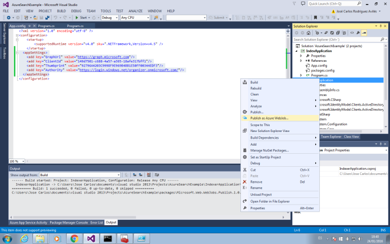

​Azure ofrece una amplia gama de servicios para los desarrolladores, entre los que se encuentra Azure Search. Este servicio, salido recientemente de su versión preview, permite incorporar una solución completa de búsqueda a las aplicaciones. En este artículo, se va a realizar un overview de este servicio, para adquirir unas nociones básicas de los pasos que hay que seguir para utilizarlo, pero, además, combinándolo con otra de las herramientas que recientemente Microsoft ha puesto a disposición de los desarrolladores, la API Microsoft Graph. En el artículo se tratará:

- Configuración y creación de índices en el servicio Azure Search.
- Configuración de un webjob para usar la API Microsoft Graph y acceder al contenido de Office 365.
- Indexación de contenido de Office 365 en Azure Search.


**El servicio Azure Search**

El servicio Azure Search permite a través de una API REST o una SDK de .NET implementar las búsquedas sin gestionar la infraestructura o llegar a ser un experto en búsquedas.

Lo primero que se debe hacer, es aprovisionar el servicio en la subscripción de Azure. Para ello, en el nuevo portal, hay que acceder a Nuevo-&gt;Datos y almacenamiento-&gt;Búsqueda de Azure. A continuación, se deben indicar los datos básicos de configuración del servicio: el nombre, grupo de recursos al que pertenece, la ubicación y el nivel de precios.


Una vez configurados los parámetros, se pulsa sobre Crear y el servicio se aprovisionará.

**Creando un índice en Azure Search**

Una vez aprovisionado el servicio de Azure Search se deben crear los índices en el mismo. Un índice es el medio principal para organizar y buscar documentos en el servicio de búsqueda de Azure, similar a cómo se organizan los registros en una tabla de una base de datos. Cada índice tiene una colección de documentos que cumplen el esquema de índice (nombres de campo, tipos de datos y propiedades), pero los índices también especifican construcciones adicionales (proveedores de sugerencias, perfiles de puntuación y configuración de CORS) que definen otros comportamientos de la búsqueda.

Por tanto, es necesario, como paso previo a subir documentos al servicio de búsqueda, definir un índice y su estructura, que no es más que una estructura de tablas que acepta datos y consultas. Los índices en el servicio de búsqueda de Azure, se pueden crear de tres formas, o desde el propio portal de Azure o por medio de código usando una SDK de .NET o una API REST.

Para crear un índice, en este caso, se usará una aplicación de consola en Visual Studio y la SDK de .NET. Por tanto, será necesario añadir las referencias a la SDK. Esto, se consigue ejecutando en la consola de Nuget el siguiente comando:

*Install-Package Microsoft.Azure.Search -Pre*

La creación de un índice por medio de la SDK de Azure Search consta de cuatro pasos:

1. Conectarse al servicio: por medio de la url y la api-key que se obtiene al aprovisionar el servicio.
2. Comprobar si el índice ya existía previamente y en ese caso, borrarlo.
3. Crear la estructura del índice
4. Añadir el índice a nuestra instancia de Azure Search


El código de la aplicación de consola que permite hacer esto, puede ser como el que el siguiente:

```
class Program  
```

```
{  
```

```
static void Main(string[] args)  
```

```
{  
```

```
               //step one
```

```
               SearchServiceClient serviceClient = GetSearchServiceClient();
```

```
               //step two
```

```
             DeleteIndexIfExists(serviceClient, "indexName");
```

```
               //step three and four
```

```
        CreateIndexUsingSDK(serviceClient, "indexName");
```

```
}  
```

```
 
```

```
private static SearchServiceClient GetSearchServiceClient() 
```

```
{ 
```

```
string serviceName = ConfigurationManager.AppSettings["SearchServiceName"]; 
```

```
string apiKey = ConfigurationManager.AppSettings["ApiKey"];
```

```
 
```

```
SearchServiceClient serviceClient = new SearchServiceClient(serviceName, new SearchCredentials(apiKey));  
```

```
 
```

```
return serviceClient; 
```

```
}
```

```
 
```

```
private static void DeleteIndexIfExists(SearchServiceClient serviceClient, string indexName) 
```

```
{ 
```

```
if (serviceClient.Indexes.Exists(indexName)) 
```

```
serviceClient.Indexes.Delete(indexName); 
```

```
}
```

```
 
```

```
private static void CreateIndexUsingNetSDK(SearchServiceClient serviceClient, string indexName) 
```

```
{ 
```

```
               //Index Schema Definition
```

```
var index = new Index()             
```

```
{                 
```

```
Name = indexName,                 
```

```
Fields = new[]
```

```
{                     
```

```
new Field("ContactId", DataType.String) {IsKey = true,  IsRetrievable = true, IsFilterable = true},                     
```

```
new Field("Name",DataType.String) { IsRetrievable = true, IsSearchable=true, IsFilterable = true},                     
```

```
new Field("Job", DataType.String) { IsRetrievable = true, IsSearchable = true, IsFilterable = true},                     
```

```
new Field("Department", DataType.String) { IsRetrievable = true, IsSearchable = true, IsFilterable = true},                     
```

```
new Field("Email", DataType.String) { IsRetrievable = true, IsSearchable = true, IsFilterable = true}                 
```

```
}            
```

```
 };
```

```
 
```

```
//Adding Index in Azure Search  
```

```
serviceClient.Indexes.Create(index); 
```

```
}
```

```
}
```

Ejecutando esta aplicación de consola, se creará el índice en Azure Search. Si posteriormente, se accede al portal de Azure, al servicio de búsqueda que se había aprovisionado, se observará como se ha añadido un nuevo índice en el mismo.

**Indexando contenido de Office 365 en Azure Search**

Una vez creado el índice, el siguiente paso es añadir contenido al mismo. Para la indexación de contenido de Office 365, que es el objetivo de este artículo, se creará una aplicación de consola, que se ejecutará como un WebJob de Azure y que usará la nueva API Microsoft Graph y de nuevo la SDK de .NET para acceder al servicio e indexar información de Office 365.

El flujo habitual de autenticación para usar la API Microsoft Graph en las aplicaciones se basa en el protocolo OAuth2. Este protocolo, parte de un token que hace una delegación de una serie de permisos específicos para un usuario concreto. Para obtener dicho token, es necesario que el usuario se identifique en Office 365 al menos una vez, por lo que tiene que introducir sus credenciales en una pantalla de autenticación que se muestre.

Sin embargo, en determinadas aplicaciones este flujo de autenticación no es posible. Por ejemplo, aplicaciones que ejecutan tareas en background y en las que no hay un usuario que interaccione como un WebJob de Azure. Para este tipo de aplicaciones, el protocolo OAuth2 proporcionar un flujo adicional de autenticación. Este flujo es el que se va a utilizar en la aplicación de consola que se va a desarrollar en esta ocasión. Este flujo de autenticación está actualmente soportado para obtener acceso a las API de contactos, mail y calendario. Sin embargo, aún no está disponible para acceder, por ejemplo, a APIs como la de OneDrive.

A continuación, se va a indicar el proceso de configuración del WebJob para que tenga acceso al contenido de Office 365 y pueda indexar dicha información.

*1. Crear el certificado*

Para comenzar, se tiene que crear un certificado. Al tratarse de un entorno de pruebas, se puede utilizar un certificado auto-firmado, para lo que se usará la aplicación makecert.exe de la siguiente forma (sustituyendo los valores *Tenant* y *AppName* por los valores correspondientes):

*makecert -r -pe -n "CN=Tenant AppName Cert" -b 11/25/2015 -e 11/25/2017 -ss my -len 2048*

A continuación, se exportará dicho certificado en formato PFX y CER. Para ello primero se abre la aplicación Microsoft Management Console (mmc.exe). Una vez aquí, se accede a Archivo-&gt;Agregar o quitar complemento y ahí se añade la opción certificados.


Tras esto, se busca el certificado que se acaba de crear y se hace clic sobre el botón derecho del mismo seleccionando Todas las tareas-&gt;exportar.

Habrá disponibles dos opciones de exportación, "Exportar la clave privada" y "No exportar la clave privada", para obtener los dos formatos del certificado, será necesario ejecutar la exportación para cada una de las opciones y completar, en ambos casos, el asistente.


*2. Crear y configurar los permisos de la aplicación en AAD*

El siguiente paso es acceder a Azure Active Directory, registrar aquí una nueva aplicación y conceder los permisos oportunos a la misma. Para ello, en la pestaña "aplicaciones" se hace click en "Agregar", tras lo cual, se deberán completar los pasos de configuración de la aplicación.


Una vez creada la aplicación, en la sección "configuración", se debe acceder a "permisos para otras aplicaciones" y una vez ahí "Agregar aplicación". En la ventana que aparece, habrá que añadir permisos para Microsoft Graph.


Tras añadirlos, en el desplegable "Permisos de la aplicación", ya que se van a conceder los permisos directamente a la aplicación, hay que seleccionar a qué aspectos de Microsoft Graph se desea conceder acceso.


Para terminar de configurar los permisos de la aplicación, habrá que pulsar el botón "Guardar".

3. *Cargar el certificado en AAD*

En la aplicación de Azure Active Directory que se acaba de crear, hay que configurar el certificado que se generó en el paso 1. Esto no se puede hacer a través de una interfaz gráfica, por lo que habrá que hacerlo modificando el manifiesto de la aplicación. Para ello, lo primero que se debe hacer, es recuperar las claves del certificado CER que se generó usando el siguiente script de PowerShell

*$certPath = Read-Host "Enter certificate path (.cer)"*

*$cert = New-Object System.Security.Cryptography.X509Certificates.X509Certificate2 $cert.Import($certPath)*

*$rawCert = $cert.GetRawCertData()*

*$base64Cert = [System.Convert]::ToBase64String($rawCert)*

*$rawCertHash = $cert.GetCertHash()*

*$base64CertHash = [System.Convert]::ToBase64String($rawCertHash)*

*$KeyId = [System.Guid]::NewGuid().ToString()*

*Write-Host "base64Cert:" $base64Cert*

*Write-Host "base64CertHash:" $base64CertHash*

*Write-Host "KeyId:" $KeyId*

Una vez obtenidas las claves, se descarga el manifiesto y sustituimos

*"keyCredentials": []*

por

```
"keyCredentials": [

{  "customKeyIdentifier": "base64CertHash",

"keyId": "KeyId",

"type": "AsymmetricX509Cert",

"usage": "Verify",

"value": "base64Cert"

} ]
```

Sustituyendo los valores "base64CertHash", "KeyId" y "base64Cert", por la cadena correspondiente obtenida de la ejecución del script powershell anterior.

4. *Cargar el certificado en un sitio web de Azure*

El WebJob se va a desplegar en un sitio web de Azure, al que se deberá agregar el certificado que se ha obtenido en el paso 1. Por tanto, antes de nada, se deberá crear un sitio web de Azure, haciendo click, en el antiguo portal de Azure, en Nuevo-&gt;Proceso-&gt;Aplicación web-&gt;Creación rápida.

Una vez aprovisionado, lo primero será promocionar el sitio web creado a un sitio de nivel Básico en la pestaña ESCALAR. A continuación, en la pestaña CONFIGURAR, se hace clic en la opción cargar certificado y se selecciona el certificado con extensión PFX.


Una vez cargado, se obtiene la huella digital de ese certificado que se añadirá como clave-valor en la sección "configuración de la aplicación".


Una vez realizada toda la configuración en el portal de Azure, se puede proceder a codificar la aplicación de consola que se desplegará como WebJob en Azure y que se encargará de la indexación de contenidos, en este caso, de Office 365 por medio de la API Microsoft Graph.

Los pasos que hay que seguir para llevar a cabo esta tarea son los siguientes:

1. Obtener el token de autenticación que concede los permisos de acceso para la aplicación de consola.
2. Hacer la llamada a Microsoft Graph para obtener los contactos.
3. Crear el array de contactos.
4. Añadir la información a Azure Search.


El código de la aplicación de consola se puede ver a continuación:

```
class Program     
```

```
{         
```

```
private static readonly string GraphUrl = ConfigurationManager.AppSettings["GraphUrl"];         
```

```
private static readonly string ClientId = ConfigurationManager.AppSettings["ClientId"];         
```

```
private static readonly string Authority = ConfigurationManager.AppSettings["Authority"];         
```

```
private static readonly string Thumbprint = ConfigurationManager.AppSettings["Thumbprint"];          
```

```
 
```

```
static void Main(string[] args)         
```

```
{                 
```

```
               // STEP ONE
```

```
// Retrieve the certificate                 
```

```
var certificate = GetCertificate();                  
```

```
// Get an access token                 
```

```
var token = GetAccessToken(certificate);                  
```

```
 
```

```
//STEP TWO
```

```
// Fetch the contact                
```

```
var client = new RestClient(GraphUrl);                
```

```
var request = new RestRequest("/v1.0/users/<userid>/contacts", Method.GET);                 request.AddHeader("Authorization", "Bearer " + token.Result);                 request.AddHeader("Content-Type", "application/json");                 request.AddHeader("Accept", "application/json");                  
```

```
 
```

```
var response = client.Execute(request);                 
```

```
var content = response.Content;                  
```

```
 
```

```
//STEP THREE
```

```
//deserialize json object 
```

```
dynamic contacts = JObject.Parse(content);                  
```

```
 
```

```
List<Contacts> contactsToPopulate = new List<Contacts>();                  int count = 1;                  
```

```
 
```

```
foreach (var contact in contacts.value)                 
```

```
{                     
```

```
Contacts contactToAdd = new Contacts                     
```

```
{                         
```

```
ContactId = count.ToString(),                         
```

```
Name = contact.displayName,                         
```

```
Department = contact.department,                         
```

```
Job = contact.jobTitle,                         
```

```
Email = contact.emailAddresses[0].address                     };                      
```

```
 
```

```
contactsToPopulate.Add(contactToAdd);                      
```

```
count++;                  
```

```
}                  
```

```
 
```

```
//STEP FOUR
```

```
//Populate the content
```

```
SearchIndexClient indexClient = GetSearchIndexClient();                  
```

```
var batch = IndexBatch.Upload(contactsToPopulate.ToArray());                 indexClient.Documents.Index(batch);                  
```

```
 
```

```
Thread.Sleep(3000);         
```

```
}          
```

```
private static X509Certificate2 GetCertificate()         
```

```
{             
```

```
X509Certificate2 certificate = null;             
```

```
var certStore = new X509Store(StoreName.My, StoreLocation.CurrentUser);             
```

```
certStore.Open(OpenFlags.ReadOnly);             
```

```
var certCollection = certStore.Certificates.Find(X509FindType.FindByThumbprint, Thumbprint, false);             
```

```
// Get the first cert with the thumbprint             
```

```
if (certCollection.Count > 0)             
```

```
{                 
```

```
certificate = certCollection[0];             
```

```
}             
```

```
certStore.Close();             
```

```
return certificate;         
```

```
}          
```

```
private static async Task<string> GetAccessToken(X509Certificate2 certificate)         
```

```
{             
```

```
var authenticationContext = new AuthenticationContext(Authority, false);             
```

```
var cac = new ClientAssertionCertificate(ClientId, certificate);             var authenticationResult = await authenticationContext.AcquireTokenAsync(GraphUrl, cac);             
```

```
 
```

```
return authenticationResult.AccessToken;         
```

```
}          
```

```
private static SearchIndexClient GetSearchIndexClient()         
```

```
{             
```

```
string serviceName = ConfigurationManager.AppSettings["SearchServiceName"];             
```

```
string apiKey = ConfigurationManager.AppSettings["ApiKey"];              
```

```
SearchIndexClient indexClient = new SearchIndexClient(serviceName, "contacts", new SearchCredentials(apiKey));              
```

```
 
```

```
return indexClient;         
```

```
}     
```

```
} 
```

Este ejemplo, está preparado para ejecutar una vez a modo de prueba. Si se quisiera llevar a un entorno en el que el WebJob se ejecutara de forma recursiva, al código del mismo habría que añadir la lógica correspondiente para, o bien eliminar el contenido indexado e indexarlo todo de nuevo o añadir solo los nuevos elementos.

El paso final es desplegar esta aplicación de consola como WebJob. Para ello, sobre la solución hacemos click en botón derecho y seleccionamos la opción Publish as Azure WebJobs



A continuación, se completan los distintos pasos necesarios para la publicación del WebJob: indicar la planificación, seleccionar la aplicación web donde se quiere desplegar y publicar la solución:


Si se prueba el webjob que se acaba de desplegar y tras la ejecución, se accede a la instancia del servicio Azure Search que se ha utilizado para el ejemplo, se puede observar que en el índice correspondiente se ha indexado el contenido.

**Buscando contenido a través de Azure Search**

Una vez creado el índice e indexado el contenido, se puede incorporar a una aplicación final la experiencia de búsqueda que proporciona, o bien la SDK de .NET, o la API REST de Azure Search. Se podrán incorporar fácilmente paneles de refinamiento, ordenación, sugerencias, etc. En definitiva, una completa experiencia de búsqueda para el proyecto.

**Conclusiones**

Las búsquedas se convierten en un elemento fundamental en muchos proyectos informáticos, y a la vez, de las partes más complejas de desarrollar. El servicio Azure Search es una solución muy útil para incorporar la búsqueda en dichos proyectos de una forma eficaz y con un resultado muy completo. Además, como se ha podido comprobar en el artículo, se pueden combinar con la API Microsoft Graph para poder acceder al contenido de Office 365 e indexar el mismo en la solución de búsqueda. En el artículo de hoy, se ha presentado toda la fase de backend del ciclo de vida de una solución de búsqueda, en próximos artículos, se podrá ver como usar este servicio para desarrollar una aplicación basada en búsquedas que proporciona contenido de Office 365 y SharePoint Online.

**Bibliografía**

- [https://elblogdelprogramador.wordpress.com/2016/01/18/primeros-pasos-con-azure-search-los-indices/](https://elblogdelprogramador.wordpress.com/2016/01/18/primeros-pasos-con-azure-search-los-indices/)
- [https://elblogdelprogramador.wordpress.com/2016/01/24/autenticacion-app-only-para-usar-la-api-microsoft-graph-en-webjobs-de-azure/](https://elblogdelprogramador.wordpress.com/2016/01/24/autenticacion-app-only-para-usar-la-api-microsoft-graph-en-webjobs-de-azure/)
- [https://elblogdelprogramador.wordpress.com/2016/02/02/indexando-contenido-en-el-servicio-azure-search/](https://elblogdelprogramador.wordpress.com/2016/02/02/indexando-contenido-en-el-servicio-azure-search/)
- [https://azure.microsoft.com/en-us/documentation/articles/search-what-is-azure-search/](https://azure.microsoft.com/en-us/documentation/articles/search-what-is-azure-search/)
- [http://www.eliostruyf.com/building-daemon-or-service-app-with-the-microsoft-graph-api/](http://www.eliostruyf.com/building-daemon-or-service-app-with-the-microsoft-graph-api/)
- [https://azure.microsoft.com/en-us/documentation/articles/search-howto-dotnet-sdk/](https://azure.microsoft.com/en-us/documentation/articles/search-howto-dotnet-sdk/)
- [http://graph.microsoft.io/en-us/docs](http://graph.microsoft.io/en-us/docs)


**José Carlos Rodríguez Avilés**

Desarrollador de Soluciones de SharePoint y colaborador del grupo de usuarios MadPoint

@jcroav

http://elblogdelprogramador.wordpress.com

 
 
import LayoutNumber from '../../../components/layout-article'
export default LayoutNumber
