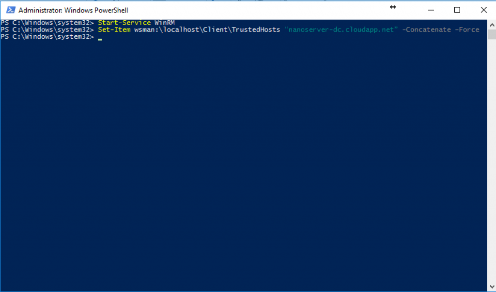

Los beneficios que aporta un Nano Server son los siguientes:
·       Nano Server es una opción de instalación en Windows Server 2016; el sistema, aunque es mínimo en cuanto a tamaño tiene el mismo potencial que la versión completa de Windows Server.
·       Son 100% parametrizables por medio de scripting (PowerShell) ya que carecen de interface (GUI).
·       Nano servidor instala los componentes básicos del sistema operativo, su imagen completa puede llegar a consumir entre 400 y 500 MB de disco.
·       Puede administrar los Nano Servers de forma remota mediante el uso de Windows PowerShell, herramientas de System Center, o interfaces gráficas de usuario estándar RSAT.
·       Un nano server puede tener los siguientes roles: Hyper-V, IIS, failover clustering, scale-out file server, etc. Además se ejecuta en contenedores independientemente del Docker technology.
 
Las diferencias de un Nano Server con un Windows Server convencional son las siguientes:

·       Nano Server carece de GUI. 
·       Nano Server tiene un tamaño mucho más pequeño que Windows Server - incluso significativamente menor que Windows Server Core.
·       Nano Server a nivel de virtualización tiene VHD 93% más pequeño, 92% menos de procesos de HAL críticos y 80% menos de reinicios necesarios.

**Configuración de Nano Servers en Microsoft Azure:**
 
En primer lugar, necesitarás una suscripción de Microsoft Azure para hacer este procedimiento, si no dispones de ninguna puedes solicitar una prueba de 30 días o $100 desde el siguiente enlace: [https://azure.microsoft.com/es-es/pricing/free-trial/](https://azure.microsoft.com/es-es/pricing/free-trial/). Una vez configurada nuestra suscripción procedemos a instalar nuestro Nano Server, para ello:

·       Vamos a la opción de Virtual Machines y seleccionamos la opción "Crear Virtual Machine":


·          En el siguiente paso debemos seleccionar una máquina virtual de la Galería, esto nos permitirá  seleccionar  una plantilla ya creada de un Nano Server para no tener que instalarlo desde Cero.


·          Ahora  seleccionamos  la plantilla: Windows Server 2016 TP – Nano Server:


·          El siguiente paso es bastante importante, aquí asignaremos los recursos de hardware a la máquina virtual y el nombre de la misma. Recordemos que no hay requerimientos mínimos para un Nano Server, debemos ajustarlo a nuestras necesidades de infraestructura del servicio que se pretende instalar.


·          Ahora simplemente indicamos parámetros como el nombre de nuestra suscripción, como la localidad y las horas de disponibilidad de nuestro Nano Server. Un detalle importante que quiero destacar, es que todas las máquinas virtuales creadas en Azure se le agrega la extensión cloudapp.net, esta nos ayudara hacer más fácil las consultas a nuestra maquina desde Internet:


·       Por ultimo podemos seleccionar opciones de seguridad y componentes adicionales disponibles para aumentar la seguridad y rendimiento de nuestro Nano Server.

**Nota:** Es imprescindible instalar el VM Agent.


·          ¡Finalizado!, ya tenemos nuestro Nano Server instalado y ejecutándose dentro de nuestra suscripción.


**Administrando nuestro Nano Server:**
 
Como ya hemos dicho a lo largo de nuestro artículo, los Nano Servers no tiene GUI, por lo cual tenemos que trabajar con ellos desde PowerShell. Para poder lograr administrar nuestro Nano debemos hacerlo con una conexión segura y con certificado, para ello seguimos los siguientes pasos:

1.       Una vez tengas creado y ejecutándose tu servidor Core o Nano dentro de Azure debes descargar las herramientas de administración de Azure mediante PowerShell desde el siguiente vinculo:

[https://azure.microsoft.com/en-us/downloads/?fb=en-us](https://azure.microsoft.com/en-us/downloads/?fb=en-us)

2.       En la parte inferior de la pantalla, específicamente en el apartado PowerShell selecciona Windows Install.


3. Descarga el Paquete e instálalo:


4. Una vez instalado debemos crear el certificado de seguridad y una conexión segura a nuestro servidor, para ello vamos abrir una consola de PowerShell (Con Privilegios de administrador) y ejecutamos el siguiente comando Get-AzurePublishSettingsFile.


5. Una vez el comando se ejecute, se abrirá una ventana de descarga en tu explorador de Internet, donde podemos descargarnos nuestro archivo de conexión segura a nuestra suscripción:


6 . Verás que es un archivo con extensión .publishsettings el cual nos habilita la conexión con nuestra suscripción, en mi caso lo he renombrado a ancadia.publishsettings y lo he ubicado en la carpeta C:\Azure.

7 .   Ahora debemos importar ese archivo de conexión a nuestro PowerShell, lo hacemos mediante el siguiente parámetro Import-AzurePublishSettingsfile –PublishSettingsFile “c:\Azure\ancadia.publishsettings”.


8 . Una vez realizado este procedimiento ya tenemos conexión a nuestra suscripción, ahora debemos conectarnos a nuestro Core/Nano Server y para ello lo vamos hacer mediante un script, pero antes debemos iniciar los servicios de WinRM, debemos ejecutar el siguiente comando: Start-Service WinRM.

9. Luego debemos crear una conexión certificada con nuestro host, para ello ejecutamos el siguiente comando donde debemos especificar el nombre de nuestro Core/Nano, en mi caso es  NanoServer-DC  :


```
Set-Item wsman:\l​​​ocalhost\Client\TrustedHosts “nanoserver-dc.cloudapp.net” -Concatenate –Force
```



10.  Ahora como comprobación verificamos que tenemos nuestra conexión de confianza correctamente configurada, para ello ejecutamos el siguiente comando:

```
Set-Item wsman:\localhost\Client\TrustedHosts​​
```


11.   ¡¡Esta todo listo!! Lo único que nos queda es ejecutar el script de conexión  [http://www.solomicrosoft.com/wp-content/uploads/2016/05/NanoScript.txt](http://www.solomicrosoft.com/wp-content/uploads/2016/05/NanoScript.txt) donde solo debemos modificar los siguientes parámetros:


$serviceName = ‘NanoServer-DC’   – Representa el nombre del servicio
  $vmName = ‘NanoServer-DC’  – Reprsenta el nombre de tu servidor virtual 
  $subName = ‘Pay-As-You-Go’  – Representa el nombre de tu suscripción


Todos estos datos puedes obtenerlos en la consola de Azure, bien ejecutamos el script, en mi caso yo lo he guardado en la carpeta c:\azure y lo he llamado NanoScript.ps1


12. Aceptamos la importación del certificado de conexión especifico de nuestro host:


13. En la petición de credenciales, simplemente indicamos el usuario administrador de nuestro Nano.

14. Ya nos hemos conectado a nuestro  Core/Nano Server y podemos administrarlo, para comprobar nuestra conexión ejecutamos un ipconfig​


**Conclusiones**
Desde aquí las posibilidades son infinitas, Nano Server no es el futuro es el ahora, la apuesta de Microsoft por los Nano Servers será incondicional. Nano Server además de integrarse con Contenedores de una manera nativa nos dará la posibilidad de instalar un servidor en un PenDrive, o instalar un servidor por cada servicio de nuestra red sin necesidad de grandes requerimientos de hardware.

Nano Server es la verdadera evolución del servidor, es la apuesta del Cloud OS.


**Darwin Castro**
 MVP Office Servers and Services
darwin.castro@ancadia.com
 @ancadiasystems
 http://www.ancadia.com

