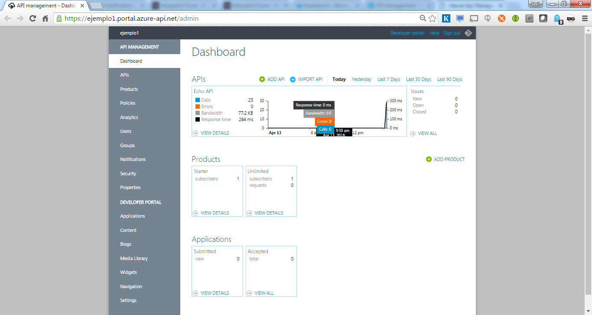

Estamos atendiendo a un cambio en el modo de afrontar la incorporación de software externo a un proyecto. Cada día es más habitual el incorporar el uso de APIs externas para suplir funciones en lugar de incorporar el software y los datos necesarios para llevarlas a cabo internamente. Todos hemos oído o leído que el paradigma del futuro cercano son los microservicios y llevamos muchísimo viendo las bondades de las APIs REST. Este cambio, como todos, tiene sus cosas buenas y sus cosas no tan buenas.

En una empresa al principio todo es fácilmente manejable, pero el número de APIs de terceros que se van usando crece y se van creando APIs propias para conectar proyectos garantizando que hay poco acoplamiento. Además cada vez se van generando más y más proyectos que hacen uso de esas APIs a medida que más equipos se incorporan a este modo de trabajar. Todo se va complicando y la empresa se da cuenta de que tiene un problema el día que tiene que cambiar un proveedor, o hacer un cambio en el sistema de validación de una API y eso conlleva cambios en un montón de proyectos.

Para evitar problemas de este tipo, Azure nos provee de un entorno de trabajo que resulta muy potente cuando se aprovechan todas sus capacidades. Aquí le daremos un vistazo introductorio que nos permita empezar a cacharrear sin miedo.

**¿Qué es Azure API Management?**

Azure API Management [1] es un espacio de trabajo que nos proporciona Azure en el que, básicamente, podemos configurar distintas APIs (propias o de terceros) añadiendo una capa de abstracción que unifica el acceso de desarrolladores a ellas.

Hay múltiples casos de uso, algunos típicos podrían ser:

·       Hay un API de terceros que se usa mucho en tu empresa, para mitigar el vendor lock-in la incorporas al API manager de tal modo que en un momento dado puedas cambiar el proveedor de dicha API sin cambiar los proyectos desde los que se usa.
·       Quieres vender el uso de tus APIs a desarrolladores externos y quieres tener un modo sencillo en el que proveerles documentación, controlar su uso, etc. Las incorporas a través del API Management y abres el acceso al portal del desarrollador, permitiéndoles que se auto-provean.
·       Quieres que tus equipos de desarrollo se abstraigan totalmente y no hagan distinción si el proveedor de una API es interno o externo, manteniendo unificado el feedback, la monitorización, las peticiones de mantenimiento, etc. Incluyes todo en el API Management y habilitas un canal único (por ej. el portal del desarrollador) para esas comunicaciones.
·       Quieres unificar las llamadas que se hacen a una API de terceros desde tus proyectos para aunar el volumen mejorando los precios. Configuras ese API en el API Management con unas credenciales únicas y le das acceso a tus equipos de desarrollo.
·       Quieres unificar la autenticación y autorización a todas las API de tal modo que no haya que usar distintos sistemas para conectarse a distintos endpoints. Configuras cada API para que se hagan desde el gateway de Azure los pasos de autenticación y autorización que correspondan en cada una (usario y contraseña, OAuth, OAuth 2.0, certificado de seguridad, etc.) y permites el acceso a ellas con un único sistema.
·       No quieres dar acceso desde tus servidores de aplicación a los distintos dominios de internet que alojan todas las APIs usadas. Las metes en el API Management y sólo tienes que permitir el acceso a un único endpoint.
·       Quieres componer llamadas pidiendo un dato a un proveedor barato y si no lo tiene pedírselo a otro que es más caro. Con un pequeño script puedes hacerlo desde el API Management haciendo que para tus desarrolladores sea una sola llamada.

Como veis, hay una gran cantidad de casos en los que puede ser interesante disponer de las funcionalidades que nos proporciona Azure API Management.

**¿Competidores?**

Hay muchas empresas proporcionando servicios como el de Microsoft. La solución de software libre más popular es la de WSO2 [2] que te permite instalarlo en la infraestructura que quieras, pero también te dan la opción de usarlo como servicio Cloud. IBM como gran proveedor corporativo que es, tiene su solución API Connect [3], e incluso AWS tiene su Amazon API Gateway [4]. Todos proveen más o menos las mismas funcionalidades y a la hora de elegir creo que hay que tener en cuenta la afinidad, la versatilidad, la velocidad de adaptación y por supuesto el precio, ya que es un sistema caro y que requiere un uso intensivo para amortizarlo.

El sistema de API Management de Azure creo que destaca sobre los demás en la velocidad de adaptación. No necesitas ser ningún experto para manejarlo, de hecho puedes montarlo con facilidad sin tener experiencia previa y luego ir cambiando su configuración a medida que van surgiendo necesidades sin mayor dificultad. Tiene sus limitaciones por ser un servicio y no algo que controles tú al 100%, pero todo lo que se puede hacer, se puede hacer en 3 clics. ¿Qué quieres cachear los resultados de una API que tarda mucho para mejorar el rendimiento? 3 clics y resuelto. ¿Qué quieres tener un endpoint en la otra parte del planeta para agilizar el uso desde aplicaciones que estén en otras zonas geográficas? 3 clics y resuelto. ¿Qué quieres hacer un pack de APIs de traducción para venderlas como una sola? 3 clics y resuelto. ¿Qué quieres mantener un log con todas las llamadas que se hacen? 3 clics y resulto. Y así con todo.

**Historia**

Esta solución no es un desarrollo original de Microsoft. Inicialmente lo desarrolló Apiphany. Esta parece ser un spin off de EastBanc Technologies creada en 2011. EastBanc es una compañía con un largo recorrido que además es partner de Microsoft. Apiphany fue pasando por todas las fases del programa Bizspark y recibió una inversión de $2.3M en 2012 [5]. En 2013, unos meses después de la incorporación de un antiguo empleado de Microsoft (y hacer esta conexión ya son elucubraciones mías), y teniendo en su cartera varios grandes clientes Apiphany fue adquirida por Microsoft para incorporar sus servicios a los que ya se ofrecían en Azure.

Aunque desde la adquisición todo ha ido cambiando y mejorando, está claro de dónde proviene [6]. Mi sensación personal, comparándolo al resto de componentes de Azure, es que no cambia demasiado, puede que porque desde el principio era ya un producto validado que cubría todas las necesidades de grandes clientes. Es algo importante a tener en cuenta, ya que cuando nos enfrentemos a un problema, sabiendo esto será más fácil pensar en que seguramente ya esté resuelto de un modo sencillo.

**Componentes**

En una instancia de API Management hay tres componentes que entran en juego:

·       El Management Portal: es dónde el administrador hace las configuraciones, crea productos, controla la seguridad, analiza los datos, etc.
·       El Developer Portal: es dónde los desarrolladores podrán registrarse, acceder a la documentación de las distintas APIs e incluso probarlas.
·       El Gateway: es lo que no vemos, donde ocurre toda la magia.

**Management portal**

En el management portal, inicialmente tienes el dashboard, dónde tienes un resumen de la información más relevante y acceso a un par de operaciones comunes.

A continuación, en el apartado APIs puedes definir cada una de las APIs que vas a gestionar y sus operaciones. Los principales datos de cada API son su URL y el sufijo que quieres usar. Si la URL es https://apidetercero.com y el sufijo es apide3, todas las llamadas que se reciban en https://tuapimanagement.azure-api.net/apide3 se redirigirán a https//apidetercero.com. Podrás definir otros detalles como los sistemas de seguridad que hay que usar para conectar a esa API, o la reescritura de parámetros que hay que hacer en cada operación. Inicialmente tendrás una API con distintas operaciones a las que llamar mediante distintos métodos (GET, POST, DELETE, HEAD y PUT).

En productos puedes crear distintas agrupaciones de APIs. Por ejemplo puedes tener un producto con APIs destinadas a generar gráficos; puedes crear otro con APIs que analizan textos y devuelven datos sobre su idioma, sentimiento, etc.; puedes crear cuantos productos quieras y que cuando un desarrollador se suscriba a un producto tenga acceso a todas las APIs incluidas en él. Inicialmente tendrás dos productos, el Starter al que se podrá suscribir cualquier desarrollador y el Unlimited al que cualquier desarrollador puede solicitar una suscripción, pero un administrador tendrá que aprobarla.

En Policies es dónde encontramos el tema más interesante. Parte de las cosas que se definen en otros apartados tienen su representación en las políticas, permite hacer casi cualquier cosa y definir cómo se comportará el gateway. Es un apartado muy extenso y las distintas políticas [7] de las que disponemos nos permitirán hacer casi cualquier cosa. Inicialmente encontrarás alguna política como la que dice que una suscripción al producto Starter no puede hacer más de 100 llamadas a la semana. En este apartado podrás definir pequeños scripts que dirijan el tráfico a un endpoint o a otro independientemente de lo que se haya configurado al crear la operación de la API, también te permitirá solicitar un token mediante oAuth 2.0 que te de la autorización necesaria para llamar al backend, o procesar la respuesta para modificarla antes de devolverla al proceso que ha hecho la llamada inicial.

Además de estos apartados principales tenemos otros para gestionar los usuarios y los grupos; para analizar el uso por API, productos o usuarios; para establecer las notificaciones de correo que se mandan y a quién; para generar propiedades especiales a las que acceder desde las políticas; y para controlar distintos aspectos de la seguridad como certificados para autenticación servidor a servidor, controlar cómo los usuarios se autentican en el developer portal, o activar funcionalidades especiales como un API REST o un repositorio de Git con los que gestionar la configuración de un modo automatizado sin hacer uso de la interfaz web.

Bajo el título Developer Portal disponemos de distintos apartados en los que configurar el aspecto y el contenido, ya que en el fondo el Developer Portal no deja de ser un CMS orientado a la exposición de las APIs manejadas y de toda la información y comunicaciones que se necesitan (noticias, feedback, etc.).

**Developer Portal**

El Developer Portal, como introducíamos en el apartado anterior, es un CMS que expone todo lo necesario para exponer nuestras APIs.

En la configuración por defecto, un usuario puede registrarse y suscribirse a productos. Para el usuario, las suscripciones le permiten autenticarse contra las APIs y podrá manejar sus credenciales. Estas credenciales son dos claves que son muy importantes porque tendrá que mandar una de ellas en cada llamada que se realice. Como es habitual en este tipo de sistemas, hay dos para que si la seguridad de la que esté en uso se ve comprometida por cualquier motivo el usuario, que se presupone es un desarrollador y sin necesidad de la intervención de un administrador, podrá empezar a usar la otra y regenerar la clave comprometida.

En la sección de APIs el usuario podrá consultar la documentación de las distintas APIs que están disponibles, teniendo además acceso a código generado automáticamente para usarlas mediante Curl o usando C#, Java, JavaScript, Objective C, PHP, Python o Ruby. Además, si tiene una suscripción de un producto que le dé acceso a la API en cuestión, podrá probar a hacer llamadas a la API desde la propia web.

Otras de las funcionalidades para el usuario que ofrece el Developer Portal son informar de problemas sin necesidad de trasladarse a otro canal de comunicación, publicitar sus aplicaciones que hacen uso de las APIs o consultar sus estadísticas de uso que se corresponden a las que los administradores ven en el Management Portal.

**Conclusión**

El entorno de API Management que nos proporciona Azure es muy potente y a la vez versátil. Nos permite estar trabajando en muy poquito tiempo y tener unificadas todas las llamadas que se hagan desde nuestra empresa a APIs internas o externas, o usarlo como herramienta para gestionar desde un único punto todas las APIs que les ofrecemos a nuestros clientes.

Como contrapartida, es una solución que hay que usar intensivamente para poder amortizarla. La versión para desarrollo tiene un coste de $1.58 al día (sólo 32 mil llamadas al día, 161 MB de transferencia y 10 MB de caché), mientras que la versión estándar ya asciende a $22.55 al día y la Premium (que es la única que nos permite conectar por VPN al backend o usar varios nodos geográficamente distribuidos) son $91.90. Con esos precios no es una solución barata si no vas a usar todo su potencial, pero si vas a exprimirla al máximo es algo que te dará mucho juego con muy poco esfuerzo.

[1]         [https://azure.microsoft.com/es-es/services/api-management/](https://azure.microsoft.com/es-es/services/api-management/)

[2]         [http://wso2.com/api-management](http://wso2.com/api-management)

[3]         [http://www-03.ibm.com/software/products/en/api-connect](http://www-03.ibm.com/software/products/en/api-connect)

[4]         [https://aws.amazon.com/api-gateway/](https://aws.amazon.com/api-gateway/)

[5] [https://www.crunchbase.com/organization/apiphany/timeline#/timeline/index](https://www.crunchbase.com/organization/apiphany/timeline#/timeline/index)

[6]         [http://apievangelist.com/2013/05/27/api-management-using-apiphany/](http://apievangelist.com/2013/05/27/api-management-using-apiphany/)

[7]  [https://msdn.microsoft.com/library/azure/dn894081.aspx](https://msdn.microsoft.com/library/azure/dn894081.aspx)

[8]         [https://azure.microsoft.com/en-us/pricing/details/api-management/](https://azure.microsoft.com/en-us/pricing/details/api-management/)

**Javier López González**
 mail@javilopezg.com
 [@javilopezg](http://twitter.com/JaviLopezG)
 [https://javilopezg.com](https://javilopezg.com/)

 
 
import LayoutNumber from '../../../components/layout-article'
export default LayoutNumber
