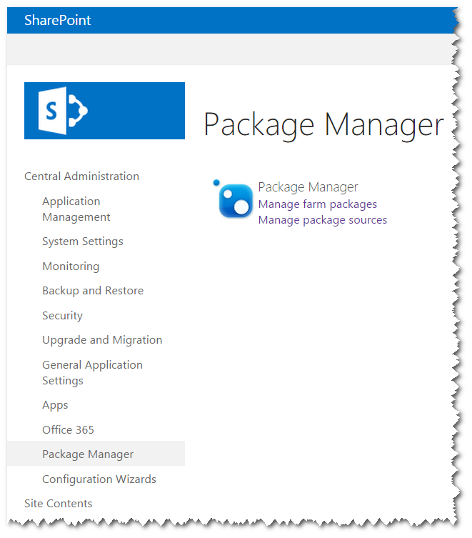
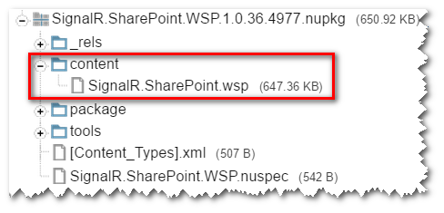
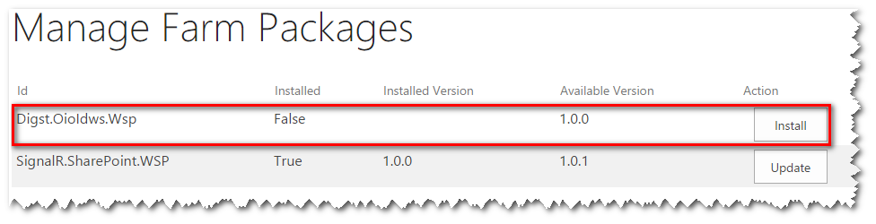
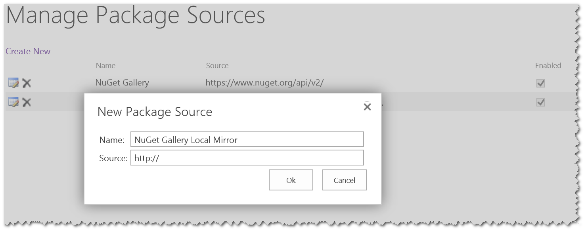
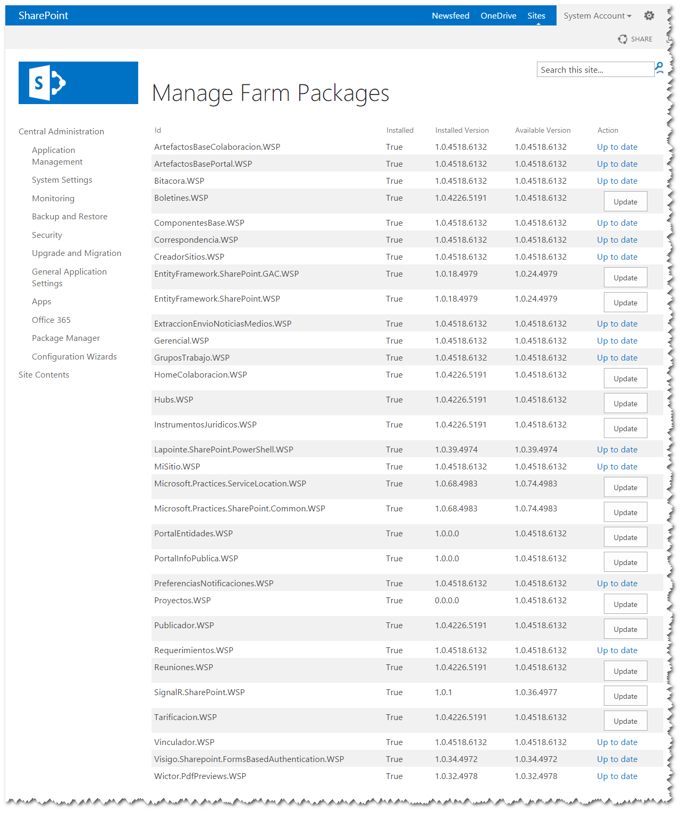

import ArticleHeader from '../../../components/article-header'

<ArticleHeader frontmatter={props.pageContext.frontmatter} />

Desde hace algún tiempo me ha inquietado la imposibilidad de distribuir fácilmente soluciones SharePoint - archivos CAB-base con extensión wsp. Preguntas sobre cómo hacerlas disponibles fácilmente para los clientes o distribuidores, así como brindar facilidades de actualización, eventualmente resurgen en mi mente cuando los proyectos entran en etapas de despliegue o mantenimiento.

Fue entonces cuando decidí que SharePoint necesitaba de una suerte de arma secreta que nos facilitara este tipo de gestión, por lo que escribí el código mínimo funcional, publiqué los fuentes en *GitHub* y lo bauticé como *SharePoint Package Manager*o gestor de paquetes de soluciones para SharePoint.

**¿Qué es SharePoint Package Manager?**

****

*SharePoint Package Manager* es un sistema de distribución y despliegue de soluciones de *SharePoint* basado en *NuGet*.

Básicamente es una extensión para el sitio de la Administración Central de SharePoint que permite la automatización del proceso para instalar o actualizar paquetes de soluciones desde una fuente de paquetes (en esencia cualquier fuente de paquetes *NuGet*).

**¿Por qué*****NuGet*****?**

De hecho, es posible responder con otra pregunta. ¿Por qué no? *NuGet* es gestor de paquetes ampliamente usado y popular entre los desarrolladores .NET.

Ciertamente existen varias soluciones personalizadas que usan *NuGet* como *backend*, por ejemplo, gestor de extensiones para [*ReSharper*](https&#58;//resharper-plugins.jetbrains.com/), [*OctopusDeploy*](https&#58;//octopus.com/), [*Chocolatey*](https&#58;//chocolatey.org/), [*Squirrel*](https&#58;//github.com/Squirrel), incluida una extensión de las opciones de modularidad para *Prism* implementada por [*Catel*](http&#58;//likewastoldtome.blogspot.com/2013/10/catel-extends-prism-modularity-options.html).

Existen muy pocas reglas para usar este gestor de paquetes. Solo necesitas los detalles de este 'nuevo' concepto: paquete de solución.

**¿Qué es un paquete de solución?**

Un paquete de solución es un paquete *NuGet* cuyo nombre termina en '.wsp' y cumple con la siguiente estructura.

Note como el folder 'content' contiene el archivo *wsp* con el mismo nombre del paquete solución.

Un paquete de solución puede hacer uso de los descriptores de dependencias – como cualquier otro paquete NuGet – pero sólo entre paquetes de solución. Las dependencias a paquetes NuGet que no sean paquetes de solución son ignoradas.

Puede que el convenio de nombre luzca débil, pero sólo existe un paquete en la galería con nombre [*Digst.OioIdws.Wsp*](https&#58;//www.nuget.org/packages/Digst.OioIdws.Wsp), por lo tanto creo que es suficiente. Eventualmente, el gestor de paquete puede llevar un registro de los paquetes que deben ser ignorados.

**Gestionando fuentes de paquetes**

*SharePoint Package Manager* incluye una página para gestionar los orígenes o fuentes de los paquetes, brindando opciones para adicionar, eliminar, habilitar o deshabilitar fuentes de paquetes.

La fuente de paquetes por defecto es la galería *NuGet*.

**Instalando o actualizando paquetes solución**

*SharePoint Package Manager* incluye además una página para gestionar los paquetes en la granja. A partir de revisar las soluciones instaladas y mezclando esta información con los paquetes solución disponibles desde las fuentes de paquetes, la página muestra los paquetes solución disponibles tanto para instalar como para actualizar.

*SharePoint Package Manager* provee la opción de instalar o actualizar los paquetes soluciones. Esta opción se muestra justo a la derecha de cada paquete, y de ejecutarse el sistema planifica un *job* que garantiza la ejecución del proceso de instalación o actualización del paquete solución a la última versión disponible. Si el paquete solución seleccionado tiene dependencias, el gestor de paquetes instala o actualiza todas las dependencias si es requerido.

**¿Cómo continua?**

Este sistema propone una estrategia novedosa en términos distribución, instalación y actualización de soluciones para *SharePoint* a partir de automatizar todo el proceso.

La implementación actual es prácticamente un borrador o una prueba de concepto. Les recuerdo, es justo el mínimo código funcional para garantizar su operatividad. Pero ya está disponible y lo pueden probar. Además he publicado un paquete solución para [*SignalR*](https&#58;//www.nuget.org/packages/SignalR.SharePoint.WSP/) en la galería de *NuGet* por lo que debe listarse como un paquete solución disponible. De hecho, el paquete correspondiente a *SharePoint Package Manager* en sí mismo debe listarse, ya que se distribuye como paquete de solución y es auto-actualizable.

Disfrútenlo, y déjenme saber que piensan. Incluso mejor, podemos hacer esto justos. Como dije al inicio, los fuentes están disponibles en [*GitHub*](https&#58;//github.com/alexfdezsauco/PackageManager.SharePoint) y aún quedan cosas por hacer.

**Igr Alexánder Fernández Saúco**
Arquitecto de software y especialista principal en DATYS
alexander.fernandez.sauco@gmail.com
 @alexfdezsauco
 [http://likewastoldtome.blogspot.com](http&#58;//likewastoldtome.blogspot.com/)

