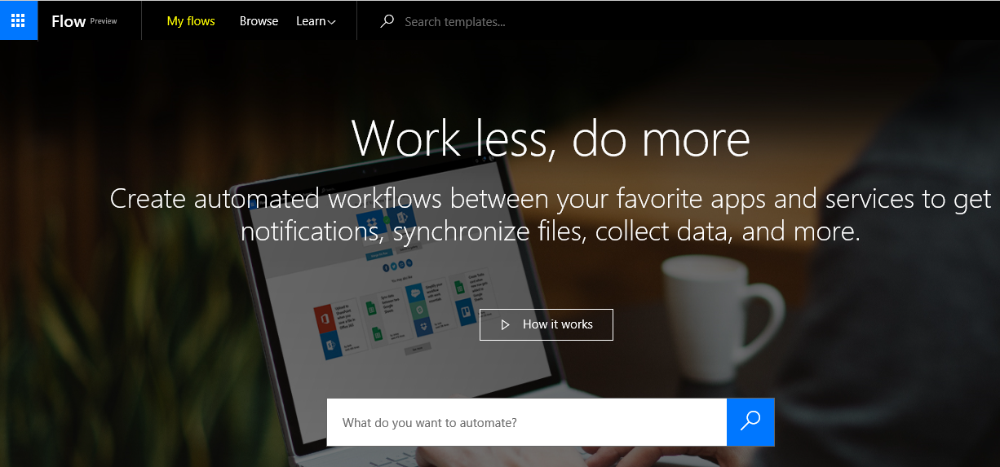
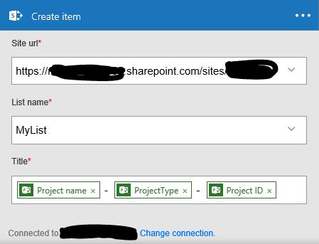

Microsoft está tratando de facilitar la creación de aplicaciones multidispositivo y flujos de negocio mediante dos nuevas herramientas: [Microsoft Flow](https&#58;//flow.microsoft.com/en-us/documentation/getting-started/) y [Power Apps](https&#58;//powerapps.microsoft.com/en-us/tutorials/getting-started/) . Ambas están actualmente en modo “Preview” pero podemos comenzar a usarlas para automatizar de forma sencilla nuestros procesos diarios e integrar varios sistemas.

En este artículo vamos a ver qué eventos y acciones tenemos para Project Online con Microsoft Flow. Microsoft está apostando claramente por la nube, así que todas las cosas “chulas” que saque irán orientadas a este entorno. Por lo que, por el momento, no está disponible esta herramienta en instalaciones “OnPremise”. Quizás más adelante y en entornos híbridos sí será posible.

Para crear nuestro primero flujo podemos localizar “Microsoft Flow” desde el Lanzador de Aplicaciones de nuestro tenant de Office 365:

​

Tras pulsar el botón “Flow” seremos redirigidos a la página home de este producto. En la parte superior derecha de la misma podremos logarnos con las credenciales que usemos en nuestro tenant. Una vez logados, desde el menú de navegación superior podremos acceder a las diferentes plantillas de flujos ya preparadas por Microsoft mediante el enlace “Browse” o crear un nuevo a partir del enlace “My flows”:

Como lo que nos interesa ahora mismo es ver qué hay disponible para Project Online, crearemos un flujo desde cero. Lo primero que aparecerá será un el listado con los     flujos que ya tengamos creados (si es la primera vez, no habrá nada) y el botón “Create new flow”. Tras pulsarlo, se mostrará un lienzo en el que ir configurando nuestro flujo.

Lo primero que veremos será un pequeño buscador en el que localizar el evento inicial que ejecutará nuestro flujo:

Como se puede apreciar en la imagen, actualmente ya existen muchos y muy interesantes eventos, buscando facilitar la conectividad entre diversos sistemas. Y no sólo entre los de Microsoft, sino con otros muchos de uso común como Google Drive, Facebook, Instagram, Mailchimp, etc.

**Eventos**

Para encontrar los eventos disponibles en Project Online podemos desplazarnos verticalmente por el listado que nos ofrece el sistema o escribir "Project" en el buscador. Los resultados son los siguientes:

Por el momento sólo tenemos tres eventos, pero los tres bastante interesantes:

·          Cuando se crea un nuevo proyecto.

·          Cuando se crea un nuevo recurso.

·          Cuando se crea una nueva tarea.

Y es especialmente útil el último: “Cuando se crea una nueva tarea”. Y ahora os explicaré el porqué. No obstante, comentar que actualmente no es posible sustituir las capacidades que ofrecen los flujos de Project Server por las de Microsoft Flow: no tenemos la opción de indicar qué páginas mostrar por cada etapa del flujo de trabajo ni qué campos de proyecto son obligatorios o no para cada una de ellas, por ejemplo. De hecho, ni los eventos ni las acciones disponibles están orientadas a eso. En todo caso, podríamos realizar flujos que complementen parte del flujo de gestión de la demanda o realizar operaciones que hasta el momento habrían supuesto necesariamente un desarrollo. Y es aquí donde tiene toda su potencia el evento “When a new task is created” ya que no existía hasta la fecha ningún evento accesible desde SPD para el mismo, lo que obligaba a realizar un desarrollo que sobrescribiera este evento para Project Server o el evento remoto en Project Online. Si nuestro proyecto es de lista de SharePoint sí podríamos lanzar un flujo sobre la lista de tareas del sitio documental del proyecto, pero el ámbito de la información sería el de SharePoint y no podríamos acceder a ciertos datos de Project de forma sencilla.

Configurar cualquiera de estos eventos es bastante fácil: basta con indicar la url de nuestra instancia de PWA e indicar con qué usuario nos conectamos a la misma (esto sólo lo pedirá la primera vez y podremos cambiarlo en cualquier momento):

Una vez configurado el evento inicial, hay que indicar obligatoriamente una acción para el flujo. Así que vamos a ver cuáles tenemos disponibles para Project Online.

**Acciones**

Para añadir una nueva acción simplemente hay que pulsar en la cruz que aparece tras el evento. Se mostrarán dos opciones: "Add an action" para añadir una nueva acción o "Add a condition" para añadir una condición a nuestro flujo, tal y como se ve en la imagen:

Si añadimos una condición, se mostrará un formulario como el de la imagen, en el que seleccionar el tipo de objeto a consultar y la condición a validar sobre el mismo. Incluso es posible editar la condición y modificarla de forma manual a nuestro gusto:

Nosotros vamos a añadir una nueva acción puesto que lo que deseamos es ver cuáles tenemos disponibles para Project Online. Como en el caso anterior, si escribimos “Project” en el buscador, aparecerán filtradas las acciones que nos interesan:

Las que tenemos disponibles por el momento (además de los tres eventos ya comentados) son las siguientes:

·          Checkin and publish Project (Proteger y publicar un proyecto).

·          Checkout a Project (Desproteger un proyecto).

·          Create new resource (Crear un nuevo recurso).

·          Creates new Project (Crear un nuevo proyecto).

·          Creates new task (Crear una nueva tarea).

·          List projects (Listar proyectos).

·          Lists tasks (Listar tareas).

La configuración de la mayoría de acciones es muy parecida, solo hay que indicar la url de la instancia de PWA a la que conectarse y el ID del Proyecto:

Y, tal y como puede apreciarse en la imagen, en la configuración de las acciones tenemos disponible información que se ha ido arrastrando de los pasos anteriores como, por ejemplo, el ID del proyecto, el nombre del proyecto, el ID y el nombre de la tarea (ya que el evento usado en el ejemplo era “When a new task is created”), algunas fechas de inicio y fin…Esto nos ayuda a configurar la acción o a facilitar información necesaria como, en este caso, el ID del proyecto.

Las acciones que requieren de información adicional son las tres relacionadas con la creación de proyectos, recursos y tareas ya que, obviamente, necesitan completar los campos obligatorios para este tipo de objetos.

Las dos últimas acciones (“Lists Projects” y “Lists Tasks”) son también muy útiles ya que permiten, respectivamente, la obtención del listado de proyectos de una instancia de PWA o las tareas relativas a un proyecto determinado. Los resultados se devuelven como una colección, pero, al no haber ninguna acción tipo “for each”, se hace un poco complicado trabajar directamente con la misma. Lo más que se puede hacer es realizar algún filtro mediante el condicional y ejecutar acciones según el resultado de la comparación con algún campo.

Otra opción sería guardar los resultados directamente en otro objeto como, por ejemplo, un fichero de Excel, de Google Drive o en una lista de SharePoint, que es lo que hemos preparado para el ejemplo, guardando en el campo “Title” de nuestra lista la información relativa al nombre del proyecto, el tipo de proyecto y su GUID:

Nuestro flujo completo quedaría así:

Para probarlo, creamos una nueva tarea en uno de nuestros proyectos, con lo que el evento se lanza correctamente y me llega el siguiente correo:

También se generaron en la lista de SharePoint tantos elementos como proyectos existían en mi PWA:

**Revisar el histórico de las ejecuciones**

Además, desde el listado con nuestros flujos es posible verificar el estado de cada ejecución de los mismos y ver de esta manera si se ha producido algún error. Para ello, se debe pulsar el icono con el interrogante del flujo que se desee analizar:

Tras esto, se mostrará un listado con las últimas ejecuciones y el estado de las mismas:

Pulsando en cualquiera de ellas veremos el detalle de la ejecución para cada una de las acciones: si todo fue bien se marcará con un stick verde y si hubo un error quedará señalado con un aspa roja:

**Conclusiones**

Gracias a los nuevos eventos y acciones disponibles en Microsoft Flow, es posible realizar diversos procesos de negocio y/o de interconectividad entre sistemas que hasta ahora había que llevar a cabo mediante desarrollos o con herramientas de terceros. Y, en esta línea, los eventos disponibles para Project Online nos permiten mejorar la personalización de las implantaciones de una manera muy sencilla y fácilmente mantenible.

Ahora mismo tiene algunas pequeñas pegas: la interfaz sólo está en inglés; no se pueden mover las acciones en el diseñador para, por ejemplo, cambiarlas de orden (hay que eliminar y volver a crear las acciones); no he visto que se puedan guardar los resultados en variables…Pero todo esto irá mejorando con el tiempo, no olvidemos que estamos ante una versión preview. Y lo que nos ofrece supera con creces estos pequeños detalles.

**Jose Rafael García**

josex1975@gmail.com

[https://projectservernotes.com/](https&#58;//projectservernotes.com/)

@jrgarcia1975

