Microsoft anunció el pasado día 4 de Mayo en el Evento llamado The Future of SharePoint**,** celebrado en San Francisco (EE.UU), nuevas características en SharePoint 2016, Office 365 y OneDrive for Business. En el acto se hizo una previsión de lo que SharePoint se convertirá en el futuro. Además del anuncio de la disponibilidad de SharePoint 2016 se mostraron nuevos diseños para sitios de grupo, la página de contenido, página de sitios para Oficina 365, incluida una demo. Otro de los aspectos destacables fueron las novedades en materia de seguridad y "compliance".

A continuación, echaremos un vistazo a los cambios y novedades anunciadas en el evento y daré referencias a videos y artículos publicados por Microsoft.​

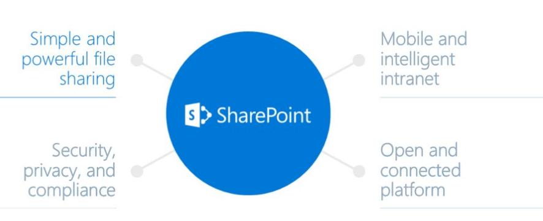

**Novedades en SharePoint 2016**

La primera gran novedad es que SharePoint 2016 NO será la última versión On-Premise. A continuación, se enumeran las principales novedades sobre SharePoint 2016 que se anunciaron en el evento:

Aplicación móvil para SharePoint. Ya es una realidad poder disponer de SharePoint "en el bolsillo", ya que Microsoft acaba de anunciar una nueva App de SharePoint para tal propósito.

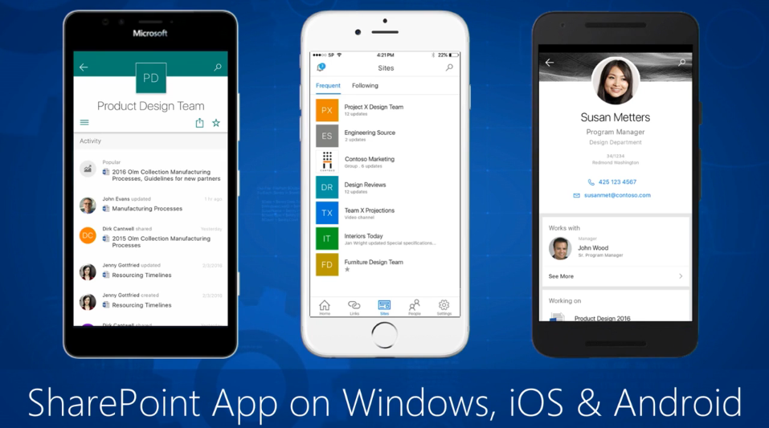

Las características más relevantes de esta nueva App son:

·          Rápido acceso a todas las bibliotecas y sitios en un entorno híbrido.

·          Acceso a los sitios desde on-premise.

·          Responsive & Fast, mediante diseño.

·          Uso de Office Graph para mostrar los datos más relevantes al usuario (SharePoint Online).

·          Uso del nuevo SharePoint Framework con soporte total de JavaScript para renderizar las páginas y librería de documentos del lado de cliente.

Disponibilidad de SharePoint 2016 **.** Los subscriptores de MSDN pueden descargar SharePoint 2016 para poder desarrollar y testear sobre el nuevo entorno.

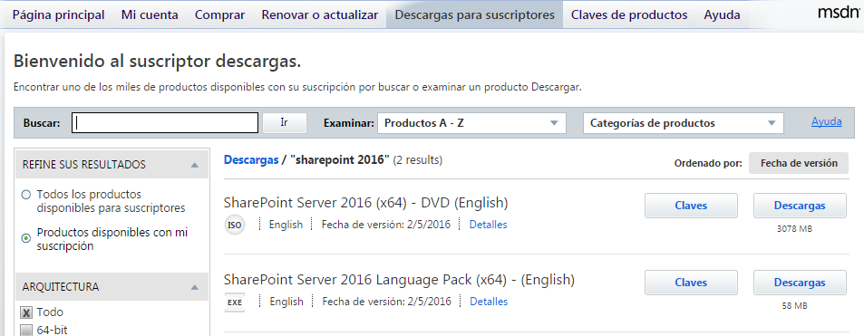

Nuevo Framework de desarrollo par SharePoint  . Se trata de un nuevo Framework basado en JavaScript y por lo tanto en desarrollo en el lado del cliente, para construir “Responsive And Fast” Apps

Out-of-the-Box. Se incluyen nuevos modelos de publicación mediante canvas (sin zonas de WebParts), ligero y totalmente responsivo, lo que facilita la visualización e interacción desde dispositivos

móviles. El nuevo Framework de desarrollo para SharePoint estará disponible para los Sitios de SharePoint Online ya existentes, y dispondrá de un conjunto de WebParts por defecto listas para usar

tanto en las nuevas páginas de SharePoint Online como en páginas antiguas. Destacar el enfoque del nuevo Framework basado en estos 5 puntos:

·          Desarrollo moderno del lado de cliente.

·          Se trata de crear páginas web ligera y móvil sobre plataforma SharePoint.

·          Potenciar nuestra propia experiencia.

·          Compatible con versiones anteriores.

·          Compatible con herramientas de “open source” y Frameworks de JavaScript.​

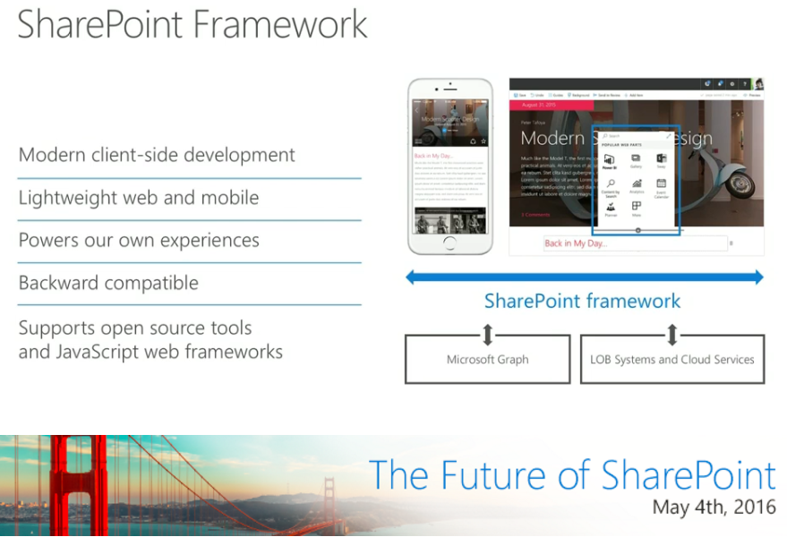

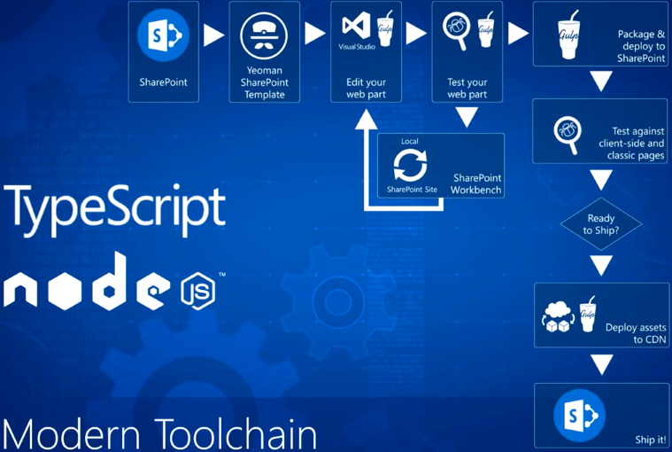

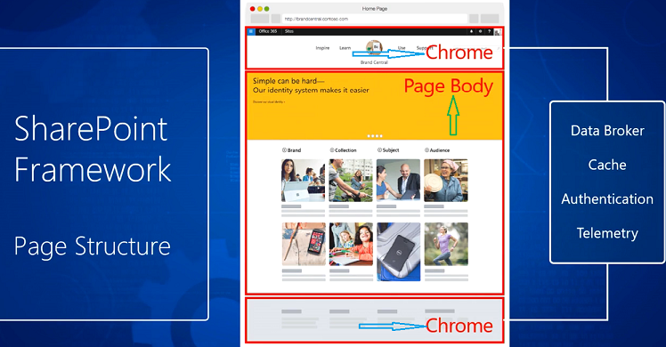

Feature Packs para SharePoint. Microsoft planea poner a disposición de los usuarios de SharePoint 2016 un mayor número de features de las que existen actualmente en la versión liberada el pasado 4 de mayo. En 2017, SharePoint 2016 recibirá al menos un Feature Pack, similar a la forma en que obtenemos las actualizaciones de Oficina 365 hoy en día (Public Update Channel). Cambios como el nuevo cliente de sincronización y otras mejoras se ofrecerán con los Feature Packs de SharePoint.

Oficialmente, el foco se de esta versión se centraliza en los entornos híbridos, especialmente en el servicio de búsqueda, seguridad de datos y mejoras de acceso. Muchas de las características de esta versión ya están disponibles en SharePoint Online, con lo cual Microsoft planea lanzar estos paquetes de características para tratar de nivelar las mejoras que se realiza con respecto a Office 365 ( no nos engañemos, Office 365 centraliza la mayor parte de los esfuerzos de la innovación ), lo que no está claro es exactamente cuándo está prevista la próxima versión completa de SharePoint Server 2016.

**Novedades en Office 365 y OneDrive for Business**

Las novedades que nos encontraremos en OneDrive for Business y Office 365 son las siguientes:

Nueva Interfaz de Usuario para los Sitios de Grupo de SharePoint. Los Sitios de Grupo (team site), las páginas de destino (landing pages), la navegación y la forma de interactuar con todos estos elementos está cambiando. El nuevo diseño está pensado para ser elegante y con estilo. De forma predeterminada, un sitio de grupo tendrá una página principal con Noticias y Vistas de Actividad (News & Activity Views). Podemos crear nuestras propias páginas mediante el uso de *Canvas* para potenciar la interactividad de las mismas, con una apariencia muy similar a los Blogs de Delve.

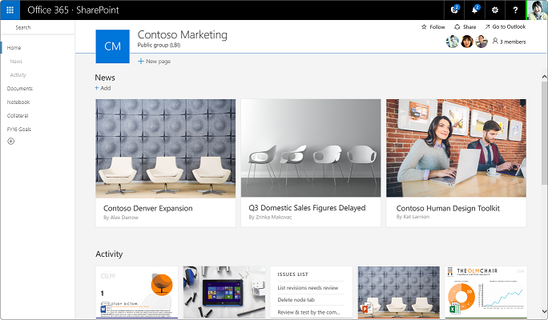

Hay una nueva página para creación de sitios de grupo también dándonos 2 opciones:

·          Sitio de Colaboración de Grupo (Team Collaboration site).

·          Sitio de Publicación de Contenido (Publishing Content site).

La nueva página de creación de sitio también permitirá crear Grupos de Office 365 cuando provisionemos un nuevo sitio de grupo, como podéis ver todo estará muy integrado.

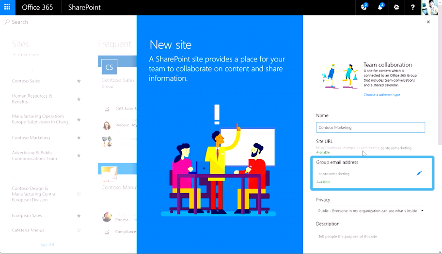

Prioridades de Microsoft Cloud: Grupos de Office 365. Office Graph y Seguridad & “Compliance”  . Coordinar el plan de gobernanza para gestionar la seguridad de extremo a extremo. La opción de invitar a usuarios externos al contenido en Office 365 (External Sharing) será más controlada mediante la aplicación de duración de tiempo para compartir, mediante la aprobación de elección de listas de dominios a elegir, para poder definir con quien se puede compartir. También se puede establecer las propiedades de la opción de compartidos externos mediante el uso de PowerShell.

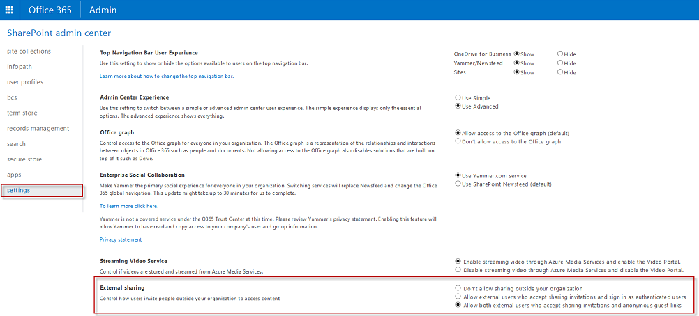

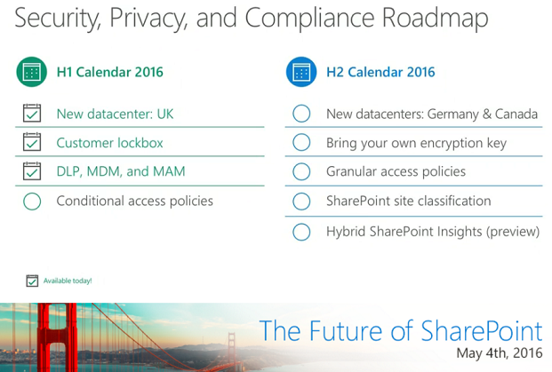

Método fácil y rápido de uso compartido de archivos

OneDrive for Bussiness como parte de Office 365, está diseñado para proporcionar sin esfuerzo, el intercambio de archivos de gran alcance y la colaboración en todos los dispositivos con seguridad integrada, la privacidad y los controles de cumplimiento. La gestión efectiva y compartir archivos es fundamental para casi todas las organizaciones. Se anunció una nueva visión audaz para la gestión de archivos en Office 365 a través de OneDrive for Business y SharePoint Online, y nuevas formas para que podamos compartir y colaborar en todos nuestros archivos en cualquier dispositivo. También se está investigando la forma de cómo nos estamos moviendo más allá de la sincronización de archivos y compartir realizando búsquedas de forma inteligente (inteligent discovery) para recomendar contenido (algo así como en lugar de nosotros buscar documentos que los documentos nos encuentren a nosotros), así como proporcionar conocimientos sobre el impacto y el alcance de nuestro trabajo. Algunas de las mejoras que veremos en OneDrive para Empresas son:

·          Copiar contenidos desde OneDrive a SharePoint.

·          Mejoras en la biblioteca de documentos de SharePoint.

·          Acceder desde cualquier lugar a nuestros archivos de Office 365.

·          Búsquedas Inteligentes.

·          Comprender el impacto de nuestro trabajo.

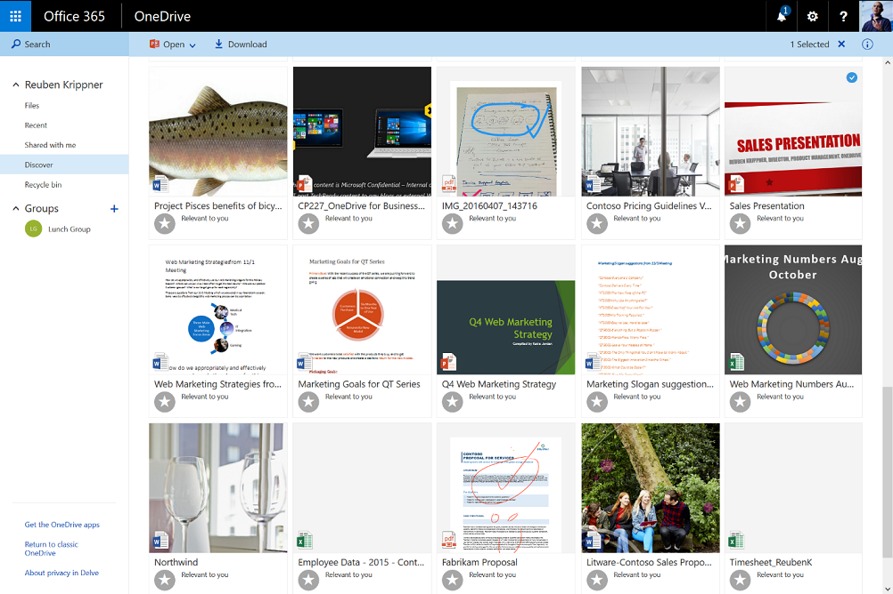

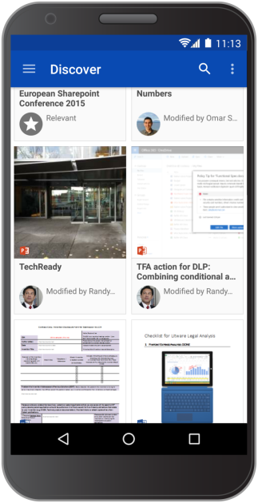

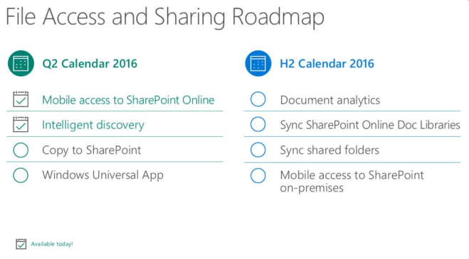

Para mayor detalle ver el blog: [https://blogs.office.com/2016/05/04/announcing-simple-and-powerful-file-sharing-and-collaboration-for-office-365/](https&#58;//blogs.office.com/2016/05/04/announcing-simple-and-powerful-file-sharing-and-collaboration-for-office-365/)

Nuevos Conectores de Datos a Listas  . Recientemente anunciado por Microsoft que integrarán flujos en las listas que permitirán a estas conectarse a datos de terceros usando procesos Out-of-the-Box.

El negocio sólo necesitará del modelo del proceso de datos e implementarse mediante unos pocos clicks.

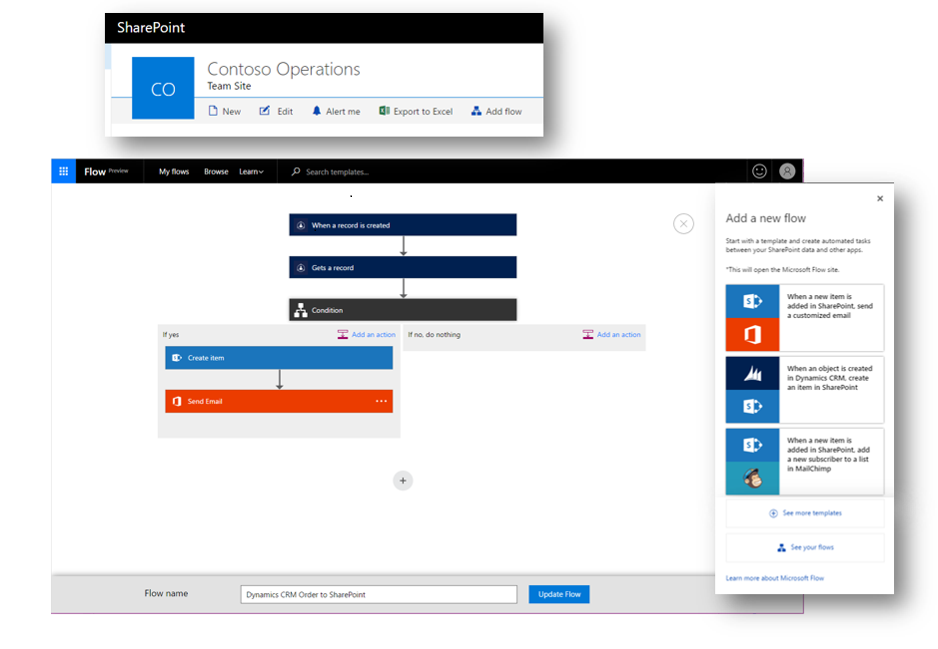

Nuevas Características para Librería de Documentos  . Podemos fijar, copiar metadatos y acceder a información sobre el documento desde el panel de información del documento desde el documento.

También podemos añadir enlaces a los documentos almacenados en otra localización. La biblioteca de Documentos en SharePoint Online tiene un nuevo aspecto similar a la que se puso en marcha para OneDrive for Business en octubre de 2015. Este modelo se puso en marcha sobre SPO en abril de este año.

Analizador de Documentos. Los archivos que hayamos compartido y visualizado y el impacto de los mismos en la organización serán más visibles en el futuro con el analizador de documento (Document Analytics). Esta será la característica que deberemos buscar, ya que aún no se ha publicado pero que se dio a conocer en el evento.​

Soporte multi-dominio para los Grupos de Office 365. Una nueva característica en los Grupos Office 365 para dar soporte a múltiples dominios ha sido añadida y utilizable desde ya, lo cual permitirá un amplio número de colaboración.

**Conclusiones**

La impresión que saco de todo lo anunciado por Microsoft el pasado 4 de mayo en el Evento de San Francisco es que seguirán aunando prácticamente todo esfuerzo en ir mejorando Office 365 e irán dando pequeñas pinceladas a las nuevas versiones OnPremise de SharePoint. Resumiendo: El futuro de SharePoint está en la nube.

**Francisco Ricardo Gil González**
 MVP CLUSTER | Especialista en SharePoint & Office 365
 francisco.gil@fiveshareit.es
 [Linkedin](http&#58;//es.linkedin.com/pub/ricardo-gil-gonzalez/63/99b/689/es)
 [http://www.mvpcluster.es](http&#58;//www.mvpcluster.es/)​

