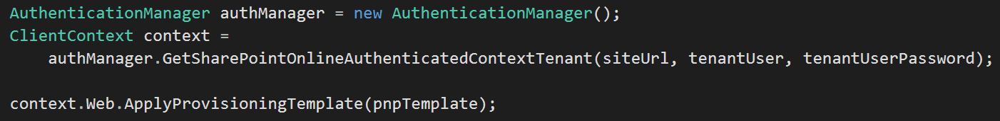

Un anuncio importante que no está en el artículo, pero que Vesa Juvonen anunció durante el Webcast bi-semanal del equipo, es que el programa PnP pasaba a formar parte del grupo de producto de SharePoint, es decir, que el programa sigue siendo Open Source y por y para la comunidad, pero que, de alguna forma, Microsoft reconoce el éxito y buen hacer del programa, y, esto es opinión personal, creo que el propio equipo de producto empezará a usarlo internamente.

Relacionado con este anuncio, otra de las novedades de esta nueva reléase de Mayo, son los cambios a nivel de paquetes *nuget* , donde ahora tenemos 3 paquetes orientados a cada uno de los distintos entornos, incluyendo una versión específica para el nuevo SharePoint 2016:

·          SharePoint PnP Core library for SharePoint Online
 *Install-Package SharePointPnPCoreOnline*

·          SharePoint PnP Core library for SharePoint 2013
 *Install-Package SharePointPnPCore2013*

·          SharePoint PnP Core library for SharePoint 2016
 *Install-Package SharePointPnPCore2016*

Actualmente todavía están disponibles los paquetes anteriores, que además han sido también actualizados con los cambios de mayo. Sin embargo, fijaros que ya aparecen marcados como [ *Deprecated* ], por lo que serán eliminados en breve.

**Componentes del programa PnP**

Como último punto antes de hablar de la arquitectura del Framewok de Provisioning, os recuerdo algunos de los componentes del PnP más destacados, en este caso de forma gráfica, como podéis ver en la siguiente imagen:

**Arquitectura del Provisioning Framework**

Vamos a analizar con algo de detalle cómo funciona el Framework de provisioning y cuál es su arquitectura. En este caso vamos a hablar de la operación de importar una template definida en un fichero XML, a un sitio de SharePoint. Sin embargo, a nivel de arquitectura, la operación de exportar un sitio SharePoint como template XML es muy similar, pero haciendo el recorrido en sentido contrario.

El ciclo para aplicar una template XML a un sitio SharePoint funciona en 2 pasos principales. Primero, se carga el contenido del fichero XML a un objeto de negocio "ProvisioningTemplate", posteriormente, ese objeto de negocio es recorrido por el Framework, haciendo las operaciones necesarias en SharePoint.

El primer paso sería el siguiente fragmento de código:

E internamente, este es el proceso que ha seguido el Framework:

1.          Todo empieza con la llamada al método *GetTemplate* de una clase que hereda de *TemplateProviderBase.*

2.          El Framework tiene soporte para templates definidas tanto en XML como JSON, si bien el formato más extendido es XML, y de hecho yo no conozco a nadie que esté utilizando JSON. Dependiendo del formato JSON/XML, la clase hereda de *JsonTemplateProvider* o *XmlTemplateProvider* . Además, el Framework permite diferentes almacenes para el fichero de la template, pudiendo almacenar el fichero en el FileSystem, en un Blob Storage de Azure, o incluso en una biblioteca de documentos de SharePoint.

3.          La clase especifica *TemplateProvider* , tendrá una propiedad de la clase base *FileConnectorBase* , con 3 implementaciones específicas, que conectaran al sistema de almacenaje utilizado: FileSystem, Azure Storage, SharePoint.

4.          El resultado del conector *FileConnectorBase* será un Stream representando el contenido de la template XML/JSON.

5.          Dicho Stream, pasa por una clase que implementa la interfaz *ITemplateFormatter* , que se encarga de convertir el Stream, a un objeto de negocio *ProvisioningTemplate* . Existen dos implementaciones de dicha *ITemplateFormatter* , dependiendo de si estamos trabajando con XML o JSON: *XMLPnPSchemaFormatter* y *JsonPnPSchemaFormatter* .

6.          Finalmente, cuando el Formatter termina su tarea, obtenemos un objeto ProvisioningTemplate, que contiene propiedades de otros objetos de negocio representando por completo la template: Fields, ContentTypes, Files, Lists, etc.

Una vez convertido el XML/JSON en un ProvisioningTemplate, el Framework recorre el objeto y aplica las operaciones necesarias en SharePoint, como crear las columnas, listas, subir los ficheros, aplicar settings, etc.

Este paso final arranca con el siguiente fragmento de código:

Y la siguiente imagen describe el proceso aplicado:

1.       Partimos de la *ProvisioningTemplate* cargado en el paso anterior.
2.       Se invoca a la extensión del objeto *Web*: *ApplyProvisioningTemplate*.
3.       La clase *TokenParser*, se encarga de traducir los tokens utilizados en la Template. Existe un sistema de "Tokenizado", por el que en el XML o JSON, se pueden utilizar tokens, que son resueltos en este momento con valores que dependen del contexto (por ejemplo: ~sitecollectionurl). Puedes ver todos los tokens disponibles en la carpeta: *OfficeDevPnP.Core\Framework\Provisioning\ObjectHandlers\TokenDefinitions*.
4.       Se ejecutan todos los *ObjectHandler* siguiendo una secuencia concreta. Cada *ObjectHandler* es responsable de provisionar una parte de la template a SharePoint. Por ejemplo, el *ObjectField*, creara las Site Columns de la template en SharePoint.
5.       En este punto, el Framework llamará a todos nuestros propios *Extensibility* *Handlers* que hayamos definido en la template. Es en este momento donde podemos "inyectar" nuestras propias acciones de provisioning. Por ejemplo, puede ser muy interesante enviar un correo electrónico cuando un template se aplica, o realizar alguna integración con un sistema externo, o alguna otra acción en SharePoint que no esté soportada por el Framework. Con la ejecución de todos los ObjectHandler, incluyendo los nuestros propios, el proceso de provisioning termina.

**Seguimiento del programa PnP**

Recordad las siguientes maneras de estar al día con el programa PnP:

·       Yammer Network: 
[https://www.yammer.com/itpronetwork](https&#58;//www.yammer.com/itpronetwork)
 Esta es posiblemente la mejor manera de seguir informado sobre el PnP. Además, podrás dejar tus dudas y comentarios y ser ayudado por el mismo equipo del PnP.
·       Canal PnP en Channel 9: 
[https://channel9.msdn.com/blogs/OfficeDevPnP](https&#58;//channel9.msdn.com/blogs/OfficeDevPnP)
 Videos con demostraciones y ejemplos de uso del PnP
·       Blog del PnP: 
·       [http://dev.office.com/blogs](http&#58;//dev.office.com/blogs)
·       Community call: 
[https://github.com/OfficeDev/PnP/wiki/Community-call](https&#58;//github.com/OfficeDev/PnP/wiki/Community-call)
 Apunta esta cita en tu calendario. Cada mes el equipo de PnP hace un meeting donde informa del estado del programa, el roadmap, muestra ejemplos, etc. Un verdadero lujo poder reunirse con el equipo del PnP y recibir las actualizaciones de mano del mismísimo Vesa.

**Luis Mañez**
SharePoint / Cloud Solutions Architect en ClearPeople LTD
 @luismanez
 [http://geeks.ms/lmanez/](http&#58;//geeks.ms/lmanez/)

