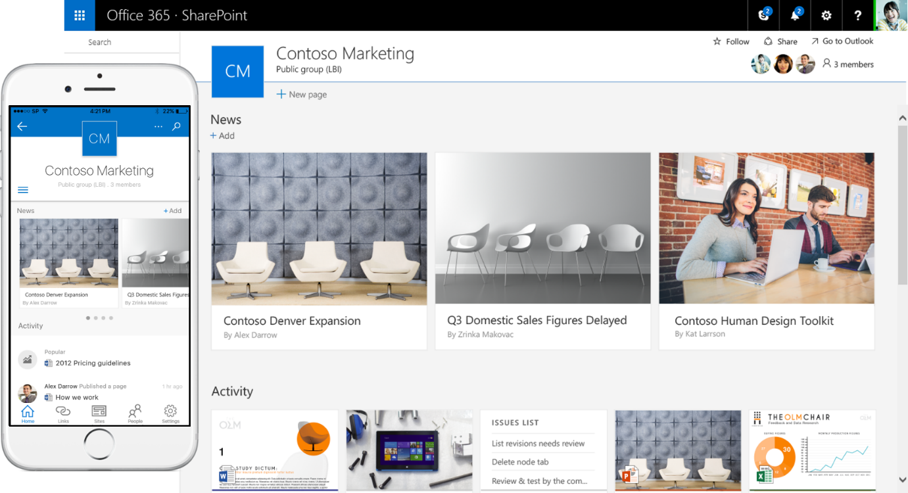
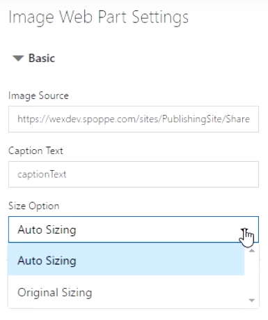
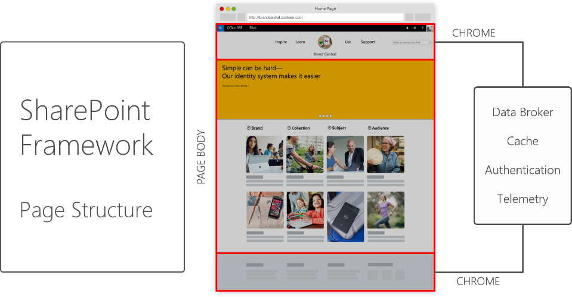
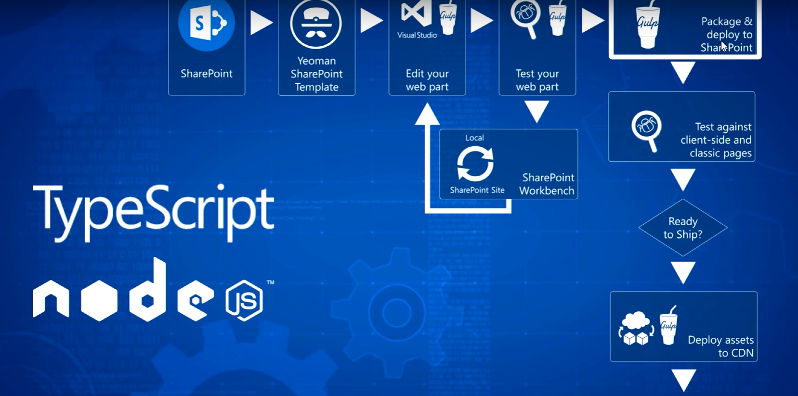
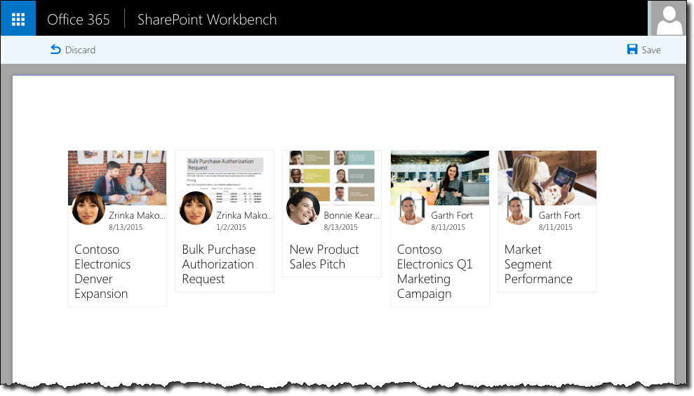

Los desarrolladores de SharePoint/Office365 llevábamos mucho tiempo sin ninguna novedad en el desarrollo, parecía que todo se estaba limitando a realizar aplicaciones (fuera de SharePoint) que consumen los servicios.  Esto podía hacernos pensar que SharePoint había pasado a no ser el orquestador de los procesos de la organización, sino un complemento que ayuda a mejorar la productividad. Ahora bien, con este escenario y con muchas dudas sobre el modelo de desarrollo en SharePoint: Farm Solutions, Add-ins, JavaScript, etc… surge el anuncio por parte de Microsoft de un nuevo Framework de SharePoint.

Este Framework se basa en la construcción de soluciones client-side (en el lado cliente) basado en la nueva UX que se va aplicar dentro de SharePoint. Además de tener una interfaz mucho más navegable e intuitiva a los usuarios (tipo Delve), está adaptada para su correcto funcionamiento en dispositivos móviles. 




El gran cambio de este Framework es que por primera vez no es imprescindible utilizar un entorno Windows ni Visual Studio para desarrollar una solución, para la depuración de las soluciones tampoco hace falta tener un IIS ni un SharePoint Online u OnPremises. Para el desarrollo sobre este framework está utilizando un set de herramientas web estándar y multiplataforma como son: NodeJs, TypeScript, Gulp, Visual Studio Code, Yo, etc. por lo que si aún no conoces estas herramientas debes de conocerlas y ponerte al día cuanto antes.

**¿Es un nuevo modelo de desarrollo?**

Esto es una de las grandes confusiones, dado que si vemos un poco de historia casi en cada versión de SharePoint hay un nuevo modelo de desarrollo: de las Farm Solutions al modelo SandBox pasando por los Add-ins (Apps). Dado estos bandazos que ha ido dando Microsoft no resulta extraño pensar que ahora iba a realizar otro nuevo modelo de desarrollo.

Sin embargo, en esta ocasión, el propio equipo de desarrollo se ha encargado de decir que NO es un nuevo modelo de desarrollo. Este nuevo Framework es una opción que se puede plantear en algunos casos.

La aparición de este Framework no implica que los otros métodos estén deprecados, sino que nos proporciona un abanico más amplio para poder seleccionar que opción se adapta mejor a los requerimientos del cliente.

**¿Cuándo lo utilizaremos?**

Vamos a utilizarlo en el caso que, dentro de SharePoint, en los nuevos Sitios de Trabajo utilizando la nueva UX y necesito que se pueda utilizar desde cualquier dispositivo móvil, quiero realizar un nuevo desarrollo o WebPart.  Este Framework ya trae de serie una serie de CSSs predeterminados que hacen que el desarrollo se pueda visualizar correctamente en los móviles. Lo que va a permitir este nuevo Framework es que podamos insertar nuevos WebParts pero con la diferencia que estos están implementados 100% en JavaScript. A estos WebParts de la misma forma que los WebParts de las Farm Solution se podrán configurar las propiedades del mismo.



**¿Qué ventaja nos proporciona?**

Este Framework no solo nos proporciona una bonita interfaz y la posibilidad de que nuestro desarrollo funcione en los dispositivos móviles, sino que nos proporciona una serie de funcionalidad de serie como es: autenticación, cache, telemetría y acceso a datos.

Otra de las funcionalidades que tiene es la ubicación donde va a estar, ahora mismo va a haber un marco donde vas a poder ubicar el desarrollo. Falta por comprobar si esta nueva funcionalidad es compatible con el sistema de MasterPage, Page Layouts que hay ahora mismo. De momento no hay ninguna referencia sobre el mismo.



**¿Cómo funciona?**

Esta primera versión utiliza:

- Yo,  es un generador de proyectos.
- TypeScript, es un súper conjunto de JavaScript (a alto nivel lo podemos definir como un JavaScript con tipos) es Open Source creado por Microsoft,
- NodeJS, es un servidor implementado en JavaScript que está de moda desde hace unos años.
- NPM, es el gestor de paquetes de NodeJS.
- Gulp, es un automatizador de tareas.




Una vez tenemos creado el proyecto el primer paso nos crea una clase vacía donde estará el WebParts de la siguiente forma:

```
export class CompartiMOSSWebPart 
```

```
   extends BaseClientSideWebPart<ICompartimossWebPartProps>{ 
```

```
    ...
```

```
}​
```

Donde ICompartimossWebPartProps es una Interface de la siguiente forma:

```
export interface ICompartimossWebPartProps { 
```

```
    description: string
```

```
} ​
```

Ahora dentro de la clase inicial sobrescribiremos por un lado el método Render de una forma similar a la siguiente:

```
public render(mode: DisplayMode, data?: IWebPartData) {
```

```
    this.domElement.innerHTML = 
```

```
       `CompartiMOSS The new WebParts !`;
```

```
}​
```
En caso de que queremos añadir propiedades de configuración tendremos que crearnos la variable PropertyPaneSettings y asignarle las propiedades que vamos a tener. Cuando queremos probar el desarrollo, en este nuevo Framework no hace falta realizar ninguna instalación en SharePoint ni en un IIS. A raíz de arrancar un servidor Gulp en local podemos tener una página Workbench que arrancara en nuestro entorno de desarrollo y podemos probar nuestro desarrollo.




Para subir este desarrollo a nuestro entorno de producción se genera un fichero donde estarán los ficheros xml como los ficheros js, css necesarios. Estos ficheros ahora bien pueden alojarse dentro de SharePoint, dentro de un Add-in o bien en un CDN bien público o externo. Una de las grandes novedades fue que permita el CDN, el motivo del uso esto hace que la carga de JavaScript es mucho más rápida desde el CDN que desde una biblioteca de SharePoint.

**¿Qué más herramientas utiliza el nuevo Framework?**

En todos estos ejemplos está hablando de utilización de Visual Studio Code, aunque en este caso se puede elegir cualquier IDE Web como pueda ser Sublime, Brackets, etc.

También se utiliza Gulp, dado que el Framework ya trae una serie de tareas predefinidas. Gulp ahora mismo dentro del mundo JavaScript es una herramienta que está en desuso y está creciendo la utilización de NPM como gestor de tareas.  Ahora bien, NPM se podrá utilizar siempre que nosotros implementemos estas tareas en NPM.

Este Framework entra en el modelo de desarrollo de JavaScript donde las herramientas de moda duran poco tiempo y en seguida se sustituyen por otras. Esto puede ser un hándicap para los desarrolladores tradicionales de SharePoint que están más acostumbrados a herramientas estables y en muchos casos obsoletas.

Por ahora, la pregunta del millón es cuando va a estar disponible este Framework para todo el mundo. Según Jeff Tapper estará disponible en el tercer cuatrimestre de 2016 para los tentant que tengan habilitado el First Release. De momento para OnPremise no hay fecha, pero se rumorea que en la primera actualización de SharePoint 2016 estará (este punto no está confirmado).


**Conclusión**

La aparición de este nuevo Framework es una gran noticia para SharePoint, la verdad es que el poder inyectar WebParts de una forma mucho más amistoso no es una revolución ni nada parecido, pero solo el motivo de que viejos requerimientos se aborden implica que el producto no está abandonado, sino que aún está vivo.

Desde el punto de vista del desarrollador, está claro que hay que conocer JavaScript si o si, pero más allá del lenguaje utilizado sí que es ilusionante el utilizar las ultimas herramientas del mercado y tener un abanico mucho más amplio de opciones para elegir la mejor opción o la opción que para este desarrollo consideras mejor.


**Adrián Diaz Cervera**

SharePoint - Architect at Encamina
Office Servers & Services MVP
[http://blogs.encamina.com/desarrollandosobresharepoint](http://blogs.encamina.com/desarrollandosobresharepoint)
[http://geeks.ms/blogs/adiazcervera](http://geeks.ms/blogs/adiazcervera)

adiaz@encamina.com @AdrianDiaz81​

 
 
import LayoutNumber from '../../../components/layout-article'
export default LayoutNumber
