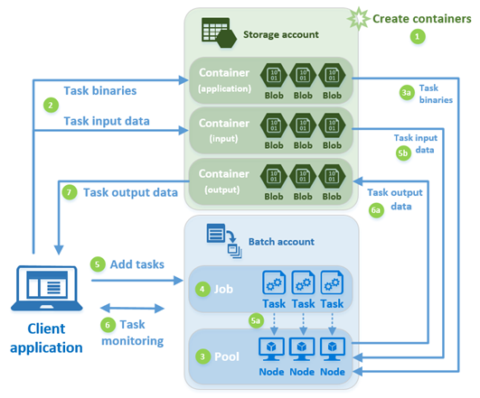
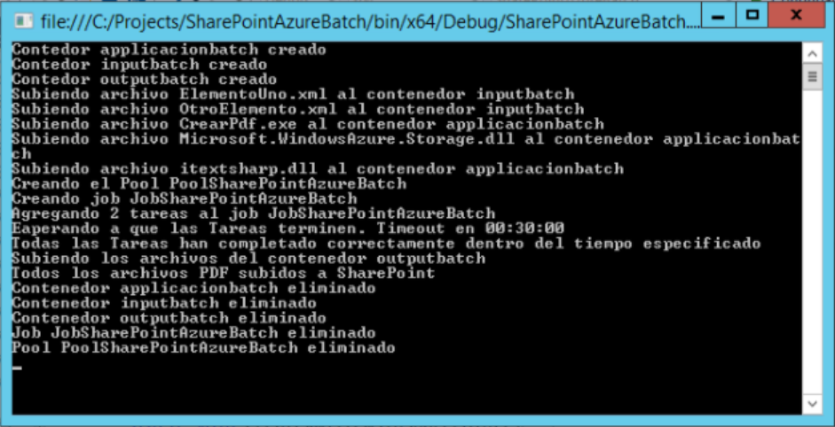
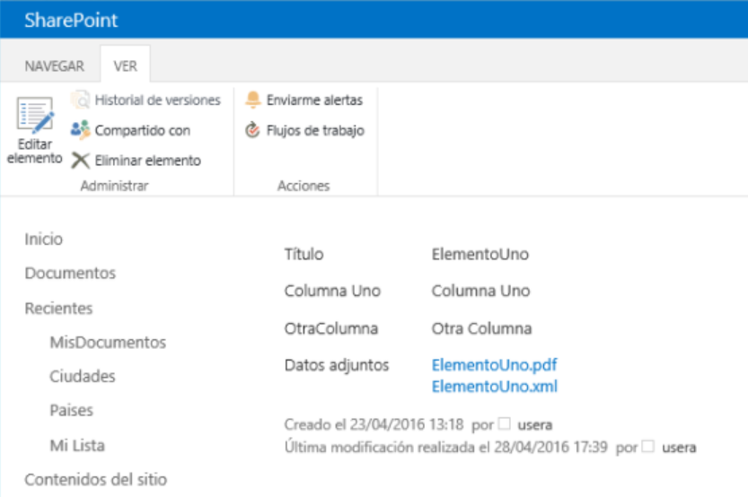

​​Muchos de los servicios ofrecidos por Azure se pueden utilizar para ampliar y mejorar el funcionamiento de SharePoint, tanto on-premises como en la nube. Uno de los servicios que ofrece Azure es "Azure Batch", que es una solución de Plataforma como Servicio (PaaS) que proporciona toda la infraestructura física más el software de base para ejecutar programas en grupos, eliminando cargas excesivas de servidores de producción. Azure Batch se encarga de crear Máquinas Virtuales que ejecuten los procesos, repartir la carga entre las diferentes Máquinas Virtuales, manejar los resultados y ponerlos a disposición del sistema que inicia la consulta.

**Como funciona Azure Batch**

Azure Batch funciona íntimamente ligado a Azure Storage. Un proceso Batch requiere un número de archivos que contengan los datos a procesar y un archivo ejecutable (con todos sus archivos de recursos) que procese esos datos; los resultados del proceso también deben ser archivos que se puedan almacenar. Primero es necesario subir tanto los archivos de datos como los del ejecutable a un Blob de Azure Storage. Luego, Azure Batch recibe los comandos necesarios para procesar los archivos y sube los resultados a otro Blob de Azure Storage, desde donde la aplicación que inició el proceso puede utilizarlos.

Azure Batch se encarga de crear Máquinas Virtuales en donde se ejecutará la aplicación para procesar los datos. Es posible utilizar hasta 1000 cores de CPU para el procesamiento de un Batch, lo que significa que se pueden crear hasta 1000 Máquinas Virtuales, cada una de un solo core, o 100 máquinas de 10 cores cada una, o cualquier combinación deseable. También es posible utilizar más de 1000 cores (sin límites), pero en ese caso es necesario tomar contacto con Microsoft para la creación del sistema.

El proceso para ejecutar una operación de Azure Batch es el siguiente (figura tomada del sitio de Microsoft Azure):



1.       Primero se crean los contenedores de Azure Storage Blob, ya sea manualmente utilizando la interface de usuario de Azure, por medio de PowerShell o programáticamente. Es necesario crear tres contenedores: uno para los datos a procesar, otro para los datos procesados y uno para los ejecutables.
2.       La aplicación cliente que maneja el Batch sube los archivos de datos y ejecutables a los contenedores.
3.       Se crea el Pool de Azure Batch manualmente o por medio de programación o PowerShell. Un Pool contiene y maneja todas las Máquinas Virtuales ("Nodos") que Azure Batch va a crear para procesar los datos. Cada Nodo recibe una copia de los ejecutables y una o más Tareas a ejecutar.
4.       Se crea un Job de Azure Batch, ya sea manualmente, por medio de PowerShell o programáticamente. El Job contiene las Tareas a ejecutar.
5.       La aplicación cliente le envía las Tareas al Job. Una tarea es un comando que inicia el ejecutable que procesa los datos. El ejecutable es normalmente una aplicación Windows de Línea de Comandos.
6.       La aplicación puede monitorear las Tareas para comprobar si ha habido algún problema, o si están tomando más tiempo de lo diseñado para ejecutar.
7.       Cuando las Tareas terminan de ejecutar, suben los resultados al Blob de salida de Azure Storage, desde donde la aplicación cliente puede descargarlos.

**Ejemplo de utilización de Azure Batch con SharePoint**

Con frecuencia es necesario que SharePoint realice tareas que requieren muchos recursos de la granja. Un ejemplo es la creación de archivos PDF desde archivos Word por motivos de archivado o presentación. Aunque SharePoint dispone de un mecanismo interno para realizar esta tarea (el "Servicio de Conversión de Documentos"), toda la carga recae sobre los servidores de la granja misma. Azure Batch se puede utilizar para remover esa carga de la granja y aliviar (y mejorar) sus prestaciones.

El siguiente ejemplo realiza una tarea similar a la descrita anteriormente: utilizando una Lista de SharePoint, primero crea un archivo XML para cada elemento donde se serializa el valor de cada uno de sus campos. Luego se envían todos estos archivos XML a Azure Batch para que los convierta en documentos PDF y, finalmente, los archivos PDF son almacenados como agregados en cada uno de los elementos de la Lista.

En el ejemplo toda la infraestructura necesaria de Azure Storage y Azure Batch es creada y removida programáticamente para indicar como se puede realizar el trabajo completamente desde código, aunque es totalmente posible crear los elementos de Azure manualmente utilizando su interface de usuario. El código del ejemplo está basado en el tutorial de Microsoft Azure Batch para .NET que se puede encontrar en el sitio de Azure, aunque ha sido modificado profundamente para poder trabajar con streams y SharePoint en lugar de archivos locales.

1.       Aunque los componentes de Azure Storage y Azure Batch se van a crear dinámicamente, es necesario crear cuentas de Storage y de Batch manualmente utilizando el Dashboard de Azure:
a.       Desde el Dashboard de Azure ([http://portal.azure.com](http://portal.azure.com/)), lóguese con sus credenciales. Utilice el botón de "New" – "Data + Storage" – "Storage Account" – Defina un nombre para la cuenta, la suscripción a utilizar y su grupo de recursos.
b.       Desde el Dashboard de Azure de nuevo, utilice el botón de "New" – "Virtual Machines" – "Batch Service" – Defina un nombre para la cuenta, la suscripción a utilizar y su grupo de recursos. 
2.       El ejemplo es una aplicación de Línea de Comando de Windows, por lo que inicie Visual Studio y cree una nueva Solución (llamada "SharePointAzureBatch" en el ejemplo).
3.       Agréguele los paquetes NuGet de "Azure.Batch" y "WindowsAzure.Storage". Estos paquetes descargan todos los dlls necesarios y agregan las referencias al proyecto.
4.       Cree directivas using a Microsoft.WindowsAzure.Storage, Microsoft.WindowsAzure.Storage.Blob, Microsoft.Azure.Batch, Microsoft.Azure.Batch.Auth y Microsoft.Azure.Batch.Common.
5.       Una serie de constantes se declaran al principio del programa para mantener los valores de los sistemas:

```
// Datos de conexion de SharePointprivate const string SiteUrl = "http://servidor";private const string ListName = "Nombre Lista"; // Datos de conexion y trabajo de Azure Storageprivate const string storageConnectionString = "DefaultEndpointsProtocol=https;AccountName=namestorage;AccountKey=YOpsrZsWMGPsGS5uzxkyzHn150fSlNVdZ772WLL0bOzUk8xFYa5MDNEPFecg/77EQif4Bd0Y51kRzG9GjfF3gQ==;BlobEndpoint=https://namestorage.blob.core.windows.net/;TableEndpoint=https://namestorage.table.core.windows.net/;QueueEndpoint=https://namestorage.queue.core.windows.net/;FileEndpoint=https://namestorage.file.core.windows.net/";private const string appContainerName = "applicacionbatch"; // Nombres de Containers TIENEN que ser en minusculas!!private const string inputContainerName = "inputbatch";private const string outputContainerName = "outputbatch"; // Datos de conexion y trabajo de Azure Batchprivate const string BatchAccountName = "namebatch";private const string BatchAccountKey = "O8jrJwdPG3aiJL9hAo/kbLI5l9THTO2pyAXftPM/XZZ4yTtn0iWMagh3BwpWKqfJ84CKBYvSxv2pBVukQ6KmFw==";private const string BatchAccountUrl = "https://namebatch.westeurope.batch.azure.com";private const string PoolIdName = "PoolSharePointAzureBatch";private const string JobIdName = "JobSharePointAzureBatch";​
```

​

La cadena de conexión al Storage "storageConnectionString" es de la forma:

*"DefaultEndpointsProtocol=https;AccountName=[NombreCuenta];AccountKey=[LlaveCuenta]==;BlobEndpoint=https://[NombreCuenta].blob.core.windows.net/;TableEndpoint=https://[NombreCuenta].table.core.windows.net/;QueueEndpoint=https://[NombreCuenta].queue.core.windows.net/;FileEndpoint=https:// [NombreCuenta].file.core.windows.net/"*

En donde "[NombreCuenta]" es el nombre asignado al momento de creación de la cuenta de Storage (Punto 1A) y "[LlaveCuenta]" se puede encontrar en el Dashboard de Azure yendo a la página del Storage creado - "All Settings" – "Access Keys" – "key1". "applicationbatch", "inputbatch" y "outputbatch" son los nombres de los contenedores a crear y tienen que ser en minúsculas.

La constante "BatchAccontName" es el nombre utilizado para crear la cuenta del Batch (Punto 1b), y el valor de "BatchAccountKey" se puede encontrar en el Dashboard de Azure yendo a la página del Batch creado – "All Settings" – "Access Keys" – "Primary Access Key". El valor de la constante "BatchAccountUrl" se encuentra en la sección de "Essentials" bajo "URL" en el Dashboard.

6.       El método Main de la aplicación de consola contiene dos llamadas: la primera crea los archivos XML de cada elemento de la Lista de SharePoint conteniendo sus campos y valores, y el segundo llama asincrónicamente el método "MainAsync" que realiza todo el resto del trabajo:

```
static void Main(string[] args){    CreateXmlItemsInSharePoint();    MainAsync().Wait();}​
```


7.          Por medio de "CreateXmlItemsInSharePoint" se crea un archivo XML de cada elemento de la Lista conteniendo los nombres de los campos visibles de la Lista y su valor:​

```
static void CreateXmlItemsInSharePoint(){    using (SPSite mySite = new SPSite(SiteUrl))    {        using (SPWeb myWeb =mySite.OpenWeb())        {            Console.WriteLine("Comenzando a crear archivosXML en SharePoint");            Dictionary<string, string> fieldValues = new Dictionary<string, string>();             SPList myList = myWeb.Lists[ListName];            foreach (SPListItemoneItem in myList.Items)            {                MemoryStream myStream = new MemoryStream();                 XmlWriterSettings settings = new XmlWriterSettings();                settings.Indent = true;                settings.IndentChars = ("    ");                settings.CloseOutput = true;                settings.OmitXmlDeclaration = true;                using (XmlWritermyWriter = XmlWriter.Create(myStream,settings))                {                   myWriter.WriteStartDocument(true);                    myWriter.WriteStartElement("Item");                     //Leer cada campo con su valor (solo los campos visibles)                    foreach (SPField oneField in myList.Fields)                    {                        if (oneField.Hidden == false)                        {                            try                            {                               fieldValues.Add(oneField.Title, oneItem[oneField.Title].ToString());                            }                            catch                            {                                // Una Lista puede tener mas de un campo                            }                        }                    }                     //Crear los nodos con los valores de los campos                    foreach (string oneKey in fieldValues.Keys)                    {                       myWriter.WriteStartElement(oneKey.Replace("", "_"));                       myWriter.WriteString(fieldValues[oneKey]);                        myWriter.WriteEndElement();                    }                     //Limpiar el diccionario y cerrar el archivo xml                    fieldValues.Clear();                    myWriter.WriteEndElement();                   myWriter.WriteEndDocument();                    myWriter.Flush();                     //Convertir el Stream con datos en un Byte Array                    byte[] myByteStream = myStream.ToArray();                     //Copiar el archivo como Agregado en el elemento de la Lista                    try                    {                       oneItem.Attachments.Add(oneItem.Title + ".xml", myByteStream);                        oneItem.Update();                    }                    catch                    {                        // Si el attachment ya existe, la rutina genera un error                    }                }            }        }    }}​​​
```

Este método utiliza un bucle que lee cada uno de los elementos de la Lista, lee cada uno de los campos en el elemento y genera un stream con el nombre y valor de cada campo. Luego los valores son guardados en formato XML y serializados como un agregado (attachment) al elemento mismo. Tenga en cuenta que las rutinas de try/catch son muy básicas y el ejemplo no está preparado para un sistema de producción.​

// Si el attachment ya existe, la rutina genera un error

}

}

}

}

}

}

Este método utiliza un bucle que lee cada uno de los elementos de la Lista, lee cada uno de los campos en el elemento y genera un stream con el nombre y valor de cada campo. Luego los valores son guardados en formato XML y serializados como un agregado (attachment) al elemento mismo. Tenga en cuenta que las rutinas de try/catch son muy básicas y el ejemplo no está preparado para un sistema de producción.

8 .        La rutina "MainAsync" es de la forma. La rutina debe ser asíncrona:

```
​private static async Task MainAsync(){    // ConfigurarAzure Storage para que funcione con Azure Batch                CloudStorageAccount storageAccount = CloudStorageAccount.Parse(storageConnectionString);    CloudBlobClient blobClient = awaitConfigureAzureStorage(storageAccount);     // Subir losarchivos XML y el procesador EXE a Azure Storage (Item1 = inputFiles, Item2 =applicationFiles)    Tuple<List<ResourceFile>, List<ResourceFile>>tupleResourceFiles = awaitUploadFilesToAzureStorage(blobClient);    // Generar el SASdel Contenedor para usar en los archivos de salida    string outputContainerSasUrl = GetContainerSasUrl(blobClient,outputContainerName, SharedAccessBlobPermissions.Write);     // Crear unBatchClient y procesar los archivos    BatchSharedKeyCredentials cred = new BatchSharedKeyCredentials(BatchAccountUrl, BatchAccountName, BatchAccountKey);    using (BatchClientbatchClient = BatchClient.Open(cred))    {        //Crear el pool que contiene los computadores que ejecutan las tareas        await CreatePoolAsync(batchClient, PoolIdName, tupleResourceFiles.Item2);         //Crear los trabajos que ejecutan las tareas        await CreateJobAsync(batchClient, JobIdName, PoolIdName);         //Agregar las tareas a los trabajos        await AddTasksAsync(batchClient, JobIdName, tupleResourceFiles.Item1,outputContainerSasUrl);         //Monitorear las tareas specificando un tiempo maximo de espera para que lastareas terminen de ejecutar        await MonitorTasks(batchClient, JobIdName, TimeSpan.FromMinutes(30));         //Bajar los archivos de resultados        await DownloadBlobsFromContainerAsync(blobClient, outputContainerName);         //Limpiar los recursos de Azure utilizados        awaitCleanUpResources(blobClient, batchClient);    }}​
```

Cada elemento se analiza en los siguientes puntos.​

9.          La variable "storageAccount" contiene un pointer al Azure Storage utilizando su cadena de conexión. La rutina "ConfigureAzureStorage" se encarga de crear todos los elementos necesarios en el Azure Storage, y devuelve una variable "blobClient" del tipo "CloudBlobClient":

```
private static async Task<CloudBlobClient> ConfigureAzureStorage(CloudStorageAccount storageAccount){    // Crear el BlobClient    CloudBlobClient blobClient = storageAccount.CreateCloudBlobClient();     // Usar el BlobClient para crear los contenedores en Azure Storage    await CreateContainerIfNotExistAsync(blobClient, appContainerName);    await CreateContainerIfNotExistAsync(blobClient, inputContainerName);    await CreateContainerIfNotExistAsync(blobClient, outputContainerName);     return blobClient;}private static async TaskCreateContainerIfNotExistAsync(CloudBlobClient blobClient, string containerName){    CloudBlobContainer container = blobClient.GetContainerReference(containerName);     try    {        if (awaitcontainer.CreateIfNotExistsAsync())        {            Console.WriteLine("Contedor" + containerName + " creado");        }        else        {            Console.WriteLine("Contenedor" + containerName + " ya existe");        }    }    catch (Exception ex)    {        Console.WriteLine(ex.ToString());    }}​​
```

"ConfigureAzureStorage" crea un Blob Storage dentro de la cuenta de Azure Storage, y luego, utilizando la rutina "CreateContainerIfNotExistAsync" crea los tres contenedores para los archivos de datos, de ejecutables y de datos procesados.​

10.          La rutina "UploadFilesToAzureStorage" lee los archivos XML de cada elemento de la Lista de SharePoint y los sube al contenedor de archivos de datos. También sube los archivos del ejecutable "CrearPdf.exe" que se va a encargar de procesar los datos (el código del ejecutable se explica al final de este capítulo). Esta rutina devuelve una Tupla de DotNet que contiene dos listas genéricas con objetos del tipo "ResourceFile" conteniendo referencias a cada uno de los archivos subidos al Storage:

```
​private static async Task<Tuple<List<ResourceFile>, List<ResourceFile>>>UploadFilesToAzureStorage(CloudBlobClient blobClient){    // Primero haceun List con los archivos XML de la Lista de SharePoint    List<Tuple<string, Stream>> inputFileStreams = new List<Tuple<string, Stream>>();  // Archivos XML de cada Item (item1=Name, item2=Data)    using (SPSite mySite = new SPSite(SiteUrl))    {        using (SPWeb myWeb =mySite.OpenWeb())        {            SPList myList = myWeb.Lists[ListName];            foreach (SPListItemoneItem in myList.Items)            {                SPFolder myFolder = myWeb.Folders["Lists"].SubFolders[myList.Title].SubFolders["Attachments"].SubFolders[oneItem.ID.ToString()];                SPFile myXmlFile = myFolder.Files["Lists/" + myList.Title + "/Attachments/" + oneItem.ID.ToString() + "/" + oneItem.Title + ".xml"];                 byte[] myBinFile = myXmlFile.OpenBinary();                MemoryStream xmlStream = new MemoryStream(myBinFile);                 inputFileStreams.Add(Tuple.Create(myXmlFile.Name, (Stream)xmlStream));            }        }    }     // Subir losarchivos XML a Azure    List<ResourceFile>inputFiles = awaitUploadFilesToContainerAsync(blobClient, inputContainerName, inputFileStreams);     // EncontrarCrearPdf.exe en el proyecto de VS    Stream streamCreatePdf = new FileStream(typeof(CrearPdf.Program).Assembly.Location, FileMode.Open, FileAccess.Read);    string compileDirectory = Path.GetDirectoryName(typeof(SharePointAzureBatch.Program).Assembly.Location);    Stream streamWindowsStorage = new FileStream(compileDirectory + @"\Microsoft.WindowsAzure.Storage.dll", FileMode.Open,FileAccess.Read);    Stream streamITextSharp = new FileStream(compileDirectory + @"\itextsharp.dll", FileMode.Open,FileAccess.Read);                // Ahora hacer unList con los archivos del ejecutable    List<Tuple<string, Stream>> applicationFileStreams = new List<Tuple<string, Stream>>    {        Tuple.Create("CrearPdf.exe",streamCreatePdf),        Tuple.Create("Microsoft.WindowsAzure.Storage.dll", streamWindowsStorage),        Tuple.Create("itextsharp.dll", streamITextSharp),    };     // Subir losarchivos del ejecutable a Azure    List<ResourceFile>applicationFiles = awaitUploadFilesToContainerAsync(blobClient, appContainerName,applicationFileStreams);     return Tuple.Create(inputFiles,applicationFiles);} private static async Task<List<ResourceFile>> UploadFilesToContainerAsync(CloudBlobClient blobClient, stringinputContainerName, List<Tuple<string, Stream>> fileStreams){    // Subir todoslos archivos especificados al Blob container    List<ResourceFile>resourceFiles = new List<ResourceFile>();     foreach (Tuple<string, Stream> fileStream infileStreams)    {        resourceFiles.Add(await UploadFileToContainerAsync(blobClient,inputContainerName, fileStream));    }     return resourceFiles;} private static async Task<ResourceFile> UploadFileToContainerAsync(CloudBlobClient blobClient, string containerName, Tuple<string, Stream> fileStream){    // Subir un soloarchivo al Blob container y obtener su SAS (el del Blob, no el del Container)    Console.WriteLine("Subiendo archivo " + fileStream.Item1 + " al contenedor " + containerName);     string blobName = fileStream.Item1;     CloudBlobContainer container = blobClient.GetContainerReference(containerName);    CloudBlockBlob blobData = container.GetBlockBlobReference(blobName);    await blobData.UploadFromStreamAsync(fileStream.Item2);     // Propiedadesdel Shared Access Signature (SAS): no tiempo de inicio, SAS es valido deinmediato    SharedAccessBlobPolicy sasConstraints = new SharedAccessBlobPolicy    {        SharedAccessExpiryTime = DateTime.UtcNow.AddHours(2),        Permissions= SharedAccessBlobPermissions.Read    };     // Construir elURL del SAS para el blob    string sasBlobToken = blobData.GetSharedAccessSignature(sasConstraints);    string blobSasUri = String.Format("{0}{1}", blobData.Uri, sasBlobToken);     return new ResourceFile(blobSasUri, blobName);} ​
```

La primera parte de la rutina recorre todos los elementos de la Lista convierte el agregado con el archivo XML de cada elemento a un stream, crea una lista genérica de Tuplas que contiene el nombre del elemento y el stream del archivo XML y lo sube al contenedor del Storage utilizando la rutina "UploadFilesToContainerAsync". Este método lee la lista genérica y sube cada elemento de ella al Storage utilizando el método "UploadFileToContainerAsync".​

11.          Para poder subir los archivos procesados por el Batch, Azure necesita el SAS (Shared Access Signature) del contenedor del Blob de salida a utilizar en Azure Storage.  De esto se encarga la rutina "GetContainerSasUrl":

```
private static string GetContainerSasUrl(CloudBlobClient blobClient, string containerName, SharedAccessBlobPermissions permissions){    // Propiedadesdel Shared Access Signature (SAS): no tiempo de inicio, SAS es valido deinmediato    SharedAccessBlobPolicy sasConstraints = new SharedAccessBlobPolicy    {        SharedAccessExpiryTime = DateTime.UtcNow.AddHours(2),        Permissions= permissions    };     // Construir elURL del SAS para el blob    CloudBlobContainer container = blobClient.GetContainerReference(containerName);    string sasContainerToken = container.GetSharedAccessSignature(sasConstraints);     // Retorna el URLdel contenedor, incluyendo el token SAS    return String.Format("{0}{1}", container.Uri,sasContainerToken);}​​
```

```

```

12.          De manera similar a la que se utilizó en el punto 9 para crear un pointer al Azure Store, se crea una referencia al Azure Batch a utilizar, usando el nombre y llave de la cuenta del Batch:

```
 BatchSharedKeyCredentials cred = new BatchSharedKeyCredentials(BatchAccountUrl, BatchAccountName, BatchAccountKey);using (BatchClientbatchClient = BatchClient.Open(cred))​​
```

13.          Inicialmente, en la parte correspondiente al Batch mismo, es necesario crear el Pool que va a contener las Máquinas Virtuales de procesamiento utilizando la rutina "CreatePoolAsync":

```
private static async Task CreatePoolAsync(BatchClient batchClient, string poolId, IList<ResourceFile> resourceFiles){    // Crear el Poolde servidores    Console.WriteLine("Creando el Pool " + poolId);     CloudPool pool = batchClient.PoolOperations.CreatePool(            poolId: poolId,            targetDedicated: 2,             // 2computadores            virtualMachineSize: "small",    // single-core,1.75GB mem, disco 225GB            cloudServiceConfiguration: new CloudServiceConfiguration(osFamily: "4"));  //Windows Server 2012 R2, ultima version     pool.StartTask = new StartTask    {        CommandLine = "cmd/c (robocopy %AZ_BATCH_TASK_WORKING_DIR% %AZ_BATCH_NODE_SHARED_DIR%) ^& IF%ERRORLEVEL% LEQ 1 exit 0",        ResourceFiles = resourceFiles,        WaitForSuccess = true    };     await pool.CommitAsync();} 
```

En la creación del Pool se especifica cuantos nodos (Máquinas Virtuales) se necesitan (dos en el ejemplo), que tipo de máquinas ("small" en el ejemplo) y tipo de sistema operativo ("4" en el ejemplo), aunque es posible también especificar que la configuración sea dinámica, es decir, que, si se necesita más potencia, el Pool mismo cree Máquinas Virtuales adicionales. El Pool también puede especificar un comando que se ejecuta cuando cada Máquina Virtual inicia. En este caso se está indicando que se deben crear dos variables de trabajo para contener los directorios en donde se van a subir los ejecutables y en donde se van a mantener los archivos de trabajo.​

1​4.          Una vez se tiene el Pool, es necesario crear el Job que contendrá las Tareas.  De esto se encarga la rutina "  CreateJobAsync  ":

```
private static async Task CreateJobAsync(BatchClient batchClient, string jobId, string poolId){    Console.WriteLine("Creando job " + jobId);     CloudJob job = batchClient.JobOperations.CreateJob();    job.Id = jobId;    job.PoolInformation = new PoolInformation { PoolId = poolId };     await job.CommitAsync();}​​
```

15.          El método "AddTasksAsync" se encarga de crear las Tareas a ejecutar e iniciarlas:

Se debe definir una Tarea por cada archivo de datos que se ha subido al Storage, agregándolas a la lista genérica. Una Tarea consiste de un comando que la Aplicación de Línea de Comandos debe ejecutar; en el caso del ejemplo, el comando inicia el ejecutable "CrearPdf.exe" con dos parámetros, el primero con un archivo de datos especifico, y el segundo con el SAS del Blob de salida del Storage. Azure Batch se encarga de distribuir las Tareas en las Máquinas Virtuales disponibles, balanceando la carga entre ellas. Finalmente, el método "JobOperations" inicia el trabajo de Azure Batch, crea las Máquinas Virtuales, descarga los archivos del ejecutable y de datos en ellas y les da el comando para comenzar el trabajo. ​

```
private static async Task<List<CloudTask>> AddTasksAsync(BatchClient batchClient, string jobId, List<ResourceFile> inputFiles, stringoutputContainerSasUrl){    Console.WriteLine("Agregando " + inputFiles.Count + " tareas al job " + jobId);     List<CloudTask>tasks = new List<CloudTask>();     // Crear cadaTarea. La aplicacion esta en el directorio compartido shared directory en%AZ_BATCH_NODE_SHARED_DIR%    foreach (ResourceFileinputFile in inputFiles)    {        //ATENCION: Los nombres de "inputFile.FilePath" NO pueden tenerespacios en blanco !!        string taskId = "topNtask" + inputFiles.IndexOf(inputFile);        string taskCommandLine = String.Format("cmd /c%AZ_BATCH_NODE_SHARED_DIR%\\CrearPdf.exe \"{0}\"\"{1}\"", inputFile.FilePath,outputContainerSasUrl);         CloudTask task = new CloudTask(taskId, taskCommandLine);        task.ResourceFiles = new List<ResourceFile> { inputFile };        tasks.Add(task);    }     await batchClient.JobOperations.AddTaskAsync(jobId, tasks);     return tasks;}​
```

16.          Las Tareas se pueden monitorear cuando terminan. La rutina "MonitorTasks" se encarga de ello:

```
private static async Task<bool> MonitorTasks(BatchClient batchClient, string jobId, TimeSpan timeout){    // Monitorear lasTareas    boolallTasksSuccessful = true;    const stringsuccessMessage = "Todas las Tareas han sido completadas";    const string failureMessage = "Alguna Tarea no ha terminado en el tiempo estipulado";     ODATADetailLevel detail = new ODATADetailLevel(selectClause: "id");    List<CloudTask>tasks = awaitbatchClient.JobOperations.ListTasks(jobId, detail).ToListAsync();     Console.WriteLine("Eaperando a que las Tareasterminen. Timeout en " +timeout.ToString());     TaskStateMonitor taskStateMonitor = batchClient.Utilities.CreateTaskStateMonitor();    booltimedOut = awaittaskStateMonitor.WhenAllAsync(tasks, TaskState.Completed, timeout);     if(timedOut)    {        allTasksSuccessful = false;         await batchClient.JobOperations.TerminateJobAsync(jobId, failureMessage);         Console.WriteLine(failureMessage);    }    else    {        await batchClient.JobOperations.TerminateJobAsync(jobId, successMessage);        detail.SelectClause = "id, executionInfo";         foreach (CloudTask taskin tasks)        {            await task.RefreshAsync(detail);             if (task.ExecutionInformation.SchedulingError != null)            {                allTasksSuccessful = false;                 Console.WriteLine("Atencion: Tarea [{0}]encontro un error: {1}", task.Id, task.ExecutionInformation.SchedulingError.Message);            }            else if(task.ExecutionInformation.ExitCode != 0)            {                allTasksSuccessful = false;                 Console.WriteLine("Atencion: Tarea [{0}]retorno un codigo de salida diferente a cero - Probablemente error de ejecucionde la tarea", task.Id);            }        }    }     if(allTasksSuccessful)    {        Console.WriteLine("Todas las Tareas hancompletado correctamente dentro del tiempo especificado");    }     return allTasksSuccessful;}​
```

Esta rutina define un tiempo de timeout como parámetro. Si el timeout dispara antes de que alguna Tarea haya terminado, se muestra un mensaje. De forma similar, si alguna Tarea termina sin problemas o con un error, el mensaje correspondiente también se muestra por pantalla.​

17.          Cuando una Tarea termina de ejecutar, la misma Tarea se encarga de subir el resultado al Blob de salida de Azure Storage. Cuando todas las Tareas han terminado, la rutina "DownloadBlobsFromContainerAsync" se encarga de subir los archivos PDF a los elementos correspondientes de la Lista de SharePoint:

```
private static async Task DownloadBlobsFromContainerAsync(CloudBlobClient blobClient, string containerName){    // Subir archivosPDF a SharePoint    Console.WriteLine("Subiendo los archivos delcontenedor " + containerName);     CloudBlobContainer container = blobClient.GetContainerReference(containerName);     foreach (IListBlobItem itemin container.ListBlobs(prefix: null, useFlatBlobListing: true))    {        CloudBlob blob = (CloudBlob)item;         //Guardar contenido del blob a un byte array        blob.FetchAttributes();        long fileByteLength = blob.Properties.Length;        Byte[] outputFile = new Byte[fileByteLength];        await blob.DownloadToByteArrayAsync(outputFile, 0);        UploadAttachmentToSharePoint(outputFile, blob.Name);    }     Console.WriteLine("Todos los archivos PDFsubidos a SharePoint");}private static void UploadAttachmentToSharePoint(byte[]outputFile, string fileName){    // Subir elarchivo PDF al elemento correcto de la Lista de SharePoint    using (SPSite mySite = new SPSite(SiteUrl))    {        using (SPWeb myWeb =mySite.OpenWeb())        {            SPList myList = myWeb.Lists[ListName];            foreach (SPListItemoneItem in myList.Items)            {                if (fileName.Contains(oneItem.Title))                {                   oneItem.Attachments.Add(fileName, outputFile);                    oneItem.Update();                }            }        }    }}​
```

```
​​
```

La primera rutina crea un stream Byte Array y la segunda rutina busca el elemento en la Lista (el nombre del archivo PDF es igual al título del elemento), y lo agrega como attachment.​

18.          Cuando ya se han subido los archivos PDF a SharePoint no es necesario mantener por más tiempo la infraestructura de Azure Batch ni del Azure Storage (mientras los recursos se mantengan en actividad, es necesario pagar por ellos). Para eliminar todos esos recursos, la función "CleanUpResources" es llamada al final del proceso:

```
private static async Task CleanUpResources(CloudBlobClient blobClient, BatchClient batchClient){    // Limpiar losRecursos de Azure Storage    await DeleteContainerAsync(blobClient, appContainerName);    await DeleteContainerAsync(blobClient, inputContainerName);    await DeleteContainerAsync(blobClient, outputContainerName);     // Limpiar losRecursos de Batch    await batchClient.JobOperations.DeleteJobAsync(JobIdName);    Console.WriteLine("Job " + JobIdName + " eliminado");    await batchClient.PoolOperations.DeletePoolAsync(PoolIdName);    Console.WriteLine("Pool " + PoolIdName + " eliminado");} private static async TaskDeleteContainerAsync(CloudBlobClient blobClient, string containerName){    CloudBlobContainer container = blobClient.GetContainerReference(containerName);     if (await container.DeleteIfExistsAsync())    {        Console.WriteLine("Contenedor " + containerName + " eliminado");    }    else    {        Console.WriteLine("Contenedor " + containerName + " no existe");    }}​​
```

19.          El programa que es ejecutado por las Tareas es una Aplicación de Consola de Windows. Agregue un nuevo Proyecto en la Solución de Visual Studio (llamado "CrearPdf" en el ejemplo). Para crear el PDF se utiliza iTextSharp (https://sourceforge.net/projects/itextsharp/), una librería de CSharp Open Source que permite la creación de archivos de este tipo. Descargue la librería desde el sitio de Internet indicado, cree una referencia en el Proyecto a itextsharp.dll y directivas using a System.Xml,     iTextSharp.text y iTextSharp.text.pdf. Igualmente, utilice el NuGet "WindowsAzure.Storage" para descargar y crear los dlls de Azure Storage necesarios y agregue directivas using a Microsoft.WindowsAzure.Storage y Microsoft.WindowsAzure.Storage.Blob. El código del ejecutable es:

```
static void Main(string[] args){//Primer argumento: el path al archivo XML usando la environment variables%AZ_BATCH_NODE_SHARED_DIR%\filename.xmlstring inputFile = args[0]; //Segundo argumento: Shared Access Signature al contenedor de salida en AzureStorage (con acceso WRITE)string outputContainerSas = args[1]; //Leer todo el texto contenido en el archivo XMLstring content = File.ReadAllText(inputFile);XmlDocument myXmlDoc = new XmlDocument();myXmlDoc.LoadXml(content); string outputFileName = Path.GetFileNameWithoutExtension(inputFile)+ ".pdf"; Dictionary<string, string> fieldValues = new Dictionary<string, string>();foreach (XmlNode oneNode in myXmlDoc.SelectNodes("/Item/*")){    fieldValues[oneNode.Name] =oneNode.InnerText;} //Crear un objeto de Documento pdfvar pdfDocument = new Document(PageSize.A4, 50, 50, 25, 25); // Crear un objetoPdfWriter, specificando el output streamMemoryStream pdfOutput = new MemoryStream();var pdfWriter = PdfWriter.GetInstance(pdfDocument,pdfOutput); //Abrir el Documento para escriturapdfDocument.Open(); // Definir el tipode letravarbodyFont = FontFactory.GetFont("Arial", 12, Font.NORMAL); //Escribir todos los valores en el documentoforeach (string oneKey in fieldValues.Keys){    pdfDocument.Add(new Paragraph(oneKey.Replace("_", " ") + " - " +fieldValues[oneKey], bodyFont));} //Cerrar el documentopdfDocument.Close(); byte[] bytePdfOutput = pdfOutput.ToArray(); // Subirlos archivos PDF a SharePointUploadFileToContainer(outputFileName,bytePdfOutput, outputContainerSas);}
```

Este programa simplemente lee el archivo XML con los datos del elemento de SharePoint, y crea un archivo PDF con ellos. La función "UploadFileToContainer" es la encargada de subir el archivo PDF creado al Blob de salida de Azure Storage:

```
private static void UploadFileToContainer(string xmlFilePath, byte[] pdfOutput, string containerSas){    string blobName = xmlFilePath;     // Obtener unareferencia al contenedor usando el URI en el SAS    CloudBlobContainer container = new CloudBlobContainer(new Uri(containerSas));     // Subir elarchivo (como un nuevo blob) al contenedor    try    {        CloudBlockBlob blob = container.GetBlockBlobReference(blobName);        blob.UploadFromByteArray(pdfOutput, 0,pdfOutput.Length);    }    catch (StorageException e)    {        //Indicar que un error ha ocurido        Environment.ExitCode= -1;    }}​
```

Cuando se compila este Proyecto, el ejecutable se puede encontrar en el sitio indicado en la función "UploadFilesToAzureStorage" (punto 10), de tal forma que el programa subirá siempre la última versión del ejecutable y de sus archivos de recursos.​

20.          Configure los valores de las constantes al principio del código. Compile la solución completa. Ejecute el programa y observe el funcionamiento por medio de los mensajes de la consola:



Cuando la aplicación termina de funcionar, los recursos utilizados en Azure son eliminados y cada elemento de la Lista debe tener dos archivos agregados: uno con un archivo XML y otro con un archivo PDF, ambos mostrando la información sobre los campos del elemento:



**Conclusiones**

Dentro de las múltiples maneras de utilizar los servicios de Azure para complementar el funcionamiento de SharePoint, Azure Batch permite mover operaciones que requieren muchos recursos de CPU y/o memoria fuera de la granja de SharePoint hacia procesos remotos en Máquinas Virtuales.

Azure Batch funciona en conjunto con Azure Storage para recibir los archivos de datos a procesar, los archivos ejecutables y los que resultan del procesamiento. El sistema es escalable prácticamente sin límites de capacidad de cálculo y memoria, y puede ser programado de forma relativamente sencilla.


**Gustavo Velez**
 MVP SharePoint
 gustavo@gavd.net
 http://www.gavd.net​​​

